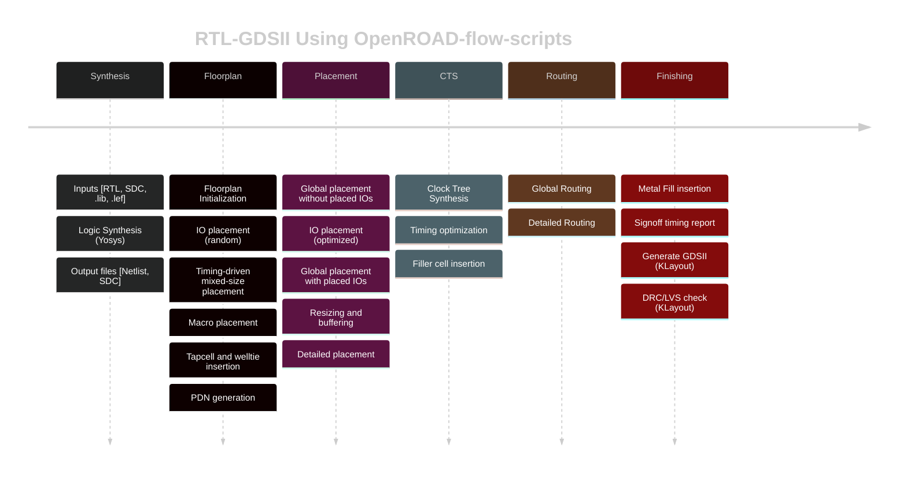

# RISC-V-SoC-Tapeout-Program-My-Journey
👩‍💻 Participant: Ashika C H 
<br>
📍 Program: RISC-V Reference SoC Tapeout Program (VSD) 
<br>
🏭 Impact: Part of India’s largest collaborative open-source tapeout with 3500+ participants .
<br>
This repository tracks my week-by-week progress in the SoC Tapeout Program, covering everything from RTL design to GDSII.

<details>
	<summary>Week 0 - Tools Installation </summary>

# Week0 - Tools Installation

## Yosys
```
$ git clone https://github.com/YosysHQ/yosys.git
$ cd yosys 
$ sudo apt install make (If make is not installed please install it) 
$ sudo apt-get install build-essential clang bison flex \
    libreadline-dev gawk tcl-dev libffi-dev git \
    graphviz xdot pkg-config python3 libboost-system-dev \
    libboost-python-dev libboost-filesystem-dev zlib1g-dev
$ make 
$ sudo make install
```


## Iverilog
```
$ sudo apt-get install iverilog
```


## GTKWave
```
$ sudo apt update
$ sudo apt install gtkwave
```


## NgspiceM
```
After downloading the tarball from https://sourceforge.net/projects/ngspice/files/ to a local
directory, unpack it using:
$ tar -zxvf ngspice-37.tar.gz
$ cd ngspice-37
$ mkdir release
$ cd release
$ ../configure --with-x --with-readline=yes --disable-debug
$ make
$ sudo make install 
```


## Magic
```
$ sudo apt-get install m4
$ sudo apt-get install tcsh
$ sudo apt-get install csh
$ sudo apt-get install libx11-dev
$ sudo apt-get install tcl-dev tk-dev
$ sudo apt-get install libcairo2-dev
$ sudo apt-get install mesa-common-dev libglu1-mesa-dev
$ sudo apt-get install libncurses-dev
git clone https://github.com/RTimothyEdwards/magic
cd magic
./configure
make
make install 
```


🛠️ Week 0 — Setup & Tools

🚀 Foundation Week — setting up the environment to begin the RISC-V SoC Tapeout journey.

🎯 Objectives

✔️ Understand program scope & flow (RTL → Synthesis → PD → Tapeout)
✔️ Install & configure open-source EDA tools
✔️ Validate environment with test runs

🧰 Tools Installed

📝 Yosys → Logic Synthesis
🎨 Magic → Layout & DRC/LVS checks
📊 KLayout → GDSII Visualization
📡GTKWave → Simulation & waveform analysis

🔑 Key Learnings

🌐 Explored the open-source EDA ecosystem
🧩 Understood how tools connect in the SoC flow
🛠️ Completed first test synthesis & layout runs successfully
🔗 Realized the importance of environment setup as the backbone for the entire tapeout process

✅ Week 0 Status
🟢 Setup Complete → Ready to begin RTL design in Week 1

✨ “Week 0 laid the foundation — from here, every week builds one more layer towards tapeout.”
</details>


<details>
<summary> Week 1 - Introduction to Verilog RTL Design and Synthesis</summary>

## Introduction to open-source simulator Iverilog

Folder structure of the git clone:
- `lib` - will contain sky130 standard cell library
- `my_lib/verilog_models` - will contain standard cell verilog model
- `verilog_files` -contains the lab experiments source files


Example of a design good_mux.v 

```
module good_mux (input i0 , input i1 , input sel , output reg y);
always @ (*)
begin
	if(sel)
		y <= i1;
	else 
		y <= i0;
end
endmodule
```
Example of a testbench tb_good_mux.v 

```
`timescale 1ns / 1ps
module tb_good_mux;
	// Inputs
	reg i0,i1,sel;
	// Outputs
	wire y;

        // Instantiate the Unit Under Test (UUT)
	good_mux uut (
		.sel(sel),
		.i0(i0),
		.i1(i1),
		.y(y)
	);

	initial begin
	$dumpfile("tb_good_mux.vcd");
	$dumpvars(0,tb_good_mux);
	// Initialize Inputs
	sel = 0;
	i0 = 0;
	i1 = 0;
	#300 $finish;
	end

always #75 sel = ~sel;
always #10 i0 = ~i0;
always #55 i1 = ~i1;
endmodule
```
Command to run the design and testbench
```
iverilog good_mux.v tb_good_mux.v
```
The output of the iverilog is a .vcd file and a.out file is created. By executing a.out iverilog dump the vcd file.

## Introduction to GTKWave
gtkwave will be used to generate the waveforms and display in visual format.

Command to view the vcd file in gtkwave 
```
gtkwave tb_good_mux.vcd
```
The waveform in gtwave is shown below


## Introduction to Yosys
It is the synthesizer used to convert RTL to netlist.
Netlist should be the same as the Design but represented in the form of standard cells.
The same testbench can be used to verify RTL and Synthesized Netlist.


## Introduction to Logic Synthesis


## Lab using Yosys and Sky130 PDKs


Timing libs, Hierarchical vs Flat Synthesis and Efficient Flop Coding Styles

## Introduction to timing .libs
Libraries are characterized based on PVT (process, voltage, temperature) \
Process -> Variations due to fabrication \
Voltage -> Variations due to voltage \
Temperature -> Variations due to temperature 

As seen in the screenshot below \
tt stands for typical in the .lib name \
025C stands for temperature of 25 C in the .lib name \
1v80 stands for voltage of 1.8V in the .lib name


-cell defines the beginning of the cell. Other information of cells mentioned are:
- Leakage power based on the combination of inputs
- Area
- Power ports
- Input capacitance
- Power associated with the pin
- Transition
- Delay

## Hierarchical vs Flat Synthesis

### Hierarchical Synthesis
Report after synthesizing multiple_modules.v. As shown below the sub_modules statistics are printed. For example, sub-module1 has 1 AND gate and sub-module2 has 1 OR gate. This is an example of Hierarchical Synthesis.


Hierarchy is preserved. sub_module1 and sub_module2 are instantiated separately in the synthesized Verilog netlist. Rather than seeing AND or OR gate, we see sub_modules when we run the command 'show' as shown in the screenshot.


If we look into the sub_module2 in synthesized netlist 'multiple_modules_hier.v', we see that rather than OR gate, the inputs a & b, pass through the inverter and then NAND gate. It is because in CMOS, stacking PMOS, which happens in 'OR' gate is bad as PMOS has lower mobility and always have to be wider to get some meaningful output. The next step is to check .lib file for the answer.

### Flat Synthesis
The design can be flattened by using the command `flatten`.

Screenshot shows the command, synthesized netlist and the logical diagram.


### Sub-module Level Synthesis
RTL (Register Transfer Level) designs are often modular, with various functional blocks or sub-modules. Sub-module level synthesis allows each of these sub-modules to be synthesized independently.

Why is the sub-module level synthesis necessary?
- Optimization and Area Reduction: By synthesizing sub-modules separately, the synthesis tool can optimize each one individually. It performs logic optimization, technology mapping, and area minimization for each sub-module. This leads to more efficient use of resources and reduced overall chip area.
- Resuability: Each submodule can be designed, verified, and optimized independently. They can be reused in a large design multiple times saving time and enhancing efficiency. 
- Parallel Processing: Different sub-modules can be synthesized concurrently, improving efficiency. For large designs, parallel synthesis significantly reduces turnaround time.

The commands to run sub-module synthesis
```
read_liberty -lib ../lib/sky130_fd_sc_hd__tt_025C_1v80.lib
read_verilog multiple_modules.v
synth -top sub_module1
abc -liberty ../lib/sky130_fd_sc_hd__tt_025C_1v80.lib
show
```

The screenshot shows that when sub_module1 is synthesized, only AND gate is generated. 


## Various Flop Coding Styles and Optimization

### Why do we need flops and how do they prevent glitches in the circuit?

Glitches can occur in digital circuits due to various reasons such as signal delays, noise, or timing issues. Flops prevent glitches during the operation in the following ways:
- Synchronization: Flops are edge-triggered devices, meaning they respond only to transitions of the input signal (e.g., rising edge, falling edge). This synchronization ensures that the output changes only at specific points, reducing the likelihood of glitches caused by transient signal variations.
- Timing Control: Flops are typically controlled by a clock signal, ensuring that all circuit operations occur synchronously. This eliminates timing issues that could lead to glitches due to data arriving at different times.


### Different types of flops
To initialize flops, we need to `set` and `reset` which can be synchronous or asynchronous.


The screenshot below shows DFF with asynchronous reset HDL simulation in Iverilog and  waveform display in GTKwave. Irrespective of the clock and d, as soon as async_reset=1, q=0.


### Synthesizing flops
The command to synthesize ***DFF with asynchronous reset*** as an example
```
read_liberty -lib ../lib/sky130_fd_sc_hd__tt_025C_1v80.lib
read_verilog dff_asyncres.v
synth -top dff_asyncres
dfflibmap -liberty ../lib/sky130_fd_sc_hd__tt_025C_1v80.lib
abc -liberty ../lib/sky130_fd_sc_hd__tt_025C_1v80.lib
show
```


On synthesizing ***DFF with synchronous reset*** we get NOR gate with inverted `d` as shown in the screenshot below. However,on evaluating the boolean expression, we reached the same logic realization. 


Using the `stat` command, all the cells used for logic synthesis are visible even though it is not evident from the statistics of doing synthesis.


### Synthesizing mult2 (multiply by 2)

To implement `y[3:0] = 2*a[2:0]`, we append a `1'b0 `to the `a[2:0]` i.e, `y[3:0] = {a[2:0],0}`. This is also equal to left shift the input bits by 1.
This can be realized by just wiring.
So we expect no hardware which is also seen in the screenshot below, analysis after synthesis and show. The command 'abc' is not required for mapping when there are no cells.


### Synthesizing mult9 (multiply by 9 or 8+1)

`y=9*a` can be considered `8*a+1*a`
To implement `y[5:0] = 9*a[2:0]`, we append `000` to `a[2:0]` and then add `a` i.e, `y[5:0] = {a[2:0],000} + a[2:0]`.
This can be realized just by wiring.
So we expect no hardware which is also seen in the screenshot below, analysis after synthesis and show. The command 'abc' is not required for mapping when there are no cells.


#### Combinational and Sequential Optimizations

## Introduction to Optimizations

### Combinational Logic Optimization
It means squeezing the logic to get the most optimized design in terms of area and power. the most commonly used techniques are:
1) Constant propagation using direct optimization
2) Boolean logic optimization using K-map and Quine McKlusky

An example of constant propagation optimization is highlighted below.


An example of boolean optimization is highlighted below.


### Sequential Logic Optimization
The technqiues used are:
1) Basic
   - Sequential constant propagation
2) Advanced (not covered as part of lab)
   - Static optimization
   - Retiming
   - Sequential logic cloning (floorplan aware synthesis)

An example of sequential constant propagation is highlighted below of DFF with asynchronous reset where D input is grounded. To note, the same technique cannot be applied to DFF with the asynchronous set because while `Q=1` when `Set=1`, but `Q=0` at `Set=0` at the next CLK pulse. Q is dependent not only on Set but also on the clock edge.


Retiming is a technique to improve the performance of the circuit.


## Combinational Logic Optimizations
Commands for optimization

```
opt_clean -purge
```
### Optimization of opt_check.v
Syntax for opt_check.v
```
module opt_check (input a , input b , output y);
        assign y = a?b:0;
endmodule
```
For opt_check.v the assignment `y = a?b:0` reduces to `y = ab`. The screenshot shown below explains this


The logic implementation after synthesis for opt_check.v is shown below, showing only AND gate.


### Optimization of opt_check2.v
Syntax for opt_check2.v
```
module opt_check2 (input a , input b , output y);
        assign y = a?1:b;
endmodule
```
For opt_check2.v the assignment `y = a?1:b` reduces to `y = a + b`. 

The logic implementation after synthesis for opt_check2.v is shown below, showing only OR gate.


### Optimization of opt_check3.v
Syntax for opt_check3.v
```
module opt_check3 (input a , input b, input c , output y);
	assign y = a?(c?b:0):0;
endmodule
```
For opt_check.v the assignment `y = a?(c?b:0):0` reduces to `y = abc`. The screenshot shown below explains this.


The logic implementation after synthesis for opt_check3.v is shown below, showing 3 input AND gate.


### Optimization of multiple_module_opt.v

Syntax of multiple_module_opt.v
```
module sub_module1(input a , input b , output y);
 assign y = a & b;
endmodule

module sub_module2(input a , input b , output y);
 assign y = a^b;
endmodule

module multiple_module_opt(input a , input b , input c , input d , output y);
wire n1,n2,n3;

sub_module1 U1 (.a(a) , .b(1'b1) , .y(n1));
sub_module2 U2 (.a(n1), .b(1'b0) , .y(n2));
sub_module2 U3 (.a(b), .b(d) , .y(n3));

assign y = c | (b & n1); 
endmodule
```
The logic implementation after synthesis for multiple_module_opt.v is shown below.


## Sequential Logic Optimizations

Both the dff_const1.v and dff_const2 are explained below.


### Optimizing dff_const1.v

Syntax for dff_const1.v
```
module dff_const1(input clk, input reset, output reg q);
always @(posedge clk, posedge reset)
begin
	if(reset)
		q <= 1'b0;
	else
		q <= 1'b1;
end

endmodule
```
For dff_const1.v, `q=0` as long as `reset=1`. However, when `reset=0` `q` doesn't immediately becomes `1` rather at the next rising edge of the `clk` as shown below. ***So the optimization cannot be applied***.


The commands to run the synthesis
```
read_liberty -lib ../lib/sky130_fd_sc_hd__tt_025C_1v80.lib
read_verilog dff_const1.v
synth -top dff_const1
dfflibmap -liberty ../lib/sky130_fd_sc_hd__tt_025C_1v80.lib
abc -liberty ../lib/sky130_fd_sc_hd__tt_025C_1v80.lib
show
```

The logic implementation after synthesis for dff_const1.v is shown below.


***complete dff_const2,4,5***

### Optimizing dff_const3.v

Syntax for dff_const3.v
```
module dff_const3(input clk, input reset, output reg q);
reg q1;

always @(posedge clk, posedge reset)
begin
	if(reset)
	begin
		q <= 1'b1;
		q1 <= 1'b0;
	end
	else
	begin
		q1 <= 1'b1;
		q <= q1;
	end
end

endmodule
```
For dff_const3.v, there are two flops.  `q1=0` as long as `reset=1`. However, when `reset=0` `q1` doesn't immediately becomes `1` rather at the next rising edge of the `clk` with some propagation delay as shown below. `q=1` as long as `reset=1`, acting as `set` rather than `reset`. However, when `reset=0` `q` samples `q1` as `0` as there are some propagation delay for `q1`as shown below. At the next `clk` edge `q` samples `q1` as `1`.
***So the optimization cannot be applied***.


The command to run HDL simulation
```
iverilog dff_const3.v tb_dff_const3.v
./a.out
gtkwave tb_dff_const3.vcd
```
The HDL simulation is shown below.

image 

The commands to run the synthesis
```
read_liberty -lib ../lib/sky130_fd_sc_hd__tt_025C_1v80.lib
read_verilog dff_const3.v
synth -top dff_const3
dfflibmap -liberty ../lib/sky130_fd_sc_hd__tt_025C_1v80.lib
abc -liberty ../lib/sky130_fd_sc_hd__tt_025C_1v80.lib
show
```

The logic implementation after synthesis for dff_const3.v is shown below.


## Sequential Optimzations for Unused Outputs

### Optimization of Case1: 3-bit Up Counter with q[0] used (counter_opt.v)
Example of a counter where bits at the position of [2] and [1] are unused.

```
module counter_opt (input clk , input reset , output q);
reg [2:0] count;
assign q = count[0];

always @(posedge clk ,posedge reset)
begin
	if(reset)
		count <= 3'b000;
	else
		count <= count + 1;
end

endmodule
```
The screenshot explains the logic of the counter. Only q[0] is used. ***So the optimization can be applied***.


The commands to run the synthesis
```
read_liberty -lib ../lib/sky130_fd_sc_hd__tt_025C_1v80.lib
read_verilog counter_opt.v
synth -top counter_opt
dfflibmap -liberty ../lib/sky130_fd_sc_hd__tt_025C_1v80.lib
abc -liberty ../lib/sky130_fd_sc_hd__tt_025C_1v80.lib
show
```
We see only one flop after the synthesis and also seen in synthesis report after `synth -top counter_opt.v`


### Optimization of Case2: 3-bit Up Counter (counter_opt2.v)

Example of a counter where all the bits are used.
```
module counter_opt (input clk , input reset , output q);
reg [2:0] count;
assign q = (count[2:0] == 3'b100);

always @(posedge clk ,posedge reset)
begin
	if(reset)
		count <= 3'b000;
	else
		count <= count + 1;
end

endmodule
```
The commands to run the synthesis
```
read_liberty -lib ../lib/sky130_fd_sc_hd__tt_025C_1v80.lib
read_verilog counter_opt.v
synth -top counter_opt
dfflibmap -liberty ../lib/sky130_fd_sc_hd__tt_025C_1v80.lib
abc -liberty ../lib/sky130_fd_sc_hd__tt_025C_1v80.lib
show
```
We see only 3 flops after the synthesis and also seen in synthesis report after `synth -top counter_opt.v`


## GLS, Synthesis-Simulation Mismatch, and Blocking/Non-blocking Statements

### Why is Gate Level Simulation (GLS) necessary?
- Verify the correctness of the design after synthesis
- Ensure the timing of the design is met which is done with delay annotation (timing aware)


### Synthesis Simulation Mismatches

It happens because of the following reasons
- Missing sensitivity list
- Blocking vs non-blocking assignments
- Non-standard verilog coding

#### (1) Missing sensitivity list

As shown in the screenshot below, `always` block is evaluated only when `sel` is changing. So output `y` is not evaluated when `sel` is not changing although `i0` and `i1` are changing. Rather it acts like a latch. The code on the right side represents the correct design coding for `mux`. In this case `always` is evaluated for any signal changes. 


#### (2) Blocking vs Non-blocking Assignments

 ##### Blocking Statements
 
 - Represented by `=`
 - Executes the statements in the order it is written inside always block
 - So the first statement is evaluated before the second statement

##### Non-Blocking Statements
- Represented by `<=`
- Executes all the RHS when always block is entered and assigns to LHS
- Parallel execution

   The left side of the screenshot below gives us the correct execution. While the right side can lead to serious issues as `d` is assigned to `q` directly. ***So choosing non-blocking statements is best practice*** (highlighted in the screenshot below).


##### Blocking Statements Leading to Synthesis Simulation Mismatch

In the code shown below, `y` gets the old `q0` value. This will mimic delay or flop. But when you synthesize, there will be no flop. If the order is changed (right side code), latest value of `q0` is assigned to `y`. 

When synthesized, both will lead to the same circuit. However, simulation will result in different behavior. For the left side of the code, `y` gets the old `q0` value and for the right side of the code, `y` gets the latest `q0` value leading to a synthesis simulation mismatch. 

This issue is resolved by using ***non-blocking statements***.


## Labs on GLS and Synthesis-Simulation Mismatch

### Ternary operator MUX (ternary_operator_mux.v)

The Verilog code of ternary_operator_mux.v
```
module ternary_operator_mux (input i0 , input i1 , input sel , output y);
	assign y = sel?i1:i0;
	endmodule
```
The command to run HDL simulation
```
iverilog ternary_operator_mux.v tb_ternary_operator_mux.v
./a.out
gtkwave tb_ternary_operator_mux.vcd
```
HDL Simulation waveform of ternary_operator_mux.v is shown in the screenshot below


The commands to run the synthesis for ternary_operator_mux.v
```
read_liberty -lib ../lib/sky130_fd_sc_hd__tt_025C_1v80.lib
read_verilog ternary_operator_mux.v
synth -top ternary_operator_mux
abc -liberty ../lib/sky130_fd_sc_hd__tt_025C_1v80.lib
show
write_verilog ternary_operator_mux_net.v
```


The commands to do GLS for ternary_operator_mux.v
```
iverilog ../my_lib/verilog_model/primitives.v ../my_lib/verilog_model/sky130_fd_sc_hd.v ternary_operator_mux_net.v tb_ternary_operator_mux.v
./a.out
gtkwave tb_ternary_operator_mux.vcd
```
The GLS output is shown below.


### Bad MUX (bad_mux.v)

The `always` block is executed only at `sel` signal. It works like a flop rather than mux.
The Verilog code of bad_mux.v
```
module bad_mux (input i0 , input i1 , input sel , output reg y);
always @ (sel)
begin
	if(sel)
		y <= i1;
	else 
		y <= i0;
end
endmodule
```

The command to run HDL simulation
```
iverilog bad_mux.v tb_bad_mux.v
./a.out
gtkwave tb_bad_mux.vcd
```
HDL Simulation waveform of bad_mux.v is shown in the screenshot below


The commands to run the synthesis for bad_mux.v.
```
read_liberty -lib ../lib/sky130_fd_sc_hd__tt_025C_1v80.lib
read_verilog bad_mux.v
synth -top bad_mux
abc -liberty ../lib/sky130_fd_sc_hd__tt_025C_1v80.lib
show
write_verilog bad_mux_net.v
```

The synthesis report shows it is still inferring the mux but not the flop.


The commands to do GLS for bad_mux.v
```
iverilog ../my_lib/verilog_model/primitives.v ../my_lib/verilog_model/sky130_fd_sc_hd.v bad_mux_net.v tb_bad_mux.v
./a.out
gtkwave tb_bad_mux.vcd
```
The GLS output is shown below. This shows correct functionality which is different from HDL simulation, leading to ***synthesis simulation mismatch***.


## Labs on Synthesis-Simulation Mismatch for Blocking Statements

### Blocking Caveat (blocking_caveat.v)

The logic to simulate is shown below.


The Verilog code of blocking_caveat.v
```
module blocking_caveat (input a , input b , input  c, output reg d); 
reg x;
always @ (*)
begin
	d = x & c;
	x = a | b;
end
endmodule
```

The command to run HDL simulation
```
iverilog blocking_caveat.v tb_blocking_caveat.v
./a.out
gtkwave tb_blocking_caveat.vcd
```
HDL Simulation waveform of blocking_caveat.v is shown in the screenshot below. `d` takes the old value of `x` causing incorrect functionality.


The commands to run the synthesis for bad_mux.v.
```
read_liberty -lib ../lib/sky130_fd_sc_hd__tt_025C_1v80.lib
read_verilog blocking_caveat.v
synth -top blocking_caveat
abc -liberty ../lib/sky130_fd_sc_hd__tt_025C_1v80.lib
show
write_verilog blocking_caveat_net.v
```

The synthesis report and logic synthesis is shown below.


The commands to do GLS for bad_mux.v
```
iverilog ../my_lib/verilog_model/primitives.v ../my_lib/verilog_model/sky130_fd_sc_hd.v blocking_caveat_net.v tb_blocking_caveat.v
./a.out
gtkwave tb_blocking_caveat.vcd
```
The GLS output is shown below. In this case, `d` takes the current value of `x` causing incorrect functionality.The waveform shows correct functionality which is different from HDL simulation, leading to ***synthesis simulation mismatch***.


</details>

<details>
	<summary>Week 2 - BabySoC Fundamentals & Functional Modelling  </summary>

# BabySoC Fundamentals & Functional Modelling 

# Objective :
To build a solid understanding of SoC fundamentals and practice functional modelling of the BabySoC using simulation tools (Icarus Verilog & GTKWave). 

🔹 Designed a compact open-source SoC (BabySoC) based on the RVMYTH RISC-V core.
<br>
🔹 Integrated a PLL for accurate clock generation & synchronization.
<br>
🔹 Added a 10-bit DAC to enable digital-to-analog conversion.
<br>
🔹 Enabled interfacing with external analog systems (e.g., 📺 televisions, 📱 mobile phones) for audio/video outputs.
<br>
🔹 Implemented using Sky130 technology, providing a documented educational platform for exploring digital–analog interfacing.

<details>
	
<summary> What is a System-on-Chip (SoC)? </summary>

**📌 System-on-Chip (SoC) – Key Points**

 **Definition**

A System-on-Chip (SoC) is an integrated circuit (IC) that combines multiple components of a complete electronic system into a single chip.

**Core Components**

Processor/Core 🖥️ → CPU, GPU, DSP, or RISC-V/ARM cores for computation.

Memory 💾 → RAM, ROM, Flash, and cache for storage.

Peripherals ⌨️ → Interfaces like USB, I2C, SPI, UART, GPIO.

Analog Blocks 🎛️ → ADC, DAC, PLL, power management.

Interconnect 🔗 → High-speed buses (AMBA, AXI, Wishbone) for communication between blocks.

**Integration**

Everything is fabricated on one silicon die → reduces cost, area, and power.

**Advantages**

🚀 High Performance → Fast data transfer (on-chip communication).

🔋 Low Power Consumption → Optimized integration saves energy.

📏 Small Size → Replaces multi-chip PCB designs.

💰 Cost-Effective → Mass production reduces manufacturing cost.

⚡ Reliability → Fewer interconnections → lower failure rates.

**Applications**

📱 Mobile Phones (Qualcomm Snapdragon, Apple A-series).

🚗 Automotive (ADAS, infotainment).

📺 Consumer Electronics (Smart TVs, IoT devices).

🛰️ Aerospace/Defense (satellite processors).

💻 Embedded Systems & Edge AI devices.

**Technology Nodes**

Fabricated in nm technologies → 180nm, 65nm, 28nm, 7nm, down to 3nm.

Smaller node = more transistors = faster + power-efficient.

**Design Flow**

Specification → RTL Design → Functional Verification → Synthesis → Place & Route → Fabrication → Testing (DFT, Scan Chains).

**Challenges**

🔧 Power Management (low power design techniques).

🔄 Integration Complexity (multiple IPs on same die).

🔐 Security (hardware root of trust).

🧪 Verification & Testing (DFT, BIST, scan).

### Why SoCs Are Awesome

**1️⃣ Compact Integration**

CPU + Memory + Peripherals + Analog + Power circuits → all in one chip.

📏 Reduces board space → smaller devices (smartphones, IoT, wearables).

**2️⃣ High Performance**

⚡ On-chip communication (fast interconnect/NoC) → lower latency vs. multi-chip systems.

🚀 Parallel processing with CPU + GPU + DSP + AI accelerators.

**3️⃣ Low Power Consumption**

🔋 Optimized for mobile/embedded use with DVFS, power gating, clock gating.

✅ Longer battery life for handheld devices.

**4️⃣ Cost-Effective**

💰 Fewer external components = reduced manufacturing cost.

🏭 Easy mass production = economies of scale.

**5️⃣ Reliability**

🔗 Fewer off-chip connections → lower failure rate.

🛡️ On-chip security modules → hardware-level protection.

**6️⃣ Versatility**

📱 Consumer Electronics: smartphones, tablets, smart TVs.

🚗 Automotive: ADAS, infotainment, EVs.

🛰️ Aerospace/Defense: satellite processors.

🤖 AI/IoT: edge devices, wearables, robotics.

**7️⃣ Scalability & Future-Readiness**

🧩 Supports custom accelerators (AI, ML, vision).

🌐 Integrates modern connectivity → Wi-Fi, Bluetooth, 5G.

📉 Shrinks with technology nodes → from 180nm → 7nm → 3nm.

### Where You’ll Find SoCs

**📱 In Your Pocket**

Smartphones, tablets, wearables → SoCs like Snapdragon, Apple A/M series, Exynos.

They manage calls, photos, gaming, AI assistants — all from one chip!

**🚗 On the Road**

Cars run on SoCs for ADAS, infotainment, EV battery control.

Examples: NVIDIA DRIVE, Qualcomm Auto SoCs, Tesla FSD.

Your car is basically a computer-on-wheels 🛞.

**🏠 Inside Your Home**

Smart TVs, Alexa, Google Home, smart bulbs & locks.

SoCs like MediaTek, ESP32, ARM Cortex-M quietly keep your home smart & connected.

**🌐 Across Networks**

Wi-Fi routers, 5G/4G modems, even satellites.

Broadcom, Qualcomm X-series, Space-grade SoCs ensure you stay connected → from your room to outer space 🚀.

**🏥 In Healthcare**

Portable monitors, smart bands, glucose trackers.

SoCs give doctors real-time data and patients life-saving insights.

**🤖 In the Future (Already Here!)**

AI edge devices, robots, drones → powered by NVIDIA Jetson, Google Coral, NPUs.

They enable vision, intelligence, and autonomy.

### Some Popular SoCs You Might Know

Snapdragon X2 Elite ⚡ → 3 nm powerhouse for laptops & PCs.

Snapdragon 8 Elite Gen-5 📱 → flagship mobile chip with AI boost.

MediaTek Dimensity 9400 📸 → camera + AI beast for smartphones.

NVIDIA Jetson Orin 🤖 → brain of robots, drones & edge AI.

Hailo-8 / Axera AX630C 👀 → tiny but strong AI vision SoCs for IoT.

Basilisk RISC-V 🧑‍🎓 → open-source SoC for learning & research.

</details>

<details>
	
<summary> Components of a typical SoC (CPU, memory, peripherals, interconnect) </summary>

	
**📌 Components of a Typical System-on-Chip (SoC)**

**1️⃣ CPU / Processing Cores**

General Purpose CPU: ARM Cortex, RISC-V, x86 cores 🖥️

GPU (Graphics Processing Unit) 🎮: Parallel processing, graphics rendering, video acceleration.

DSP (Digital Signal Processor) 🎵: Optimized for audio, image, and real-time signal processing.

AI/ML Accelerators 🤖: Neural network processing, edge AI inference engines.

Multiple Cores (Multicore SoC): Improves performance with parallel execution.

**2️⃣ Memory Subsystem**

On-Chip Memory

SRAM (Cache): L1, L2, L3 for fast data access.

ROM: Stores firmware, boot code.

External Memory Controllers

DRAM Controllers: DDR, LPDDR.

Flash Controllers: NAND/NOR for storage.

Functions: Data/instruction storage, buffering, booting, and execution.

**3️⃣ Peripherals (I/O Interfaces)**

Communication Interfaces

Low-Speed: UART, I²C, SPI.

High-Speed: USB, PCIe, Ethernet, SATA.

Multimedia Interfaces

Display controller, HDMI, MIPI DSI.

Camera interface (CSI).

Audio codecs.

Timers & Counters ⏱️

GPIO (General-Purpose Input/Output) 🔌

Security Modules 🔐

Cryptographic accelerators.

Secure boot, trusted execution.

**4️⃣ Interconnect (On-Chip Communication)**

Bus-based Fabrics: AMBA (AXI, AHB, APB).

Crossbar Switches: Parallel high-speed data paths.

Network-on-Chip (NoC): Scalable packet-switched fabric for large SoCs.

Role: Ensures efficient CPU–Memory–Peripheral communication.

**5️⃣ Analog & Mixed-Signal Blocks**

PLL (Phase-Locked Loop) ⏱️: Clock generation, synchronization.

ADC (Analog-to-Digital Converter) 🎛️: Sensor inputs (temperature, motion, etc.).

DAC (Digital-to-Analog Converter) 🔊: Audio, video signal output.

PHY Interfaces: For USB, PCIe, Ethernet.

**6️⃣ Power Management**

Power Management Unit (PMU) 🔋: Controls power domains.

Voltage Regulators & DC-DC Converters: Supply stable voltage.

Dynamic Voltage & Frequency Scaling (DVFS) ⚡: Balances performance vs. power.

Clock Gating & Power Gating: Reduce leakage and dynamic power.

Battery Management Circuits (in mobile SoCs).

**7️⃣ Other Special Features**

Security Enhancements: Hardware root of trust, encryption modules, secure enclaves.

Debug & Test Features 🛠️: JTAG, DFT, BIST (Built-In Self-Test), scan chains.

Networking Support 🌐: Wi-Fi, Bluetooth, 5G/4G modem.

Sensor Hubs 📱: For accelerometer, gyroscope, ambient sensors.

Embedded Operating System Support: Runs Linux, RTOS, Android, or bare-metal firmware.


In summary, **System on a Chip (SoC)** technology allows us to create powerful, efficient, and compact devices by combining multiple components into one chip. This is why our phone, smartwatch, and even some household appliances can do so much in such a small package.
</details>

<details>
<summary> Types of SoCs 🖥️✨</summary>

ASIC SoC 🎯 – Custom-built for specific apps, ultra-efficient.

MCU SoC ⚡ – CPU + memory + peripherals for embedded/IoT.

DSP SoC 🔊 – Accelerated for signal processing.

Network SoC 🌐 – Handles routers, modems & comms.

Mobile SoC 📱 – All-in-one for smartphones: CPU, GPU, DSP, modem.

FPGA SoC 🔄 – Programmable logic + CPU, flexible prototyping.

Multimedia SoC 🎥 – Powers video/audio processing & displays.

Power Mgmt SoC 🔋 – Battery & voltage control, energy-efficient.

 ### SoC Design Flow


	
</details>

<details>
	
<summary> Introduction to VSDBabySoC </summary>


**VSDBabySoC: Compact Yet Powerful RISC-V SoC 🖥️✨**

The VSDBabySoC is a small but highly capable System-on-Chip (SoC) built on the RISC-V architecture. Its main goal is to simultaneously test three open-source IP cores for the first time while also calibrating its analog components.

**Key components include:**

RVMYTH Microprocessor – Handles the core data processing.

8x Phase-Locked Loop (PLL) – Generates a stable, synchronized clock for smooth operation.

10-bit DAC (Digital-to-Analog Converter) – Converts digital outputs to analog signals for real-world devices.

**1️⃣ Initialization & Clock Generation ⏱️**

When BabySoC receives the initial input signal, the PLL activates, producing a stable and synchronized clock. This ensures that RVMYTH and the DAC work in perfect harmony, avoiding timing mismatches and guaranteeing data integrity across the SoC.

**2️⃣ Data Processing in RVMYTH 💻**

The RVMYTH core is the brain of BabySoC. Its r17 register cycles through values generated during instruction execution. These values are prepared for analog conversion, creating a continuous stream of digital data that the DAC can process seamlessly.

**3️⃣ Analog Signal Generation via DAC 🎶📺**

The DAC receives the digital data from RVMYTH and converts it into analog signals. These outputs, saved in a file called OUT, can drive external devices like TVs, speakers, and mobile phones. This demonstrates how BabySoC bridges digital processing and real-world multimedia outputs, showing its practical applications in consumer electronics.


## BabySoC Components 🖥️✨

**RVMYTH (RISC-V CPU) 💻**

Acts as the brain of BabySoC.

Based on the open-source RISC-V architecture, making it lightweight, flexible, and customizable.

Handles all processing tasks and communicates with other SoC components.

Perfect for learning, experimenting, and understanding CPU design and instruction flow.

**Phase-Locked Loop (PLL) ⏱️**

Generates a stable, synchronized clock to ensure smooth operation across the SoC.

Aligns BabySoC’s internal clock with a reference frequency, maintaining precise timing for RVMYTH and DAC.

Crucial for timing-critical circuits and widely used in communication and synchronization applications.

**Digital-to-Analog Converter (DAC) 🎶📺**

Converts digital data from RVMYTH into analog signals.

Enables BabySoC to interface with real-world devices like speakers, TVs, or displays.

Demonstrates how digital computation drives multimedia output, bridging the gap between digital processing and analog interaction.

### Phase-Locked Loop (PLL) ⏱️

**1️⃣ Definition**

A Phase-Locked Loop (PLL) is a control system that generates a clock signal synchronized with a reference frequency.

It continuously compares the phase of the output signal with the input reference and adjusts the output to stay in sync.

In simpler words, a PLL locks the clock of a chip to a stable reference, ensuring all components run harmoniously.

**2️⃣ Main Components of a PLL**

Phase Detector (PD) 🔍

Compares the phase of the input reference signal with the PLL’s output.

Produces a signal proportional to the phase difference.

Low-Pass Filter (LPF) 🛡️

Smooths out the output from the phase detector.

Eliminates high-frequency noise and generates a clean control voltage for the VCO.

Voltage-Controlled Oscillator (VCO ⚡)

Generates the output clock signal.

Frequency varies based on the control voltage from the filter to match the reference phase.

Feedback Path 🔄

Feeds the PLL output back to the phase detector.

Ensures continuous phase adjustment until the output is locked to the reference.

**3️⃣ Functionality**

Clock Generation: Produces a stable and precise clock for digital circuits.

Synchronization: Aligns the internal clock of ICs with an external or reference clock.

Frequency Multiplication / Division: Can generate higher or lower frequencies from a reference clock.

Jitter Reduction: Minimizes timing variations in signals for reliable operation.

**4️⃣ Why Can’t Off-Chip Clocks Always Be Used?**

Signal Degradation: Off-chip signals can suffer noise, delay, and attenuation over PCB traces.

Timing Mismatch: External clocks may not match the exact frequency requirements of internal circuits.

Power Consumption: Driving high-speed signals from off-chip sources consumes more power.

Integration Requirement: Modern SoCs require highly stable, on-chip clocks for synchronizing multiple components simultaneously.


### Digital-to-Analog Converter (DAC) 🎶📺

**1️⃣ Definition**

A DAC (Digital-to-Analog Converter) is a device that converts digital signals (binary numbers) into continuous analog signals.

It acts as a bridge between the digital world of processors and the analog world of real devices like speakers, displays, and sensors.

In simple terms, a DAC translates 0s and 1s into voltage, current, or sound waves that the real world can interpret.

**2️⃣ Main Components of a DAC**

Digital Input Register 💻

Holds the digital value coming from a processor or microcontroller.

Prepares it for analog conversion.

Reference Voltage Source ⚡

Provides a stable voltage against which the digital input is compared.

Ensures accurate and consistent output levels.

Resistor / Current Ladder Network 🔗

Converts the digital input into proportional current or voltage.

Forms the core of most DAC architectures.

Output Amplifier / Buffer 🛡️

Converts the internal DAC signal into a usable analog output.

Ensures the output can drive external devices without distortion.

**3️⃣ Functionality**

Digital-to-Analog Conversion: Translates discrete digital values into smooth analog signals.

Multimedia Output: Generates audio signals for speakers or video signals for displays.

Control Signals: Sends analog voltages to actuators, motors, or sensors in embedded systems.

Data Interfacing: Connects microcontrollers and processors to real-world analog devices.

**4️⃣ Types of DACs ⚡**

1.Binary-Weighted DAC

Uses resistors weighted by powers of 2.

Simple but sensitive to resistor accuracy.


2.R-2R Ladder DAC

Uses a ladder of resistors in a repeatable R and 2R pattern.

Popular due to ease of manufacturing and accuracy.


In VSDBabySoC:
      - In the VSDBabySoC design, we are utilizing a 10-bit DAC, which means it can take a digital input represented by 10 bits and convert it into an analog output.

---

This document outlines the structure and components of BabySoC, along with a basic understanding of SoCs and their types. By mastering these concepts and understanding how BabySoC operates, one gains a solid foundation in modern embedded systems design and digital-to-analog interfacing.

---
</details>

## Overview
The **VSDBabySoC** is a simple SoC (System-on-Chip) design incorporating a RISC-V processor (`rvmyth`), a PLL (Phase-Locked Loop) module (`pll`), and a DAC (Digital-to-Analog Converter) module (`dac`). This project demonstrates integration of these IP cores and aims to simulate and verify the design behavior using pre-synthesis and post-synthesis simulations.

## Project Structure
- `src/include/` - Contains header files (`*.vh`) with necessary macros or parameter definitions.
- `src/module/` - Contains Verilog files for each module in the SoC design.
- `output/` - Directory where compiled outputs and simulation files will be generated.

## Requirements
Ensure you have **Icarus Verilog** installed for compilation and **GTKWave** for viewing waveform files. This project assumes a Unix-like environment (macOS/Linux).

## Step-by-Step Guide

### 1. Setup and Prepare Project Directory
Clone or set up the directory structure as follows:
```txt
VSDBabySoC/
├── src/
│   ├── include/
│   │   ├── sandpiper.vh
│   │   └── other header files...
│   ├── module/
│   │   ├── vsdbabysoc.v      # Top-level module integrating all components
│   │   ├── rvmyth.v          # RISC-V core module
│   │   ├── avsdpll.v         # PLL module
│   │   ├── avsddac.v         # DAC module
│   │   └── testbench.v       # Testbench for simulation
└── output/
└── compiled_tlv/         # Holds compiled intermediate files if needed
```
### Module Descriptions

<details>
   <summary><strong>2.1 vsdbabysoc.v (Top-Level SoC Module)</strong></summary>
      This is the top-level module that integrates the rvmyth, pll, and dac modules.<br>
	  [VSDBabySoC](https://github.com/manili/VSDBabySoC.git)
      - Inputs:
         - reset: Resets the core processor.
         - VCO_IN, ENb_CP, ENb_VCO, REF: PLL control signals.
         - VREFH: DAC reference voltage.
      - Outputs:
         - OUT: Analog output from DAC.
         - Connections:
         - RV_TO_DAC - A 10-bit bus that connects the RISC-V core output to the DAC input.
         - CLK - The clock signal generated by the PLL.
      
</details>
 <details>
     <summary><strong>2.2 rvmyth.v (RISC-V Core)</strong></summary>
     The rvmyth module is a simple RISC-V based processor. It outputs a 10-bit digital signal (OUT) to be converted by the DAC.<br>
     [rvmyth](https://github.com/kunalg123/rvmyth/)
      
      Inputs:
         - CLK: Clock signal generated by the PLL.
         - reset: Initializes or resets the processor.
      Outputs:
         - OUT: A 10-bit digital signal representing processed data to be sent to the DAC.
         
   </details>

   <details>
     <summary><strong>2.3 avsdpll.v (PLL Module)</strong></summary>
     The pll module is a phase-locked loop that generates a stable clock (CLK) for the RISC-V core.<br>
     [Introduction](https://github.com/ireneann713/PLL.git)
     [avsdpll](https://github.com/lakshmi-sathi/avsdpll_1v8.git)
       Inputs:
         - VCO_IN, ENb_CP, ENb_VCO, REF: Control and reference signals for PLL operation.
      Output:
         - CLK: A stable clock signal for synchronizing the core and other modules.
         
         
   </details>

   <details>
     <summary><strong>2.4 avsddac.v (DAC Module)</strong></summary>
     The dac module converts the 10-bit digital signal from the rvmyth core to an analog output.<br>
     [avsddac](https://github.com/vsdip/rvmyth_avsddac_interface.git)
      
      Inputs:
         - D: A 10-bit digital input from the processor.
         - VREFH: Reference voltage for the DAC.
      Output:
         - OUT: Analog output signal.

         
   </details>

   ### Testbench
The testbench.v file is a test module to verify the functionality of vsdbabysoc. It includes signal initialization, clock generation, and waveform dumping for both pre-synthesis and post-synthesis simulations.
Waveform Output:
   - pre_synth_sim.vcd or post_synth_sim.vcd files generated based on simulation conditions.

### Simulation Steps
#### Pre-Synthesis Simulation
Run the following command to perform a pre-synthesis simulation:

```tcl
iverilog -o output/pre_synth_sim/pre_synth_sim.out -DPRE_SYNTH_SIM \
    -I src/include -I src/module \
    src/module/testbench.v src/module/vsdbabysoc.v
cd output/pre_synth_sim
./pre_synth_sim.out
```


**Explanation:**
   - -DPRE_SYNTH_SIM: Defines the PRE_SYNTH_SIM macro for conditional compilation in the testbench.
   - The resulting pre_synth_sim.vcd file can be viewed in GTKWave.

#### Viewing Waveform in GTKWave
After running the simulation, open the VCD file in GTKWave:
`gtkwave output/pre_synth_sim/pre_synth_sim.vcd`

#### Post-Synthesis Simulation
To run a post-synthesis simulation, use:
```tcl
iverilog -o output/post_synth_sim/post_synth_sim.out -DPOST_SYNTH_SIM \
    -I src/include -I src/module \
    src/module/testbench.v output/synthesized/vsdbabysoc.synth.v
cd output/post_synth_sim
./post_synth_sim.out
```

### Trouble shooting tips

   - Module Redefinition: If you encounter redefinition errors, ensure modules are included only once, either in the testbench or in the command line.
   - Path Issues: Verify paths specified with -I are correct. Use full paths if relative paths cause errors.


### Simulation logs


🔍 Simulation Logs – VSDBabySoC

The simulation of BabySoC Verilog modules was carried out using iverilog and GTKWave. Below is a breakdown of the simulation results:

Reset Verification ✅

Observed the active-low reset signal (rst_n) behavior.

During reset assertion, all registers and outputs were initialized to their default states.

Once reset was de-asserted, the system started executing normal operations.

Clock Operation ⏱️

Verified the clock (clk) waveform with correct periodic toggling.

Confirmed synchronous behavior across modules (signals triggered on positive clock edge).

Dataflow Analysis 📡

Data signals propagated correctly between CPU (RVMYTH), memory, and peripherals.

Verified proper handshake and data transfer between modules.

Waveform Validation 📊

Generated .vcd files using iverilog simulation.

Loaded waveforms in GTKWave to analyze transitions.

Captured screenshots highlighting reset, clock, and module dataflow activities.

Simulation Logs Snapshot 📝

The simulation logs confirm:

Successful compilation and simulation without errors.

Proper instantiation of SoC modules.

Execution flow matches expected BabySoC design functionality.

### GTKWave screenshots highlighting correct BabySoC behavior 


1️⃣ CLK Signal ⏱️

Definition: Primary clock input to the RVMYTH core.

Source: Generated by PLL in real hardware (but given as a simple clock in simulation).

Waveform Behavior:

Periodic square wave.

Rising edges trigger synchronous logic like registers, counters, and pipeline stages.

Observation:

All transitions in the design (reset release, data updates) are aligned with the positive clock edge.

Confirms system-wide synchronization.

2️⃣ Reset Signal 🔄

Definition: Input reset signal applied to the RVMYTH core.

Source: External source in hardware (manual or power-on reset).

Waveform Behavior:

Active-low → logic is held in reset when signal = 0.

On reset release (1), design resumes normal operation.

Observation:

Registers, memory, and output signals are forced to initial states during reset.

System only starts meaningful dataflow after reset is deasserted.

3️⃣ OUT (VSDBabySoC) 📤

Definition: The top-level SoC output port.

Source: DAC output in hardware → exported as SoC OUT pin.

Waveform Behavior:

In actual chip → analog signal.

In simulation → restricted to digital representation for compatibility.

Observation:

Shows transitions whenever the DAC receives new data from RV_TO_DAC[9:0].

Confirms end-to-end dataflow from CPU → DAC → OUT pin.

4️⃣ RV_TO_DAC[9:0] 🔢

Definition: 10-bit digital bus between RVMYTH and DAC.

Source: RVMYTH core register #17 (hardwired in BabySoC).

Waveform Behavior:

Carries binary values (0–1023) representing sampled digital data.

Changes on clock edges when new register values are updated.

Observation:

Any activity on this bus directly affects DAC output.

Validates CPU-to-DAC interfacing.

5️⃣ OUT (DAC – real datatype) 🎚️

Definition: Internal wire in DAC module that supports analog simulation.

Source: Derived from RV_TO_DAC[9:0] via DAC conversion logic.

Waveform Behavior:

Real datatype → represents analog-like values in simulation.

Provides continuous waveform instead of stepwise digital output.

Observation:

Helps visualize DAC’s analog functionality, even though Verilog restricts real hardware analog simulation.

Confirms correct scaling of digital input into analog range.


This week, I successfully:
1️⃣ Cloned and explored the VSDBabySoC repository 🖥️
2️⃣ Compiled the Verilog modules using Icarus Verilog ⚙️
3️⃣ Generated .vcd files and analyzed them in GTKWave 📊
4️⃣ Verified critical signals – CLK, Reset, RV_TO_DAC[9:0], and OUT 🔍
5️⃣ Captured simulation logs & screenshots to document reset behavior, clock synchronization, and dataflow between modules 📝

✨Week 2 provided hands-on experience in functional simulation of BabySoC, strengthening my understanding of SoC signal interactions and waveform analysis 🚀🔧
</details>

<details>
	<summary>Week 3 - Post-Synthesis GLS & STA Fundamentals </summary>

<details>
<summary> ⚙️ Gate-Level Simulation (GLS) of BabySoC </summary>
	
**🧩 Post-Synthesis Verification Phase**
**🎯 Purpose of GLS**

Gate-Level Simulation (GLS) is the reality check for our BabySoC design 💡.
After synthesis converts the RTL description into a gate-level netlist, GLS ensures that the design still behaves exactly as intended — but now with real hardware timing taken into account. Unlike RTL simulations that work on abstract behavioral models, GLS dives deep into the actual logic gates and interconnections that form the silicon foundation of the SoC 🧠⚡.

**🔍 Why GLS Matters for BabySoC**

**⏱️ Timing-Aware Verification:**
GLS is performed using Standard Delay Format (SDF) files that include the post-synthesis delays.
It helps verify that the design meets real-world timing constraints — checking if the SoC runs smoothly without timing violations or setup/hold issues ⏳✅.

**🧠 Functional Validation after Synthesis:**
Even after synthesis transforms RTL into gates, the logic must remain intact. GLS ensures that no logical discrepancies or unwanted glitches have crept in during synthesis. It confirms the trust between what was written and what will be fabricated.

**🔧 Simulation Tools in Action:**
Simulation is carried out using tools like Icarus Verilog (iverilog) or similar Verilog simulators 🧮.
Post-simulation, GTKWave is used to visualize and analyze the waveforms — letting us watch signal transitions, debug timing behavior, and confirm correctness visually 📊👀.

**🧠 Importance for BabySoC Architecture:**
BabySoC integrates multiple modules — RISC-V Processor (RVMYTH), PLL, and DAC — all working hand-in-hand 🤝.
GLS ensures that these modules communicate seamlessly and meet timing requirements, validating that the SoC design is synthesis-accurate, timing-correct, and silicon-ready 🚀.

🧭 Step-by-Step Manual Execution Plan
Step 1: Launch Yosys and Load Design
yosys


Start by opening Yosys, the synthesis tool.
Load your top-level BabySoC design along with all its supporting RTL modules.
This prepares the environment for generating the gate-level netlist and proceeding with the simulation 🧱➡️⚙️.

Inside the Yosys shell, run:
```yosys
read_verilog src/module/vsdbabysoc.v
read_verilog -I src/include src/module/rvmyth.v
read_verilog -I src/include src/module/clk_gate.v

```


---

### **Step 2: Load the Liberty Files for Synthesis**
Inside the same Yosys shell, run:
```yosys
read_liberty -lib src/lib/avsdpll.lib
read_liberty -lib src/lib/avsddac.lib
read_liberty -lib src/lib/sky130_fd_sc_hd__tt_025C_1v80.lib
```


---

### **Step 3: Run Synthesis Targeting `vsdbabysoc`**
```yosys
synth -top vsdbabysoc
```


---

### **Step 4: Map D Flip-Flops to Standard Cells**
```yosys
dfflibmap -liberty src/lib/sky130_fd_sc_hd__tt_025C_1v80.lib
```


---

### **Step 5: Perform Optimization and Technology Mapping**
```yosys
opt
abc -liberty src/lib/sky130_fd_sc_hd__tt_025C_1v80.lib -script +strash;scorr;ifraig;retime;{D};strash;dch,-f;map,-M,1,{D}
```


---

### **Step 6: Perform Final Clean-Up and Renaming**
```yosys
flatten
setundef -zero
clean -purge
rename -enumerate
```


---

### **Step 7: Check Statistics**
```yosys
stat
```


---

### **Step 8: Write the Synthesized Netlist**
```yosys
write_verilog -noattr output/post_synth_sim/vsdbabysoc.synth.v
```


---

## POST_SYNTHESIS SIMULATION AND WAVEFORMS
---

### **Step 1: Compile the Testbench**
Run the following `iverilog` command to compile the testbench:
```bash
iverilog -o output/post_synth_sim/post_synth_sim.out -DPOST_SYNTH_SIM -DFUNCTIONAL -DUNIT_DELAY=#1 -I src/include -I src/module src/module/testbench.v output/synth/vsdbabysoc.synth.v
```
---
### **Step 2: Navigate to the Post-Synthesis Simulation Output Directory**
```bash
cd output/post_synth_sim/
```
---
### **Step 3: Run the Simulation**

```bash
./post_synth_sim.out
```
---
### **Step 4: View the Waveforms in GTKWave**

```bash
gtkwave post_synth_sim.vcd
```
---


✨ In short, GLS acts as the final checkpoint between design and hardware — ensuring that our BabySoC beats to the right clock, with real-world timing accuracy and functional integrity ❤️🔐.
</details>

<details>
<summary> Fundamentals of STA </summary>

🕒 Static Timing Analysis (STA)

STA ensures your digital circuit works reliably at the target clock frequency by checking all timing paths.

**1️⃣ Setup / Hold Analysis**

These checks make sure data is stable and captured correctly by flip-flops or latches:

reg2reg: Timing between two flip-flops 🔁 ensures data launched by one reaches the next safely.

in2reg: Input pin to register timing ➡️🧩 checks signals entering the design.

reg2out: Register to output timing 🧩➡️ guarantees proper output timing.

in2out: Input to output combinational paths ➡️⚡ are validated.

clock gating: Checks timing impact when clocks are gated for power saving 🕹️💡.

recovery/removal: Ensures flip-flops recover properly from async reset ♻️🛠️.

data-to-data: Validates timing through combinational paths 🔗⚡.

latch time borrowing: Latches can "borrow" time for slightly late data ⏳🟡.

Launch flop → combinational logic → capture flop. Yellow dots indicate key timing points.

**2️⃣ Slew / Transition Analysis**

Analyzes signal rise and fall speed, affecting timing integrity:

Data transitions 📈📉 must be fast enough to meet setup/hold.

Clock transitions ⏰📈 must be clean to avoid timing issues.

Too slow or too fast transitions can cause violations or glitches.

**3️⃣ Load Analysis**

Looks at fanout and capacitance that impact delay:

High fanout 🔌🧩 slows down signal propagation.

Large capacitance ⚡🪫 increases signal delay.

These factors are crucial for accurate propagation delay estimation.

**4️⃣ Clock Analysis**

Checks clock timing and quality:

Skew ↔️⏰ ensures the same clock reaches all flip-flops at proper times.

Pulse width ⏱️📏 guarantees the clock pulse is long enough for reliable latching.

Proper clock analysis ensures synchronous design stability.

**5️⃣ Diagram Highlights**

Standard STA path: Launch Flop → Combinational Logic → Capture Flop.

Yellow dots mark critical timing points.

Clock gating & reset signals show control path effects.

Clock network includes buffers and gates affecting skew.

Pulse width waveform validates minimum clock duration.


### 📊 STA DAG Analysis

This diagram is a timing graph used in Static Timing Analysis to check signal propagation delays, arrival times, required times, and slack across a digital circuit.

**Convert Logic Gates into Nodes**

Each logic gate (AND, OR, MUX, etc.) is split into input pins → gate arc → output pin.

In the graph above, you see pins (i1, a1, b0, etc.) as nodes.

This makes timing analysis fine-grained, because delay depends on pin-to-pin paths rather than the whole gate.
👉 Think of it like zooming in 🔍 on gate connections instead of the whole block.


Compute Actual Arrival Time (AAT)

AAT (Blue A) = the earliest time a signal arrives at a node.
```
Formula:

𝐴𝐴𝑇=max(𝐴𝐴𝑇𝑖𝑛𝑝𝑢𝑡𝑠+𝑑𝑒𝑙𝑎𝑦𝑎𝑟𝑐)AAT=max(AATinputs+delayarc)

```

In the figure:

i1 has A=0 (source).

After a delay of 0.1, b1 gets A=0.1.

At deeper nodes like o1, you see A=7.9, showing total accumulated path delay.
👉 Blue numbers = when the data actually arrives ⏰.


**Compute Required Arrival Time (RAT)**

RAT (Yellow R) = the latest time a signal can arrive without violating timing.

Calculated by back-propagation from output to input.

```
Formula:

𝑅𝐴𝑇=min⁡(𝑅𝐴𝑇 𝑜𝑢𝑡𝑝𝑢𝑡−𝑑𝑒𝑙𝑎𝑦𝑎𝑟𝑐)RAT=min(RAT output−delayarc)

```

In the diagram:

At output node o1, R=7.55.

Back-propagated: c0 has R=5.2, c2 has R=2.2.
👉 Yellow numbers = required deadlines ⏳.

**Compute Slack**

Slack (Red S) = margin between RAT and AAT.
 
 ```
Formula:

𝑆𝑙𝑎𝑐𝑘=𝑅𝐴𝑇−𝐴𝐴𝑇Slack=RAT−AAT

```

Example from diagram:

At o1, S=-0.35.

Negative slack ❌ means a timing violation (path is too slow).
👉 Slack = safety margin 🛟. Positive = safe, Negative = fail 🚨.

**Convert Pins to Nodes & Do GBA/PBA Analysis**

Why convert pins into nodes?

It allows per-pin timing, more accurate than just per-gate.

Delays differ between input→output arcs, so pin-level modeling avoids under/overestimation.

Graph-Based Analysis (GBA):

Approximates worst-case paths quickly.

Uses max arrival times without exploring all real paths.

Path-Based Analysis (PBA):

Explores actual paths.

More accurate but slower.
👉 GBA = fast check ⚡, PBA = detailed deep dive 🧮.


**🔋 1. Introduction to transistor-level circuit for flops**

At the transistor level, a flip-flop (FF) is made up of MOSFETs (both PMOS and NMOS) arranged to store a bit of data.

Think of it like a tiny lock 🗝️ where the transistors act as switches to control the data flow.

Cross-coupled inverters 🔄 create feedback to hold the state.

Transmission gates 🚪 or pass transistors decide when new data enters.


**🔄 2. Negative and positive latch transistor-level operation**

Positive latch ➕🔓: Transparent when clk = 1, it passes input to output. When clk = 0, it locks the value.

Negative latch ➖🔓: Transparent when clk = 0, and locks when clk = 1.

Both are just transistor networks (pass-transistor + inverters) that act like a door that only opens at specific clock times ⏰.


**📏 3. Library setup time calculation**

Setup time is the minimum time ⏳ the input data must be stable before the clock edge.

Libraries calculate this by sweeping input arrival times and checking when the flop still latches data correctly.

If violated ❌, you get metastability (output stuck in an undefined state 🤯).


**⏱️ 4. Clk-Q delay calculation**

Clk-Q delay = time taken for the output (Q) to change after the clock edge.

At the transistor level, this depends on:

Load capacitance ⚡

Transistor sizing 📐

Supply voltage 🔋

It’s basically the reaction time of the flop once it hears the clock’s "GO!" 🏃‍♂️.


**📉 5. Steps to create eye diagram for jitter analysis**

An eye diagram 👁️ is made by overlaying multiple signal transitions to visualize data quality.
Steps:

Collect clock/data waveform 📡 over many cycles.

Overlay them on the same time window 🪞.

The open “eye” 👁️ shows good timing margins; a closed eye means poor signal integrity ⚠️.

Used in high-speed designs like SerDes, DDR, etc.


**📊 6. Jitter extraction and accounting in setup timing analysis**

Jitter = randomness in clock edges 🌀.

Extracted from measured or simulated waveforms by checking clock edge variations relative to ideal timing.

In setup analysis, jitter reduces effective available time:

Effective time = Clock period – (setup + jitter)

Think of it like traffic delays 🚦—you always subtract buffer time to be safe.


**Setup Analysis – Graphical ➡️ Textual Representation**

Graphical view:

You see a launch flop 📤 and a capture flop 📥 connected through combinational logic ⚡.

The clock edge ⏰ triggers the launch flop.

Data must reach the capture flop’s input before the next active clock edge.

Textual meaning:

Data launches at time T0.

Must arrive at capture flop input before Tclk – Tsetup.
```
Setup check equation:

Launch_clk + Data_path_delay ≤ Capture_clk + Tperiod – Tsetup
```
If violated ❌, the capture flop may miss data or go metastable 🤯.


**Hold Analysis with Real Clocks**

Real scenario:

Unlike setup (which looks across cycles 🌀), hold checks within the same clock edge.

Data must not change too soon after the capture clock edge.

With real clocks ⏱️, you also consider skew (difference in arrival times).

If launch clock arrives earlier than capture clock ➡️ data may race ahead 🏃 and overwrite the old value.
```
Equation form:

Launch_clk + Data_path_delay ≥ Capture_clk + Thold
```
Violation → Race condition ⚔️.


**Hold Analysis – Graphical ➡️ Textual Representation**

Graphical view:

Imagine two flops connected directly 🔗 with very little delay.

The launched data zooms 🚀 and may reach the capture flop too early.

On the timing diagram, the new data edge overlaps old data window → problem! ⚠️

Textual meaning:

Hold ensures the old data is held stable for at least Thold after the capture clock.

If violated, capture flop sees new data instead of old 🪞.

Fix → add delay buffers 🧱 in the data path.

**Sources of Variation – Etching 🧪**

Etching = removing unwanted material during fabrication (like carving tiny valleys 🪓).
But — it’s not perfectly uniform!

🧩 Cause:

Non-uniform plasma density or timing errors ⏱️

Leads to over-etch (too deep 🕳️) or under-etch (too shallow 🧱)

📊 Effect:

Changes width (W) of metal or polysilicon lines → affects resistance (R).

Example:

ΔW = ±2 nm → ΔR ≈ ±5%

📉 So etching variation = unpredictable changes in interconnect delay & transistor strength.


**🧱 Sources of Variation – Oxide Thickness (Tox)**

Gate oxide = the ultra-thin layer 🧈 between the gate and channel.
Tiny changes here have a huge impact!

🔍 If Tox ↑ (thicker):

Less gate control 🎛️

Lower capacitance (Cox ↓)

Threshold voltage (Vth ↑) → transistor turns ON slower 🐢

⚡ If Tox ↓ (thinner):

Higher gate control but more leakage current 🔥

📊 Quantitatively:

Cox = εox / Tox

Small ΔTox → large ΔCox → affects Id and delay

e.g., 5% Tox variation → ~10% Id variation


**⚙️Relationship Between Resistance (R), Drain Current (Id), and Delay (τ)**

Let’s connect the dots 🔗

a. Resistance (R):

In wires/interconnects, 
```
𝑅=𝜌𝐿𝐴R=ρAL
```

If etching increases R, charging a node takes longer 🐌

b. Drain Current (Id):
```
𝐼𝑑∝𝜇𝐶𝑜𝑥𝑊𝐿(𝑉𝑔𝑠−𝑉𝑡ℎ)2Id∝μCoxLW(Vgs−Vth)2
```
If Tox ↑ → Cox ↓ → Id ↓ (weaker drive 💪 → slower switching)

c. Delay (τ):
```
Delay ≈ 𝐶𝑙𝑜𝑎𝑑⋅𝑉𝑑𝑑𝐼𝑑IdCload⋅Vdd
```
So:
```
↑ R → ↑ delay ⏳

↓ Id → ↑ delay ⏳
```
💡 Intuitive chain:
```
Etch error ↑ → R ↑ → current flow ↓ → delay ↑
Tox variation ↑ → Id ↓ → delay ↑
```


</details>

<details>
	<summary> Generate Timing Graphs with OpenSTA </summary>

**⚡ Static Timing Analysis**

👉 This project is a spin-off of parallaxsw/OpenSTA
.
📌 For any issues or pull requests, please contribute to the original repo.

**🕒 Parallax Static Timing Analyzer**

🔍 OpenSTA is a gate-level timing checker.
As a standalone tool, it helps you analyze and verify the timing of digital circuits using industry-standard file formats.

📂 Supported inputs:

📜 Verilog (design netlist)

📕 Liberty (cell libraries)

⏱️ SDC (timing rules/constraints)

🧾 SDF (delay info)

🪢 SPEF (parasitics)

📊 VCD (power activities)

🔌 SAIF (switching activities)

⚙️ It runs with a TCL interpreter, allowing you to:

🏗️ Load your design

⏲️ Define timing requirements

📝 Generate timing reports

**🕒 Clocks**

🔄 Generated clocks

🕰️ Latency

⏳ Source latency (aka insertion delay)

🌫️ Uncertainty

🎯 Propagated / Ideal clocks

🚦 Gated clock validation

⏱️ Multi-frequency clock support

**🚧 Exception Paths**

❌ False paths

🔂 Multicycle paths

⬆️⬇️ Min / Max delay paths

🎯 Exception definition points:

🔗 -from (clock/pin/instance)

🧵 -through (pin/net)

🎯 -to (clock/pin/instance)

🎚️ Edge-specific exceptions

⬆️ -rise_from, -rise_through, -rise_to

⬇️ -fall_from, -fall_through, -fall_to

**⚡ Delay Calculation**

🧮 Built-in Dartu/Menezes/Pileggi RC effective capacitance method

🔌 External delay calculator API for flexibility

**📊 Analysis**

📑 Report timing checks (-from, -through, -to, multi-paths)

🧾 Delay calculation reports

✅ Setup/hold verification

**🛠️ Timing Engine**

OpenSTA is designed like a plug-and-play engine ⚙️ that can attach to other EDA tools without duplicating netlist data.

🔍 Query-based incremental updates (arrival times, required times, delays)

🖥️ Simulator to handle constants from constraints & tie-high/low nets

**📚 Documentation references:**

📘 doc/OpenSTA.pdf → command guide

📝 doc/ChangeLog.txt → command updates

⚙️ doc/StaApi.txt → API details

**⚖️ Licensing & Usage**

🆓 Open source (GPL v3) under the name OpenSTA

💼 Commercial license available via Parallax Software (no GPL obligations)

**🛠️ Code can be compiled locally 🔧**

🧩 Derivative works allowed ✅ (must follow GPL terms)

🚫 Removing license/copyright info ❌ = illegal

https://github.com/parallaxsw/OpenSTA.git. Any forks from this code
base have not passed extensive regression testing which is not
publicly available.

## Build from source

OpenSTA is built with CMake.

### Prerequisites

The build dependency versions are shown below.  Other versions may
work, but these are the versions used for development.

```
         Ubuntu   Macos
        22.04.2   14.5
cmake    3.24.2    3.29.2
clang             15.0.0
gcc      11.4.0
tcl       8.6      8.6.16
swig      4.1.0    4.1.1
bison     3.8.2    3.8.2
flex      2.6.4    2.6.4
```

External library dependencies:
```
           Ubuntu   Darwin  License
eigen       3.4.0   3.4.0   MPL2  required
cudd        3.0.0   3.0.0   BSD   required
tclreadline 2.3.8   2.3.8   BSD   optional
zLib        1.2.5   1.2.8   zlib  optional
```

The [TCL readline library](https://tclreadline.sourceforge.net/tclreadline.html)
links the GNU readline library to the TCL interpreter for command line
editing To enable TCL readline support use the following Cmake option:
See (https://tclreadline.sourceforge.net/) for TCL readline
documentation. To change the overly verbose default prompt, add
something this to your ~/.sta init file:

```
if { ![catch {package require tclreadline}] } {
  proc tclreadline::prompt1 {} {
    return "> "
  }
}
```

The Zlib library is an optional.  If CMake finds libz, OpenSTA can
read Liberty, Verilog, SDF, SPF, and SPEF files compressed with gzip.

CUDD is a binary decision diageram (BDD) package that is used to
improve conditional timing arc handling, constant propagation, power
activity propagation and spice netlist generation.

CUDD is available
[here](https://github.com/davidkebo/cudd/blob/main/cudd_versions/cudd-3.0.0.tar.gz).

Unpack and build CUDD.

```
tar xvfz cudd-3.0.0.tar.gz
cd cudd-3.0.0
./configure
make
```

You can use the "configure --prefix" option and "make install" to install CUDD
in a different directory.

### Building with CMake

Use the following commands to checkout the git repository and build the
OpenSTA library and excutable.

```
git clone https://github.com/parallaxsw/OpenSTA.git
cd OpenSTA
mkdir build
cd build
cmake -DCUDD_DIR=<CUDD_INSTALL_DIR> ..
make
```
The default build type is release to compile optimized code.
The resulting executable is in `build/sta`.
The library without a `main()` procedure is `build/libOpenSTA.a`.

Optional CMake variables passed as -D<var>=<value> arguments to CMake are show below.

```
CMAKE_BUILD_TYPE DEBUG|RELEASE
CMAKE_CXX_FLAGS - additional compiler flags
TCL_LIBRARY - path to tcl library
TCL_HEADER - path to tcl.h
CUDD_DIR - path to cudd installation
ZLIB_ROOT - path to zlib
CMAKE_INSTALL_PREFIX
```

If `TCL_LIBRARY` is specified the CMake script will attempt to locate
the header from the library path.

The default install directory is `/usr/local`.
To install in a different directory with CMake use the CMAKE_INSTALL_PREFIX option.

If you make changes to `CMakeLists.txt` you may need to clean out
existing CMake cached variable values by deleting all of the
files in the build directory.

## Build with Docker

An alternative way to build and run OpenSTA is with
[Docker](https://www.docker.com).  After installing Docker, the
following command builds a Docker image.

```
cd OpenSTA
docker build --file Dockerfile.ubuntu22.04 --tag opensta .
```

To run a docker container using the OpenSTA image, use the -v option
to docker to mount direcories with data to use and -i to run
interactively.

```
docker run -i -v $HOME:/data opensta
```

## Build on Macos/Darwin

The XCode versions of Tcl, Flex and Bison cannot be used to build OpenSTA.
Use Homebrew to install them. The following command installs the tools
required to build OpenSTA in the Brewfile.

```
brew bundle install
```

Set these variables before using cmake to cirumvent the Xcode versions.

```
  # flex/bison override apple version
  export PATH="$(brew --prefix bison)/bin:${PATH}"
  export PATH="$(brew --prefix flex)/bin:${PATH}"
  export CMAKE_INCLUDE_PATH="$(brew --prefix flex)/include"
  export CMAKE_LIBRARY_PATH="$(brew --prefix flex)/lib;$(brew --prefix bison)/lib"
```

Homebrew does not support tclreadline, but the macports system does
(see https://www.macports.org). 

## Install using a package manager

### Guix

OpenSTA is available in the [default repositories](https://hpc.guix.info/package/opensta):

```
  guix install opensta
```

## Bug Reports

Use the Issues tab on the github repository to report bugs.

Each issue/bug should be a separate issue. The subject of the issue
should be a short description of the problem. Attach a test case to
reproduce the issue as described below. Issues without test cases are
unlikely to get a response.

The files in the test case should be collected into a directory named
YYYYMMDD where YYYY is the year, MM is the month, and DD is the
day (this format allows "ls" to report them in chronological order).
The contents of the directory should be collected into a compressed
tarfile named YYYYMMDD.tgz.

The test case should have a tcl command file recreates the issue named
run.tcl. If there are more than one command file using the same data
files, there should be separate command files, run1.tcl, run2.tcl
etc. The bug report can refer to these command files by name.

Command files should not have absolute filenames like
"/home/cho/OpenSTA_Request/write_path_spice/dump_spice" in them.
These obviously are not portable. Use filenames relative to the test
case directory.

## Contributions

Contributors must sign the Contributor License Agreement (doc/CLA.txt)
when submitting pull requests.

All contributors should read doc/CodingGuidelines.txt for notes on
making code that adheres to the existing naming and formatting style.

Contributions that claim 4% performance improvements in OpenROAD flow
scripts will largely be ignored. Small performance improvements
simply do not justify the time required to audit and verify the changes.

Contributions that add dependencies on external libraries like boost,
abseil and Intel TBB will not be accepted.

As the author of OpenSTA I vastly prefer writing code to reviewing
code.  I don't have the patience to go round after round to correct
code formatting that is not consistent with the rest of the code.

## Authors

* James Cherry

* William Scott authored the arnoldi delay calculator at Blaze, Inc
  which was subsequently licensed to Nefelus, Inc that has graciously
  contributed it to OpenSTA.

## License

OpenSTA, Static Timing Analyzer
Copyright (c) 2023, Parallax Software, Inc.

This program is free software: you can redistribute it and/or modify
it under the terms of the GNU General Public License as published by
the Free Software Foundation, either version 3 of the License, or
(at your option) any later version.

This program is distributed in the hope that it will be useful,
but WITHOUT ANY WARRANTY; without even the implied warranty of
MERCHANTABILITY or FITNESS FOR A PARTICULAR PURPOSE. See the
GNU General Public License for more details.

You should have received a copy of the GNU General Public License
along with this program. If not, see <https://www.gnu.org/licenses/>.

**⚙️ Static Timing Analysis (STA) using OpenSTA**

This project demonstrates how OpenSTA (Open Source Static Timing Analyzer) is used to analyze timing characteristics like setup paths, hold paths, and slack for a synthesized digital design.
The goal was to perform a full STA flow — from loading the design to visualizing timing paths and generating detailed reports.

**🧩 1️⃣ Loading the Synthesized Netlist and Constraints**

In the first step, the complete design environment was set up inside OpenSTA.
This involves reading the cell library, synthesized netlist, and timing constraints. Each file plays a specific role in the timing analysis flow.

🔹 Files Used:

📘 slow.lib → Standard cell timing library (defines cell delays, setup/hold requirements, transition times, etc.)

📗 top.v → Synthesized gate-level netlist (generated after synthesis; includes all logic instances and connections)

📙 constraints.sdc → Synopsys Design Constraints file (defines clock periods, input/output delays, and timing exceptions)

🔹 Commands Executed:
read_liberty slow.lib          ;# Load cell library
read_verilog top.v             ;# Read synthesized netlist
link_design top                ;# Link top-level design
read_sdc constraints.sdc       ;# Apply design constraints
update_timing                  ;# Perform initial timing propagation

💡 Explanation:

read_liberty loads the delay and timing models for every standard cell used.

read_verilog imports the gate-level design hierarchy.

link_design ensures all cell references are resolved using the library.

read_sdc applies the defined timing environment (clocks, delays).

update_timing runs the timing engine to calculate path delays and setup/hold requirements.

✨ Outcome:

At the end of this step, OpenSTA successfully created the timing graph internally, representing all logic connections and clock domains.
This serves as the base for detailed timing path analysis in the next steps.

**📊 2️⃣ Generating Timing Graphs (Setup/Hold Paths & Slack)**

After the design setup, timing paths were extracted and visualized to study setup and hold behavior.
The goal was to understand how data propagates between sequential elements and to identify any slack violations.

🧠 Explanation:

The report_timing command traces the critical path from a source register (U1/Q) to a destination register (U2/D).

The -format dot option exports the path in Graphviz (.dot) format — a standard graphical representation format.

Graphviz then converts this .dot file into a visual image (.png), clearly showing cell delays, net delays, and slack values.

🧩 Graph Features:

⏱️ Propagation delay: Total delay of data through combinational logic.

⛔ Setup slack: Difference between arrival time and required time at capture flip-flop.

⚡ Hold slack: Minimum time between launch and capture events.

🔁 Clock path analysis: Visualizes the relationship between clock and data arrival times.

✨ Outcome:

A graphical timing representation (timing_graph.png) was generated.
It displayed the critical timing path, highlighting delay elements and slack — giving a clear view of how close the design is to timing closure.

**📑 3️⃣ Capturing Timing Reports and Corresponding Graphs**

To quantify the results, multiple reports were generated, capturing both detailed and summary-level timing metrics.
This step ensures timing analysis is measurable, verifiable, and documented.

🔹 Commands Executed:
report_checks -path_delay min_max -fields {slew capacitance delay time slack} -digits 3 > timing_report.txt
report_tns > tns_report.txt
report_wns > wns_report.txt

🧠 Explanation:

report_checks gives detailed information on setup and hold timing checks, including cell delay, net delay, and slack.

report_tns provides Total Negative Slack, representing the total sum of all timing violations in the design.

report_wns shows Worst Negative Slack, i.e., the most critical path violation.


🌟 Week 3 Conclusion: Post Synthesis GLS & STA Fundamentals

This week, I explored the core flow of digital timing verification — right from logic validation to timing closure. ⚙️

🔹 Part 1 – Post Synthesis GLS:
I successfully performed Gate-Level Simulation (GLS) after synthesis to verify the functional equivalence between RTL and synthesized netlist. This helped ensure that the design behaves accurately even after technology mapping. 🧩

🔹 Part 2 – Fundamentals of STA:
I gained a solid understanding of Static Timing Analysis (STA) — analyzing setup, hold, and slack parameters 🕒 to ensure reliable timing performance. I also learned how STA ensures design stability without requiring dynamic simulation. 💡

🔹 Part 3 – Generate Timing Graphs with OpenSTA:
I executed timing graph generation using OpenSTA, visualizing timing paths and slack values. 📈 This gave me hands-on exposure to reading timing reports, setup/hold paths, and understanding delay propagation.

✨ Overall, Week 3 strengthened my grasp on post-synthesis verification and timing analysis fundamentals, building a strong foundation for physical design and signoff stages. 💻🔧

</details>
</details>

<details>
	<summary>Week 4 - CMOS Circuit Design (sky130-style) </summary>
	
**🧠 1️⃣ What is CMOS?**

CMOS stands for Complementary Metal-Oxide-Semiconductor.
It’s a technology used to build integrated circuits (ICs) — like microprocessors 🧩, microcontrollers ⚙️, memory chips 💾, and other digital logic circuits 🔢.

👉 The word “complementary” refers to using both NMOS (n-type MOSFET) and PMOS (p-type MOSFET) transistors in a pair.

**⚙️ 2️⃣ Basic Principle**

CMOS circuits use complementary and symmetrical pairs of transistors:

NMOS transistor → conducts when input is logic 1 (high voltage) ⚡

PMOS transistor → conducts when input is logic 0 (low voltage) 💤

💡 When one is ON, the other is OFF — ensuring low power consumption 🔋.

**🔍 3️⃣ CMOS Inverter (The Heart 💚 of CMOS Logic)**

The CMOS inverter is the simplest and most important CMOS circuit.

🧩 Structure:

PMOS connected between VDD (power supply) 🔋 and output.

NMOS connected between output and GND (ground) ⬇️.

Input is common to both gates 🌀.

🧮 Operation:

Input	PMOS	NMOS	Output
0 (Low) 💤	ON ✅	OFF ❌	1 (High) ⚡
1 (High) ⚡	OFF ❌	ON ✅	0 (Low) 💤

💥 Output = NOT(Input) → This forms a logic inverter.

**🔋 4️⃣ Power Consumption**

CMOS is famous for its low static power consumption 🧊 because:

Current flows only during switching (when output changes from 0 to 1 or 1 to 0).

No current flows when the circuit is stable (both transistors not ON together).

🔋 Power = Dynamic (Switching) Power + Leakage Power

**⚡ 5️⃣ Advantages**

✨ Low power consumption – Ideal for battery-operated devices 🔋
✨ High noise immunity – Stable even with electrical noise 💪
✨ High packing density – More transistors per chip 🔩
✨ Wide voltage range – Can operate at different supply voltages ⚙️
✨ Scalability – CMOS technology keeps shrinking (Moore’s law 📉)

**🧨 6️⃣ Disadvantages**

⚠️ Slower than NMOS-only circuits in older designs
⚠️ Susceptible to damage by static electricity ⚡ (ESD sensitive)
⚠️ Leakage current increases in modern deep-submicron technology 🧬

**🧩 7️⃣ Applications**

📱 Microprocessors
💾 Memory (RAM, ROM)
🧠 Digital logic gates and ICs
📷 CMOS image sensors
⌚ Low-power embedded systems

**🧬 8️⃣ CMOS Fabrication Steps (Simplified)**

Start with Silicon Wafer 🪨

Oxidation – Grow SiO₂ layer 🌫️

Photolithography – Transfer patterns using light 🕶️

Etching – Remove unwanted oxide 🔪

Doping – Add impurities for NMOS/PMOS regions ⚗️

Metal deposition – Add interconnections 🧲

Packaging – Final IC ready 🧠✨

**🧠 9️⃣ Key Concepts**

Threshold Voltage (Vth): Minimum voltage to turn ON a MOSFET ⚙️

Propagation Delay (tp): Time taken for signal change ⏱️

Noise Margin: Ability to tolerate unwanted voltage noise 📶

**💫 🔟 CMOS vs Other Technologies**
Feature	CMOS	NMOS	TTL
Power	🔋 Very low	⚡ Higher	🔥 High
Speed	🚀 High	⚡ Moderate	🐢 Slow
Noise immunity	💪 Strong	👎 Weak	👍 Medium
Fabrication complexity	🔧 Moderate	🔧 Simple	🧩 Different

<details>
<summary>🧠 Introduction / Background</summary>

Complementary Metal-Oxide-Semiconductor (CMOS) technology 🧩 is the foundation of almost all modern digital integrated circuits — from microprocessors 💻 to memory chips 💾. CMOS devices consist of both NMOS (n-type MOSFET) and PMOS (p-type MOSFET) transistors, working together to perform logic operations efficiently ⚡ with very low static power consumption 🔋.

To understand and analyze CMOS behavior, several key experiments are performed in the lab. Each experiment focuses on different aspects of the transistor and circuit performance. Let’s explore their purpose one by one 👇

**1️⃣ ID–VDS Characteristics (Output Characteristics) 📉**

Purpose:
This experiment studies how the drain current (ID) varies with drain-to-source voltage (VDS) for different values of gate voltage (VGS).

Why it’s done:

To identify different regions of operation of a MOSFET:

Cutoff region: transistor OFF 🚫

Linear (ohmic) region: acts like a variable resistor ⚙️

Saturation region: acts like a current source 🔋

To extract key device parameters like threshold voltage (VTH), mobility, and channel length modulation (λ).

To understand transistor behavior in analog and digital switching conditions.

In short: ID–VDS helps visualize how the MOSFET conducts current under different biases ⚡ — crucial for designing amplifiers and digital gates.

**2️⃣ ID–VGS Characteristics (Transfer Characteristics) 🔄**

Purpose:
To study how the drain current (ID) changes with the gate-to-source voltage (VGS) while keeping VDS constant.

Why it’s done:

Helps determine threshold voltage (VTH) accurately — the point where the transistor just starts to conduct 🚦.

Shows the transconductance (gm), which measures how effectively the gate voltage controls the drain current.

Important for understanding switching speed and gain in CMOS logic circuits.

In short: ID–VGS gives insight into the input control behavior of the MOSFET — how “strongly” a transistor turns ON or OFF ⚙️.

**3️⃣ Voltage Transfer Characteristics (VTC) of CMOS Inverter 🔁**

Purpose:
To plot the output voltage (Vout) versus input voltage (Vin) for a CMOS inverter.

Why it’s done:

Helps analyze switching behavior of digital gates 🧠.

Identifies key points like:

Noise margins (how tolerant the circuit is to noise) 📶

Transition voltage (VM) (where output switches sharply) ⚡

Logic levels (VOH, VOL) for proper logic ‘1’ and ‘0’.

Demonstrates how both NMOS and PMOS transistors complement each other for low static power consumption 🔋.

In short: The VTC curve represents the heart of digital logic — showing how a CMOS inverter flips signals with high noise immunity and minimal power use 💪.

**4️⃣ Static and Dynamic Power Dissipation 🔥**

Purpose:
To measure how much power is consumed by CMOS circuits in both steady (static) and switching (dynamic) states.

Why it’s done:

Static power = leakage current when the circuit is idle 💤

Dynamic power = charging/discharging of load capacitances during switching ⚙️

Helps optimize circuits for low-power design, crucial in portable electronics 📱 and IoT devices 🌐.

In short: This experiment shows why CMOS is energy-efficient — consuming almost no power when idle and scaling well with voltage/frequency ⚡.

**5️⃣ Delay and Switching Speed ⏱️**

Purpose:
To analyze how fast a CMOS inverter or logic gate responds when input changes.

Why it’s done:

Measures propagation delay (tp) and rise/fall times (tr, tf).

Helps evaluate circuit speed and timing performance ⏩.

Crucial for designing high-frequency and high-speed digital systems.

In short: Delay analysis reveals how quickly CMOS logic transitions between logic ‘0’ and ‘1’ — key for modern GHz processors ⚙️💨.


</details>

<details> 
<summary> SPICE Netlists / Code </summary>

**🧾 What is a SPICE Netlist?**

A SPICE (Simulation Program with Integrated Circuit Emphasis) netlist is a text-based description 📝 of an electronic circuit.
It contains:

The circuit elements (transistors, resistors, capacitors, etc.)

Their connections (nodes) 🔌

The models for devices (like NMOS, PMOS)

The simulation commands to analyze the circuit 📊

SPICE simulations help us study how CMOS circuits behave before actually fabricating them 🧪💡.

**🔋 1️⃣ ID–VDS Characteristics (Output Characteristics)**

This experiment studies how drain current (ID) varies with drain–source voltage (VDS) for different gate voltages (VGS).

🧠 Purpose:

To identify the transistor’s operating regions: cutoff, linear, and saturation 🚦.

🧩 SPICE Netlist Example:
```
* CMOS NMOS ID-VDS Characteristics ⚡
M1  D G S B  NMOS_MODEL  L=180n  W=1u
VGS G S DC 1.0
VDS D S DC 0
VBS B S DC 0

* Sweep VDS from 0 to 2V for multiple VGS values
.DC VDS 0 2 0.05 SWEEP VGS 0 2 0.5

* NMOS Model Parameters
.MODEL NMOS_MODEL NMOS (LEVEL=1 VTO=0.7 KP=120e-6 LAMBDA=0.05)

* Output command
.PRINT DC ID(M1)
.END
```

📈 This simulation plots ID vs VDS for several VGS values — showing how current increases and saturates as VDS increases.

**⚡ 2️⃣ ID–VGS Characteristics (Transfer Characteristics)**
🧠 Purpose:

To analyze how drain current (ID) varies with gate voltage (VGS) at a constant VDS.

🧩 SPICE Netlist Example:

```
* NMOS ID-VGS Characteristics 🔄
M1 D G S B NMOS_MODEL L=180n W=1u
VDS D S DC 1.0
VBS B S DC 0

* Sweep VGS from 0V to 2V
.DC VGS 0 2 0.05

* NMOS Model
.MODEL NMOS_MODEL NMOS (LEVEL=1 VTO=0.7 KP=120e-6 LAMBDA=0.05)

.PRINT DC ID(M1)
.END
```

📊 This gives the ID vs VGS curve, helping determine the threshold voltage (VTH) and transconductance (gm) 🧮.

**🔁 3️⃣ CMOS Inverter – Voltage Transfer Characteristics (VTC)**
🧠 Purpose:

To plot the output voltage (Vout) versus input voltage (Vin) for a CMOS inverter — the most basic logic gate 🔀.

🧩 SPICE Netlist Example:

```
* CMOS Inverter VTC Simulation 🧠
M1 out in vdd vdd PMOS_MODEL L=180n W=2u
M2 out in 0   0   NMOS_MODEL L=180n W=1u

VDD vdd 0 DC 1.8
VIN in 0 DC 0

* Sweep input voltage
.DC VIN 0 1.8 0.01

.MODEL NMOS_MODEL NMOS (LEVEL=1 VTO=0.7 KP=120e-6 LAMBDA=0.05)
.MODEL PMOS_MODEL PMOS (LEVEL=1 VTO=-0.7 KP=50e-6 LAMBDA=0.05)

.PRINT DC V(in) V(out)
.PLOT DC V(out) vs V(in)
.END
```

📈 The output will be a sharp transition — showing logic inversion and identifying key points like VM, noise margins, and VOH/VOL 🧭.

**⏱️ 4️⃣ Transient Analysis (Switching Behavior)**
🧠 Purpose:

To study how fast a CMOS inverter switches when the input changes over time — i.e., propagation delay, rise/fall time ⏩.

🧩 SPICE Netlist Example:
```
* CMOS Inverter Transient Simulation ⏱️
M1 out in vdd vdd PMOS_MODEL L=180n W=2u
M2 out in 0   0   NMOS_MODEL L=180n W=1u

VDD vdd 0 DC 1.8
VIN in 0 PULSE(0 1.8 0n 100p 100p 5n 10n)

.TRAN 0.1n 20n

.MODEL NMOS_MODEL NMOS (LEVEL=1 VTO=0.7 KP=120e-6 LAMBDA=0.05)
.MODEL PMOS_MODEL PMOS (LEVEL=1 VTO=-0.7 KP=50e-6 LAMBDA=0.05)

.PRINT TRAN V(in) V(out)
.PLOT TRAN V(in) V(out)
.END
```

📊 This simulation shows how quickly the inverter responds when Vin toggles — allowing measurement of delay, rise/fall time, and power switching behavior ⚡.

**🌡️ 5️⃣ Parameter / Process Variation Simulation**
🧠 Purpose:

To analyze how device parameter variations (like threshold voltage or mobility) affect circuit performance 🧬 — crucial for reliability and yield in manufacturing 🏭.

🧩 SPICE Netlist Example:

```
* CMOS Inverter with Variation 🧪
M1 out in vdd vdd PMOS_MODEL L=180n W=2u
M2 out in 0   0   NMOS_MODEL L=180n W=1u

VDD vdd 0 DC 1.8
VIN in 0 DC 0

.DC VIN 0 1.8 0.01 SWEEP PARAM VTO_N 0.6 0.8 0.05

.MODEL NMOS_MODEL NMOS (LEVEL=1 VTO={VTO_N} KP=120e-6 LAMBDA=0.05)
.MODEL PMOS_MODEL PMOS (LEVEL=1 VTO=-0.7 KP=50e-6 LAMBDA=0.05)

.PRINT DC V(in) V(out)
.END
```


📈 This shows how shifting threshold voltage (VTO) changes the switching point and VTC curve, helping understand process tolerance 🧮.


</details>

<details>
<summary>Plots & Figures</summary>

**🔋 1️⃣ ID vs VDS Characteristics (Output Characteristics)**

🧠 Purpose:
To analyze how the drain current (ID) varies with drain–source voltage (VDS) for different gate voltages (VGS).

📈 Graph:
Plot — ID (y-axis) vs VDS (x-axis) for multiple VGS values (e.g., 0.5 V, 1.0 V, 1.5 V, 2.0 V).

🔍 Key Observations:

At low VDS, the MOSFET operates in the linear (ohmic) region ⚙️.

As VDS increases, the curve flattens, indicating saturation 🚀.

Higher VGS → higher ID due to stronger inversion (more carriers).

📝 Annotations (mark these on the plot):

📍 Saturation point: where the curve starts to flatten.

⚡ Linear region: initial rising part of the curve.

💤 Cutoff: ID ≈ 0 when VGS < VTH.

✏️ Label VGS values on each curve for clarity.

**🔄 2️⃣ ID vs VGS Characteristics (Transfer Characteristics)**

🧠 Purpose:
To observe how ID changes with VGS (at constant VDS) — showing how the MOSFET “turns ON” and “OFF.”

📈 Graph:
Plot — ID (y-axis) vs VGS (x-axis).

🔍 Key Observations:

Below threshold voltage (VTH) → ID ≈ 0 (OFF region) 🚫.

Above VTH → ID increases rapidly (saturation/ON region) ⚡.

The curve is exponential at first, then quadratic.

📝 Annotations:

⚙️ Threshold voltage (VTH): mark the point where ID starts rising.

📐 Label subthreshold slope (for small ID region).

🔋 Indicate ON and OFF regions clearly.

**🔁 3️⃣ CMOS Inverter – Voltage Transfer Characteristics (VTC)**

🧠 Purpose:
To study how the output voltage (Vout) varies with input voltage (Vin) — the fundamental switching behavior of a CMOS inverter 🔀.

📈 Graph:
Plot — Vout (y-axis) vs Vin (x-axis).

🔍 Key Observations:

Vout ≈ VDD when Vin < VM (switching point) → PMOS ON, NMOS OFF 🔋.

Vout ≈ 0V when Vin > VM → NMOS ON, PMOS OFF ⚡.

Sharp transition between high and low → strong switching performance.

📝 Annotations:

🎯 Switching point (VM): mark where Vin = Vout (midpoint).

📍 Noise Margins:

NMH (Noise Margin High) → VOH - VIH

NML (Noise Margin Low) → VIL - VOL

✏️ Label VOH, VOL, VIL, VIH, and VM.

✅ Indicate regions: Logic ‘0’ 🟢, Transition Zone ⚙️, Logic ‘1’ 🔴.

**⏱️ 4️⃣ Transient Waveforms (Dynamic Switching Behavior)**

🧠 Purpose:
To observe real-time switching of the CMOS inverter when input toggles — showing how fast it responds ⏩.

📈 Graph:
Plot — Vin(t) and Vout(t) vs Time (t).

🔍 Key Observations:

When Vin rises (0 → 1), Vout falls (1 → 0) — inverter action 🔄.

The delay between Vin and Vout represents propagation delay (tp) ⏱️.

Rise and fall times show transition speed of output edges.

📝 Annotations:

⏱️ tpHL: time delay for output going HIGH → LOW.

⏱️ tpLH: time delay for output going LOW → HIGH.

📍 Rise time (tr) and Fall time (tf).

⚙️ Highlight steady logic levels (VOH, VOL).


</details>

<details>
	<summary>Tabulated Results</summary>

**🧾 CMOS Summary Table Overview**

Your CMOS inverter characterization experiment gives you key electrical parameters that describe how well your circuit switches and how reliable it is under noise and variations. These are typically tabulated like this 👇:

Parameter	Symbol	Typical Unit	Description
Threshold Voltage	V<sub>th</sub>	V	Voltage where MOSFET turns ON
Rise Propagation Delay	t<sub>pLH</sub>	ns	Time for output to rise (LOW→HIGH)
Fall Propagation Delay	t<sub>pHL</sub>	ns	Time for output to fall (HIGH→LOW)
Low Noise Margin	NM<sub>L</sub>	V	Margin for logic LOW noise immunity
High Noise Margin	NM<sub>H</sub>	V	Margin for logic HIGH noise immunity
Switching Point	V<sub>M</sub>	V	Input voltage where output = input
Variation Effects	—	—	How above parameters change with V<sub>DD</sub>, T, or device size

**⚡ 1️⃣ Extracted Threshold Voltage (V<sub>th</sub>)**

Meaning:
👉 The threshold voltage is the minimum gate voltage (V<sub>GS</sub>) needed to turn ON the MOSFET and allow current to flow from drain to source.

How it’s found:
🔍 From the Id–Vgs curve, you plot drain current (I<sub>D</sub>) vs gate voltage (V<sub>GS</sub>).
The point where I<sub>D</sub> starts to increase rapidly is V<sub>th</sub>.

CMOS context:

For NMOS, V<sub>th,n</sub> ≈ +0.4–0.7 V

For PMOS, V<sub>th,p</sub> ≈ −0.4–−0.7 V

Importance:
⚙️ Determines switching threshold, static power, and noise margins.
Too low → leakage 🔥
Too high → slow switching 🐢

**⏱️ 2️⃣ Rise / Fall Propagation Delays**

Meaning:
Propagation delay (t<sub>p</sub>) measures how fast the inverter responds to input changes.

t<sub>pLH</sub>: Delay when output goes from LOW → HIGH (rising) ⬆️

t<sub>pHL</sub>: Delay when output goes from HIGH → LOW (falling) ⬇️

How it’s found:
From the transient simulation (Vout vs time):

Measure the time when input reaches 50% of V<sub>DD</sub>.

Measure when output crosses 50% of V<sub>DD</sub>.

Difference = propagation delay 🕒

Interpretation:

Ideally, t<sub>pLH</sub> ≈ t<sub>pHL</sub> for symmetric CMOS.

Smaller delay ⇒ faster circuit ⚡

**📉 3️⃣ Noise Margins (NM<sub>L</sub>, NM<sub>H</sub>)**

Noise margins tell how much noise voltage the circuit can tolerate without logic errors 🧩

VTC (Voltage Transfer Curve) is used — plot V<sub>OUT</sub> vs V<sub>IN</sub>.

Definitions:

NM<sub>L</sub> = V<sub>IL</sub> − V<sub>OL</sub>
(Tolerance for noise on LOW level)

NM<sub>H</sub> = V<sub>OH</sub> − V<sub>IH</sub>
(Tolerance for noise on HIGH level)

How to find:

Mark points where the slope of VTC = −1.

Those input voltages correspond to V<sub>IL</sub> and V<sub>IH</sub>.

Then compute NM<sub>L</sub> and NM<sub>H</sub> 🔍

Importance:

Larger NM = better noise immunity 💪

Balanced noise margins → reliable digital switching ✅

**⚙️ 4️⃣ Effect of Variation (Process, Voltage, Temperature — “PVT”)**

CMOS performance changes due to variations in fabrication or environment 🌡️⚡🏭

Variation Type	Effect
Voltage (V<sub>DD</sub>)	↑ V<sub>DD</sub> → faster switching, larger noise margins; ↓ V<sub>DD</sub> → slower, smaller NM
Temperature (T)	↑ T → mobility ↓ → delay ↑, leakage ↑
Process (W/L)	Wider W → stronger drive → faster; longer L → slower but stable

Impact on Parameters:

Switching Point (V<sub>M</sub>): shifts depending on NMOS/PMOS strength ⚖️

Noise Margins: may shrink at low supply or high temperature 😬

Delays: increase under slow or hot conditions 🐢

**🧮 5️⃣ Example Summary Table (for Report)**
Parameter	Symbol	NMOS/PMOS	Typical Value	Observation
Threshold Voltage	V<sub>th,n</sub> / V<sub>th,p</sub>	+0.55 V / −0.55 V	Extracted from Id–Vgs curve	
Rise Delay	t<sub>pLH</sub>	—	1.8 ns	Output low→high transition
Fall Delay	t<sub>pHL</sub>	—	1.5 ns	Output high→low transition
Low Noise Margin	NM<sub>L</sub>	—	0.6 V	Good LOW-level stability
High Noise Margin	NM<sub>H</sub>	—	0.7 V	Good HIGH-level stability
Switching Voltage	V<sub>M</sub>	—	0.9 V	From VTC midpoint
Variation Effect	—	—	Slight delay ↑, NM ↓ at 85 °C	Typical CMOS PVT behavior


</details>

<details>
	<summary>Observations / Analysis</summary>

**Observations & Analysis — per experiment (CMOS) 🔬🪄**

Below I’ve written short, focused discussions for the common CMOS characterization experiments you’ll run (Id–Vgs, Id–Vds, VTC, transient switching, VTC/PVT variations, noise margins, delay vs load). Each entry gives (1) what you see, (2) why it happens — device physics, and (3) how it ties back to STA concepts (delay models, variation, margins) — with emoji highlights for clarity.

**1) Id – Vgs (Transfer / Threshold extraction) 📈�**�

What you see

Low current for small Vgs, then an exponential/subthreshold region, then a rapid rise in Id once Vgs approaches Vth, and eventually a stronger (quadratic/linear) conduction region. ⚡️

Threshold extraction point (e.g., constant-current or linear-extrapolation) visible as the “knee” in the curve. 🎯

Why it happens (device physics)

At low Vgs: channel not formed — only subthreshold diffusion current (exponential w.r.t Vgs). 🧊

As Vgs ≈ Vth: inversion charge forms, channel conduction begins → strong current increase. The threshold is where surface potential enables enough inversion carriers. 🪙

Mobility, velocity saturation, and series resistance shape the slope and the post-threshold region (mobility decreases with vertical field; at high Vgs velocity saturation dominates). 🧲

STA tie-back (delay, variation, margin)

Vth directly influences on-current (Ion) → higher Ion → faster gates (lower delay); lower Ion → slower gates. ⏱️

Leakage in standby comes from subthreshold current — affects static power and noise floor used in STA power models. 🔋

Process variation that shifts Vth (ΔVth) maps to variation in gate delay in STA (fast/typ/slow corners). Use Vth corners when building timing libraries and analyzing worst-case vs best-case. ⚖️

**2) Id – Vds (Output characteristics / Saturation onset) 🛑➡️**

What you see

For small Vds you see a roughly linear (ohmic) region; as Vds increases the slope flattens and current saturates — the saturation region. The boundary (Vds ≈ Vgs − Vth for long-channel) marks saturation onset. 🏁

Why it happens (device physics)

At low Vds: channel is continuous; current limited by channel resistance (linear region). 🧵

At higher Vds: channel “pinches off” near the drain; further increases in Vds don’t linearly increase current — carriers are swept by drift, and velocity saturation or channel-length modulation dictate behavior. 🌪️

Short-channel effects: drain-induced barrier lowering (DIBL) reduces Vth at high Vds causing increased current and a slope even in saturation. 🔍

STA tie-back

Output resistance (ro) and channel-length modulation impact the effective drive and thus the RC delay model — slower than expected if ro low. 🧮

DIBL and Vth roll-off show as variation across PVT corners and worsen worst-case timing (must be included in STA corners). ☁️

For timing libraries: Ion vs Vds behavior determines current-drive in liberty (lib) delay models (e.g., nonlinear current source for Elmore RC). 🧩

**3) Voltage Transfer Curve (VTC) — inverter static characteristic 🔁📊**

What you see

S-shaped Vout vs Vin curve: high output at low Vin, then a steep switching region, then low output at high Vin. The switching point (Vm) is near the midpoint of the transition. The slope in the transition is steep and may cross −1 at two points used for noise margin calculation. 🎢

Why it happens (device physics)

At small Vin: PMOS strongly ON, NMOS OFF → Vout ≈ VDD. At large Vin: NMOS ON, PMOS OFF → Vout ≈ 0. Between: both conduct and the stronger transistor at a given Vin biases the output. The steep region is where both devices are partially on (strong competition). ⚔️

Device sizing (W/L ratio) moves Vm: larger PMOS shifts Vm down, larger NMOS shifts Vm up. 🧷

STA tie-back

Vm relates to logical switching threshold used in STA when mapping to input arrival times and threshold crossing detection (50% VDD or custom Vm). 🎯

Noise margins (NM_L, NM_H) are calculated from VTC and directly affect static timing guard-banding and robustness requirements for interconnect drivers. 🛡️

For standard-cell libraries, VTC-derived thresholds influence the defined input threshold and thus propagation delay measurements in timing characterization. 🧭

**4) Transient switching (rise/fall, load effects) ⏱️🔁**

What you see

Output rises/falls with an RC shape; rise time (t_r) and fall time (t_f) measured between 10–90% or 20–80%. Propagation delays t_pLH and t_pHL measured at 50% crossing. Under heavier capacitive load, delays increase and edges slow. 🕰️🐢

Why it happens (device physics)

Switching is charging/discharging the load capacitance through the device resistance / current source: 

```
𝑡≈𝑅eq𝐶𝐿t≈ReqCL	​

```
. R_eq relates to transistor on-resistance; Ion and mobility set how quickly the capacitor charges. ⚡️➡️🧱

As device enters velocity-saturation, the current saturates and effective R_eq behaves differently than long-channel models — edge rates degrade. Also, rise vs fall asymmetry arises due to different mobility (μn > μp) and W/L sizing. 🧲

STA tie-back

STA uses delay models (e.g., alpha-power law, resistor–capacitor (RC), or effective current sources) that approximate this behavior. Measured t_pLH/t_pHL feed into LUTs for cell delay vs input slope and output load. 🔧

Slew rate (input transition time) affects delay — slower input increases cell delay (captured in nonlinear delay models). 🔁

Load-dependent delay explains why buffer insertion and sizing are used in STA optimization (logical effort, tapering). 🏗️

**5) VTC under variation (PVT: VDD, Temp, Process) 🌡️⚡🏭**

What you see

Lower VDD → VTC compresses and Vm shifts, transitions broaden; higher temperature → mobility drops, slopes soften, currents reduce; process corner (fast/slow devices) shifts Vm and steepness. Variation may reduce NM and increase delay spread. 🎛️

Why it happens (device physics)

VDD scaling reduces available overdrive (Vgs − Vth) → weaker channel charge → lower Ion → slower switching. 🔋

Temperature increases phonon scattering → mobility ↓ → Ion ↓; leakage via subthreshold and junction leakage often increases. 🔥

Process shifts (e.g., threshold shifts, oxide thickness, doping variations) change Vth and mobility directly. 🧪

STA tie-back

STA corners model these behaviors (typ, ss, tt, ff, hot/cold). You must simulate worst-case (slow, low VDD, high T) for setup margin and best-case (fast, high VDD, low T) for hold checks. 🧾

Variation increases timing uncertainty — timing margins and guardbands are set accordingly; statistical STA (SSTA) can quantify probability of timing failure due to correlated variations. 🎲

PVT-induced NM shrinkage may force conservative sizing or timing margins to maintain reliability. 🛡️

**6) Noise Margin experiments (VTC slope & stability) 🧩🔐**

What you see

Two points where dVout/dVin = −1 define VIH and VIL; NM_H and NM_L are the distances from these to VOH/ VOL respectively. Under variation or loading, these margins shrink. ⚠️

Why it happens (device physics)

Noise margin depends on how stiff the rails are (device drive) and how sharply the VTC transitions — steep transition = large margins. Reduced overdrive or increased series resistance flattens the transition and reduces margins. 🪛

STA tie-back

Noise margin values feed into cell library characterizations and determine allowable voltage noise on nets without violating logic levels. They also influence design for reliability, metastability risk analysis, and required regenerative strength in feedback elements. 🔄

In timing, NM interacts with cross-talk and simultaneous switching noise (SSN) — STA tools sometimes include margin offsets to account for IR drop and SSN. 🌊

**7) Delay vs Load / Driving Strength (sizing experiments) 🧮📦**

What you see

Larger device widths → lower delay (better drive), but higher input capacitance; optimum sizing trades off fanout and intrinsic delay. Plot of delay vs load shows diminishing returns with bigger drivers. 📉➡️📈

Why it happens (device physics)

Wider devices increase channel charge capacity → larger Ion → smaller R_eq. But they also add gate capacitance which the previous stage must drive. Physics: more parallel channels → more carriers, less resistive bottleneck. 🧵🧵

STA tie-back

This is the basis of logical effort and tapering in STA-driven optimization: choose stage effort to minimize overall delay. Sizing decisions are encoded in library drive-strength cells. ⚙️

Over-driving increases dynamic power (C·V²·f) — STA-guided synthesis must balance timing vs power. 🔋↕️

**8) Temperature / Leakage experiments (static behavior) 🌡️💧**

What you see

As temperature rises, leakage (subthreshold and junction) increases, static Vout levels may shift slightly, and delay increases. At high temperature leakage might dominate low-power designs. ♨️

Why it happens (device physics)

Thermal energy increases carrier generation and reduces bandgap effective barrier — more carriers even when device “off” → leakage up. Mobility decreases with T → slower switching. 📉

STA tie-back

STA must account for leakage when performing power-aware timing and for IR-drop effects (voltage droop under load causing local VDD reductions). Thermal corners are used to check timing under hot conditions. 🥵

Quick practical checklist — What to report for each experiment ✅📝

Raw plots: Id–Vgs, Id–Vds, VTC, transient Vout/Vin, VTC under PVT.

Extracted numbers: Vth (NMOS/PMOS), Vm, t_pLH, t_pHL, t_r/t_f, NM_L, NM_H, Ion/Ioff, ro.

Conditions: VDD, Temp, W/L, load capacitance — always state exact values. 📌

Observations: saturation onset voltage, subthreshold slope changes, DIBL evidence, Vm shifts.

Short physics explanation: mobility, inversion/channel formation, pinch-off, DIBL, velocity saturation.

STA mapping: which STA corner(s) these correspond to, what happens to propagation delay and margins, recommended guardbands. 🔁

</details>

<details> 
<summary>Conclusions</summary>

**Conclusions — high-level reflections (CMOS) 🧠⚡️**

Below are focused, emoji-rich takeaways that tie transistor physics to real-world timing behavior and show how variation / supply changes affect STA margins and critical paths. Each bullet explains what happens, why it matters, and practical/STA consequences + mitigations.

**1️⃣ How transistor-level behavior constrains timing in real circuits**
• On-current (Ion) sets the pace ⚡→🐢

What — The transistor’s drive current (Ion) determines how fast it can charge/discharge loads, so delay scales roughly like

```
𝑡≈𝐶load⋅𝑉𝐼efft≈IeffCload⋅V
```
​
Why (physics) — Ion depends on mobility (μ), overdrive (Vgs−Vth), channel length, and velocity saturation. In short-channel devices, velocity saturation and series resistances cap current.
STA consequence — Library delay entries and timing arcs reflect effective current; weak Ion → longer propagation delay → paths become critical.
Mitigation — upsizing transistors or adding buffers (logical effort), use cells with higher drive strength, or reduce capacitive load. 🛠️

• Threshold voltage (Vth) is a gatekeeper 🎯

What — Vth controls when a device turns on and how strong it is at a given Vgs.
Why (physics) — Vth shift changes overdrive (Vgs−Vth) and thus Ion exponentially (in subthreshold) and strongly in above-threshold region.
STA consequence — Vth variation maps directly to delay spread across PVT corners (fast/typ/slow). Cells with higher Vth are slower but leak less → timing vs power tradeoff.
Mitigation — pick library corners carefully in STA, use adaptive body bias or multi-Vth libraries for a balanced design. ⚖️

• Mobility & temperature effects — speed slides with T 🌡️

What — Higher temperature reduces mobility → lower Ion → slower transitions.
Why (physics) — Phonon scattering increases with temperature; hence carrier mobility drops.
STA consequence — Hot corners (high T) are often worst-case for setup timing; cold corners may be worst for hold. Include thermal corners in STA.
Mitigation — thermal-aware floorplanning, allocate guardbands, or use timing monitors. 🔥🧊

• Short-channel effects (DIBL, CLM) shift behavior ↗️↘️

What — DIBL lowers apparent Vth at high Vds; channel-length modulation gives finite output resistance (ro).
Why (physics) — Drain field influences barrier at the source; effective channel length is reduced.
STA consequence — Drive current and output resistance vary with operating point → impacts delay and slope of VTC → unexpected critical paths or reduced noise margins.
Mitigation — include short-channel models in characterization; use worst-case corner models (SS/FF) and monte-carlo/SSTA for statistical effects. 🔬

• Wiring & parasitics turn local device speed into global timing 📦➕🔌

What — interconnect RC dominates as technology scales; even very fast transistors can be slowed by long wires and heavy loads.
Why (physics) — longer metal = higher R and C; delay becomes RC-dominated (not just transistor-limited).
STA consequence — Critical path often is a chain of gates + long wires — buffer insertion/tapering is required. Timing closure must model parasitics accurately.
Mitigation — buffer insertion, net sizing, floorplan-aware routing, and accurate extraction for STA. 🧭

**2️⃣ How variation or supply changes affect STA margins & critical paths**
• Supply voltage (VDD) changes are multiplier effects 🔋↕️

What — Lower VDD reduces overdrive (Vgs−Vth), drastically lowering Ion and increasing delay; higher VDD speeds things up (but raises power).
Why (physics) — Ion ∝ (Vgs−Vth)^α (α ≈ 1–2 depending on regime); so small VDD reductions cause big current reductions.
STA consequence — Low-VDD corners (or IR drop) create worst-case timing for setup; a path that’s safe at nominal VDD may fail at droop/low-VDD. Critical path ranking can change with VDD.
Mitigation — Include voltage-droop-aware STA, MCMM runs (multi-corner multi-mode), use on-chip regulation / decoupling, dynamic voltage scaling with margin tracking. ⚙️

• Process variation (global & local) spreads delays — statistical risk 🎲

What — Die-to-die or within-die variation changes Vth, mobility, oxide thickness, etc., producing a distribution of delays.
Why (physics) — Imperfect doping, random dopant fluctuation, and geometric variation change device parameters unpredictably.
STA consequence — Deterministic corners can be pessimistic or optimistic; SSTA (statistical STA) is needed to estimate yield and probability of timing violations. Critical paths may vary per die — a different path can be worst-case in another chip.
Mitigation — use SSTA, guardband for 6σ targets if needed, redundancy/repair, timing-aware placement to reduce sensitivity to variation. 🛡️

• Temperature + VDD + process interact nonlinearly — corners can flip-critical paths 🔄

What — The slowest path at one corner might be non-critical at another (e.g., path A slow at low-VDD, path B slow at high T).
Why (physics) — Device physics affect different gates differently (stack effects, body effect, input slews); interactions change delay slopes.
STA consequence — Must run timing across multiple corners & modes; relying on a single worst-case corner can miss failures. Slack margins must be sized to cover corner interactions.
Mitigation — MCMM timing runs, identify paths with large corner sensitivity, and prioritize optimization where sensitivity is highest. 🔍

• IR drop & simultaneous switching noise (SSN) reduce local VDD — hidden killer ⚠️

What — Current surges cause local supply droop and ground bounce; effective local VDD drops for critical cells.
Why (physics) — Finite resistance in power grid and inductance in package cause voltage transient under large current.
STA consequence — Apparent slow-down of cells, reduced noise margins; can flip timing at full-chip activity though single-cell tests pass.
Mitigation — EM/IR analysis, stronger power grid, decoupling capacitors, on-chip monitors, and IR-aware timing checks. 🧯

**3️⃣ Practical takeaways & recommendations ✅**

Model faithfully: Use characterized library data (delay vs input slew vs output load) including PVT corners and short-channel effects. 📚

Run MCMM & SSTA: Don’t rely on one corner — run multiple corners and statistical analysis to understand yield and margin. 🎲

Target sensitivity hotspots: Identify paths with high sensitivity to Vth/VDD/T and optimize them first (sizing, buffering, placement). 🎯

Design power/timing trade-offs consciously: Lowering VDD saves power but increases worst-case delay — use adaptive schemes (DVFS) with timing monitors. ⚖️

Plan for IR/SSN: Add timing margin and IR-aware STA, strengthen PDN (power delivery network). 🧩

Use on-chip monitoring: Ring-oscillators, critical-path monitors, or shadow registers help adapt to runtime variation. 🔬
</details>

<details>

<summary>References / Citations</summary>

**📖 References / Citations (with respect to SKY130)**

**🧩 1️⃣ SkyWater SKY130 PDK**

Source:
👉 SkyWater Technology Foundry + Google Open-Source PDK Repository
🔗 GitHub: https://github.com/google/skywater-pdk

About:

🌍 The Sky130 process is a 130 nm CMOS technology node developed by SkyWater Technology and made open-source through collaboration with Google.

🧠 It provides transistor-level SPICE models, standard-cell libraries, device layouts, and characterization data for both NMOS and PMOS devices.

⚙️ Includes device corners (TT, SS, FF, FS, SF), BSIM3v3 models, and parasitic extraction rules, enabling accurate simulation and timing analysis.

🧪 Used for analog, digital, and mixed-signal circuit characterization and education — ideal for understanding CMOS behavior such as VTC, Id–Vds, and delay.

🛠️ Model files: typically located under

skywater-pdk/libraries/sky130_fd_pr/latest/models/


with sub-models like sky130_fd_pr__nfet_01v8 and sky130_fd_pr__pfet_01v8.

In your report:

SPICE simulations and transistor characteristics were derived using SkyWater SKY130 PDK models (sky130_fd_pr__nfet_01v8 and sky130_fd_pr__pfet_01v8) to ensure realistic CMOS behavior for Id–Vgs, Id–Vds, and inverter VTC experiments.

**📗 2️⃣ BSIM3v3 Compact Model (Used inside SKY130)**

Source:

Berkeley Short-Channel IGFET Model (BSIM3v3), UC Berkeley Device Group

About:

🧬 It’s the industry-standard physics-based MOSFET model used for short-channel devices in sub-micron CMOS.

🧮 Accurately models threshold voltage roll-off, velocity saturation, DIBL, and mobility degradation.

🧠 SKY130 PDK uses BSIM3v3 parameters within its .model cards to represent device I–V and C–V behavior in SPICE simulations.

In your report:

Device modeling followed BSIM3v3 equations embedded in the SKY130 SPICE decks, ensuring realistic capture of transistor-level effects for timing and noise analysis.

**📘 3️⃣ Open-Source Toolchain References**

You may list the tools used for simulation and STA (if applicable):

⚡ ngspice / Xyce — for SPICE simulations of Id–Vds, Id–Vgs, and inverter transient behavior.

⏱️ OpenSTA — for static timing analysis, delay extraction, and timing-graph understanding.

🧩 Magic / Klayout / OpenROAD — for layout visualization, parasitic extraction, and PVT analysis in the open-source flow.

In your report:

Simulations were performed using open-source tools such as ngspice for circuit characterization and OpenSTA for timing interpretation, with device parameters sourced from SkyWater SKY130 PDK.

**📙 4️⃣ Supporting Literature / References**

📕 “CMOS Digital Integrated Circuits: Analysis and Design” — Sung-Mo (Steve) Kang, Yusuf Leblebici.

📘 “Digital Integrated Circuits: A Design Perspective” — Jan M. Rabaey et al.

📗 BSIM3v3 MOSFET Model User’s Manual — UC Berkeley Device Group.

📙 SkyWater SKY130 Open-Source PDK Documentation — https://skywater-pdk.readthedocs.io
	
</details>

🧠 Conclusion – Week 4: CMOS Circuit Design (sky130-style)

This week’s work using Sky130 🌿 showed how transistor physics directly drives circuit timing 🕒.
By simulating NMOS/PMOS behavior ⚡, extracting Vt (~0.43 V) 🎯, plotting VTC ⚙️, and measuring delays (~60–70 ps) ⏱️, I saw how device properties shape STA concepts like slack, delay, and noise margins 📊.
Varying VDD and W/L revealed clear effects on switching point, noise margin, and delay 🔄 — proving that real CMOS variation defines timing reliability in digital design 💡.

</details>

<details>

<summary>Week 5 - OpenROAD Flow Setup and Floorplan + Placement</summary>

<details>
	<summary> Introduction to OpenRoad </summary>
🎯 Objective

You are going to:
✅ Set up the OpenROAD Flow Scripts environment 🧰
✅ Run the Floorplan 🧩 and Placement 📦 stages of the physical design flow.

🧠 Big Picture

You’re moving from transistor-level design (SPICE) ⚡ — where you work on individual transistors and circuits —
to backend implementation 🏗️ — where you take a logic design (Verilog) 💻 and turn it into a physical chip layout 🪶.

🧩 Stage 1: Floorplanning

🗺️ What it means:
You decide how the chip will be organized —
like planning where rooms go in a house before you build it 🏠.

In chip terms:

Define the chip core area 🧱

Place macros (big blocks like memory or analog parts) 🧊

Reserve areas for power, clock, and routing ⚡

Set up IO pins (inputs/outputs) 🔌

Goal: Create a clean, efficient layout foundation for the rest of the design 🧭

📦 Stage 2: Placement

🚧 What it means:
Now you start placing the smaller “standard cells” (like AND, OR, flip-flops) inside the floorplan.

It’s like taking furniture 🪑 and arranging it perfectly inside your house 🏡.

In chip terms:

Place each logic cell in the defined area 🧮

Optimize placement for timing, power, and area ⚙️

Make sure no cells overlap, and signals can route efficiently 🛣️

Goal: Arrange everything so the chip can later be routed and work fast and reliably ⚡

🧭 Transition Summary

🔬 Before (SPICE): You designed circuits transistor-by-transistor — the microscopic view.
🏗️ Now (OpenROAD Flow): You’re automating the creation of a full chip layout from logic — the macroscopic view.

## OpenROAD installation guide

### 📚 Contents

  - [Steps to Install OpenROAD and Run GUI](#steps-to-install-openroad-and-run-gui)
    - [1. Clone the OpenROAD Repository](#1-clone-the-openroad-repository)
    - [2. Run the Setup Script](#2-run-the-setup-script)
    - [3. Build OpenROAD](#3-build-openroad)
    - [4. Verify Installation](#4-verify-installation)
    - [5. Run the OpenROAD Flow](#5-run-the-openroad-flow)
    - [6. Launch the GUI](#6-launch-the-graphical-user-interface-gui-to-visualize-the-final-layout)
- [ORFS Directory Structure and File Formats](#orfs-directory-structure-and-file-formats)


**OpenROAD** is an open-source, fully automated RTL-to-GDSII flow for digital integrated circuit (IC) design. It supports synthesis, floorplanning, placement, clock tree synthesis, routing, and final layout generation. OpenROAD enables rapid design iterations, making it ideal for academic research and industry prototyping.

OpenROAD provides [OpenROAD-flow-scripts](https://github.com/The-OpenROAD-Project/OpenROAD-flow-scripts)
as a native, ready-to-use prototyping and tapeout flow. However,
it also enables the creation of any custom flow controllers based
on the underlying tools, database and analysis engines. Please refer to the flow documentation [here](https://openroad-flow-scripts.readthedocs.io/en/latest/).

OpenROAD-flow-scripts (ORFS) is a fully autonomous, RTL-GDSII flow
for rapid architecture and design space exploration, early prediction
of QoR and detailed physical design implementation. However, ORFS
also enables manual intervention for finer user control of individual
flow stages through Tcl commands and Python APIs.

Figure below shows the main stages of the OpenROAD-flow-scripts:



Here are the main steps for a physical design implementation
using OpenROAD;

- `Floorplanning`
  - Floorplan initialization - define the chip area, utilization
  - IO pin placement (for designs without pads)
  - Tap cell and well tie insertion
  - PDN- power distribution network creation
- `Global Placement` 
  - Macro placement (RAMs, embedded macros)
  - Standard cell placement
  - Automatic placement optimization and repair for max slew,
    max capacitance, and max fanout violations and long wires
- `Detailed Placement`
  - Legalize placement - align to grid, adhere to design rules
  - Incremental timing analysis for early estimates
- `Clock Tree Synthesis` 
  - Insert buffers and resize for high fanout nets
- `Optimize setup/hold timing`
- `Global Routing`
  - Antenna repair
  - Create routing guides
- `Detailed Routing`
  - Legalize routes, DRC-correct routing to meet timing, power
    constraints
- `Chip Finishing`
  - Parasitic extraction using OpenRCX
  - Final timing verification
  - Final physical verification
  - Dummy metal fill for manufacturability
  - Use KLayout or Magic using generated GDS for DRC signoff

### GUI

The OpenROAD GUI is a powerful visualization, analysis, and debugging
tool with a customizable Tcl interface. The below figures show GUI views for
various flow stages including floorplanning, placement congestion,
CTS and post-routed design.
</details>

<details>
	<summary> Install OpenROAD Flow Scripts </summary>

### `Steps to Install OpenROAD and Run GUI`

### 1. Clone the OpenROAD Repository

```bash
git clone --recursive https://github.com/The-OpenROAD-Project/OpenROAD-flow-scripts
cd OpenROAD-flow-scripts
```


### 2. Run the Setup Script

```bash
sudo ./setup.sh
```


### 3. Build OpenROAD

```bash
./build_openroad.sh --local
```


### 4. Verify Installation

```bash
source ./env.sh
yosys -help  
openroad -help
```


### 5. Run the OpenROAD Flow

```bash
cd flow
make
```


### 6. Launch the graphical user interface (GUI) to visualize the final layout

```bash
 make gui_final
```


✅ Installation Complete! You can now explore the full RTL-to-GDSII flow using OpenROAD.

### `ORFS Directory Structure and File formats`

OpenROAD-flow-scripts/

```plaintext
├── OpenROAD-flow-scripts             
│   ├── docker           -> It has Docker based installation, run scripts and all saved here
│   ├── docs             -> Documentation for OpenROAD or its flow scripts.  
│   ├── flow             -> Files related to run RTL to GDS flow  
|   ├── jenkins          -> It contains the regression test designed for each build update
│   ├── tools            -> It contains all the required tools to run RTL to GDS flow
│   ├── etc              -> Has the dependency installer script and other things
│   ├── setup_env.sh     -> Its the source file to source all our OpenROAD rules to run the RTL to GDS flow
```
Inside the `flow/` Directory

```plaintext
├── flow           
│   ├── design           -> It has built-in examples from RTL to GDS flow across different technology nodes
│   ├── makefile         -> The automated flow runs through makefile setup
│   ├── platform         -> It has different technology note libraries, lef files, GDS etc 
|   ├── tutorials        
│   ├── util            
│   ├── scripts                 
```


</details>

<details>
<summary> Execution of Floorplan and Placement </summary>

### `Floorplan and Placement of VSDBabySoC in OpenROAD`

### 📚 Contents
 - [RTL2GDS Flow for VSDBabySoC: Initial Steps](#rtl2gds-flow-for-vsdbabysoc-initial-steps)
    - [Key Components of config.mk](#key-components-of-configmk)
    - [File Structure After Setup](#file-structure-after-setup)
  - [Run Synthesis](#run-synthesis)
    - [Synthesis Netlist](#synthesis-netlist)
    - [Synthesis Log](#synthesis-log)
    - [Synthesis Check](#synthesis-check)
    - [Synthesis Stats](#synthesis-stats)
  - [Run Floorplan](#run-floorplan)
    - [Floorplan Error and Fix](#floorplan-error-and-fix)
    - [Floorplan Result (GUI)](#floorplan-result-gui)
 -  [Run Placement](#run-placement)
    - [Placement Result (GUI)](#placement-result-gui)

###  `RTL2GDS Flow for VSDBabySoC: Initial Steps`

1. **Create Directories:**
   - Inside `OpenROAD-flow-scripts/flow/designs/sky130hd/`, create a folder named `vsdbabysoc`.
   - Create another folder named `vsdbabysoc` in `OpenROAD-flow-scripts/flow/designs/src/` and place all Verilog files here.

2. **Copy Folders:**
   - From your `VSDBabySoC` folder, copy the following folders into `sky130hd/vsdbabysoc`:
     - **gds:** Contains `avsddac.gds`, `avsdpll.gds`.
     - **include:** Contains `sandpiper.vh`, `sandpiper_gen.vh`, `sp_default.vh`, `sp_verilog.vh`.
     - **lef:** Contains `avsddac.lef`, `avsdpll.lef`.
     - **lib:** Contains `avsddac.lib`, `avsdpll.lib`.

3. **Copy Constraint and Configuration Files:**
   - Copy `vsdbabysoc_synthesis.sdc` into `sky130hd/vsdbabysoc`.
   - Copy `macro.cfg` and `pin_order.cfg` into `sky130hd/vsdbabysoc`.

4. **Create Config File:**
   - Create a `config.mk` file in `sky130hd/vsdbabysoc` with the required configuration details. 

<details> <summary><strong>config.mk</strong></summary>

```
  # Design and Platform Configuration
   export DESIGN_NICKNAME = vsdbabysoc
   export DESIGN_NAME = vsdbabysoc
   export PLATFORM    = sky130hd

  # Design Paths
  export vsdbabysoc_DIR = /home/ashika_gowda/OpenROAD-flow-scripts/flow/designs/sky130hd/$(DESIGN_NICKNAME)

  # Explicitly list Verilog files for synthesis
   export VERILOG_FILES = /home/ashika_gowda/OpenROAD-flow-scripts/flow/designs/src/vsdbabysoc/vsdbabysoc.v \
                         /home/ashika_gowda/OpenROAD-flow-scripts/flow/designs/src/vsdbabysoc/rvmyth.v \
                         /home/ashika_gowda/OpenROAD-flow-scripts/flow/designs/src/vsdbabysoc/clk_gate.v


  # Include Directory for Verilog Header Files
   export VERILOG_INCLUDE_DIRS = $(vsdbabysoc_DIR)/include

  # Constraints File
    export SDC_FILE = $(vsdbabysoc_DIR)/vsdbabysoc_synthesis.sdc

  # Additional GDS Files
    export ADDITIONAL_GDS = $(vsdbabysoc_DIR)/gds/avsddac.gds \
                            $(vsdbabysoc_DIR)/gds/avsdpll.gds

  # Additional LEF Files
   export ADDITIONAL_LEFS = $(vsdbabysoc_DIR)/lef/avsddac.lef \
                            $(vsdbabysoc_DIR)/lef/avsdpll.lef

  # Additional LIB Files
   export ADDITIONAL_LIBS = $(vsdbabysoc_DIR)/lib/avsddac.lib \
                            $(vsdbabysoc_DIR)/lib/avsdpll.lib

 # Pin Order and Macro Placement Configurations
   export FP_PIN_ORDER_CFG = $(vsdbabysoc_DIR)/pin_order.cfg
   export MACRO_PLACEMENT_CFG = $(vsdbabysoc_DIR)/macro.cfg

 # Clock Configuration
   export CLOCK_PORT = CLK
   export CLOCK_NET  = $(CLOCK_PORT)
   export CLOCK_PERIOD = 20.0

# Floorplanning Configuration
  export DIE_AREA   = 0 0 1600 1600
  export CORE_AREA  = 20 20 1590 1590

# Placement Configuration
  export PLACE_PINS_ARGS = -exclude left:0-600 -exclude left:1000-1600 -exclude right:* -exclude top:* -exclude bottom:*

# Tuning for Timing and Buffers
  export TNS_END_PERCENT     = 100
  export REMOVE_ABC_BUFFERS  = 1
  export CTS_BUF_DISTANCE    = 600
  export SKIP_GATE_CLONING   = 1

 # Magic Tool Configuration
   export MAGIC_ZEROIZE_ORIGIN = 0
   export MAGIC_EXT_USE_GDS    = 1
```
</details>

This script sets up environment variables and configurations for the design and synthesis of a System-on-Chip (SoC) using the OpenROAD flow. The design is based on the "vsdbabysoc" and targets the "sky130hd" platform.

--------

### `Key Components of config.mk`

#### Design and Platform Configuration
- **DESIGN_NICKNAME & DESIGN_NAME**: Both are set to "vsdbabysoc," serving as the identifier for the design project.
- **PLATFORM**: Specifies the technology platform as "sky130hd," indicating the process node and design rules to be used.

#### Design Paths
- **vsdbabysoc_DIR**: Defines the directory path for the design files as `/home/ashika_gowda/OpenROAD-flow-scripts/flow/designs/sky130hd/vsdbabysoc`. This path is constructed using the DESIGN_NICKNAME variable, ensuring consistency and easy access to design resources.

#### Verilog Files for Synthesis
- **VERILOG_FILES**: Lists the Verilog source files required for synthesis:
  - `/home/ashika_gowda/OpenROAD-flow-scripts/flow/designs/src/vsdbabysoc/vsdbabysoc.v`: The main Verilog file for the SoC design.
  - `/home/ashika_gowda/OpenROAD-flow-scripts/flow/designs/src/vsdbabysoc/rvmyth.v`: A module within the design, possibly a RISC-V core or related component.
  - `/home/ashika_gowda/OpenROAD-flow-scripts/flow/designs/src/vsdbabysoc/clk_gate.v`: A module for clock gating, used to manage power consumption by controlling clock signals.

#### Verilog Header Files
- **VERILOG_INCLUDE_DIRS**: Specifies the directory for Verilog header files as `/home/ashika_gowda/OpenROAD-flow-scripts/flow/designs/sky130hd/vsdbabysoc/include`.

#### Constraints and Additional Files
- **SDC_FILE**: Points to the constraints file for synthesis located at `/home/ashika_gowda/OpenROAD-flow-scripts/flow/designs/sky130hd/vsdbabysoc/vsdbabysoc_synthesis.sdc`.
- **ADDITIONAL_GDS**: Lists additional GDS files required for the design:
  - `/home/ashika_gowda/OpenROAD-flow-scripts/flow/designs/sky130hd/vsdbabysoc/gds/avsddac.gds`
  - `/home/ashika_gowda/OpenROAD-flow-scripts/flow/designs/sky130hd/vsdbabysoc/gds/avsdpll.gds`
- **ADDITIONAL_LEFS**: Lists additional LEF files:
  - `/home/ashika_gowda/OpenROAD-flow-scripts/flow/designs/sky130hd/vsdbabysoc/lef/avsddac.lef`
  - `/home/ashika_gowda/OpenROAD-flow-scripts/flow/designs/sky130hd/vsdbabysoc/lef/avsdpll.lef`
- **ADDITIONAL_LIBS**: Lists additional LIB files:
  - `/home/ashika_gowda/OpenROAD-flow-scripts/flow/designs/sky130hd/vsdbabysoc/lib/avsddac.lib`
  - `/home/ashika_gowda/OpenROAD-flow-scripts/flow/designs/sky130hd/vsdbabysoc/lib/avsdpll.lib`

#### Pin Order and Macro Placement
- **FP_PIN_ORDER_CFG**: Configuration file for pin order located at `/home/ashika_gowda/OpenROAD-flow-scripts/flow/designs/sky130hd/vsdbabysoc/pin_order.cfg`.
- **MACRO_PLACEMENT_CFG**: Configuration file for macro placement located at `/home/ashika_gowda/OpenROAD-flow-scripts/flow/designs/sky130hd/vsdbabysoc/macro.cfg`.

#### Clock Configuration
- **CLOCK_PORT & CLOCK_NET**: Defines the clock port and net as `CLK`.
- **CLOCK_PERIOD**: Sets the clock period to `20.0` units.

#### Floorplanning Configuration
- **DIE_AREA**: Specifies the die area dimensions as `0 0 1600 1600`.
- **CORE_AREA**: Specifies the core area dimensions as `20 20 1590 1590`.

#### Placement Configuration
- **PLACE_PINS_ARGS**: Arguments for pin placement, excluding certain areas on the die:
  - `-exclude left:0-600`
  - `-exclude left:1000-1600`
  - `-exclude right:*`
  - `-exclude top:*`
  - `-exclude bottom:*`

#### Timing and Buffer Tuning
- **TNS_END_PERCENT**: Sets the target negative slack end percentage to `100`.
- **REMOVE_ABC_BUFFERS**: Enables removal of ABC buffers, set to `1`.
- **CTS_BUF_DISTANCE**: Sets the buffer distance for clock tree synthesis to `600`.
- **SKIP_GATE_CLONING**: Skips gate cloning during synthesis, set to `1`.

#### Magic Tool Configuration
- **MAGIC_ZEROIZE_ORIGIN**: Configuration for zeroizing the origin, set to `0`.
- **MAGIC_EXT_USE_GDS**: Configuration for using GDS files, set to `1`.

This setup script is crucial for defining the environment and parameters needed for successful synthesis and layout of the "vsdbabysoc" design on the "sky130hd" platform, ensuring that all necessary files and configurations are in place for the design flow.

### `File Structure After Setup`

```shell
ashika_gowda@ashika_gowda-VirtualBox:~/OpenROAD-flow-scripts/flow$ ls -ltrh designs/src/vsdbabysoc/
total 84K
-rw-rw-r-- 1 ashika_gowda ashika_gowda 1.1K Jun 29 15:50 avsddac.v
-rw-rw-r-- 1 ashika_gowda ashika_gowda  947 Jun 29 15:50 avsdpll.v
lrwxrwxrwx 1 ashika_gowda ashika_gowda   87 Jun 29 15:50 primitives.v -> /home/ashika_gowda/VLSI/sky130RTLDesignAndSynthesisWorkshop/my_lib/verilog_model/primitives.v
-rw-rw-r-- 1 ashika_gowda ashika_gowda 1.7K Jun 29 15:50 clk_gate.v
-rw-rw-r-- 1 ashika_gowda ashika_gowda  17K Jun 29 15:50 rvmyth.v
-rw-rw-r-- 1 ashika_gowda ashika_gowda  19K Jun 29 15:50 rvmyth_gen.v
-rw-rw-r-- 1 ashika_gowda ashika_gowda 2.3M Jun 29 15:50 sky130_fd_sc_hd.v
-rwxrwxr-x 1 ashika_gowda ashika_gowda 1.3K Jun 29 15:50 testbench.v
-rw-rw-r-- 1 ashika_gowda ashika_gowda  603 Jun 29 15:50 testbench.rvmyth.post-routing.v
-rw-rw-r-- 1 ashika_gowda ashika_gowda  590 Jun 29 15:50 vsdbabysoc.v
-rw-rw-r-- 1 ashika_gowda ashika_gowda 743K Jun 29 15:50 vsdbabysoc.synth.v
```

```shell
ashika_gowda@ashika_gowda-VirtualBox:~/OpenROAD-flow-scripts/flow$ ls -ltrh designs/sky130hd/vsdbabysoc/
total 32K
drwxrwxr-x 2 ashika_gowda ashika_gowda 4.0K Jun 29 15:52 gds
drwxrwxr-x 2 ashika_gowda ashika_gowda 4.0K Jun 29 15:52 include
drwxrwxr-x 2 ashika_gowda ashika_gowda 4.0K Jun 29 15:53 lef
-rw-rw-r-- 1 ashika_gowda ashika_gowda   73 Jun 29 15:54 vsdbabysoc_synthesis.sdc
lrwxrwxrwx 1 ashika_gowda ashika_gowda   65 Jun 29 15:55 macro.cfg -> /home/ashika_gowda/VLSI/VSDBabySoC/src/layout_conf/vsdbabysoc/macro.cfg
lrwxrwxrwx 1 ashika_gowda ashika_gowda   69 Jun 29 15:55 pin_order.cfg -> /home/ashika_gowda/VLSI/VSDBabySoC/src/layout_conf/vsdbabysoc/pin_order.cfg
-rw-rw-r-- 1 ashika_gowda ashika_gowda 2.1K Jun 29 15:59 config.mk
drwxrwxr-x 2 ashika_gowda ashika_gowda 4.0K Jun 29 16:06 lib
```


#### Now go to terminal and run the following commands:

```shell
# Navigate to the OpenROAD flow scripts directory
cd OpenROAD-flow-scripts
# Source the environment setup script
source env.sh
# Change to the flow directory
cd flow
```
----
 
### `Run Synthesis`

```shell
# Ensure you are in the 'flow' directory before running the synthesis command
make DESIGN_CONFIG=./designs/sky130hd/vsdbabysoc/config.mk synth
```

This command runs the synthesis process using the specified design configuration file `config.mk` for the `vsdbabysoc` design on the `sky130hd` platform.


#### Synthesis netlist

```shell
ashika_gowda@ashika_gowda-VirtualBox:~/OpenROAD-flow-scripts/flow$ gvim results/sky130hd/vsdbabysoc/base/1_2_yosys.v
```


#### Synthesis log

```shell
ashika_gowda@ashika_gowda-VirtualBox:~/OpenROAD-flow-scripts/flow$ gvim logs/sky130hd/vsdbabysoc/base/1_1_yosys.log
```


#### Synthesis Check

```shell
ashika_gowda@ashika_gowda-VirtualBox:~/OpenROAD-flow-scripts/flow$ gvim reports/sky130hd/vsdbabysoc/base/synth_check.txt
```


#### Synthesis Stats

```shell
ashika_gowda@ashika_gowda-VirtualBox:~/OpenROAD-flow-scripts/flow$ gvim reports/sky130hd/vsdbabysoc/base/synth_stat.txt
```

<details> <summary><strong>synth_stat.txt</strong></summary>

```
20. Printing statistics.

=== vsdbabysoc ===

   Number of wires:               6551
   Number of wire bits:           6551
   Number of public wires:        1285
   Number of public wire bits:    1285
   Number of ports:                  7
   Number of port bits:              7
   Number of memories:               0
    Number of memory bits:            0
   Number of processes:              0
   Number of cells:               6440
     avsddac                         1
     avsdpll                         1
     sky130_fd_sc_hd__a2111o_1       1
     sky130_fd_sc_hd__a2111oi_0      3
     sky130_fd_sc_hd__a2111oi_2      1
     sky130_fd_sc_hd__a211o_1        9
     sky130_fd_sc_hd__a211o_2        1
     sky130_fd_sc_hd__a211oi_1      47
     sky130_fd_sc_hd__a21bo_2        1
     sky130_fd_sc_hd__a21boi_1       1
     sky130_fd_sc_hd__a21o_1        29
     sky130_fd_sc_hd__a21oi_1      816
     sky130_fd_sc_hd__a21oi_2        1
     sky130_fd_sc_hd__a221o_1       10
     sky130_fd_sc_hd__a221oi_1      51
     sky130_fd_sc_hd__a221oi_2       4
     sky130_fd_sc_hd__a22o_1        45
     sky130_fd_sc_hd__a22oi_1      183
     sky130_fd_sc_hd__a22oi_2        1
     sky130_fd_sc_hd__a2bb2oi_1      4
     sky130_fd_sc_hd__a311o_1        3
     sky130_fd_sc_hd__a311o_2        1
     sky130_fd_sc_hd__a311oi_1      37
     sky130_fd_sc_hd__a311oi_2       1
     sky130_fd_sc_hd__a31o_2        16
     sky130_fd_sc_hd__a31oi_1       44
     sky130_fd_sc_hd__a31oi_2        1
     sky130_fd_sc_hd__a32o_1         2
     sky130_fd_sc_hd__a32oi_1        5
     sky130_fd_sc_hd__a41o_1         4
     sky130_fd_sc_hd__a41oi_1        3
     sky130_fd_sc_hd__a41oi_2        2
     sky130_fd_sc_hd__and2_0         2
     sky130_fd_sc_hd__and2_1        22
     sky130_fd_sc_hd__and3_1        38
     sky130_fd_sc_hd__and4_1         3
     sky130_fd_sc_hd__buf_1         38
     sky130_fd_sc_hd__buf_2         35
     sky130_fd_sc_hd__buf_4          8
     sky130_fd_sc_hd__buf_6          7
     sky130_fd_sc_hd__buf_8          2
     sky130_fd_sc_hd__clkbuf_1     502
     sky130_fd_sc_hd__clkbuf_2       7
     sky130_fd_sc_hd__clkbuf_8       1
     sky130_fd_sc_hd__clkinv_1       6
     sky130_fd_sc_hd__conb_1         1
     sky130_fd_sc_hd__dfxtp_1     1144
     sky130_fd_sc_hd__fa_1           4
     sky130_fd_sc_hd__ha_1         101
     sky130_fd_sc_hd__inv_1         94
     sky130_fd_sc_hd__inv_2          1
     sky130_fd_sc_hd__mux2_2        39
     sky130_fd_sc_hd__mux2i_1       76
     sky130_fd_sc_hd__mux2i_2        3
     sky130_fd_sc_hd__mux2i_4        4
     sky130_fd_sc_hd__mux4_1        12
     sky130_fd_sc_hd__mux4_2        79
     sky130_fd_sc_hd__nand2_1     1371
     sky130_fd_sc_hd__nand2b_1      24
     sky130_fd_sc_hd__nand3_1      228
     sky130_fd_sc_hd__nand3b_1      37
     sky130_fd_sc_hd__nand4_1       51
     sky130_fd_sc_hd__nand4b_1       1
     sky130_fd_sc_hd__nor2_1       264
     sky130_fd_sc_hd__nor2b_1       54
     sky130_fd_sc_hd__nor3_1        52
     sky130_fd_sc_hd__nor3b_1        7
     sky130_fd_sc_hd__nor4_1        20
     sky130_fd_sc_hd__o2111ai_1      1
     sky130_fd_sc_hd__o211a_1        1
     sky130_fd_sc_hd__o211ai_1      48
     sky130_fd_sc_hd__o211ai_2       4
     sky130_fd_sc_hd__o21a_1        28
     sky130_fd_sc_hd__o21ai_0      385
     sky130_fd_sc_hd__o21ai_1       22
     sky130_fd_sc_hd__o21ai_2        9
     sky130_fd_sc_hd__o21ba_2        2
     sky130_fd_sc_hd__o21bai_1       8
     sky130_fd_sc_hd__o221a_2        2
     sky130_fd_sc_hd__o221ai_1      19
     sky130_fd_sc_hd__o22a_1        33
     sky130_fd_sc_hd__o22ai_1       17
     sky130_fd_sc_hd__o2bb2ai_1      6
     sky130_fd_sc_hd__o311a_1        3
     sky130_fd_sc_hd__o311ai_0       4
     sky130_fd_sc_hd__o311ai_1       2
     sky130_fd_sc_hd__o31a_1         7
     sky130_fd_sc_hd__o31ai_1       34
     sky130_fd_sc_hd__o31ai_4        1
     sky130_fd_sc_hd__o32a_1         2
     sky130_fd_sc_hd__o32ai_1        3
     sky130_fd_sc_hd__o41ai_1        4
     sky130_fd_sc_hd__o41ai_2        1
     sky130_fd_sc_hd__or2_1          1
     sky130_fd_sc_hd__or2_2          8
     sky130_fd_sc_hd__or3_1         20
     sky130_fd_sc_hd__or3b_1         2
     sky130_fd_sc_hd__or3b_2         2
     sky130_fd_sc_hd__or4_1          9
     sky130_fd_sc_hd__or4b_2         1
     sky130_fd_sc_hd__xnor2_1       57
     sky130_fd_sc_hd__xor2_1        27

   Area for cell type \avsddac is unknown!
   Area for cell type \avsdpll is unknown!

   Chip area for module '\vsdbabysoc': 52933.267200
     of which used for sequential elements: 22901.964800 (43.27%)
```


</details>

----------

### `Run Floorplan`

```shell
make DESIGN_CONFIG=./designs/sky130hd/vsdbabysoc/config.mk floorplan
```

This command initiates the floorplanning process for the `vsdbabysoc` design using the specified configuration file `config.mk` on the `sky130hd` platform.

#### Floorplan Error and Fix

❗**Note:** You may encounter the following error:

```shell
[ERROR STA-0164] .../vsdbabysoc/lib/avsdpll.lib line 54, syntax error
Error: floorplan.tcl, 4 STA-0164
```

**Fix:**
This error is caused by commented block structures in your Liberty file avsdpll.lib. OpenROAD’s parser does not tolerate partially commented blocks like:

```shell
//pin (GND#2) {
//  direction : input;
//  max_transition : 2.5;
//  capacitance : 0.001;
//}
```
✅ To fix it, simply delete the entire commented block starting at line 54:


#### Floorplan Result (GUI)

```shell
make DESIGN_CONFIG=./designs/sky130hd/vsdbabysoc/config.mk gui_floorplan
```


------

### `Run Placement`

```shell
make DESIGN_CONFIG=./designs/sky130hd/vsdbabysoc/config.mk place
```
This command executes the placement process for the `vsdbabysoc` design, utilizing the configuration file `config.mk` on the `sky130hd` platform to arrange the circuit components optimally within the defined floorplan.


#### Placement Result (GUI)

```shell
make DESIGN_CONFIG=./designs/sky130hd/vsdbabysoc/config.mk gui_place
```


To view the Placement Density heatmap in OpenROAD:

Go to **Tools → Heat maps → Placement Density** → **✓ Show numbers**


</details>

<details>
<summary>Conclusion</summary>

🎉 Conclusion – Week 5: OpenROAD Flow Success! 🚀

By the end of Week 5, I have:

✅ Installed and set up the 🧰 OpenROAD Flow Scripts environment – creating a solid foundation for the physical design flow.

🏗️ Executed and verified the key backend stages:

🧩 Floorplanning – defined chip dimensions, placed macros, and organized the design layout.

📦 Placement – positioned standard cells efficiently to optimize timing, area, and power.

🖥️ Generated and verified both:

📸 Visual outputs (layout views and GUI screenshots)

📜 Log files proving successful execution and correctness of each stage. 

</details>
</details>

<details>
	<summary> Week 6 - Physical Design using OpenLane </summary>
<!---


-->

# Digital VLSI SoC Design and Planning


<!---
Comments
-->

> 2 Week digital VLSI SoC design and planning workshop with complete RTL2GDSII flow organised by VSD in collaboration with NASSCOM

## Section 1 - Inception of open-source EDA, OpenLANE and Sky130 PDK (14/03/2024 - 15/03/2024)

### Theory

<details>
  <summary>
Expand or Collapse
  </summary>

#### Package

* In any embedded board we have seen, the part of the board we consider as the chip is only the ***PACKAGE*** of the chip which is nothing but a protective layer or packet bound over the actual chip and the actual manufatured chip is usually present at the center of a package wherein, the connections from package is fed to the chip by ***WIRE BOUND*** method which is none other than basic wired connection.


#### Chip

* Now, taking a look inside the chip, all the signals from the external world to the chip and vice versa is passed through ***PADS***. The area bound by the pads is ***CORE*** where all the digital logic of the chip is placed. Both the core and pads make up the ***DIE*** which is the basic manufacturing unit in regards to semiconductor chips.


* ***FOUNDRY*** is the place where the semiconductor chips are manufactured and ***FOUNDRY IP's*** are Intellectual Properties based on a specific foundry and these IP's require a specific level of intelligence to be produced whereas, repeatable digital logic blocks are called ***MACROS***.


#### ISA (Intruction Set Architecture)

* A C program which has to be run on a specific hardware layout which is the interior of a chip in your laptop, there is certain flow to be followed.
* Initially, this particular C program is compiled in it's assembly language program which is nothing but ***RISC-V ISA (Reduced Instruction Set Compting - V Intruction Set Architecture)***.
* Following this, the assembly language program is then converted to machine language program which is the binary language logic 0 and 1 which is understood by the hardware of the computer.
* Directly after this, we've to implement this RISC-V specification using some ***RTL (a Hardware Description Language)***. Finally, from the RTL to ***Layout*** it is a standard PnR or RTL to GDSII flow.


* For an application software to be run on a hardware there are several processes taking place. To begin with, the apps enters into a block called system software and it converts the application program to binary language. There are various layers in system software in which the major layers or components are OS (Operating System), Compiler and Assembler.
* At first the OS outputs are small function in C, C++, VB or Java language which are taken by the respective compiler and converted into instructions and the syntax of these instructions varies with the hardware architecture on which the system is implemented.
* Then, the job of the assembler is to take these instructions and convert it into it's binary format which is basically called as a machine language program. Finally, this binary language is fed to the hardware and it understands the specific functions it has to perform based on the binary code it receives.


* For example, if we take a stopwatch app on RISC-V core, then the output of the OS could be a small C function which enters into the compiler and we get output RISC-V instructions following this, the output of the assembler will be the binary code which enters into your chip layout.


* For the above stopwatch the following are the input and output of the compiler and assembler.


* The output of the compiler are instructions and the output of the assembler is the binary pattern. Now, we need some RTL (a Hardware Description Language) which understands and implements the particular instructions. Then, this RTL is synthesised into a netlist in form of gates which is fabricated into the chip through a physical design implementation.


* There are mainly 3 different parts in this course. They are:
1. RISC-V ISA
2. RTL and synthesis of RISC-V based CPU core - picorv32
3. Physical design implementation of picorv32


#### Open-source Implementation

* For open-source ASIC design implemantation, we require the following enablers to be readily available as open-source versions. They are:-
1. RTL Designs
2. EDA Tools
3. PDK Data

* Initially in the early ages, the design and fabrication of IC's were tightly coupled and were only practiced by very few companies like TI, Intel, etc.
* In 1979, Lynn Conway and Carver Mead came up with an idea to saperate the design from the fabrication and to do this they inroduced structured design methodologies based on the λ-based design rules and published the first VLSI book "Introduction to VLSI System" which started the VLSI education.
* This methodology resulted in the emergence of the design only companies or ***"Fabless Companies"*** and fabrication only companies that we usually refer to as ***"Pure Play Fabs"***.
* The inteface between the designers and the fab by now became a set of data files and documents, that are reffered to as the ***"Process Design Kits (PDKs)"***.
* The PDK include but not limited to Device Models, Technology Information, Design Rules, Digital Standard Cell Libraries, I/O Libraries and many more.
* Since, the PDK contained variety of informations, and so they were distributed only under NDAs (Non-Disclosure Agreements) which made it in-accessible to the public.
* Recently, Google worked out an agreement with skywater to open-source the PDK for the 130nm process by skywater Technology, as a result on 30 June 2020 Google released the first ever open-source PDK.


* ASIC design is a complex step that involves tons of steps, various methodologies and respective EDA tools which are all required for successful ASIC implementation which is achieved though an ASIC flow which is nothing but a piece of software that pulls different tools togather to carry out the design process.


#### OpenLANE Open-source ASIC Design Implementation Flow

* The main objective of the ASIC Design Flow is to take the design from the RTL (Register Transfer Level) all the way to the GDSII, which is the format used for the final fabrication layout.


* Synthesis is the process of convertion or translation of design RTL into circuits made out of Standard Cell Libraries (SCL) the resultant circuit is described in HDL and is usually reffered to as the Gate-Level Netlist.
* Gate-Level Netlist is functionally equivalent to the RTL.


* The fundemental building blocks which are the standard cells have regular layouts.
* Each cell has different views/models which are utilised by different EDA tools like liberty view with electrical models of the cells, HDL behavioral models, SPICE or CDL views of the cells, Layout view which include GDSII view which is the detailed view and LEF view which is the abstract view.


* Chip Floor Planning


* Macro Floor Planning


* Power Planning typically uses upper metal layers for power distribution since thay are thicker than lower metal layers and so have lower resistance and PP is done to avoid electron migration and IR drops.


* Placement


* Global placement provide approximate locations for all cells based on connectivity but in this stage the cells may be overlapped on each other and in detailed placement the positions obtained from global placements are minimally altered to make it legal (non-overlapping and in site-rows)


* Clock Tree Synthesis


* Clock skew is the time difference in arrival of clock at different components.
* Routing


* skywater PDK has 6 routing layers in which the lowest layer is called the local interconnect layer which is a Titanium Nitride layer the following 5 layers are all Aluminium layers.


* Global and Detailed Routing


* Once done with the routing the final layout can be generated which undergoes various Sign-Off checks.
* Design Rules Checking (DRC) which verifies that the final layout honours all design fabrication rules.
* Layout Vs Schematic (LVS) which verifies that the final layout functionality matches the gate-level netlist that we started with.
* Static Timing Analysis (STA) to verify that the design runs at the designated clock frequency.


</details>

### Implementation

Section 1 tasks:- 
1. Run 'picorv32a' design synthesis using OpenLANE flow and generate necessary outputs.
2. Calculate the flop ratio.

```math
Flop\ Ratio = \frac{Number\ of\ D\ Flip\ Flops}{Total\ Number\ of\ Cells}
```
```math
Percentage\ of\ DFF's = Flop\ Ratio * 100
```

* All section 1 logs, reports and results can be found in following run folder:

[Section 1 Run - 15-03_15-51](https://github.com/fayizferosh/soc-design-and-planning-nasscom-vsd/tree/main/Desktop/work/tools/openlane_working_dir/openlane/designs/picorv32a/runs/15-03_15-51)

#### 1. Run 'picorv32a' design synthesis using OpenLANE flow and generate necessary outputs.

Commands to invoke the OpenLANE flow and perform synthesis

```bash
# Change directory to openlane flow directory
cd Desktop/work/tools/openlane_working_dir/openlane

# alias docker='docker run -it -v $(pwd):/openLANE_flow -v $PDK_ROOT:$PDK_ROOT -e PDK_ROOT=$PDK_ROOT -u $(id -u $USER):$(id -g $USER) efabless/openlane:v0.21'
# Since we have aliased the long command to 'docker' we can invoke the OpenLANE flow docker sub-system by just running this command
docker
```
```tcl
# Now that we have entered the OpenLANE flow contained docker sub-system we can invoke the OpenLANE flow in the Interactive mode using the following command
./flow.tcl -interactive

# Now that OpenLANE flow is open we have to input the required packages for proper functionality of the OpenLANE flow
package require openlane 0.9

# Now the OpenLANE flow is ready to run any design and initially we have to prep the design creating some necessary files and directories for running a specific design which in our case is 'picorv32a'
prep -design picorv32a

# Now that the design is prepped and ready, we can run synthesis using following command
run_synthesis

# Exit from OpenLANE flow
exit

# Exit from OpenLANE flow docker sub-system
exit
```

Screenshots of running each commands


#### 2. Calculate the flop ratio.

Screenshots of synthesis statistics report file with required values highlighted


Calculation of Flop Ratio and DFF % from synthesis statistics report file

```math
Flop\ Ratio = \frac{1613}{14876} = 0.108429685
```
```math
Percentage\ of\ DFF's = 0.108429685 * 100 = 10.84296854\ \%
```

## Section 2 - Good floorplan vs bad floorplan and introduction to library cells (16/03/2024 - 17/03/2024)

### Theory

### Implementation

Section 2 tasks:- 
1. Run 'picorv32a' design floorplan using OpenLANE flow and generate necessary outputs.
2. Calculate the die area in microns from the values in floorplan def.
3. Load generated floorplan def in magic tool and explore the floorplan.
4. Run 'picorv32a' design congestion aware placement using OpenLANE flow and generate necessary outputs.
5. Load generated placement def in magic tool and explore the placement.

```math
Area\ of\ die\ in\ microns = Die\ width\ in\ microns * Die\ height\ in\ microns
```

* All section 2 logs, reports and results can be found in following run folder:

[Section 2 Run - 17-03_12-06](https://github.com/fayizferosh/soc-design-and-planning-nasscom-vsd/tree/main/Desktop/work/tools/openlane_working_dir/openlane/designs/picorv32a/runs/17-03_12-06)

#### 1. Run 'picorv32a' design floorplan using OpenLANE flow and generate necessary outputs.

Commands to invoke the OpenLANE flow and perform floorplan

```bash
# Change directory to openlane flow directory
cd Desktop/work/tools/openlane_working_dir/openlane

# alias docker='docker run -it -v $(pwd):/openLANE_flow -v $PDK_ROOT:$PDK_ROOT -e PDK_ROOT=$PDK_ROOT -u $(id -u $USER):$(id -g $USER) efabless/openlane:v0.21'
# Since we have aliased the long command to 'docker' we can invoke the OpenLANE flow docker sub-system by just running this command
docker
```
```tcl
# Now that we have entered the OpenLANE flow contained docker sub-system we can invoke the OpenLANE flow in the Interactive mode using the following command
./flow.tcl -interactive

# Now that OpenLANE flow is open we have to input the required packages for proper functionality of the OpenLANE flow
package require openlane 0.9

# Now the OpenLANE flow is ready to run any design and initially we have to prep the design creating some necessary files and directories for running a specific design which in our case is 'picorv32a'
prep -design picorv32a

# Now that the design is prepped and ready, we can run synthesis using following command
run_synthesis

# Now we can run floorplan
run_floorplan
```

Screenshot of floorplan run


#### 2. Calculate the die area in microns from the values in floorplan def.

Screenshot of contents of floorplan def


According to floorplan def
```math
1000\ Unit\ Distance = 1\ Micron
```
```math
Die\ width\ in\ unit\ distance = 660685 - 0 = 660685
```
```math
Die\ height\ in\ unit\ distance = 671405 - 0 = 671405
```
```math
Distance\ in\ microns = \frac{Value\ in\ Unit\ Distance}{1000}
```
```math
Die\ width\ in\ microns = \frac{660685}{1000} = 660.685\ Microns
```
```math
Die\ height\ in\ microns = \frac{671405}{1000} = 671.405\ Microns
```
```math
Area\ of\ die\ in\ microns = 660.685 * 671.405 = 443587.212425\ Square\ Microns
```

#### 3. Load generated floorplan def in magic tool and explore the floorplan.

Commands to load floorplan def in magic in another terminal

```bash
# Change directory to path containing generated floorplan def
cd Desktop/work/tools/openlane_working_dir/openlane/designs/picorv32a/runs/17-03_12-06/results/floorplan/

# Command to load the floorplan def in magic tool
magic -T /home/vsduser/Desktop/work/tools/openlane_working_dir/pdks/sky130A/libs.tech/magic/sky130A.tech lef read ../../tmp/merged.lef def read picorv32a.floorplan.def &
```

Screenshots of floorplan def in magic


Equidistant placement of ports


Port layer as set through config.tcl


Decap Cells and Tap Cells


Diogonally equidistant Tap cells


Unplaced standard cells at the origin


#### 4. Run 'picorv32a' design congestion aware placement using OpenLANE flow and generate necessary outputs.

Command to run placement

```tcl
# Congestion aware placement by default
run_placement
```

Screenshots of placement run


#### 5. Load generated placement def in magic tool and explore the placement.

Commands to load placement def in magic in another terminal

```bash
# Change directory to path containing generated placement def
cd Desktop/work/tools/openlane_working_dir/openlane/designs/picorv32a/runs/17-03_12-06/results/placement/

# Command to load the placement def in magic tool
magic -T /home/vsduser/Desktop/work/tools/openlane_working_dir/pdks/sky130A/libs.tech/magic/sky130A.tech lef read ../../tmp/merged.lef def read picorv32a.placement.def &
```

Screenshots of floorplan def in magic


Standard cells legally placed 


Commands to exit from current run

```tcl
# Exit from OpenLANE flow
exit

# Exit from OpenLANE flow docker sub-system
exit
```

## Section 3 - Design library cell using Magic Layout and ngspice characterization (18/03/2024 - 21/03/2024)

### Theory

### Implementation

* Section 3 tasks:-
1. Clone custom inverter standard cell design from github repository: [Standard cell design and characterization using OpenLANE flow](https://github.com/nickson-jose/vsdstdcelldesign).
2. Load the custom inverter layout in magic and explore.
3. Spice extraction of inverter in magic.
4. Editing the spice model file for analysis through simulation.
5. Post-layout ngspice simulations.
6. Find problem in the DRC section of the old magic tech file for the skywater process and fix them.

* Section 3 - Tasks 1 to 5 files, reports and logs can be found in the following folder:

[Section 3 - Tasks 1 to 5 \(vsdstdcelldesign\)](https://github.com/fayizferosh/soc-design-and-planning-nasscom-vsd/tree/main/Desktop/work/tools/openlane_working_dir/openlane/vsdstdcelldesign)

* Section 3 - Task 6 files, reports and logs can be found in the following folder:

[Section 3 - Task 6 \(drc_tests\)](https://github.com/fayizferosh/soc-design-and-planning-nasscom-vsd/tree/main/drc_tests)

#### 1. Clone custom inverter standard cell design from github repository

```bash
# Change directory to openlane
cd Desktop/work/tools/openlane_working_dir/openlane

# Clone the repository with custom inverter design
git clone https://github.com/nickson-jose/vsdstdcelldesign

# Change into repository directory
cd vsdstdcelldesign

# Copy magic tech file to the repo directory for easy access
cp /home/vsduser/Desktop/work/tools/openlane_working_dir/pdks/sky130A/libs.tech/magic/sky130A.tech .

# Check contents whether everything is present
ls

# Command to open custom inverter layout in magic
magic -T sky130A.tech sky130_inv.mag &
```

Screenshot of commands run


#### 2. Load the custom inverter layout in magic and explore.

Screenshot of custom inverter layout in magic


NMOS and PMOS identified


Output Y connectivity to PMOS and NMOS drain verified


PMOS source connectivity to VDD (here VPWR) verified


NMOS source connectivity to VSS (here VGND) verified


Deleting necessary layout part to see DRC error


#### 3. Spice extraction of inverter in magic.

Commands for spice extraction of the custom inverter layout to be used in tkcon window of magic

```tcl
# Check current directory
pwd

# Extraction command to extract to .ext format
extract all

# Before converting ext to spice this command enable the parasitic extraction also
ext2spice cthresh 0 rthresh 0

# Converting to ext to spice
ext2spice
```

Screenshot of tkcon window after running above commands


Screenshot of created spice file


#### 4. Editing the spice model file for analysis through simulation.

Measuring unit distance in layout grid


Final edited spice file ready for ngspice simulation


#### 5. Post-layout ngspice simulations.

Commands for ngspice simulation

```bash
# Command to directly load spice file for simulation to ngspice
ngspice sky130_inv.spice

# Now that we have entered ngspice with the simulation spice file loaded we just have to load the plot
plot y vs time a
```

Screenshots of ngspice run


Screenshot of generated plot


Rise transition time calculation

```math
Rise\ transition\ time = Time\ taken\ for\ output\ to\ rise\ to\ 80\% - Time\ taken\ for\ output\ to\ rise\ to\ 20\%
```
```math
20\%\ of\ output = 660\ mV
```
```math
80\%\ of\ output = 2.64\ V
```

20% Screenshots


80% Screenshots


```math
Rise\ transition\ time = 2.24638 - 2.18242 = 0.06396\ ns = 63.96\ ps
```

Fall transition time calculation

```math
Fall\ transition\ time = Time\ taken\ for\ output\ to\ fall\ to\ 20\% - Time\ taken\ for\ output\ to\ fall\ to\ 80\%
```
```math
20\%\ of\ output = 660\ mV
```
```math
80\%\ of\ output = 2.64\ V
```

20% Screenshots


80% Screenshots


```math
Fall\ transition\ time = 4.0955 - 4.0536 = 0.0419\ ns = 41.9\ ps
```

Rise Cell Delay Calculation

```math
Rise\ Cell\ Delay = Time\ taken\ for\ output\ to\ rise\ to\ 50\% - Time\ taken\ for\ input\ to\ fall\ to\ 50\%
```
```math
50\%\ of\ 3.3\ V = 1.65\ V
```

50% Screenshots


```math
Rise\ Cell\ Delay = 2.21144 - 2.15008 = 0.06136\ ns = 61.36\ ps
```

Fall Cell Delay Calculation

```math
Fall\ Cell\ Delay = Time\ taken\ for\ output\ to\ fall\ to\ 50\% - Time\ taken\ for\ input\ to\ rise\ to\ 50\%
```
```math
50\%\ of\ 3.3\ V = 1.65\ V
```

50% Screenshots


```math
Fall\ Cell\ Delay = 4.07 - 4.05 = 0.02\ ns = 20\ ps
```

#### 6. Find problem in the DRC section of the old magic tech file for the skywater process and fix them.

Link to Sky130 Periphery rules: [https://skywater-pdk.readthedocs.io/en/main/rules/periphery.html](https://skywater-pdk.readthedocs.io/en/main/rules/periphery.html)

Commands to download and view the corrupted skywater process magic tech file and associated files to perform drc corrections

```bash
# Change to home directory
cd

# Command to download the lab files
wget http://opencircuitdesign.com/open_pdks/archive/drc_tests.tgz

# Since lab file is compressed command to extract it
tar xfz drc_tests.tgz

# Change directory into the lab folder
cd drc_tests

# List all files and directories present in the current directory
ls -al

# Command to view .magicrc file
gvim .magicrc

# Command to open magic tool in better graphics
magic -d XR &
```

Screenshots of commands run


Screenshot of .magicrc file


**Incorrectly implemented poly.9 simple rule correction**

Screenshot of poly rules


Incorrectly implemented poly.9 rule no drc violation even though spacing < 0.48u


New commands inserted in sky130A.tech file to update drc


Commands to run in tkcon window

```tcl
# Loading updated tech file
tech load sky130A.tech

# Must re-run drc check to see updated drc errors
drc check

# Selecting region displaying the new errors and getting the error messages 
drc why
```

Screenshot of magic window with rule implemented


**Incorrectly implemented difftap.2 simple rule correction**

Screenshot of difftap rules


Incorrectly implemented difftap.2 rule no drc violation even though spacing < 0.42u


New commands inserted in sky130A.tech file to update drc


Commands to run in tkcon window

```tcl
# Loading updated tech file
tech load sky130A.tech

# Must re-run drc check to see updated drc errors
drc check

# Selecting region displaying the new errors and getting the error messages 
drc why
```

Screenshot of magic window with rule implemented


**Incorrectly implemented nwell.4 complex rule correction**

Screenshot of nwell rules


Incorrectly implemented nwell.4 rule no drc violation even though no tap present in nwell


New commands inserted in sky130A.tech file to update drc


Commands to run in tkcon window

```tcl
# Loading updated tech file
tech load sky130A.tech

# Change drc style to drc full
drc style drc(full)

# Must re-run drc check to see updated drc errors
drc check

# Selecting region displaying the new errors and getting the error messages 
drc why
```

Screenshot of magic window with rule implemented


## Section 4 - Pre-layout timing analysis and importance of good clock tree (22/03/2024 - 24/03/2024)

### Theory

### Implementation

* Section 4 tasks:-
1. Fix up small DRC errors and verify the design is ready to be inserted into our flow.
2. Save the finalized layout with custom name and open it.
3. Generate lef from the layout.
4. Copy the newly generated lef and associated required lib files to 'picorv32a' design 'src' directory.
5. Edit 'config.tcl' to change lib file and add the new extra lef into the openlane flow.
6. Run openlane flow synthesis with newly inserted custom inverter cell.
7. Remove/reduce the newly introduced violations with the introduction of custom inverter cell by modifying design parameters.
8. Once synthesis has accepted our custom inverter we can now run floorplan and placement and verify the cell is accepted in PnR flow.
9. Do Post-Synthesis timing analysis with OpenSTA tool.
10. Make timing ECO fixes to remove all violations.
11. Replace the old netlist with the new netlist generated after timing ECO fix and implement the floorplan, placement and cts.
12. Post-CTS OpenROAD timing analysis.
13. Explore post-CTS OpenROAD timing analysis by removing 'sky130_fd_sc_hd__clkbuf_1' cell from clock buffer list variable 'CTS_CLK_BUFFER_LIST'.

* Section 4 - Tasks 1 to 4 files, reports and logs can be found in the following folder:

[Section 4 - Tasks 1 to 4 \(vsdstdcelldesign\)](https://github.com/fayizferosh/soc-design-and-planning-nasscom-vsd/tree/main/Desktop/work/tools/openlane_working_dir/openlane/vsdstdcelldesign)

* Section 4 - Task 4 files, reports and logs can be found in the following folder:

[Section 4 - Task 4 \(src\)](https://github.com/fayizferosh/soc-design-and-planning-nasscom-vsd/tree/main/Desktop/work/tools/openlane_working_dir/openlane/designs/picorv32a/src)

* Section 4 - Task 5 files, reports and logs can be found in the following folder:

[Section 4 - Task 5 \(picorv32a\)](https://github.com/fayizferosh/soc-design-and-planning-nasscom-vsd/tree/main/Desktop/work/tools/openlane_working_dir/openlane/designs/picorv32a)

* Section 4 - Tasks 6 to 8 & 11 to 13 logs, reports and results can be found in following run folder:

[Section 4 - Tasks 6 to 8 & 11 to 13 Run \(24-03_10-03\)](https://github.com/fayizferosh/soc-design-and-planning-nasscom-vsd/tree/main/Desktop/work/tools/openlane_working_dir/openlane/designs/picorv32a/runs/24-03_10-03)

* Section 4 - Tasks 9 to 11 logs, reports and results can be found in following run folder:

[Section 4 - Tasks 9 to 11 Run \(25-03_18-52\)](https://github.com/fayizferosh/soc-design-and-planning-nasscom-vsd/tree/main/Desktop/work/tools/openlane_working_dir/openlane/designs/picorv32a/runs/25-03_18-52)

#### 1. Fix up small DRC errors and verify the design is ready to be inserted into our flow.

Conditions to be verified before moving forward with custom designed cell layout:
* Condition 1: The input and output ports of the standard cell should lie on the intersection of the vertical and horizontal tracks.
* Condition 2: Width of the standard cell should be odd multiples of the horizontal track pitch.
* Condition 3: Height of the standard cell should be even multiples of the vertical track pitch.

Commands to open the custom inverter layout

```bash
# Change directory to vsdstdcelldesign
cd Desktop/work/tools/openlane_working_dir/openlane/vsdstdcelldesign

# Command to open custom inverter layout in magic
magic -T sky130A.tech sky130_inv.mag &
```

Screenshot of tracks.info of sky130_fd_sc_hd


Commands for tkcon window to set grid as tracks of locali layer

```tcl
# Get syntax for grid command
help grid

# Set grid values accordingly
grid 0.46um 0.34um 0.23um 0.17um
```

Screenshot of commands run


Condition 1 verified


Condition 2 verified

```math
Horizontal\ track\ pitch = 0.46\ um
```


```math
Width\ of\ standard\ cell = 1.38\ um = 0.46 * 3
```

Condition 3 verified

```math
Vertical\ track\ pitch = 0.34\ um
```


```math
Height\ of\ standard\ cell = 2.72\ um = 0.34 * 8
```

#### 2. Save the finalized layout with custom name and open it.

Command for tkcon window to save the layout with custom name

```tcl
# Command to save as
save sky130_vsdinv.mag
```

Command to open the newly saved layout

```bash
# Command to open custom inverter layout in magic
magic -T sky130A.tech sky130_vsdinv.mag &
```

Screenshot of newly saved layout


#### 3. Generate lef from the layout.

Command for tkcon window to write lef

```tcl
# lef command
lef write
```

Screenshot of command run


Screenshot of newly created lef file


#### 4. Copy the newly generated lef and associated required lib files to 'picorv32a' design 'src' directory.

Commands to copy necessary files to 'picorv32a' design 'src' directory

```bash
# Copy lef file
cp sky130_vsdinv.lef ~/Desktop/work/tools/openlane_working_dir/openlane/designs/picorv32a/src/

# List and check whether it's copied
ls ~/Desktop/work/tools/openlane_working_dir/openlane/designs/picorv32a/src/

# Copy lib files
cp libs/sky130_fd_sc_hd__* ~/Desktop/work/tools/openlane_working_dir/openlane/designs/picorv32a/src/

# List and check whether it's copied
ls ~/Desktop/work/tools/openlane_working_dir/openlane/designs/picorv32a/src/
```

Screenshot of commands run


#### 5. Edit 'config.tcl' to change lib file and add the new extra lef into the openlane flow.

Commands to be added to config.tcl to include our custom cell in the openlane flow

```tcl
set ::env(LIB_SYNTH) "$::env(OPENLANE_ROOT)/designs/picorv32a/src/sky130_fd_sc_hd__typical.lib"
set ::env(LIB_FASTEST) "$::env(OPENLANE_ROOT)/designs/picorv32a/src/sky130_fd_sc_hd__fast.lib"
set ::env(LIB_SLOWEST) "$::env(OPENLANE_ROOT)/designs/picorv32a/src/sky130_fd_sc_hd__slow.lib"
set ::env(LIB_TYPICAL) "$::env(OPENLANE_ROOT)/designs/picorv32a/src/sky130_fd_sc_hd__typical.lib"

set ::env(EXTRA_LEFS) [glob $::env(OPENLANE_ROOT)/designs/$::env(DESIGN_NAME)/src/*.lef]
```

Edited config.tcl to include the added lef and change library to ones we added in src directory


#### 6. Run openlane flow synthesis with newly inserted custom inverter cell.

Commands to invoke the OpenLANE flow include new lef and perform synthesis 

```bash
# Change directory to openlane flow directory
cd Desktop/work/tools/openlane_working_dir/openlane

# alias docker='docker run -it -v $(pwd):/openLANE_flow -v $PDK_ROOT:$PDK_ROOT -e PDK_ROOT=$PDK_ROOT -u $(id -u $USER):$(id -g $USER) efabless/openlane:v0.21'
# Since we have aliased the long command to 'docker' we can invoke the OpenLANE flow docker sub-system by just running this command
docker
```
```tcl
# Now that we have entered the OpenLANE flow contained docker sub-system we can invoke the OpenLANE flow in the Interactive mode using the following command
./flow.tcl -interactive

# Now that OpenLANE flow is open we have to input the required packages for proper functionality of the OpenLANE flow
package require openlane 0.9

# Now the OpenLANE flow is ready to run any design and initially we have to prep the design creating some necessary files and directories for running a specific design which in our case is 'picorv32a'
prep -design picorv32a

# Adiitional commands to include newly added lef to openlane flow
set lefs [glob $::env(DESIGN_DIR)/src/*.lef]
add_lefs -src $lefs

# Now that the design is prepped and ready, we can run synthesis using following command
run_synthesis
```

Screenshots of commands run


#### 7. Remove/reduce the newly introduced violations with the introduction of custom inverter cell by modifying design parameters.

Noting down current design values generated before modifying parameters to improve timing


Commands to view and change parameters to improve timing and run synthesis

```tcl
# Now once again we have to prep design so as to update variables
prep -design picorv32a -tag 24-03_10-03 -overwrite

# Addiitional commands to include newly added lef to openlane flow merged.lef
set lefs [glob $::env(DESIGN_DIR)/src/*.lef]
add_lefs -src $lefs

# Command to display current value of variable SYNTH_STRATEGY
echo $::env(SYNTH_STRATEGY)

# Command to set new value for SYNTH_STRATEGY
set ::env(SYNTH_STRATEGY) "DELAY 3"

# Command to display current value of variable SYNTH_BUFFERING to check whether it's enabled
echo $::env(SYNTH_BUFFERING)

# Command to display current value of variable SYNTH_SIZING
echo $::env(SYNTH_SIZING)

# Command to set new value for SYNTH_SIZING
set ::env(SYNTH_SIZING) 1

# Command to display current value of variable SYNTH_DRIVING_CELL to check whether it's the proper cell or not
echo $::env(SYNTH_DRIVING_CELL)

# Now that the design is prepped and ready, we can run synthesis using following command
run_synthesis
```

Screenshot of merged.lef in `tmp` directory with our custom inverter as macro


Screenshots of commands run


Comparing to previously noted run values area has increased and worst negative slack has become 0


#### 8. Once synthesis has accepted our custom inverter we can now run floorplan and placement and verify the cell is accepted in PnR flow.

Now that our custom inverter is properly accepted in synthesis we can now run floorplan using following command

```tcl
# Now we can run floorplan
run_floorplan
```

Screenshots of command run


Since we are facing unexpected un-explainable error while using `run_floorplan` command, we can instead use the following set of commands available based on information from `Desktop/work/tools/openlane_working_dir/openlane/scripts/tcl_commands/floorplan.tcl` and also based on `Floorplan Commands` section in `Desktop/work/tools/openlane_working_dir/openlane/docs/source/OpenLANE_commands.md`

```tcl
# Follwing commands are alltogather sourced in "run_floorplan" command
init_floorplan
place_io
tap_decap_or
```

Screenshots of commands run


Now that floorplan is done we can do placement using following command

```tcl
# Now we are ready to run placement
run_placement
```

Screenshots of command run


Commands to load placement def in magic in another terminal

```bash
# Change directory to path containing generated placement def
cd Desktop/work/tools/openlane_working_dir/openlane/designs/picorv32a/runs/24-03_10-03/results/placement/

# Command to load the placement def in magic tool
magic -T /home/vsduser/Desktop/work/tools/openlane_working_dir/pdks/sky130A/libs.tech/magic/sky130A.tech lef read ../../tmp/merged.lef def read picorv32a.placement.def &
```

Screenshot of placement def in magic


Screenshot of custom inverter inserted in placement def with proper abutment


Command for tkcon window to view internal layers of cells

```tcl
# Command to view internal connectivity layers
expand
```

Abutment of power pins with other cell from library clearly visible


#### 9. Do Post-Synthesis timing analysis with OpenSTA tool.

Since we are having 0 wns after improved timing run we are going to do timing analysis on initial run of synthesis which has lots of violations and no parameters were added to improve timing

Commands to invoke the OpenLANE flow include new lef and perform synthesis 

```bash
# Change directory to openlane flow directory
cd Desktop/work/tools/openlane_working_dir/openlane

# alias docker='docker run -it -v $(pwd):/openLANE_flow -v $PDK_ROOT:$PDK_ROOT -e PDK_ROOT=$PDK_ROOT -u $(id -u $USER):$(id -g $USER) efabless/openlane:v0.21'
# Since we have aliased the long command to 'docker' we can invoke the OpenLANE flow docker sub-system by just running this command
docker
```
```tcl
# Now that we have entered the OpenLANE flow contained docker sub-system we can invoke the OpenLANE flow in the Interactive mode using the following command
./flow.tcl -interactive

# Now that OpenLANE flow is open we have to input the required packages for proper functionality of the OpenLANE flow
package require openlane 0.9

# Now the OpenLANE flow is ready to run any design and initially we have to prep the design creating some necessary files and directories for running a specific design which in our case is 'picorv32a'
prep -design picorv32a

# Adiitional commands to include newly added lef to openlane flow
set lefs [glob $::env(DESIGN_DIR)/src/*.lef]
add_lefs -src $lefs

# Command to set new value for SYNTH_SIZING
set ::env(SYNTH_SIZING) 1

# Now that the design is prepped and ready, we can run synthesis using following command
run_synthesis
```

Commands run final screenshot


Newly created `pre_sta.conf` for STA analysis in `openlane` directory


Newly created `my_base.sdc` for STA analysis in `openlane/designs/picorv32a/src` directory based on the file `openlane/scripts/base.sdc`


Commands to run STA in another terminal

```bash
# Change directory to openlane
cd Desktop/work/tools/openlane_working_dir/openlane

# Command to invoke OpenSTA tool with script
sta pre_sta.conf
```

Screenshots of commands run


Since more fanout is causing more delay we can add parameter to reduce fanout and do synthesis again

Commands to include new lef and perform synthesis 

```tcl
# Now the OpenLANE flow is ready to run any design and initially we have to prep the design creating some necessary files and directories for running a specific design which in our case is 'picorv32a'
prep -design picorv32a -tag 25-03_18-52 -overwrite

# Adiitional commands to include newly added lef to openlane flow
set lefs [glob $::env(DESIGN_DIR)/src/*.lef]
add_lefs -src $lefs

# Command to set new value for SYNTH_SIZING
set ::env(SYNTH_SIZING) 1

# Command to set new value for SYNTH_MAX_FANOUT
set ::env(SYNTH_MAX_FANOUT) 4

# Command to display current value of variable SYNTH_DRIVING_CELL to check whether it's the proper cell or not
echo $::env(SYNTH_DRIVING_CELL)

# Now that the design is prepped and ready, we can run synthesis using following command
run_synthesis
```

Commands run final screenshot


Commands to run STA in another terminal

```bash
# Change directory to openlane
cd Desktop/work/tools/openlane_working_dir/openlane

# Command to invoke OpenSTA tool with script
sta pre_sta.conf
```

Screenshots of commands run


#### 10. Make timing ECO fixes to remove all violations.

OR gate of drive strength 2 is driving 4 fanouts


Commands to perform analysis and optimize timing by replacing with OR gate of drive strength 4

```tcl
# Reports all the connections to a net
report_net -connections _11672_

# Checking command syntax
help replace_cell

# Replacing cell
replace_cell _14510_ sky130_fd_sc_hd__or3_4

# Generating custom timing report
report_checks -fields {net cap slew input_pins} -digits 4
```

Result - slack reduced


OR gate of drive strength 2 is driving 4 fanouts


Commands to perform analysis and optimize timing by replacing with OR gate of drive strength 4

```tcl
# Reports all the connections to a net
report_net -connections _11675_

# Replacing cell
replace_cell _14514_ sky130_fd_sc_hd__or3_4

# Generating custom timing report
report_checks -fields {net cap slew input_pins} -digits 4
```

Result - slack reduced


OR gate of drive strength 2 driving OA gate has more delay


Commands to perform analysis and optimize timing by replacing with OR gate of drive strength 4

```tcl
# Reports all the connections to a net
report_net -connections _11643_

# Replacing cell
replace_cell _14481_ sky130_fd_sc_hd__or4_4

# Generating custom timing report
report_checks -fields {net cap slew input_pins} -digits 4
```

Result - slack reduced


OR gate of drive strength 2 driving OA gate has more delay


Commands to perform analysis and optimize timing by replacing with OR gate of drive strength 4

```tcl
# Reports all the connections to a net
report_net -connections _11668_

# Replacing cell
replace_cell _14506_ sky130_fd_sc_hd__or4_4

# Generating custom timing report
report_checks -fields {net cap slew input_pins} -digits 4
```

Result - slack reduced


Commands to verify instance `_14506_`  is replaced with `sky130_fd_sc_hd__or4_4`

```tcl
# Generating custom timing report
report_checks -from _29043_ -to _30440_ -through _14506_
```

Screenshot of replaced instance


*We started ECO fixes at wns -23.9000 and now we stand at wns -22.6173 we reduced around 1.2827 ns of violation*

#### 11. Replace the old netlist with the new netlist generated after timing ECO fix and implement the floorplan, placement and cts.

Now to insert this updated netlist to PnR flow and we can use `write_verilog` and overwrite the synthesis netlist but before that we are going to make a copy of the old old netlist

Commands to make copy of netlist

```bash
# Change from home directory to synthesis results directory
cd Desktop/work/tools/openlane_working_dir/openlane/designs/picorv32a/runs/25-03_18-52/results/synthesis/

# List contents of the directory
ls

# Copy and rename the netlist
cp picorv32a.synthesis.v picorv32a.synthesis_old.v

# List contents of the directory
ls
```

Screenshot of commands run


Commands to write verilog

```tcl
# Check syntax
help write_verilog

# Overwriting current synthesis netlist
write_verilog /home/vsduser/Desktop/work/tools/openlane_working_dir/openlane/designs/picorv32a/runs/25-03_18-52/results/synthesis/picorv32a.synthesis.v

# Exit from OpenSTA since timing analysis is done
exit
```

Screenshot of commands run


Verified that the netlist is overwritten by checking that instance `_14506_`  is replaced with `sky130_fd_sc_hd__or4_4`


Since we confirmed that netlist is replaced and will be loaded in PnR but since we want to follow up on the earlier 0 violation design we are continuing with the clean design to further stages

Commands load the design and run necessary stages

```tcl
# Now once again we have to prep design so as to update variables
prep -design picorv32a -tag 24-03_10-03 -overwrite

# Addiitional commands to include newly added lef to openlane flow merged.lef
set lefs [glob $::env(DESIGN_DIR)/src/*.lef]
add_lefs -src $lefs

# Command to set new value for SYNTH_STRATEGY
set ::env(SYNTH_STRATEGY) "DELAY 3"

# Command to set new value for SYNTH_SIZING
set ::env(SYNTH_SIZING) 1

# Now that the design is prepped and ready, we can run synthesis using following command
run_synthesis

# Follwing commands are alltogather sourced in "run_floorplan" command
init_floorplan
place_io
tap_decap_or

# Now we are ready to run placement
run_placement

# Incase getting error
unset ::env(LIB_CTS)

# With placement done we are now ready to run CTS
run_cts
```

Screenshots of commands run


#### 12. Post-CTS OpenROAD timing analysis.

Commands to be run in OpenLANE flow to do OpenROAD timing analysis with integrated OpenSTA in OpenROAD

```tcl
# Command to run OpenROAD tool
openroad

# Reading lef file
read_lef /openLANE_flow/designs/picorv32a/runs/24-03_10-03/tmp/merged.lef

# Reading def file
read_def /openLANE_flow/designs/picorv32a/runs/24-03_10-03/results/cts/picorv32a.cts.def

# Creating an OpenROAD database to work with
write_db pico_cts.db

# Loading the created database in OpenROAD
read_db pico_cts.db

# Read netlist post CTS
read_verilog /openLANE_flow/designs/picorv32a/runs/24-03_10-03/results/synthesis/picorv32a.synthesis_cts.v

# Read library for design
read_liberty $::env(LIB_SYNTH_COMPLETE)

# Link design and library
link_design picorv32a

# Read in the custom sdc we created
read_sdc /openLANE_flow/designs/picorv32a/src/my_base.sdc

# Setting all cloks as propagated clocks
set_propagated_clock [all_clocks]

# Check syntax of 'report_checks' command
help report_checks

# Generating custom timing report
report_checks -path_delay min_max -fields {slew trans net cap input_pins} -format full_clock_expanded -digits 4

# Exit to OpenLANE flow
exit
```

Screenshots of commands run and timing report generated


#### 13. Explore post-CTS OpenROAD timing analysis by removing 'sky130_fd_sc_hd__clkbuf_1' cell from clock buffer list variable 'CTS_CLK_BUFFER_LIST'.

Commands to be run in OpenLANE flow to do OpenROAD timing analysis after changing `CTS_CLK_BUFFER_LIST`

```tcl
# Checking current value of 'CTS_CLK_BUFFER_LIST'
echo $::env(CTS_CLK_BUFFER_LIST)

# Removing 'sky130_fd_sc_hd__clkbuf_1' from the list
set ::env(CTS_CLK_BUFFER_LIST) [lreplace $::env(CTS_CLK_BUFFER_LIST) 0 0]

# Checking current value of 'CTS_CLK_BUFFER_LIST'
echo $::env(CTS_CLK_BUFFER_LIST)

# Checking current value of 'CURRENT_DEF'
echo $::env(CURRENT_DEF)

# Setting def as placement def
set ::env(CURRENT_DEF) /openLANE_flow/designs/picorv32a/runs/24-03_10-03/results/placement/picorv32a.placement.def

# Run CTS again
run_cts

# Checking current value of 'CTS_CLK_BUFFER_LIST'
echo $::env(CTS_CLK_BUFFER_LIST)

# Command to run OpenROAD tool
openroad

# Reading lef file
read_lef /openLANE_flow/designs/picorv32a/runs/24-03_10-03/tmp/merged.lef

# Reading def file
read_def /openLANE_flow/designs/picorv32a/runs/24-03_10-03/results/cts/picorv32a.cts.def

# Creating an OpenROAD database to work with
write_db pico_cts1.db

# Loading the created database in OpenROAD
read_db pico_cts.db

# Read netlist post CTS
read_verilog /openLANE_flow/designs/picorv32a/runs/24-03_10-03/results/synthesis/picorv32a.synthesis_cts.v

# Read library for design
read_liberty $::env(LIB_SYNTH_COMPLETE)

# Link design and library
link_design picorv32a

# Read in the custom sdc we created
read_sdc /openLANE_flow/designs/picorv32a/src/my_base.sdc

# Setting all cloks as propagated clocks
set_propagated_clock [all_clocks]

# Generating custom timing report
report_checks -path_delay min_max -fields {slew trans net cap input_pins} -format full_clock_expanded -digits 4

# Report hold skew
report_clock_skew -hold

# Report setup skew
report_clock_skew -setup

# Exit to OpenLANE flow
exit

# Checking current value of 'CTS_CLK_BUFFER_LIST'
echo $::env(CTS_CLK_BUFFER_LIST)

# Inserting 'sky130_fd_sc_hd__clkbuf_1' to first index of list
set ::env(CTS_CLK_BUFFER_LIST) [linsert $::env(CTS_CLK_BUFFER_LIST) 0 sky130_fd_sc_hd__clkbuf_1]

# Checking current value of 'CTS_CLK_BUFFER_LIST'
echo $::env(CTS_CLK_BUFFER_LIST)
```

Screenshots of commands run and timing report generated


## Section 5 - Final steps for RTL2GDS using tritonRoute and openSTA (25/03/2024 - 26/03/2024)

### Theory

### Implementation

* Section 5 tasks:-
1. Perform generation of Power Distribution Network (PDN) and explore the PDN layout.
2. Perfrom detailed routing using TritonRoute.
3. Post-Route parasitic extraction using SPEF extractor.
4. Post-Route OpenSTA timing analysis with the extracted parasitics of the route.

* All section 5 logs, reports and results can be found in following run folder:

[Section 5 Run - 26-03_08-45](https://github.com/fayizferosh/soc-design-and-planning-nasscom-vsd/tree/main/Desktop/work/tools/openlane_working_dir/openlane/designs/picorv32a/runs/26-03_08-45)

#### 1. Perform generation of Power Distribution Network (PDN) and explore the PDN layout.

Commands to perform all necessary stages up until now

```bash
# Change directory to openlane flow directory
cd Desktop/work/tools/openlane_working_dir/openlane

# alias docker='docker run -it -v $(pwd):/openLANE_flow -v $PDK_ROOT:$PDK_ROOT -e PDK_ROOT=$PDK_ROOT -u $(id -u $USER):$(id -g $USER) efabless/openlane:v0.21'
# Since we have aliased the long command to 'docker' we can invoke the OpenLANE flow docker sub-system by just running this command
docker
```
```tcl
# Now that we have entered the OpenLANE flow contained docker sub-system we can invoke the OpenLANE flow in the Interactive mode using the following command
./flow.tcl -interactive

# Now that OpenLANE flow is open we have to input the required packages for proper functionality of the OpenLANE flow
package require openlane 0.9

# Now the OpenLANE flow is ready to run any design and initially we have to prep the design creating some necessary files and directories for running a specific design which in our case is 'picorv32a'
prep -design picorv32a

# Addiitional commands to include newly added lef to openlane flow merged.lef
set lefs [glob $::env(DESIGN_DIR)/src/*.lef]
add_lefs -src $lefs

# Command to set new value for SYNTH_STRATEGY
set ::env(SYNTH_STRATEGY) "DELAY 3"

# Command to set new value for SYNTH_SIZING
set ::env(SYNTH_SIZING) 1

# Now that the design is prepped and ready, we can run synthesis using following command
run_synthesis

# Following commands are alltogather sourced in "run_floorplan" command
init_floorplan
place_io
tap_decap_or

# Now we are ready to run placement
run_placement

# Incase getting error
unset ::env(LIB_CTS)

# With placement done we are now ready to run CTS
run_cts

# Now that CTS is done we can do power distribution network
gen_pdn 
```

Screenshots of power distribution network run


Commands to load PDN def in magic in another terminal

```bash
# Change directory to path containing generated PDN def
cd Desktop/work/tools/openlane_working_dir/openlane/designs/picorv32a/runs/26-03_08-45/tmp/floorplan/

# Command to load the PDN def in magic tool
magic -T /home/vsduser/Desktop/work/tools/openlane_working_dir/pdks/sky130A/libs.tech/magic/sky130A.tech lef read ../../tmp/merged.lef def read 14-pdn.def &
```

Screenshots of PDN def


#### 2. Perfrom detailed routing using TritonRoute and explore the routed layout.

Command to perform routing

```tcl
# Check value of 'CURRENT_DEF'
echo $::env(CURRENT_DEF)

# Check value of 'ROUTING_STRATEGY'
echo $::env(ROUTING_STRATEGY)

# Command for detailed route using TritonRoute
run_routing
```

Screenshots of routing run


Commands to load routed def in magic in another terminal

```bash
# Change directory to path containing routed def
cd Desktop/work/tools/openlane_working_dir/openlane/designs/picorv32a/runs/26-03_08-45/results/routing/

# Command to load the routed def in magic tool
magic -T /home/vsduser/Desktop/work/tools/openlane_working_dir/pdks/sky130A/libs.tech/magic/sky130A.tech lef read ../../tmp/merged.lef def read picorv32a.def &
```

Screenshots of routed def


Screenshot of fast route guide present in `openlane/designs/picorv32a/runs/26-03_08-45/tmp/routing` directory


#### 3. Post-Route parasitic extraction using SPEF extractor.

Commands for SPEF extraction using external tool

```bash
# Change directory
cd Desktop/work/tools/SPEF_EXTRACTOR

# Command extract spef
python3 main.py /home/vsduser/Desktop/work/tools/openlane_working_dir/openlane/designs/picorv32a/runs/26-03_08-45/tmp/merged.lef /home/vsduser/Desktop/work/tools/openlane_working_dir/openlane/designs/picorv32a/runs/26-03_08-45/results/routing/picorv32a.def
```

#### 4. Post-Route OpenSTA timing analysis with the extracted parasitics of the route.

Commands to be run in OpenLANE flow to do OpenROAD timing analysis with integrated OpenSTA in OpenROAD

```tcl
# Command to run OpenROAD tool
openroad

# Reading lef file
read_lef /openLANE_flow/designs/picorv32a/runs/26-03_08-45/tmp/merged.lef

# Reading def file
read_def /openLANE_flow/designs/picorv32a/runs/26-03_08-45/results/routing/picorv32a.def

# Creating an OpenROAD database to work with
write_db pico_route.db

# Loading the created database in OpenROAD
read_db pico_route.db

# Read netlist post CTS
read_verilog /openLANE_flow/designs/picorv32a/runs/26-03_08-45/results/synthesis/picorv32a.synthesis_preroute.v

# Read library for design
read_liberty $::env(LIB_SYNTH_COMPLETE)

# Link design and library
link_design picorv32a

# Read in the custom sdc we created
read_sdc /openLANE_flow/designs/picorv32a/src/my_base.sdc

# Setting all cloks as propagated clocks
set_propagated_clock [all_clocks]

# Read SPEF
read_spef /openLANE_flow/designs/picorv32a/runs/26-03_08-45/results/routing/picorv32a.spef

# Generating custom timing report
report_checks -path_delay min_max -fields {slew trans net cap input_pins} -format full_clock_expanded -digits 4

# Exit to OpenLANE flow
exit
```

Screenshots of commands run and timing report generated


# Certificate


# Acknowledgements

* [Kunal Ghosh](https://github.com/kunalg123), Co-founder, VSD Corp. Pvt. Ltd.
* [Nickson P Jose](https://github.com/nickson-jose), Physical Design Engineer, Intel Corporation.
* [R. Timothy Edwards](https://github.com/RTimothyEdwards), Senior Vice President of Analog and Design, efabless Corporation.


</details>


  


