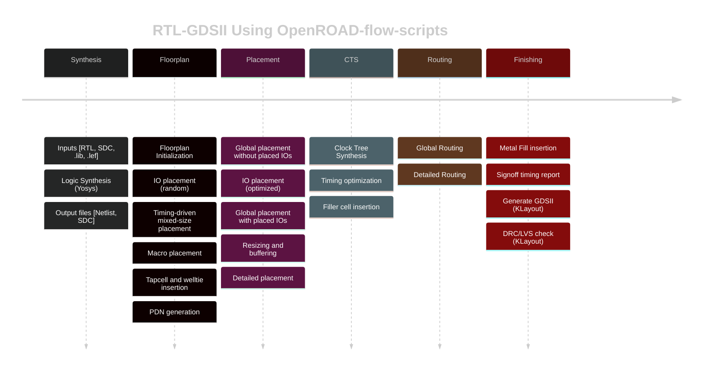

# RISC-V-SoC-Tapeout-Program-My-Journey
👩‍💻 Participant: Ashika C H 
<br>
📍 Program: RISC-V Reference SoC Tapeout Program (VSD) 
<br>
🏭 Impact: Part of India’s largest collaborative open-source tapeout with 3500+ participants .
<br>
This repository tracks my week-by-week progress in the SoC Tapeout Program, covering everything from RTL design to GDSII.

<details>
	<summary>Week 0 - Tools Installation </summary>

# Week0 - Tools Installation

## Yosys
```
$ git clone https://github.com/YosysHQ/yosys.git
$ cd yosys 
$ sudo apt install make (If make is not installed please install it) 
$ sudo apt-get install build-essential clang bison flex \
    libreadline-dev gawk tcl-dev libffi-dev git \
    graphviz xdot pkg-config python3 libboost-system-dev \
    libboost-python-dev libboost-filesystem-dev zlib1g-dev
$ make 
$ sudo make install
```


## Iverilog
```
$ sudo apt-get install iverilog
```


## GTKWave
```
$ sudo apt update
$ sudo apt install gtkwave
```


## NgspiceM
```
After downloading the tarball from https://sourceforge.net/projects/ngspice/files/ to a local
directory, unpack it using:
$ tar -zxvf ngspice-37.tar.gz
$ cd ngspice-37
$ mkdir release
$ cd release
$ ../configure --with-x --with-readline=yes --disable-debug
$ make
$ sudo make install 
```


## Magic
```
$ sudo apt-get install m4
$ sudo apt-get install tcsh
$ sudo apt-get install csh
$ sudo apt-get install libx11-dev
$ sudo apt-get install tcl-dev tk-dev
$ sudo apt-get install libcairo2-dev
$ sudo apt-get install mesa-common-dev libglu1-mesa-dev
$ sudo apt-get install libncurses-dev
git clone https://github.com/RTimothyEdwards/magic
cd magic
./configure
make
make install 
```


🛠️ Week 0 — Setup & Tools

🚀 Foundation Week — setting up the environment to begin the RISC-V SoC Tapeout journey.

🎯 Objectives

✔️ Understand program scope & flow (RTL → Synthesis → PD → Tapeout)
✔️ Install & configure open-source EDA tools
✔️ Validate environment with test runs

🧰 Tools Installed

📝 Yosys → Logic Synthesis
🎨 Magic → Layout & DRC/LVS checks
📊 KLayout → GDSII Visualization
📡GTKWave → Simulation & waveform analysis

🔑 Key Learnings

🌐 Explored the open-source EDA ecosystem
🧩 Understood how tools connect in the SoC flow
🛠️ Completed first test synthesis & layout runs successfully
🔗 Realized the importance of environment setup as the backbone for the entire tapeout process

✅ Week 0 Status
🟢 Setup Complete → Ready to begin RTL design in Week 1

✨ “Week 0 laid the foundation — from here, every week builds one more layer towards tapeout.”
</details>


<details>
<summary> Week 1 - Introduction to Verilog RTL Design and Synthesis</summary>

## Introduction to open-source simulator Iverilog

Folder structure of the git clone:
- `lib` - will contain sky130 standard cell library
- `my_lib/verilog_models` - will contain standard cell verilog model
- `verilog_files` -contains the lab experiments source files


Example of a design good_mux.v 

```
module good_mux (input i0 , input i1 , input sel , output reg y);
always @ (*)
begin
	if(sel)
		y <= i1;
	else 
		y <= i0;
end
endmodule
```
Example of a testbench tb_good_mux.v 

```
`timescale 1ns / 1ps
module tb_good_mux;
	// Inputs
	reg i0,i1,sel;
	// Outputs
	wire y;

        // Instantiate the Unit Under Test (UUT)
	good_mux uut (
		.sel(sel),
		.i0(i0),
		.i1(i1),
		.y(y)
	);

	initial begin
	$dumpfile("tb_good_mux.vcd");
	$dumpvars(0,tb_good_mux);
	// Initialize Inputs
	sel = 0;
	i0 = 0;
	i1 = 0;
	#300 $finish;
	end

always #75 sel = ~sel;
always #10 i0 = ~i0;
always #55 i1 = ~i1;
endmodule
```
Command to run the design and testbench
```
iverilog good_mux.v tb_good_mux.v
```
The output of the iverilog is a .vcd file and a.out file is created. By executing a.out iverilog dump the vcd file.

## Introduction to GTKWave
gtkwave will be used to generate the waveforms and display in visual format.

Command to view the vcd file in gtkwave 
```
gtkwave tb_good_mux.vcd
```
The waveform in gtwave is shown below


## Introduction to Yosys
It is the synthesizer used to convert RTL to netlist.
Netlist should be the same as the Design but represented in the form of standard cells.
The same testbench can be used to verify RTL and Synthesized Netlist.


## Introduction to Logic Synthesis


## Lab using Yosys and Sky130 PDKs


Timing libs, Hierarchical vs Flat Synthesis and Efficient Flop Coding Styles

## Introduction to timing .libs
Libraries are characterized based on PVT (process, voltage, temperature) \
Process -> Variations due to fabrication \
Voltage -> Variations due to voltage \
Temperature -> Variations due to temperature 

As seen in the screenshot below \
tt stands for typical in the .lib name \
025C stands for temperature of 25 C in the .lib name \
1v80 stands for voltage of 1.8V in the .lib name


-cell defines the beginning of the cell. Other information of cells mentioned are:
- Leakage power based on the combination of inputs
- Area
- Power ports
- Input capacitance
- Power associated with the pin
- Transition
- Delay

## Hierarchical vs Flat Synthesis

### Hierarchical Synthesis
Report after synthesizing multiple_modules.v. As shown below the sub_modules statistics are printed. For example, sub-module1 has 1 AND gate and sub-module2 has 1 OR gate. This is an example of Hierarchical Synthesis.


Hierarchy is preserved. sub_module1 and sub_module2 are instantiated separately in the synthesized Verilog netlist. Rather than seeing AND or OR gate, we see sub_modules when we run the command 'show' as shown in the screenshot.


If we look into the sub_module2 in synthesized netlist 'multiple_modules_hier.v', we see that rather than OR gate, the inputs a & b, pass through the inverter and then NAND gate. It is because in CMOS, stacking PMOS, which happens in 'OR' gate is bad as PMOS has lower mobility and always have to be wider to get some meaningful output. The next step is to check .lib file for the answer.

### Flat Synthesis
The design can be flattened by using the command `flatten`.

Screenshot shows the command, synthesized netlist and the logical diagram.


### Sub-module Level Synthesis
RTL (Register Transfer Level) designs are often modular, with various functional blocks or sub-modules. Sub-module level synthesis allows each of these sub-modules to be synthesized independently.

Why is the sub-module level synthesis necessary?
- Optimization and Area Reduction: By synthesizing sub-modules separately, the synthesis tool can optimize each one individually. It performs logic optimization, technology mapping, and area minimization for each sub-module. This leads to more efficient use of resources and reduced overall chip area.
- Resuability: Each submodule can be designed, verified, and optimized independently. They can be reused in a large design multiple times saving time and enhancing efficiency. 
- Parallel Processing: Different sub-modules can be synthesized concurrently, improving efficiency. For large designs, parallel synthesis significantly reduces turnaround time.

The commands to run sub-module synthesis
```
read_liberty -lib ../lib/sky130_fd_sc_hd__tt_025C_1v80.lib
read_verilog multiple_modules.v
synth -top sub_module1
abc -liberty ../lib/sky130_fd_sc_hd__tt_025C_1v80.lib
show
```

The screenshot shows that when sub_module1 is synthesized, only AND gate is generated. 


## Various Flop Coding Styles and Optimization

### Why do we need flops and how do they prevent glitches in the circuit?

Glitches can occur in digital circuits due to various reasons such as signal delays, noise, or timing issues. Flops prevent glitches during the operation in the following ways:
- Synchronization: Flops are edge-triggered devices, meaning they respond only to transitions of the input signal (e.g., rising edge, falling edge). This synchronization ensures that the output changes only at specific points, reducing the likelihood of glitches caused by transient signal variations.
- Timing Control: Flops are typically controlled by a clock signal, ensuring that all circuit operations occur synchronously. This eliminates timing issues that could lead to glitches due to data arriving at different times.


### Different types of flops
To initialize flops, we need to `set` and `reset` which can be synchronous or asynchronous.


The screenshot below shows DFF with asynchronous reset HDL simulation in Iverilog and  waveform display in GTKwave. Irrespective of the clock and d, as soon as async_reset=1, q=0.


### Synthesizing flops
The command to synthesize ***DFF with asynchronous reset*** as an example
```
read_liberty -lib ../lib/sky130_fd_sc_hd__tt_025C_1v80.lib
read_verilog dff_asyncres.v
synth -top dff_asyncres
dfflibmap -liberty ../lib/sky130_fd_sc_hd__tt_025C_1v80.lib
abc -liberty ../lib/sky130_fd_sc_hd__tt_025C_1v80.lib
show
```


On synthesizing ***DFF with synchronous reset*** we get NOR gate with inverted `d` as shown in the screenshot below. However,on evaluating the boolean expression, we reached the same logic realization. 


Using the `stat` command, all the cells used for logic synthesis are visible even though it is not evident from the statistics of doing synthesis.


### Synthesizing mult2 (multiply by 2)

To implement `y[3:0] = 2*a[2:0]`, we append a `1'b0 `to the `a[2:0]` i.e, `y[3:0] = {a[2:0],0}`. This is also equal to left shift the input bits by 1.
This can be realized by just wiring.
So we expect no hardware which is also seen in the screenshot below, analysis after synthesis and show. The command 'abc' is not required for mapping when there are no cells.


### Synthesizing mult9 (multiply by 9 or 8+1)

`y=9*a` can be considered `8*a+1*a`
To implement `y[5:0] = 9*a[2:0]`, we append `000` to `a[2:0]` and then add `a` i.e, `y[5:0] = {a[2:0],000} + a[2:0]`.
This can be realized just by wiring.
So we expect no hardware which is also seen in the screenshot below, analysis after synthesis and show. The command 'abc' is not required for mapping when there are no cells.


#### Combinational and Sequential Optimizations

## Introduction to Optimizations

### Combinational Logic Optimization
It means squeezing the logic to get the most optimized design in terms of area and power. the most commonly used techniques are:
1) Constant propagation using direct optimization
2) Boolean logic optimization using K-map and Quine McKlusky

An example of constant propagation optimization is highlighted below.


An example of boolean optimization is highlighted below.


### Sequential Logic Optimization
The technqiues used are:
1) Basic
   - Sequential constant propagation
2) Advanced (not covered as part of lab)
   - Static optimization
   - Retiming
   - Sequential logic cloning (floorplan aware synthesis)

An example of sequential constant propagation is highlighted below of DFF with asynchronous reset where D input is grounded. To note, the same technique cannot be applied to DFF with the asynchronous set because while `Q=1` when `Set=1`, but `Q=0` at `Set=0` at the next CLK pulse. Q is dependent not only on Set but also on the clock edge.


Retiming is a technique to improve the performance of the circuit.


## Combinational Logic Optimizations
Commands for optimization

```
opt_clean -purge
```
### Optimization of opt_check.v
Syntax for opt_check.v
```
module opt_check (input a , input b , output y);
        assign y = a?b:0;
endmodule
```
For opt_check.v the assignment `y = a?b:0` reduces to `y = ab`. The screenshot shown below explains this


The logic implementation after synthesis for opt_check.v is shown below, showing only AND gate.


### Optimization of opt_check2.v
Syntax for opt_check2.v
```
module opt_check2 (input a , input b , output y);
        assign y = a?1:b;
endmodule
```
For opt_check2.v the assignment `y = a?1:b` reduces to `y = a + b`. 

The logic implementation after synthesis for opt_check2.v is shown below, showing only OR gate.


### Optimization of opt_check3.v
Syntax for opt_check3.v
```
module opt_check3 (input a , input b, input c , output y);
	assign y = a?(c?b:0):0;
endmodule
```
For opt_check.v the assignment `y = a?(c?b:0):0` reduces to `y = abc`. The screenshot shown below explains this.


The logic implementation after synthesis for opt_check3.v is shown below, showing 3 input AND gate.


### Optimization of multiple_module_opt.v

Syntax of multiple_module_opt.v
```
module sub_module1(input a , input b , output y);
 assign y = a & b;
endmodule

module sub_module2(input a , input b , output y);
 assign y = a^b;
endmodule

module multiple_module_opt(input a , input b , input c , input d , output y);
wire n1,n2,n3;

sub_module1 U1 (.a(a) , .b(1'b1) , .y(n1));
sub_module2 U2 (.a(n1), .b(1'b0) , .y(n2));
sub_module2 U3 (.a(b), .b(d) , .y(n3));

assign y = c | (b & n1); 
endmodule
```
The logic implementation after synthesis for multiple_module_opt.v is shown below.


## Sequential Logic Optimizations

Both the dff_const1.v and dff_const2 are explained below.


### Optimizing dff_const1.v

Syntax for dff_const1.v
```
module dff_const1(input clk, input reset, output reg q);
always @(posedge clk, posedge reset)
begin
	if(reset)
		q <= 1'b0;
	else
		q <= 1'b1;
end

endmodule
```
For dff_const1.v, `q=0` as long as `reset=1`. However, when `reset=0` `q` doesn't immediately becomes `1` rather at the next rising edge of the `clk` as shown below. ***So the optimization cannot be applied***.


The commands to run the synthesis
```
read_liberty -lib ../lib/sky130_fd_sc_hd__tt_025C_1v80.lib
read_verilog dff_const1.v
synth -top dff_const1
dfflibmap -liberty ../lib/sky130_fd_sc_hd__tt_025C_1v80.lib
abc -liberty ../lib/sky130_fd_sc_hd__tt_025C_1v80.lib
show
```

The logic implementation after synthesis for dff_const1.v is shown below.


***complete dff_const2,4,5***

### Optimizing dff_const3.v

Syntax for dff_const3.v
```
module dff_const3(input clk, input reset, output reg q);
reg q1;

always @(posedge clk, posedge reset)
begin
	if(reset)
	begin
		q <= 1'b1;
		q1 <= 1'b0;
	end
	else
	begin
		q1 <= 1'b1;
		q <= q1;
	end
end

endmodule
```
For dff_const3.v, there are two flops.  `q1=0` as long as `reset=1`. However, when `reset=0` `q1` doesn't immediately becomes `1` rather at the next rising edge of the `clk` with some propagation delay as shown below. `q=1` as long as `reset=1`, acting as `set` rather than `reset`. However, when `reset=0` `q` samples `q1` as `0` as there are some propagation delay for `q1`as shown below. At the next `clk` edge `q` samples `q1` as `1`.
***So the optimization cannot be applied***.


The command to run HDL simulation
```
iverilog dff_const3.v tb_dff_const3.v
./a.out
gtkwave tb_dff_const3.vcd
```
The HDL simulation is shown below.

image 

The commands to run the synthesis
```
read_liberty -lib ../lib/sky130_fd_sc_hd__tt_025C_1v80.lib
read_verilog dff_const3.v
synth -top dff_const3
dfflibmap -liberty ../lib/sky130_fd_sc_hd__tt_025C_1v80.lib
abc -liberty ../lib/sky130_fd_sc_hd__tt_025C_1v80.lib
show
```

The logic implementation after synthesis for dff_const3.v is shown below.


## Sequential Optimzations for Unused Outputs

### Optimization of Case1: 3-bit Up Counter with q[0] used (counter_opt.v)
Example of a counter where bits at the position of [2] and [1] are unused.

```
module counter_opt (input clk , input reset , output q);
reg [2:0] count;
assign q = count[0];

always @(posedge clk ,posedge reset)
begin
	if(reset)
		count <= 3'b000;
	else
		count <= count + 1;
end

endmodule
```
The screenshot explains the logic of the counter. Only q[0] is used. ***So the optimization can be applied***.


The commands to run the synthesis
```
read_liberty -lib ../lib/sky130_fd_sc_hd__tt_025C_1v80.lib
read_verilog counter_opt.v
synth -top counter_opt
dfflibmap -liberty ../lib/sky130_fd_sc_hd__tt_025C_1v80.lib
abc -liberty ../lib/sky130_fd_sc_hd__tt_025C_1v80.lib
show
```
We see only one flop after the synthesis and also seen in synthesis report after `synth -top counter_opt.v`


### Optimization of Case2: 3-bit Up Counter (counter_opt2.v)

Example of a counter where all the bits are used.
```
module counter_opt (input clk , input reset , output q);
reg [2:0] count;
assign q = (count[2:0] == 3'b100);

always @(posedge clk ,posedge reset)
begin
	if(reset)
		count <= 3'b000;
	else
		count <= count + 1;
end

endmodule
```
The commands to run the synthesis
```
read_liberty -lib ../lib/sky130_fd_sc_hd__tt_025C_1v80.lib
read_verilog counter_opt.v
synth -top counter_opt
dfflibmap -liberty ../lib/sky130_fd_sc_hd__tt_025C_1v80.lib
abc -liberty ../lib/sky130_fd_sc_hd__tt_025C_1v80.lib
show
```
We see only 3 flops after the synthesis and also seen in synthesis report after `synth -top counter_opt.v`


## GLS, Synthesis-Simulation Mismatch, and Blocking/Non-blocking Statements

### Why is Gate Level Simulation (GLS) necessary?
- Verify the correctness of the design after synthesis
- Ensure the timing of the design is met which is done with delay annotation (timing aware)


### Synthesis Simulation Mismatches

It happens because of the following reasons
- Missing sensitivity list
- Blocking vs non-blocking assignments
- Non-standard verilog coding

#### (1) Missing sensitivity list

As shown in the screenshot below, `always` block is evaluated only when `sel` is changing. So output `y` is not evaluated when `sel` is not changing although `i0` and `i1` are changing. Rather it acts like a latch. The code on the right side represents the correct design coding for `mux`. In this case `always` is evaluated for any signal changes. 


#### (2) Blocking vs Non-blocking Assignments

 ##### Blocking Statements
 
 - Represented by `=`
 - Executes the statements in the order it is written inside always block
 - So the first statement is evaluated before the second statement

##### Non-Blocking Statements
- Represented by `<=`
- Executes all the RHS when always block is entered and assigns to LHS
- Parallel execution

   The left side of the screenshot below gives us the correct execution. While the right side can lead to serious issues as `d` is assigned to `q` directly. ***So choosing non-blocking statements is best practice*** (highlighted in the screenshot below).


##### Blocking Statements Leading to Synthesis Simulation Mismatch

In the code shown below, `y` gets the old `q0` value. This will mimic delay or flop. But when you synthesize, there will be no flop. If the order is changed (right side code), latest value of `q0` is assigned to `y`. 

When synthesized, both will lead to the same circuit. However, simulation will result in different behavior. For the left side of the code, `y` gets the old `q0` value and for the right side of the code, `y` gets the latest `q0` value leading to a synthesis simulation mismatch. 

This issue is resolved by using ***non-blocking statements***.


## Labs on GLS and Synthesis-Simulation Mismatch

### Ternary operator MUX (ternary_operator_mux.v)

The Verilog code of ternary_operator_mux.v
```
module ternary_operator_mux (input i0 , input i1 , input sel , output y);
	assign y = sel?i1:i0;
	endmodule
```
The command to run HDL simulation
```
iverilog ternary_operator_mux.v tb_ternary_operator_mux.v
./a.out
gtkwave tb_ternary_operator_mux.vcd
```
HDL Simulation waveform of ternary_operator_mux.v is shown in the screenshot below


The commands to run the synthesis for ternary_operator_mux.v
```
read_liberty -lib ../lib/sky130_fd_sc_hd__tt_025C_1v80.lib
read_verilog ternary_operator_mux.v
synth -top ternary_operator_mux
abc -liberty ../lib/sky130_fd_sc_hd__tt_025C_1v80.lib
show
write_verilog ternary_operator_mux_net.v
```


The commands to do GLS for ternary_operator_mux.v
```
iverilog ../my_lib/verilog_model/primitives.v ../my_lib/verilog_model/sky130_fd_sc_hd.v ternary_operator_mux_net.v tb_ternary_operator_mux.v
./a.out
gtkwave tb_ternary_operator_mux.vcd
```
The GLS output is shown below.


### Bad MUX (bad_mux.v)

The `always` block is executed only at `sel` signal. It works like a flop rather than mux.
The Verilog code of bad_mux.v
```
module bad_mux (input i0 , input i1 , input sel , output reg y);
always @ (sel)
begin
	if(sel)
		y <= i1;
	else 
		y <= i0;
end
endmodule
```

The command to run HDL simulation
```
iverilog bad_mux.v tb_bad_mux.v
./a.out
gtkwave tb_bad_mux.vcd
```
HDL Simulation waveform of bad_mux.v is shown in the screenshot below


The commands to run the synthesis for bad_mux.v.
```
read_liberty -lib ../lib/sky130_fd_sc_hd__tt_025C_1v80.lib
read_verilog bad_mux.v
synth -top bad_mux
abc -liberty ../lib/sky130_fd_sc_hd__tt_025C_1v80.lib
show
write_verilog bad_mux_net.v
```

The synthesis report shows it is still inferring the mux but not the flop.


The commands to do GLS for bad_mux.v
```
iverilog ../my_lib/verilog_model/primitives.v ../my_lib/verilog_model/sky130_fd_sc_hd.v bad_mux_net.v tb_bad_mux.v
./a.out
gtkwave tb_bad_mux.vcd
```
The GLS output is shown below. This shows correct functionality which is different from HDL simulation, leading to ***synthesis simulation mismatch***.


## Labs on Synthesis-Simulation Mismatch for Blocking Statements

### Blocking Caveat (blocking_caveat.v)

The logic to simulate is shown below.


The Verilog code of blocking_caveat.v
```
module blocking_caveat (input a , input b , input  c, output reg d); 
reg x;
always @ (*)
begin
	d = x & c;
	x = a | b;
end
endmodule
```

The command to run HDL simulation
```
iverilog blocking_caveat.v tb_blocking_caveat.v
./a.out
gtkwave tb_blocking_caveat.vcd
```
HDL Simulation waveform of blocking_caveat.v is shown in the screenshot below. `d` takes the old value of `x` causing incorrect functionality.


The commands to run the synthesis for bad_mux.v.
```
read_liberty -lib ../lib/sky130_fd_sc_hd__tt_025C_1v80.lib
read_verilog blocking_caveat.v
synth -top blocking_caveat
abc -liberty ../lib/sky130_fd_sc_hd__tt_025C_1v80.lib
show
write_verilog blocking_caveat_net.v
```

The synthesis report and logic synthesis is shown below.


The commands to do GLS for bad_mux.v
```
iverilog ../my_lib/verilog_model/primitives.v ../my_lib/verilog_model/sky130_fd_sc_hd.v blocking_caveat_net.v tb_blocking_caveat.v
./a.out
gtkwave tb_blocking_caveat.vcd
```
The GLS output is shown below. In this case, `d` takes the current value of `x` causing incorrect functionality.The waveform shows correct functionality which is different from HDL simulation, leading to ***synthesis simulation mismatch***.


</details>

<details>
	<summary>Week 2 - BabySoC Fundamentals & Functional Modelling  </summary>

# BabySoC Fundamentals & Functional Modelling 

# Objective :
To build a solid understanding of SoC fundamentals and practice functional modelling of the BabySoC using simulation tools (Icarus Verilog & GTKWave). 

🔹 Designed a compact open-source SoC (BabySoC) based on the RVMYTH RISC-V core.
<br>
🔹 Integrated a PLL for accurate clock generation & synchronization.
<br>
🔹 Added a 10-bit DAC to enable digital-to-analog conversion.
<br>
🔹 Enabled interfacing with external analog systems (e.g., 📺 televisions, 📱 mobile phones) for audio/video outputs.
<br>
🔹 Implemented using Sky130 technology, providing a documented educational platform for exploring digital–analog interfacing.

<details>
	
<summary> What is a System-on-Chip (SoC)? </summary>

**📌 System-on-Chip (SoC) – Key Points**

 **Definition**

A System-on-Chip (SoC) is an integrated circuit (IC) that combines multiple components of a complete electronic system into a single chip.

**Core Components**

Processor/Core 🖥️ → CPU, GPU, DSP, or RISC-V/ARM cores for computation.

Memory 💾 → RAM, ROM, Flash, and cache for storage.

Peripherals ⌨️ → Interfaces like USB, I2C, SPI, UART, GPIO.

Analog Blocks 🎛️ → ADC, DAC, PLL, power management.

Interconnect 🔗 → High-speed buses (AMBA, AXI, Wishbone) for communication between blocks.

**Integration**

Everything is fabricated on one silicon die → reduces cost, area, and power.

**Advantages**

🚀 High Performance → Fast data transfer (on-chip communication).

🔋 Low Power Consumption → Optimized integration saves energy.

📏 Small Size → Replaces multi-chip PCB designs.

💰 Cost-Effective → Mass production reduces manufacturing cost.

⚡ Reliability → Fewer interconnections → lower failure rates.

**Applications**

📱 Mobile Phones (Qualcomm Snapdragon, Apple A-series).

🚗 Automotive (ADAS, infotainment).

📺 Consumer Electronics (Smart TVs, IoT devices).

🛰️ Aerospace/Defense (satellite processors).

💻 Embedded Systems & Edge AI devices.

**Technology Nodes**

Fabricated in nm technologies → 180nm, 65nm, 28nm, 7nm, down to 3nm.

Smaller node = more transistors = faster + power-efficient.

**Design Flow**

Specification → RTL Design → Functional Verification → Synthesis → Place & Route → Fabrication → Testing (DFT, Scan Chains).

**Challenges**

🔧 Power Management (low power design techniques).

🔄 Integration Complexity (multiple IPs on same die).

🔐 Security (hardware root of trust).

🧪 Verification & Testing (DFT, BIST, scan).

### Why SoCs Are Awesome

**1️⃣ Compact Integration**

CPU + Memory + Peripherals + Analog + Power circuits → all in one chip.

📏 Reduces board space → smaller devices (smartphones, IoT, wearables).

**2️⃣ High Performance**

⚡ On-chip communication (fast interconnect/NoC) → lower latency vs. multi-chip systems.

🚀 Parallel processing with CPU + GPU + DSP + AI accelerators.

**3️⃣ Low Power Consumption**

🔋 Optimized for mobile/embedded use with DVFS, power gating, clock gating.

✅ Longer battery life for handheld devices.

**4️⃣ Cost-Effective**

💰 Fewer external components = reduced manufacturing cost.

🏭 Easy mass production = economies of scale.

**5️⃣ Reliability**

🔗 Fewer off-chip connections → lower failure rate.

🛡️ On-chip security modules → hardware-level protection.

**6️⃣ Versatility**

📱 Consumer Electronics: smartphones, tablets, smart TVs.

🚗 Automotive: ADAS, infotainment, EVs.

🛰️ Aerospace/Defense: satellite processors.

🤖 AI/IoT: edge devices, wearables, robotics.

**7️⃣ Scalability & Future-Readiness**

🧩 Supports custom accelerators (AI, ML, vision).

🌐 Integrates modern connectivity → Wi-Fi, Bluetooth, 5G.

📉 Shrinks with technology nodes → from 180nm → 7nm → 3nm.

### Where You’ll Find SoCs

**📱 In Your Pocket**

Smartphones, tablets, wearables → SoCs like Snapdragon, Apple A/M series, Exynos.

They manage calls, photos, gaming, AI assistants — all from one chip!

**🚗 On the Road**

Cars run on SoCs for ADAS, infotainment, EV battery control.

Examples: NVIDIA DRIVE, Qualcomm Auto SoCs, Tesla FSD.

Your car is basically a computer-on-wheels 🛞.

**🏠 Inside Your Home**

Smart TVs, Alexa, Google Home, smart bulbs & locks.

SoCs like MediaTek, ESP32, ARM Cortex-M quietly keep your home smart & connected.

**🌐 Across Networks**

Wi-Fi routers, 5G/4G modems, even satellites.

Broadcom, Qualcomm X-series, Space-grade SoCs ensure you stay connected → from your room to outer space 🚀.

**🏥 In Healthcare**

Portable monitors, smart bands, glucose trackers.

SoCs give doctors real-time data and patients life-saving insights.

**🤖 In the Future (Already Here!)**

AI edge devices, robots, drones → powered by NVIDIA Jetson, Google Coral, NPUs.

They enable vision, intelligence, and autonomy.

### Some Popular SoCs You Might Know

Snapdragon X2 Elite ⚡ → 3 nm powerhouse for laptops & PCs.

Snapdragon 8 Elite Gen-5 📱 → flagship mobile chip with AI boost.

MediaTek Dimensity 9400 📸 → camera + AI beast for smartphones.

NVIDIA Jetson Orin 🤖 → brain of robots, drones & edge AI.

Hailo-8 / Axera AX630C 👀 → tiny but strong AI vision SoCs for IoT.

Basilisk RISC-V 🧑‍🎓 → open-source SoC for learning & research.

</details>

<details>
	
<summary> Components of a typical SoC (CPU, memory, peripherals, interconnect) </summary>

	
**📌 Components of a Typical System-on-Chip (SoC)**

**1️⃣ CPU / Processing Cores**

General Purpose CPU: ARM Cortex, RISC-V, x86 cores 🖥️

GPU (Graphics Processing Unit) 🎮: Parallel processing, graphics rendering, video acceleration.

DSP (Digital Signal Processor) 🎵: Optimized for audio, image, and real-time signal processing.

AI/ML Accelerators 🤖: Neural network processing, edge AI inference engines.

Multiple Cores (Multicore SoC): Improves performance with parallel execution.

**2️⃣ Memory Subsystem**

On-Chip Memory

SRAM (Cache): L1, L2, L3 for fast data access.

ROM: Stores firmware, boot code.

External Memory Controllers

DRAM Controllers: DDR, LPDDR.

Flash Controllers: NAND/NOR for storage.

Functions: Data/instruction storage, buffering, booting, and execution.

**3️⃣ Peripherals (I/O Interfaces)**

Communication Interfaces

Low-Speed: UART, I²C, SPI.

High-Speed: USB, PCIe, Ethernet, SATA.

Multimedia Interfaces

Display controller, HDMI, MIPI DSI.

Camera interface (CSI).

Audio codecs.

Timers & Counters ⏱️

GPIO (General-Purpose Input/Output) 🔌

Security Modules 🔐

Cryptographic accelerators.

Secure boot, trusted execution.

**4️⃣ Interconnect (On-Chip Communication)**

Bus-based Fabrics: AMBA (AXI, AHB, APB).

Crossbar Switches: Parallel high-speed data paths.

Network-on-Chip (NoC): Scalable packet-switched fabric for large SoCs.

Role: Ensures efficient CPU–Memory–Peripheral communication.

**5️⃣ Analog & Mixed-Signal Blocks**

PLL (Phase-Locked Loop) ⏱️: Clock generation, synchronization.

ADC (Analog-to-Digital Converter) 🎛️: Sensor inputs (temperature, motion, etc.).

DAC (Digital-to-Analog Converter) 🔊: Audio, video signal output.

PHY Interfaces: For USB, PCIe, Ethernet.

**6️⃣ Power Management**

Power Management Unit (PMU) 🔋: Controls power domains.

Voltage Regulators & DC-DC Converters: Supply stable voltage.

Dynamic Voltage & Frequency Scaling (DVFS) ⚡: Balances performance vs. power.

Clock Gating & Power Gating: Reduce leakage and dynamic power.

Battery Management Circuits (in mobile SoCs).

**7️⃣ Other Special Features**

Security Enhancements: Hardware root of trust, encryption modules, secure enclaves.

Debug & Test Features 🛠️: JTAG, DFT, BIST (Built-In Self-Test), scan chains.

Networking Support 🌐: Wi-Fi, Bluetooth, 5G/4G modem.

Sensor Hubs 📱: For accelerometer, gyroscope, ambient sensors.

Embedded Operating System Support: Runs Linux, RTOS, Android, or bare-metal firmware.


In summary, **System on a Chip (SoC)** technology allows us to create powerful, efficient, and compact devices by combining multiple components into one chip. This is why our phone, smartwatch, and even some household appliances can do so much in such a small package.
</details>

<details>
<summary> Types of SoCs 🖥️✨</summary>

ASIC SoC 🎯 – Custom-built for specific apps, ultra-efficient.

MCU SoC ⚡ – CPU + memory + peripherals for embedded/IoT.

DSP SoC 🔊 – Accelerated for signal processing.

Network SoC 🌐 – Handles routers, modems & comms.

Mobile SoC 📱 – All-in-one for smartphones: CPU, GPU, DSP, modem.

FPGA SoC 🔄 – Programmable logic + CPU, flexible prototyping.

Multimedia SoC 🎥 – Powers video/audio processing & displays.

Power Mgmt SoC 🔋 – Battery & voltage control, energy-efficient.

 ### SoC Design Flow


	
</details>

<details>
	
<summary> Introduction to VSDBabySoC </summary>


**VSDBabySoC: Compact Yet Powerful RISC-V SoC 🖥️✨**

The VSDBabySoC is a small but highly capable System-on-Chip (SoC) built on the RISC-V architecture. Its main goal is to simultaneously test three open-source IP cores for the first time while also calibrating its analog components.

**Key components include:**

RVMYTH Microprocessor – Handles the core data processing.

8x Phase-Locked Loop (PLL) – Generates a stable, synchronized clock for smooth operation.

10-bit DAC (Digital-to-Analog Converter) – Converts digital outputs to analog signals for real-world devices.

**1️⃣ Initialization & Clock Generation ⏱️**

When BabySoC receives the initial input signal, the PLL activates, producing a stable and synchronized clock. This ensures that RVMYTH and the DAC work in perfect harmony, avoiding timing mismatches and guaranteeing data integrity across the SoC.

**2️⃣ Data Processing in RVMYTH 💻**

The RVMYTH core is the brain of BabySoC. Its r17 register cycles through values generated during instruction execution. These values are prepared for analog conversion, creating a continuous stream of digital data that the DAC can process seamlessly.

**3️⃣ Analog Signal Generation via DAC 🎶📺**

The DAC receives the digital data from RVMYTH and converts it into analog signals. These outputs, saved in a file called OUT, can drive external devices like TVs, speakers, and mobile phones. This demonstrates how BabySoC bridges digital processing and real-world multimedia outputs, showing its practical applications in consumer electronics.


## BabySoC Components 🖥️✨

**RVMYTH (RISC-V CPU) 💻**

Acts as the brain of BabySoC.

Based on the open-source RISC-V architecture, making it lightweight, flexible, and customizable.

Handles all processing tasks and communicates with other SoC components.

Perfect for learning, experimenting, and understanding CPU design and instruction flow.

**Phase-Locked Loop (PLL) ⏱️**

Generates a stable, synchronized clock to ensure smooth operation across the SoC.

Aligns BabySoC’s internal clock with a reference frequency, maintaining precise timing for RVMYTH and DAC.

Crucial for timing-critical circuits and widely used in communication and synchronization applications.

**Digital-to-Analog Converter (DAC) 🎶📺**

Converts digital data from RVMYTH into analog signals.

Enables BabySoC to interface with real-world devices like speakers, TVs, or displays.

Demonstrates how digital computation drives multimedia output, bridging the gap between digital processing and analog interaction.

### Phase-Locked Loop (PLL) ⏱️

**1️⃣ Definition**

A Phase-Locked Loop (PLL) is a control system that generates a clock signal synchronized with a reference frequency.

It continuously compares the phase of the output signal with the input reference and adjusts the output to stay in sync.

In simpler words, a PLL locks the clock of a chip to a stable reference, ensuring all components run harmoniously.

**2️⃣ Main Components of a PLL**

Phase Detector (PD) 🔍

Compares the phase of the input reference signal with the PLL’s output.

Produces a signal proportional to the phase difference.

Low-Pass Filter (LPF) 🛡️

Smooths out the output from the phase detector.

Eliminates high-frequency noise and generates a clean control voltage for the VCO.

Voltage-Controlled Oscillator (VCO ⚡)

Generates the output clock signal.

Frequency varies based on the control voltage from the filter to match the reference phase.

Feedback Path 🔄

Feeds the PLL output back to the phase detector.

Ensures continuous phase adjustment until the output is locked to the reference.

**3️⃣ Functionality**

Clock Generation: Produces a stable and precise clock for digital circuits.

Synchronization: Aligns the internal clock of ICs with an external or reference clock.

Frequency Multiplication / Division: Can generate higher or lower frequencies from a reference clock.

Jitter Reduction: Minimizes timing variations in signals for reliable operation.

**4️⃣ Why Can’t Off-Chip Clocks Always Be Used?**

Signal Degradation: Off-chip signals can suffer noise, delay, and attenuation over PCB traces.

Timing Mismatch: External clocks may not match the exact frequency requirements of internal circuits.

Power Consumption: Driving high-speed signals from off-chip sources consumes more power.

Integration Requirement: Modern SoCs require highly stable, on-chip clocks for synchronizing multiple components simultaneously.


### Digital-to-Analog Converter (DAC) 🎶📺

**1️⃣ Definition**

A DAC (Digital-to-Analog Converter) is a device that converts digital signals (binary numbers) into continuous analog signals.

It acts as a bridge between the digital world of processors and the analog world of real devices like speakers, displays, and sensors.

In simple terms, a DAC translates 0s and 1s into voltage, current, or sound waves that the real world can interpret.

**2️⃣ Main Components of a DAC**

Digital Input Register 💻

Holds the digital value coming from a processor or microcontroller.

Prepares it for analog conversion.

Reference Voltage Source ⚡

Provides a stable voltage against which the digital input is compared.

Ensures accurate and consistent output levels.

Resistor / Current Ladder Network 🔗

Converts the digital input into proportional current or voltage.

Forms the core of most DAC architectures.

Output Amplifier / Buffer 🛡️

Converts the internal DAC signal into a usable analog output.

Ensures the output can drive external devices without distortion.

**3️⃣ Functionality**

Digital-to-Analog Conversion: Translates discrete digital values into smooth analog signals.

Multimedia Output: Generates audio signals for speakers or video signals for displays.

Control Signals: Sends analog voltages to actuators, motors, or sensors in embedded systems.

Data Interfacing: Connects microcontrollers and processors to real-world analog devices.

**4️⃣ Types of DACs ⚡**

1.Binary-Weighted DAC

Uses resistors weighted by powers of 2.

Simple but sensitive to resistor accuracy.


2.R-2R Ladder DAC

Uses a ladder of resistors in a repeatable R and 2R pattern.

Popular due to ease of manufacturing and accuracy.


In VSDBabySoC:
      - In the VSDBabySoC design, we are utilizing a 10-bit DAC, which means it can take a digital input represented by 10 bits and convert it into an analog output.

---

This document outlines the structure and components of BabySoC, along with a basic understanding of SoCs and their types. By mastering these concepts and understanding how BabySoC operates, one gains a solid foundation in modern embedded systems design and digital-to-analog interfacing.

---
</details>

## Overview
The **VSDBabySoC** is a simple SoC (System-on-Chip) design incorporating a RISC-V processor (`rvmyth`), a PLL (Phase-Locked Loop) module (`pll`), and a DAC (Digital-to-Analog Converter) module (`dac`). This project demonstrates integration of these IP cores and aims to simulate and verify the design behavior using pre-synthesis and post-synthesis simulations.

## Project Structure
- `src/include/` - Contains header files (`*.vh`) with necessary macros or parameter definitions.
- `src/module/` - Contains Verilog files for each module in the SoC design.
- `output/` - Directory where compiled outputs and simulation files will be generated.

## Requirements
Ensure you have **Icarus Verilog** installed for compilation and **GTKWave** for viewing waveform files. This project assumes a Unix-like environment (macOS/Linux).

## Step-by-Step Guide

### 1. Setup and Prepare Project Directory
Clone or set up the directory structure as follows:
```txt
VSDBabySoC/
├── src/
│   ├── include/
│   │   ├── sandpiper.vh
│   │   └── other header files...
│   ├── module/
│   │   ├── vsdbabysoc.v      # Top-level module integrating all components
│   │   ├── rvmyth.v          # RISC-V core module
│   │   ├── avsdpll.v         # PLL module
│   │   ├── avsddac.v         # DAC module
│   │   └── testbench.v       # Testbench for simulation
└── output/
└── compiled_tlv/         # Holds compiled intermediate files if needed
```
### Module Descriptions

<details>
   <summary><strong>2.1 vsdbabysoc.v (Top-Level SoC Module)</strong></summary>
      This is the top-level module that integrates the rvmyth, pll, and dac modules.<br>
	  [VSDBabySoC](https://github.com/manili/VSDBabySoC.git)
      - Inputs:
         - reset: Resets the core processor.
         - VCO_IN, ENb_CP, ENb_VCO, REF: PLL control signals.
         - VREFH: DAC reference voltage.
      - Outputs:
         - OUT: Analog output from DAC.
         - Connections:
         - RV_TO_DAC - A 10-bit bus that connects the RISC-V core output to the DAC input.
         - CLK - The clock signal generated by the PLL.
      
</details>
 <details>
     <summary><strong>2.2 rvmyth.v (RISC-V Core)</strong></summary>
     The rvmyth module is a simple RISC-V based processor. It outputs a 10-bit digital signal (OUT) to be converted by the DAC.<br>
     [rvmyth](https://github.com/kunalg123/rvmyth/)
      
      Inputs:
         - CLK: Clock signal generated by the PLL.
         - reset: Initializes or resets the processor.
      Outputs:
         - OUT: A 10-bit digital signal representing processed data to be sent to the DAC.
         
   </details>

   <details>
     <summary><strong>2.3 avsdpll.v (PLL Module)</strong></summary>
     The pll module is a phase-locked loop that generates a stable clock (CLK) for the RISC-V core.<br>
     [Introduction](https://github.com/ireneann713/PLL.git)
     [avsdpll](https://github.com/lakshmi-sathi/avsdpll_1v8.git)
       Inputs:
         - VCO_IN, ENb_CP, ENb_VCO, REF: Control and reference signals for PLL operation.
      Output:
         - CLK: A stable clock signal for synchronizing the core and other modules.
         
         
   </details>

   <details>
     <summary><strong>2.4 avsddac.v (DAC Module)</strong></summary>
     The dac module converts the 10-bit digital signal from the rvmyth core to an analog output.<br>
     [avsddac](https://github.com/vsdip/rvmyth_avsddac_interface.git)
      
      Inputs:
         - D: A 10-bit digital input from the processor.
         - VREFH: Reference voltage for the DAC.
      Output:
         - OUT: Analog output signal.

         
   </details>

   ### Testbench
The testbench.v file is a test module to verify the functionality of vsdbabysoc. It includes signal initialization, clock generation, and waveform dumping for both pre-synthesis and post-synthesis simulations.
Waveform Output:
   - pre_synth_sim.vcd or post_synth_sim.vcd files generated based on simulation conditions.

### Simulation Steps
#### Pre-Synthesis Simulation
Run the following command to perform a pre-synthesis simulation:

```tcl
iverilog -o output/pre_synth_sim/pre_synth_sim.out -DPRE_SYNTH_SIM \
    -I src/include -I src/module \
    src/module/testbench.v src/module/vsdbabysoc.v
cd output/pre_synth_sim
./pre_synth_sim.out
```


**Explanation:**
   - -DPRE_SYNTH_SIM: Defines the PRE_SYNTH_SIM macro for conditional compilation in the testbench.
   - The resulting pre_synth_sim.vcd file can be viewed in GTKWave.

#### Viewing Waveform in GTKWave
After running the simulation, open the VCD file in GTKWave:
`gtkwave output/pre_synth_sim/pre_synth_sim.vcd`

#### Post-Synthesis Simulation
To run a post-synthesis simulation, use:
```tcl
iverilog -o output/post_synth_sim/post_synth_sim.out -DPOST_SYNTH_SIM \
    -I src/include -I src/module \
    src/module/testbench.v output/synthesized/vsdbabysoc.synth.v
cd output/post_synth_sim
./post_synth_sim.out
```

### Trouble shooting tips

   - Module Redefinition: If you encounter redefinition errors, ensure modules are included only once, either in the testbench or in the command line.
   - Path Issues: Verify paths specified with -I are correct. Use full paths if relative paths cause errors.


### Simulation logs


🔍 Simulation Logs – VSDBabySoC

The simulation of BabySoC Verilog modules was carried out using iverilog and GTKWave. Below is a breakdown of the simulation results:

Reset Verification ✅

Observed the active-low reset signal (rst_n) behavior.

During reset assertion, all registers and outputs were initialized to their default states.

Once reset was de-asserted, the system started executing normal operations.

Clock Operation ⏱️

Verified the clock (clk) waveform with correct periodic toggling.

Confirmed synchronous behavior across modules (signals triggered on positive clock edge).

Dataflow Analysis 📡

Data signals propagated correctly between CPU (RVMYTH), memory, and peripherals.

Verified proper handshake and data transfer between modules.

Waveform Validation 📊

Generated .vcd files using iverilog simulation.

Loaded waveforms in GTKWave to analyze transitions.

Captured screenshots highlighting reset, clock, and module dataflow activities.

Simulation Logs Snapshot 📝

The simulation logs confirm:

Successful compilation and simulation without errors.

Proper instantiation of SoC modules.

Execution flow matches expected BabySoC design functionality.

### GTKWave screenshots highlighting correct BabySoC behavior 


1️⃣ CLK Signal ⏱️

Definition: Primary clock input to the RVMYTH core.

Source: Generated by PLL in real hardware (but given as a simple clock in simulation).

Waveform Behavior:

Periodic square wave.

Rising edges trigger synchronous logic like registers, counters, and pipeline stages.

Observation:

All transitions in the design (reset release, data updates) are aligned with the positive clock edge.

Confirms system-wide synchronization.

2️⃣ Reset Signal 🔄

Definition: Input reset signal applied to the RVMYTH core.

Source: External source in hardware (manual or power-on reset).

Waveform Behavior:

Active-low → logic is held in reset when signal = 0.

On reset release (1), design resumes normal operation.

Observation:

Registers, memory, and output signals are forced to initial states during reset.

System only starts meaningful dataflow after reset is deasserted.

3️⃣ OUT (VSDBabySoC) 📤

Definition: The top-level SoC output port.

Source: DAC output in hardware → exported as SoC OUT pin.

Waveform Behavior:

In actual chip → analog signal.

In simulation → restricted to digital representation for compatibility.

Observation:

Shows transitions whenever the DAC receives new data from RV_TO_DAC[9:0].

Confirms end-to-end dataflow from CPU → DAC → OUT pin.

4️⃣ RV_TO_DAC[9:0] 🔢

Definition: 10-bit digital bus between RVMYTH and DAC.

Source: RVMYTH core register #17 (hardwired in BabySoC).

Waveform Behavior:

Carries binary values (0–1023) representing sampled digital data.

Changes on clock edges when new register values are updated.

Observation:

Any activity on this bus directly affects DAC output.

Validates CPU-to-DAC interfacing.

5️⃣ OUT (DAC – real datatype) 🎚️

Definition: Internal wire in DAC module that supports analog simulation.

Source: Derived from RV_TO_DAC[9:0] via DAC conversion logic.

Waveform Behavior:

Real datatype → represents analog-like values in simulation.

Provides continuous waveform instead of stepwise digital output.

Observation:

Helps visualize DAC’s analog functionality, even though Verilog restricts real hardware analog simulation.

Confirms correct scaling of digital input into analog range.


This week, I successfully:
1️⃣ Cloned and explored the VSDBabySoC repository 🖥️
2️⃣ Compiled the Verilog modules using Icarus Verilog ⚙️
3️⃣ Generated .vcd files and analyzed them in GTKWave 📊
4️⃣ Verified critical signals – CLK, Reset, RV_TO_DAC[9:0], and OUT 🔍
5️⃣ Captured simulation logs & screenshots to document reset behavior, clock synchronization, and dataflow between modules 📝

✨Week 2 provided hands-on experience in functional simulation of BabySoC, strengthening my understanding of SoC signal interactions and waveform analysis 🚀🔧
</details>

<details>
	<summary>Week 3 - Post-Synthesis GLS & STA Fundamentals </summary>

<details>
<summary> ⚙️ Gate-Level Simulation (GLS) of BabySoC </summary>
	
**🧩 Post-Synthesis Verification Phase**
**🎯 Purpose of GLS**

Gate-Level Simulation (GLS) is the reality check for our BabySoC design 💡.
After synthesis converts the RTL description into a gate-level netlist, GLS ensures that the design still behaves exactly as intended — but now with real hardware timing taken into account. Unlike RTL simulations that work on abstract behavioral models, GLS dives deep into the actual logic gates and interconnections that form the silicon foundation of the SoC 🧠⚡.

**🔍 Why GLS Matters for BabySoC**

**⏱️ Timing-Aware Verification:**
GLS is performed using Standard Delay Format (SDF) files that include the post-synthesis delays.
It helps verify that the design meets real-world timing constraints — checking if the SoC runs smoothly without timing violations or setup/hold issues ⏳✅.

**🧠 Functional Validation after Synthesis:**
Even after synthesis transforms RTL into gates, the logic must remain intact. GLS ensures that no logical discrepancies or unwanted glitches have crept in during synthesis. It confirms the trust between what was written and what will be fabricated.

**🔧 Simulation Tools in Action:**
Simulation is carried out using tools like Icarus Verilog (iverilog) or similar Verilog simulators 🧮.
Post-simulation, GTKWave is used to visualize and analyze the waveforms — letting us watch signal transitions, debug timing behavior, and confirm correctness visually 📊👀.

**🧠 Importance for BabySoC Architecture:**
BabySoC integrates multiple modules — RISC-V Processor (RVMYTH), PLL, and DAC — all working hand-in-hand 🤝.
GLS ensures that these modules communicate seamlessly and meet timing requirements, validating that the SoC design is synthesis-accurate, timing-correct, and silicon-ready 🚀.

🧭 Step-by-Step Manual Execution Plan
Step 1: Launch Yosys and Load Design
yosys


Start by opening Yosys, the synthesis tool.
Load your top-level BabySoC design along with all its supporting RTL modules.
This prepares the environment for generating the gate-level netlist and proceeding with the simulation 🧱➡️⚙️.

Inside the Yosys shell, run:
```yosys
read_verilog src/module/vsdbabysoc.v
read_verilog -I src/include src/module/rvmyth.v
read_verilog -I src/include src/module/clk_gate.v

```


---

### **Step 2: Load the Liberty Files for Synthesis**
Inside the same Yosys shell, run:
```yosys
read_liberty -lib src/lib/avsdpll.lib
read_liberty -lib src/lib/avsddac.lib
read_liberty -lib src/lib/sky130_fd_sc_hd__tt_025C_1v80.lib
```


---

### **Step 3: Run Synthesis Targeting `vsdbabysoc`**
```yosys
synth -top vsdbabysoc
```


---

### **Step 4: Map D Flip-Flops to Standard Cells**
```yosys
dfflibmap -liberty src/lib/sky130_fd_sc_hd__tt_025C_1v80.lib
```


---

### **Step 5: Perform Optimization and Technology Mapping**
```yosys
opt
abc -liberty src/lib/sky130_fd_sc_hd__tt_025C_1v80.lib -script +strash;scorr;ifraig;retime;{D};strash;dch,-f;map,-M,1,{D}
```


---

### **Step 6: Perform Final Clean-Up and Renaming**
```yosys
flatten
setundef -zero
clean -purge
rename -enumerate
```


---

### **Step 7: Check Statistics**
```yosys
stat
```


---

### **Step 8: Write the Synthesized Netlist**
```yosys
write_verilog -noattr output/post_synth_sim/vsdbabysoc.synth.v
```


---

## POST_SYNTHESIS SIMULATION AND WAVEFORMS
---

### **Step 1: Compile the Testbench**
Run the following `iverilog` command to compile the testbench:
```bash
iverilog -o output/post_synth_sim/post_synth_sim.out -DPOST_SYNTH_SIM -DFUNCTIONAL -DUNIT_DELAY=#1 -I src/include -I src/module src/module/testbench.v output/synth/vsdbabysoc.synth.v
```
---
### **Step 2: Navigate to the Post-Synthesis Simulation Output Directory**
```bash
cd output/post_synth_sim/
```
---
### **Step 3: Run the Simulation**

```bash
./post_synth_sim.out
```
---
### **Step 4: View the Waveforms in GTKWave**

```bash
gtkwave post_synth_sim.vcd
```
---


✨ In short, GLS acts as the final checkpoint between design and hardware — ensuring that our BabySoC beats to the right clock, with real-world timing accuracy and functional integrity ❤️🔐.
</details>

<details>
<summary> Fundamentals of STA </summary>

🕒 Static Timing Analysis (STA)

STA ensures your digital circuit works reliably at the target clock frequency by checking all timing paths.

**1️⃣ Setup / Hold Analysis**

These checks make sure data is stable and captured correctly by flip-flops or latches:

reg2reg: Timing between two flip-flops 🔁 ensures data launched by one reaches the next safely.

in2reg: Input pin to register timing ➡️🧩 checks signals entering the design.

reg2out: Register to output timing 🧩➡️ guarantees proper output timing.

in2out: Input to output combinational paths ➡️⚡ are validated.

clock gating: Checks timing impact when clocks are gated for power saving 🕹️💡.

recovery/removal: Ensures flip-flops recover properly from async reset ♻️🛠️.

data-to-data: Validates timing through combinational paths 🔗⚡.

latch time borrowing: Latches can "borrow" time for slightly late data ⏳🟡.

Launch flop → combinational logic → capture flop. Yellow dots indicate key timing points.

**2️⃣ Slew / Transition Analysis**

Analyzes signal rise and fall speed, affecting timing integrity:

Data transitions 📈📉 must be fast enough to meet setup/hold.

Clock transitions ⏰📈 must be clean to avoid timing issues.

Too slow or too fast transitions can cause violations or glitches.

**3️⃣ Load Analysis**

Looks at fanout and capacitance that impact delay:

High fanout 🔌🧩 slows down signal propagation.

Large capacitance ⚡🪫 increases signal delay.

These factors are crucial for accurate propagation delay estimation.

**4️⃣ Clock Analysis**

Checks clock timing and quality:

Skew ↔️⏰ ensures the same clock reaches all flip-flops at proper times.

Pulse width ⏱️📏 guarantees the clock pulse is long enough for reliable latching.

Proper clock analysis ensures synchronous design stability.

**5️⃣ Diagram Highlights**

Standard STA path: Launch Flop → Combinational Logic → Capture Flop.

Yellow dots mark critical timing points.

Clock gating & reset signals show control path effects.

Clock network includes buffers and gates affecting skew.

Pulse width waveform validates minimum clock duration.


### 📊 STA DAG Analysis

This diagram is a timing graph used in Static Timing Analysis to check signal propagation delays, arrival times, required times, and slack across a digital circuit.

**Convert Logic Gates into Nodes**

Each logic gate (AND, OR, MUX, etc.) is split into input pins → gate arc → output pin.

In the graph above, you see pins (i1, a1, b0, etc.) as nodes.

This makes timing analysis fine-grained, because delay depends on pin-to-pin paths rather than the whole gate.
👉 Think of it like zooming in 🔍 on gate connections instead of the whole block.


Compute Actual Arrival Time (AAT)

AAT (Blue A) = the earliest time a signal arrives at a node.
```
Formula:

𝐴𝐴𝑇=max(𝐴𝐴𝑇𝑖𝑛𝑝𝑢𝑡𝑠+𝑑𝑒𝑙𝑎𝑦𝑎𝑟𝑐)AAT=max(AATinputs+delayarc)

```

In the figure:

i1 has A=0 (source).

After a delay of 0.1, b1 gets A=0.1.

At deeper nodes like o1, you see A=7.9, showing total accumulated path delay.
👉 Blue numbers = when the data actually arrives ⏰.


**Compute Required Arrival Time (RAT)**

RAT (Yellow R) = the latest time a signal can arrive without violating timing.

Calculated by back-propagation from output to input.

```
Formula:

𝑅𝐴𝑇=min⁡(𝑅𝐴𝑇 𝑜𝑢𝑡𝑝𝑢𝑡−𝑑𝑒𝑙𝑎𝑦𝑎𝑟𝑐)RAT=min(RAT output−delayarc)

```

In the diagram:

At output node o1, R=7.55.

Back-propagated: c0 has R=5.2, c2 has R=2.2.
👉 Yellow numbers = required deadlines ⏳.

**Compute Slack**

Slack (Red S) = margin between RAT and AAT.
 
 ```
Formula:

𝑆𝑙𝑎𝑐𝑘=𝑅𝐴𝑇−𝐴𝐴𝑇Slack=RAT−AAT

```

Example from diagram:

At o1, S=-0.35.

Negative slack ❌ means a timing violation (path is too slow).
👉 Slack = safety margin 🛟. Positive = safe, Negative = fail 🚨.

**Convert Pins to Nodes & Do GBA/PBA Analysis**

Why convert pins into nodes?

It allows per-pin timing, more accurate than just per-gate.

Delays differ between input→output arcs, so pin-level modeling avoids under/overestimation.

Graph-Based Analysis (GBA):

Approximates worst-case paths quickly.

Uses max arrival times without exploring all real paths.

Path-Based Analysis (PBA):

Explores actual paths.

More accurate but slower.
👉 GBA = fast check ⚡, PBA = detailed deep dive 🧮.


**🔋 1. Introduction to transistor-level circuit for flops**

At the transistor level, a flip-flop (FF) is made up of MOSFETs (both PMOS and NMOS) arranged to store a bit of data.

Think of it like a tiny lock 🗝️ where the transistors act as switches to control the data flow.

Cross-coupled inverters 🔄 create feedback to hold the state.

Transmission gates 🚪 or pass transistors decide when new data enters.


**🔄 2. Negative and positive latch transistor-level operation**

Positive latch ➕🔓: Transparent when clk = 1, it passes input to output. When clk = 0, it locks the value.

Negative latch ➖🔓: Transparent when clk = 0, and locks when clk = 1.

Both are just transistor networks (pass-transistor + inverters) that act like a door that only opens at specific clock times ⏰.


**📏 3. Library setup time calculation**

Setup time is the minimum time ⏳ the input data must be stable before the clock edge.

Libraries calculate this by sweeping input arrival times and checking when the flop still latches data correctly.

If violated ❌, you get metastability (output stuck in an undefined state 🤯).


**⏱️ 4. Clk-Q delay calculation**

Clk-Q delay = time taken for the output (Q) to change after the clock edge.

At the transistor level, this depends on:

Load capacitance ⚡

Transistor sizing 📐

Supply voltage 🔋

It’s basically the reaction time of the flop once it hears the clock’s "GO!" 🏃‍♂️.


**📉 5. Steps to create eye diagram for jitter analysis**

An eye diagram 👁️ is made by overlaying multiple signal transitions to visualize data quality.
Steps:

Collect clock/data waveform 📡 over many cycles.

Overlay them on the same time window 🪞.

The open “eye” 👁️ shows good timing margins; a closed eye means poor signal integrity ⚠️.

Used in high-speed designs like SerDes, DDR, etc.


**📊 6. Jitter extraction and accounting in setup timing analysis**

Jitter = randomness in clock edges 🌀.

Extracted from measured or simulated waveforms by checking clock edge variations relative to ideal timing.

In setup analysis, jitter reduces effective available time:

Effective time = Clock period – (setup + jitter)

Think of it like traffic delays 🚦—you always subtract buffer time to be safe.


**Setup Analysis – Graphical ➡️ Textual Representation**

Graphical view:

You see a launch flop 📤 and a capture flop 📥 connected through combinational logic ⚡.

The clock edge ⏰ triggers the launch flop.

Data must reach the capture flop’s input before the next active clock edge.

Textual meaning:

Data launches at time T0.

Must arrive at capture flop input before Tclk – Tsetup.
```
Setup check equation:

Launch_clk + Data_path_delay ≤ Capture_clk + Tperiod – Tsetup
```
If violated ❌, the capture flop may miss data or go metastable 🤯.


**Hold Analysis with Real Clocks**

Real scenario:

Unlike setup (which looks across cycles 🌀), hold checks within the same clock edge.

Data must not change too soon after the capture clock edge.

With real clocks ⏱️, you also consider skew (difference in arrival times).

If launch clock arrives earlier than capture clock ➡️ data may race ahead 🏃 and overwrite the old value.
```
Equation form:

Launch_clk + Data_path_delay ≥ Capture_clk + Thold
```
Violation → Race condition ⚔️.


**Hold Analysis – Graphical ➡️ Textual Representation**

Graphical view:

Imagine two flops connected directly 🔗 with very little delay.

The launched data zooms 🚀 and may reach the capture flop too early.

On the timing diagram, the new data edge overlaps old data window → problem! ⚠️

Textual meaning:

Hold ensures the old data is held stable for at least Thold after the capture clock.

If violated, capture flop sees new data instead of old 🪞.

Fix → add delay buffers 🧱 in the data path.

**Sources of Variation – Etching 🧪**

Etching = removing unwanted material during fabrication (like carving tiny valleys 🪓).
But — it’s not perfectly uniform!

🧩 Cause:

Non-uniform plasma density or timing errors ⏱️

Leads to over-etch (too deep 🕳️) or under-etch (too shallow 🧱)

📊 Effect:

Changes width (W) of metal or polysilicon lines → affects resistance (R).

Example:

ΔW = ±2 nm → ΔR ≈ ±5%

📉 So etching variation = unpredictable changes in interconnect delay & transistor strength.


**🧱 Sources of Variation – Oxide Thickness (Tox)**

Gate oxide = the ultra-thin layer 🧈 between the gate and channel.
Tiny changes here have a huge impact!

🔍 If Tox ↑ (thicker):

Less gate control 🎛️

Lower capacitance (Cox ↓)

Threshold voltage (Vth ↑) → transistor turns ON slower 🐢

⚡ If Tox ↓ (thinner):

Higher gate control but more leakage current 🔥

📊 Quantitatively:

Cox = εox / Tox

Small ΔTox → large ΔCox → affects Id and delay

e.g., 5% Tox variation → ~10% Id variation


**⚙️Relationship Between Resistance (R), Drain Current (Id), and Delay (τ)**

Let’s connect the dots 🔗

a. Resistance (R):

In wires/interconnects, 
```
𝑅=𝜌𝐿𝐴R=ρAL
```

If etching increases R, charging a node takes longer 🐌

b. Drain Current (Id):
```
𝐼𝑑∝𝜇𝐶𝑜𝑥𝑊𝐿(𝑉𝑔𝑠−𝑉𝑡ℎ)2Id∝μCoxLW(Vgs−Vth)2
```
If Tox ↑ → Cox ↓ → Id ↓ (weaker drive 💪 → slower switching)

c. Delay (τ):
```
Delay ≈ 𝐶𝑙𝑜𝑎𝑑⋅𝑉𝑑𝑑𝐼𝑑IdCload⋅Vdd
```
So:
```
↑ R → ↑ delay ⏳

↓ Id → ↑ delay ⏳
```
💡 Intuitive chain:
```
Etch error ↑ → R ↑ → current flow ↓ → delay ↑
Tox variation ↑ → Id ↓ → delay ↑
```


</details>

<details>
	<summary> Generate Timing Graphs with OpenSTA </summary>

**⚡ Static Timing Analysis**

👉 This project is a spin-off of parallaxsw/OpenSTA
.
📌 For any issues or pull requests, please contribute to the original repo.

**🕒 Parallax Static Timing Analyzer**

🔍 OpenSTA is a gate-level timing checker.
As a standalone tool, it helps you analyze and verify the timing of digital circuits using industry-standard file formats.

📂 Supported inputs:

📜 Verilog (design netlist)

📕 Liberty (cell libraries)

⏱️ SDC (timing rules/constraints)

🧾 SDF (delay info)

🪢 SPEF (parasitics)

📊 VCD (power activities)

🔌 SAIF (switching activities)

⚙️ It runs with a TCL interpreter, allowing you to:

🏗️ Load your design

⏲️ Define timing requirements

📝 Generate timing reports

**🕒 Clocks**

🔄 Generated clocks

🕰️ Latency

⏳ Source latency (aka insertion delay)

🌫️ Uncertainty

🎯 Propagated / Ideal clocks

🚦 Gated clock validation

⏱️ Multi-frequency clock support

**🚧 Exception Paths**

❌ False paths

🔂 Multicycle paths

⬆️⬇️ Min / Max delay paths

🎯 Exception definition points:

🔗 -from (clock/pin/instance)

🧵 -through (pin/net)

🎯 -to (clock/pin/instance)

🎚️ Edge-specific exceptions

⬆️ -rise_from, -rise_through, -rise_to

⬇️ -fall_from, -fall_through, -fall_to

**⚡ Delay Calculation**

🧮 Built-in Dartu/Menezes/Pileggi RC effective capacitance method

🔌 External delay calculator API for flexibility

**📊 Analysis**

📑 Report timing checks (-from, -through, -to, multi-paths)

🧾 Delay calculation reports

✅ Setup/hold verification

**🛠️ Timing Engine**

OpenSTA is designed like a plug-and-play engine ⚙️ that can attach to other EDA tools without duplicating netlist data.

🔍 Query-based incremental updates (arrival times, required times, delays)

🖥️ Simulator to handle constants from constraints & tie-high/low nets

**📚 Documentation references:**

📘 doc/OpenSTA.pdf → command guide

📝 doc/ChangeLog.txt → command updates

⚙️ doc/StaApi.txt → API details

**⚖️ Licensing & Usage**

🆓 Open source (GPL v3) under the name OpenSTA

💼 Commercial license available via Parallax Software (no GPL obligations)

**🛠️ Code can be compiled locally 🔧**

🧩 Derivative works allowed ✅ (must follow GPL terms)

🚫 Removing license/copyright info ❌ = illegal

https://github.com/parallaxsw/OpenSTA.git. Any forks from this code
base have not passed extensive regression testing which is not
publicly available.

## Build from source

OpenSTA is built with CMake.

### Prerequisites

The build dependency versions are shown below.  Other versions may
work, but these are the versions used for development.

```
         Ubuntu   Macos
        22.04.2   14.5
cmake    3.24.2    3.29.2
clang             15.0.0
gcc      11.4.0
tcl       8.6      8.6.16
swig      4.1.0    4.1.1
bison     3.8.2    3.8.2
flex      2.6.4    2.6.4
```

External library dependencies:
```
           Ubuntu   Darwin  License
eigen       3.4.0   3.4.0   MPL2  required
cudd        3.0.0   3.0.0   BSD   required
tclreadline 2.3.8   2.3.8   BSD   optional
zLib        1.2.5   1.2.8   zlib  optional
```

The [TCL readline library](https://tclreadline.sourceforge.net/tclreadline.html)
links the GNU readline library to the TCL interpreter for command line
editing To enable TCL readline support use the following Cmake option:
See (https://tclreadline.sourceforge.net/) for TCL readline
documentation. To change the overly verbose default prompt, add
something this to your ~/.sta init file:

```
if { ![catch {package require tclreadline}] } {
  proc tclreadline::prompt1 {} {
    return "> "
  }
}
```

The Zlib library is an optional.  If CMake finds libz, OpenSTA can
read Liberty, Verilog, SDF, SPF, and SPEF files compressed with gzip.

CUDD is a binary decision diageram (BDD) package that is used to
improve conditional timing arc handling, constant propagation, power
activity propagation and spice netlist generation.

CUDD is available
[here](https://github.com/davidkebo/cudd/blob/main/cudd_versions/cudd-3.0.0.tar.gz).

Unpack and build CUDD.

```
tar xvfz cudd-3.0.0.tar.gz
cd cudd-3.0.0
./configure
make
```

You can use the "configure --prefix" option and "make install" to install CUDD
in a different directory.

### Building with CMake

Use the following commands to checkout the git repository and build the
OpenSTA library and excutable.

```
git clone https://github.com/parallaxsw/OpenSTA.git
cd OpenSTA
mkdir build
cd build
cmake -DCUDD_DIR=<CUDD_INSTALL_DIR> ..
make
```
The default build type is release to compile optimized code.
The resulting executable is in `build/sta`.
The library without a `main()` procedure is `build/libOpenSTA.a`.

Optional CMake variables passed as -D<var>=<value> arguments to CMake are show below.

```
CMAKE_BUILD_TYPE DEBUG|RELEASE
CMAKE_CXX_FLAGS - additional compiler flags
TCL_LIBRARY - path to tcl library
TCL_HEADER - path to tcl.h
CUDD_DIR - path to cudd installation
ZLIB_ROOT - path to zlib
CMAKE_INSTALL_PREFIX
```

If `TCL_LIBRARY` is specified the CMake script will attempt to locate
the header from the library path.

The default install directory is `/usr/local`.
To install in a different directory with CMake use the CMAKE_INSTALL_PREFIX option.

If you make changes to `CMakeLists.txt` you may need to clean out
existing CMake cached variable values by deleting all of the
files in the build directory.

## Build with Docker

An alternative way to build and run OpenSTA is with
[Docker](https://www.docker.com).  After installing Docker, the
following command builds a Docker image.

```
cd OpenSTA
docker build --file Dockerfile.ubuntu22.04 --tag opensta .
```

To run a docker container using the OpenSTA image, use the -v option
to docker to mount direcories with data to use and -i to run
interactively.

```
docker run -i -v $HOME:/data opensta
```

## Build on Macos/Darwin

The XCode versions of Tcl, Flex and Bison cannot be used to build OpenSTA.
Use Homebrew to install them. The following command installs the tools
required to build OpenSTA in the Brewfile.

```
brew bundle install
```

Set these variables before using cmake to cirumvent the Xcode versions.

```
  # flex/bison override apple version
  export PATH="$(brew --prefix bison)/bin:${PATH}"
  export PATH="$(brew --prefix flex)/bin:${PATH}"
  export CMAKE_INCLUDE_PATH="$(brew --prefix flex)/include"
  export CMAKE_LIBRARY_PATH="$(brew --prefix flex)/lib;$(brew --prefix bison)/lib"
```

Homebrew does not support tclreadline, but the macports system does
(see https://www.macports.org). 

## Install using a package manager

### Guix

OpenSTA is available in the [default repositories](https://hpc.guix.info/package/opensta):

```
  guix install opensta
```

## Bug Reports

Use the Issues tab on the github repository to report bugs.

Each issue/bug should be a separate issue. The subject of the issue
should be a short description of the problem. Attach a test case to
reproduce the issue as described below. Issues without test cases are
unlikely to get a response.

The files in the test case should be collected into a directory named
YYYYMMDD where YYYY is the year, MM is the month, and DD is the
day (this format allows "ls" to report them in chronological order).
The contents of the directory should be collected into a compressed
tarfile named YYYYMMDD.tgz.

The test case should have a tcl command file recreates the issue named
run.tcl. If there are more than one command file using the same data
files, there should be separate command files, run1.tcl, run2.tcl
etc. The bug report can refer to these command files by name.

Command files should not have absolute filenames like
"/home/cho/OpenSTA_Request/write_path_spice/dump_spice" in them.
These obviously are not portable. Use filenames relative to the test
case directory.

## Contributions

Contributors must sign the Contributor License Agreement (doc/CLA.txt)
when submitting pull requests.

All contributors should read doc/CodingGuidelines.txt for notes on
making code that adheres to the existing naming and formatting style.

Contributions that claim 4% performance improvements in OpenROAD flow
scripts will largely be ignored. Small performance improvements
simply do not justify the time required to audit and verify the changes.

Contributions that add dependencies on external libraries like boost,
abseil and Intel TBB will not be accepted.

As the author of OpenSTA I vastly prefer writing code to reviewing
code.  I don't have the patience to go round after round to correct
code formatting that is not consistent with the rest of the code.

## Authors

* James Cherry

* William Scott authored the arnoldi delay calculator at Blaze, Inc
  which was subsequently licensed to Nefelus, Inc that has graciously
  contributed it to OpenSTA.

## License

OpenSTA, Static Timing Analyzer
Copyright (c) 2023, Parallax Software, Inc.

This program is free software: you can redistribute it and/or modify
it under the terms of the GNU General Public License as published by
the Free Software Foundation, either version 3 of the License, or
(at your option) any later version.

This program is distributed in the hope that it will be useful,
but WITHOUT ANY WARRANTY; without even the implied warranty of
MERCHANTABILITY or FITNESS FOR A PARTICULAR PURPOSE. See the
GNU General Public License for more details.

You should have received a copy of the GNU General Public License
along with this program. If not, see <https://www.gnu.org/licenses/>.

**⚙️ Static Timing Analysis (STA) using OpenSTA**

This project demonstrates how OpenSTA (Open Source Static Timing Analyzer) is used to analyze timing characteristics like setup paths, hold paths, and slack for a synthesized digital design.
The goal was to perform a full STA flow — from loading the design to visualizing timing paths and generating detailed reports.

**🧩 1️⃣ Loading the Synthesized Netlist and Constraints**

In the first step, the complete design environment was set up inside OpenSTA.
This involves reading the cell library, synthesized netlist, and timing constraints. Each file plays a specific role in the timing analysis flow.

🔹 Files Used:

📘 slow.lib → Standard cell timing library (defines cell delays, setup/hold requirements, transition times, etc.)

📗 top.v → Synthesized gate-level netlist (generated after synthesis; includes all logic instances and connections)

📙 constraints.sdc → Synopsys Design Constraints file (defines clock periods, input/output delays, and timing exceptions)

🔹 Commands Executed:
read_liberty slow.lib          ;# Load cell library
read_verilog top.v             ;# Read synthesized netlist
link_design top                ;# Link top-level design
read_sdc constraints.sdc       ;# Apply design constraints
update_timing                  ;# Perform initial timing propagation

💡 Explanation:

read_liberty loads the delay and timing models for every standard cell used.

read_verilog imports the gate-level design hierarchy.

link_design ensures all cell references are resolved using the library.

read_sdc applies the defined timing environment (clocks, delays).

update_timing runs the timing engine to calculate path delays and setup/hold requirements.

✨ Outcome:

At the end of this step, OpenSTA successfully created the timing graph internally, representing all logic connections and clock domains.
This serves as the base for detailed timing path analysis in the next steps.

**📊 2️⃣ Generating Timing Graphs (Setup/Hold Paths & Slack)**

After the design setup, timing paths were extracted and visualized to study setup and hold behavior.
The goal was to understand how data propagates between sequential elements and to identify any slack violations.

🧠 Explanation:

The report_timing command traces the critical path from a source register (U1/Q) to a destination register (U2/D).

The -format dot option exports the path in Graphviz (.dot) format — a standard graphical representation format.

Graphviz then converts this .dot file into a visual image (.png), clearly showing cell delays, net delays, and slack values.

🧩 Graph Features:

⏱️ Propagation delay: Total delay of data through combinational logic.

⛔ Setup slack: Difference between arrival time and required time at capture flip-flop.

⚡ Hold slack: Minimum time between launch and capture events.

🔁 Clock path analysis: Visualizes the relationship between clock and data arrival times.

✨ Outcome:

A graphical timing representation (timing_graph.png) was generated.
It displayed the critical timing path, highlighting delay elements and slack — giving a clear view of how close the design is to timing closure.

**📑 3️⃣ Capturing Timing Reports and Corresponding Graphs**

To quantify the results, multiple reports were generated, capturing both detailed and summary-level timing metrics.
This step ensures timing analysis is measurable, verifiable, and documented.

🔹 Commands Executed:
report_checks -path_delay min_max -fields {slew capacitance delay time slack} -digits 3 > timing_report.txt
report_tns > tns_report.txt
report_wns > wns_report.txt

🧠 Explanation:

report_checks gives detailed information on setup and hold timing checks, including cell delay, net delay, and slack.

report_tns provides Total Negative Slack, representing the total sum of all timing violations in the design.

report_wns shows Worst Negative Slack, i.e., the most critical path violation.


🌟 Week 3 Conclusion: Post Synthesis GLS & STA Fundamentals

This week, I explored the core flow of digital timing verification — right from logic validation to timing closure. ⚙️

🔹 Part 1 – Post Synthesis GLS:
I successfully performed Gate-Level Simulation (GLS) after synthesis to verify the functional equivalence between RTL and synthesized netlist. This helped ensure that the design behaves accurately even after technology mapping. 🧩

🔹 Part 2 – Fundamentals of STA:
I gained a solid understanding of Static Timing Analysis (STA) — analyzing setup, hold, and slack parameters 🕒 to ensure reliable timing performance. I also learned how STA ensures design stability without requiring dynamic simulation. 💡

🔹 Part 3 – Generate Timing Graphs with OpenSTA:
I executed timing graph generation using OpenSTA, visualizing timing paths and slack values. 📈 This gave me hands-on exposure to reading timing reports, setup/hold paths, and understanding delay propagation.

✨ Overall, Week 3 strengthened my grasp on post-synthesis verification and timing analysis fundamentals, building a strong foundation for physical design and signoff stages. 💻🔧

</details>
</details>

<details>
	<summary>Week 4 - CMOS Circuit Design (sky130-style) </summary>
	
**🧠 1️⃣ What is CMOS?**

CMOS stands for Complementary Metal-Oxide-Semiconductor.
It’s a technology used to build integrated circuits (ICs) — like microprocessors 🧩, microcontrollers ⚙️, memory chips 💾, and other digital logic circuits 🔢.

👉 The word “complementary” refers to using both NMOS (n-type MOSFET) and PMOS (p-type MOSFET) transistors in a pair.

**⚙️ 2️⃣ Basic Principle**

CMOS circuits use complementary and symmetrical pairs of transistors:

NMOS transistor → conducts when input is logic 1 (high voltage) ⚡

PMOS transistor → conducts when input is logic 0 (low voltage) 💤

💡 When one is ON, the other is OFF — ensuring low power consumption 🔋.

**🔍 3️⃣ CMOS Inverter (The Heart 💚 of CMOS Logic)**

The CMOS inverter is the simplest and most important CMOS circuit.

🧩 Structure:

PMOS connected between VDD (power supply) 🔋 and output.

NMOS connected between output and GND (ground) ⬇️.

Input is common to both gates 🌀.

🧮 Operation:

Input	PMOS	NMOS	Output
0 (Low) 💤	ON ✅	OFF ❌	1 (High) ⚡
1 (High) ⚡	OFF ❌	ON ✅	0 (Low) 💤

💥 Output = NOT(Input) → This forms a logic inverter.

**🔋 4️⃣ Power Consumption**

CMOS is famous for its low static power consumption 🧊 because:

Current flows only during switching (when output changes from 0 to 1 or 1 to 0).

No current flows when the circuit is stable (both transistors not ON together).

🔋 Power = Dynamic (Switching) Power + Leakage Power

**⚡ 5️⃣ Advantages**

✨ Low power consumption – Ideal for battery-operated devices 🔋
✨ High noise immunity – Stable even with electrical noise 💪
✨ High packing density – More transistors per chip 🔩
✨ Wide voltage range – Can operate at different supply voltages ⚙️
✨ Scalability – CMOS technology keeps shrinking (Moore’s law 📉)

**🧨 6️⃣ Disadvantages**

⚠️ Slower than NMOS-only circuits in older designs
⚠️ Susceptible to damage by static electricity ⚡ (ESD sensitive)
⚠️ Leakage current increases in modern deep-submicron technology 🧬

**🧩 7️⃣ Applications**

📱 Microprocessors
💾 Memory (RAM, ROM)
🧠 Digital logic gates and ICs
📷 CMOS image sensors
⌚ Low-power embedded systems

**🧬 8️⃣ CMOS Fabrication Steps (Simplified)**

Start with Silicon Wafer 🪨

Oxidation – Grow SiO₂ layer 🌫️

Photolithography – Transfer patterns using light 🕶️

Etching – Remove unwanted oxide 🔪

Doping – Add impurities for NMOS/PMOS regions ⚗️

Metal deposition – Add interconnections 🧲

Packaging – Final IC ready 🧠✨

**🧠 9️⃣ Key Concepts**

Threshold Voltage (Vth): Minimum voltage to turn ON a MOSFET ⚙️

Propagation Delay (tp): Time taken for signal change ⏱️

Noise Margin: Ability to tolerate unwanted voltage noise 📶

**💫 🔟 CMOS vs Other Technologies**
Feature	CMOS	NMOS	TTL
Power	🔋 Very low	⚡ Higher	🔥 High
Speed	🚀 High	⚡ Moderate	🐢 Slow
Noise immunity	💪 Strong	👎 Weak	👍 Medium
Fabrication complexity	🔧 Moderate	🔧 Simple	🧩 Different

<details>
<summary>🧠 Introduction / Background</summary>

Complementary Metal-Oxide-Semiconductor (CMOS) technology 🧩 is the foundation of almost all modern digital integrated circuits — from microprocessors 💻 to memory chips 💾. CMOS devices consist of both NMOS (n-type MOSFET) and PMOS (p-type MOSFET) transistors, working together to perform logic operations efficiently ⚡ with very low static power consumption 🔋.

To understand and analyze CMOS behavior, several key experiments are performed in the lab. Each experiment focuses on different aspects of the transistor and circuit performance. Let’s explore their purpose one by one 👇

**1️⃣ ID–VDS Characteristics (Output Characteristics) 📉**

Purpose:
This experiment studies how the drain current (ID) varies with drain-to-source voltage (VDS) for different values of gate voltage (VGS).

Why it’s done:

To identify different regions of operation of a MOSFET:

Cutoff region: transistor OFF 🚫

Linear (ohmic) region: acts like a variable resistor ⚙️

Saturation region: acts like a current source 🔋

To extract key device parameters like threshold voltage (VTH), mobility, and channel length modulation (λ).

To understand transistor behavior in analog and digital switching conditions.

In short: ID–VDS helps visualize how the MOSFET conducts current under different biases ⚡ — crucial for designing amplifiers and digital gates.

**2️⃣ ID–VGS Characteristics (Transfer Characteristics) 🔄**

Purpose:
To study how the drain current (ID) changes with the gate-to-source voltage (VGS) while keeping VDS constant.

Why it’s done:

Helps determine threshold voltage (VTH) accurately — the point where the transistor just starts to conduct 🚦.

Shows the transconductance (gm), which measures how effectively the gate voltage controls the drain current.

Important for understanding switching speed and gain in CMOS logic circuits.

In short: ID–VGS gives insight into the input control behavior of the MOSFET — how “strongly” a transistor turns ON or OFF ⚙️.

**3️⃣ Voltage Transfer Characteristics (VTC) of CMOS Inverter 🔁**

Purpose:
To plot the output voltage (Vout) versus input voltage (Vin) for a CMOS inverter.

Why it’s done:

Helps analyze switching behavior of digital gates 🧠.

Identifies key points like:

Noise margins (how tolerant the circuit is to noise) 📶

Transition voltage (VM) (where output switches sharply) ⚡

Logic levels (VOH, VOL) for proper logic ‘1’ and ‘0’.

Demonstrates how both NMOS and PMOS transistors complement each other for low static power consumption 🔋.

In short: The VTC curve represents the heart of digital logic — showing how a CMOS inverter flips signals with high noise immunity and minimal power use 💪.

**4️⃣ Static and Dynamic Power Dissipation 🔥**

Purpose:
To measure how much power is consumed by CMOS circuits in both steady (static) and switching (dynamic) states.

Why it’s done:

Static power = leakage current when the circuit is idle 💤

Dynamic power = charging/discharging of load capacitances during switching ⚙️

Helps optimize circuits for low-power design, crucial in portable electronics 📱 and IoT devices 🌐.

In short: This experiment shows why CMOS is energy-efficient — consuming almost no power when idle and scaling well with voltage/frequency ⚡.

**5️⃣ Delay and Switching Speed ⏱️**

Purpose:
To analyze how fast a CMOS inverter or logic gate responds when input changes.

Why it’s done:

Measures propagation delay (tp) and rise/fall times (tr, tf).

Helps evaluate circuit speed and timing performance ⏩.

Crucial for designing high-frequency and high-speed digital systems.

In short: Delay analysis reveals how quickly CMOS logic transitions between logic ‘0’ and ‘1’ — key for modern GHz processors ⚙️💨.


</details>

<details> 
<summary> SPICE Netlists / Code </summary>

**🧾 What is a SPICE Netlist?**

A SPICE (Simulation Program with Integrated Circuit Emphasis) netlist is a text-based description 📝 of an electronic circuit.
It contains:

The circuit elements (transistors, resistors, capacitors, etc.)

Their connections (nodes) 🔌

The models for devices (like NMOS, PMOS)

The simulation commands to analyze the circuit 📊

SPICE simulations help us study how CMOS circuits behave before actually fabricating them 🧪💡.

**🔋 1️⃣ ID–VDS Characteristics (Output Characteristics)**

This experiment studies how drain current (ID) varies with drain–source voltage (VDS) for different gate voltages (VGS).

🧠 Purpose:

To identify the transistor’s operating regions: cutoff, linear, and saturation 🚦.

🧩 SPICE Netlist Example:
```
* CMOS NMOS ID-VDS Characteristics ⚡
M1  D G S B  NMOS_MODEL  L=180n  W=1u
VGS G S DC 1.0
VDS D S DC 0
VBS B S DC 0

* Sweep VDS from 0 to 2V for multiple VGS values
.DC VDS 0 2 0.05 SWEEP VGS 0 2 0.5

* NMOS Model Parameters
.MODEL NMOS_MODEL NMOS (LEVEL=1 VTO=0.7 KP=120e-6 LAMBDA=0.05)

* Output command
.PRINT DC ID(M1)
.END
```

📈 This simulation plots ID vs VDS for several VGS values — showing how current increases and saturates as VDS increases.

**⚡ 2️⃣ ID–VGS Characteristics (Transfer Characteristics)**
🧠 Purpose:

To analyze how drain current (ID) varies with gate voltage (VGS) at a constant VDS.

🧩 SPICE Netlist Example:

```
* NMOS ID-VGS Characteristics 🔄
M1 D G S B NMOS_MODEL L=180n W=1u
VDS D S DC 1.0
VBS B S DC 0

* Sweep VGS from 0V to 2V
.DC VGS 0 2 0.05

* NMOS Model
.MODEL NMOS_MODEL NMOS (LEVEL=1 VTO=0.7 KP=120e-6 LAMBDA=0.05)

.PRINT DC ID(M1)
.END
```

📊 This gives the ID vs VGS curve, helping determine the threshold voltage (VTH) and transconductance (gm) 🧮.

**🔁 3️⃣ CMOS Inverter – Voltage Transfer Characteristics (VTC)**
🧠 Purpose:

To plot the output voltage (Vout) versus input voltage (Vin) for a CMOS inverter — the most basic logic gate 🔀.

🧩 SPICE Netlist Example:

```
* CMOS Inverter VTC Simulation 🧠
M1 out in vdd vdd PMOS_MODEL L=180n W=2u
M2 out in 0   0   NMOS_MODEL L=180n W=1u

VDD vdd 0 DC 1.8
VIN in 0 DC 0

* Sweep input voltage
.DC VIN 0 1.8 0.01

.MODEL NMOS_MODEL NMOS (LEVEL=1 VTO=0.7 KP=120e-6 LAMBDA=0.05)
.MODEL PMOS_MODEL PMOS (LEVEL=1 VTO=-0.7 KP=50e-6 LAMBDA=0.05)

.PRINT DC V(in) V(out)
.PLOT DC V(out) vs V(in)
.END
```

📈 The output will be a sharp transition — showing logic inversion and identifying key points like VM, noise margins, and VOH/VOL 🧭.

**⏱️ 4️⃣ Transient Analysis (Switching Behavior)**
🧠 Purpose:

To study how fast a CMOS inverter switches when the input changes over time — i.e., propagation delay, rise/fall time ⏩.

🧩 SPICE Netlist Example:
```
* CMOS Inverter Transient Simulation ⏱️
M1 out in vdd vdd PMOS_MODEL L=180n W=2u
M2 out in 0   0   NMOS_MODEL L=180n W=1u

VDD vdd 0 DC 1.8
VIN in 0 PULSE(0 1.8 0n 100p 100p 5n 10n)

.TRAN 0.1n 20n

.MODEL NMOS_MODEL NMOS (LEVEL=1 VTO=0.7 KP=120e-6 LAMBDA=0.05)
.MODEL PMOS_MODEL PMOS (LEVEL=1 VTO=-0.7 KP=50e-6 LAMBDA=0.05)

.PRINT TRAN V(in) V(out)
.PLOT TRAN V(in) V(out)
.END
```

📊 This simulation shows how quickly the inverter responds when Vin toggles — allowing measurement of delay, rise/fall time, and power switching behavior ⚡.

**🌡️ 5️⃣ Parameter / Process Variation Simulation**
🧠 Purpose:

To analyze how device parameter variations (like threshold voltage or mobility) affect circuit performance 🧬 — crucial for reliability and yield in manufacturing 🏭.

🧩 SPICE Netlist Example:

```
* CMOS Inverter with Variation 🧪
M1 out in vdd vdd PMOS_MODEL L=180n W=2u
M2 out in 0   0   NMOS_MODEL L=180n W=1u

VDD vdd 0 DC 1.8
VIN in 0 DC 0

.DC VIN 0 1.8 0.01 SWEEP PARAM VTO_N 0.6 0.8 0.05

.MODEL NMOS_MODEL NMOS (LEVEL=1 VTO={VTO_N} KP=120e-6 LAMBDA=0.05)
.MODEL PMOS_MODEL PMOS (LEVEL=1 VTO=-0.7 KP=50e-6 LAMBDA=0.05)

.PRINT DC V(in) V(out)
.END
```


📈 This shows how shifting threshold voltage (VTO) changes the switching point and VTC curve, helping understand process tolerance 🧮.


</details>

<details>
<summary>Plots & Figures</summary>

**🔋 1️⃣ ID vs VDS Characteristics (Output Characteristics)**

🧠 Purpose:
To analyze how the drain current (ID) varies with drain–source voltage (VDS) for different gate voltages (VGS).

📈 Graph:
Plot — ID (y-axis) vs VDS (x-axis) for multiple VGS values (e.g., 0.5 V, 1.0 V, 1.5 V, 2.0 V).

🔍 Key Observations:

At low VDS, the MOSFET operates in the linear (ohmic) region ⚙️.

As VDS increases, the curve flattens, indicating saturation 🚀.

Higher VGS → higher ID due to stronger inversion (more carriers).

📝 Annotations (mark these on the plot):

📍 Saturation point: where the curve starts to flatten.

⚡ Linear region: initial rising part of the curve.

💤 Cutoff: ID ≈ 0 when VGS < VTH.

✏️ Label VGS values on each curve for clarity.

**🔄 2️⃣ ID vs VGS Characteristics (Transfer Characteristics)**

🧠 Purpose:
To observe how ID changes with VGS (at constant VDS) — showing how the MOSFET “turns ON” and “OFF.”

📈 Graph:
Plot — ID (y-axis) vs VGS (x-axis).

🔍 Key Observations:

Below threshold voltage (VTH) → ID ≈ 0 (OFF region) 🚫.

Above VTH → ID increases rapidly (saturation/ON region) ⚡.

The curve is exponential at first, then quadratic.

📝 Annotations:

⚙️ Threshold voltage (VTH): mark the point where ID starts rising.

📐 Label subthreshold slope (for small ID region).

🔋 Indicate ON and OFF regions clearly.

**🔁 3️⃣ CMOS Inverter – Voltage Transfer Characteristics (VTC)**

🧠 Purpose:
To study how the output voltage (Vout) varies with input voltage (Vin) — the fundamental switching behavior of a CMOS inverter 🔀.

📈 Graph:
Plot — Vout (y-axis) vs Vin (x-axis).

🔍 Key Observations:

Vout ≈ VDD when Vin < VM (switching point) → PMOS ON, NMOS OFF 🔋.

Vout ≈ 0V when Vin > VM → NMOS ON, PMOS OFF ⚡.

Sharp transition between high and low → strong switching performance.

📝 Annotations:

🎯 Switching point (VM): mark where Vin = Vout (midpoint).

📍 Noise Margins:

NMH (Noise Margin High) → VOH - VIH

NML (Noise Margin Low) → VIL - VOL

✏️ Label VOH, VOL, VIL, VIH, and VM.

✅ Indicate regions: Logic ‘0’ 🟢, Transition Zone ⚙️, Logic ‘1’ 🔴.

**⏱️ 4️⃣ Transient Waveforms (Dynamic Switching Behavior)**

🧠 Purpose:
To observe real-time switching of the CMOS inverter when input toggles — showing how fast it responds ⏩.

📈 Graph:
Plot — Vin(t) and Vout(t) vs Time (t).

🔍 Key Observations:

When Vin rises (0 → 1), Vout falls (1 → 0) — inverter action 🔄.

The delay between Vin and Vout represents propagation delay (tp) ⏱️.

Rise and fall times show transition speed of output edges.

📝 Annotations:

⏱️ tpHL: time delay for output going HIGH → LOW.

⏱️ tpLH: time delay for output going LOW → HIGH.

📍 Rise time (tr) and Fall time (tf).

⚙️ Highlight steady logic levels (VOH, VOL).


</details>

<details>
	<summary>Tabulated Results</summary>

**🧾 CMOS Summary Table Overview**

Your CMOS inverter characterization experiment gives you key electrical parameters that describe how well your circuit switches and how reliable it is under noise and variations. These are typically tabulated like this 👇:

Parameter	Symbol	Typical Unit	Description
Threshold Voltage	V<sub>th</sub>	V	Voltage where MOSFET turns ON
Rise Propagation Delay	t<sub>pLH</sub>	ns	Time for output to rise (LOW→HIGH)
Fall Propagation Delay	t<sub>pHL</sub>	ns	Time for output to fall (HIGH→LOW)
Low Noise Margin	NM<sub>L</sub>	V	Margin for logic LOW noise immunity
High Noise Margin	NM<sub>H</sub>	V	Margin for logic HIGH noise immunity
Switching Point	V<sub>M</sub>	V	Input voltage where output = input
Variation Effects	—	—	How above parameters change with V<sub>DD</sub>, T, or device size

**⚡ 1️⃣ Extracted Threshold Voltage (V<sub>th</sub>)**

Meaning:
👉 The threshold voltage is the minimum gate voltage (V<sub>GS</sub>) needed to turn ON the MOSFET and allow current to flow from drain to source.

How it’s found:
🔍 From the Id–Vgs curve, you plot drain current (I<sub>D</sub>) vs gate voltage (V<sub>GS</sub>).
The point where I<sub>D</sub> starts to increase rapidly is V<sub>th</sub>.

CMOS context:

For NMOS, V<sub>th,n</sub> ≈ +0.4–0.7 V

For PMOS, V<sub>th,p</sub> ≈ −0.4–−0.7 V

Importance:
⚙️ Determines switching threshold, static power, and noise margins.
Too low → leakage 🔥
Too high → slow switching 🐢

**⏱️ 2️⃣ Rise / Fall Propagation Delays**

Meaning:
Propagation delay (t<sub>p</sub>) measures how fast the inverter responds to input changes.

t<sub>pLH</sub>: Delay when output goes from LOW → HIGH (rising) ⬆️

t<sub>pHL</sub>: Delay when output goes from HIGH → LOW (falling) ⬇️

How it’s found:
From the transient simulation (Vout vs time):

Measure the time when input reaches 50% of V<sub>DD</sub>.

Measure when output crosses 50% of V<sub>DD</sub>.

Difference = propagation delay 🕒

Interpretation:

Ideally, t<sub>pLH</sub> ≈ t<sub>pHL</sub> for symmetric CMOS.

Smaller delay ⇒ faster circuit ⚡

**📉 3️⃣ Noise Margins (NM<sub>L</sub>, NM<sub>H</sub>)**

Noise margins tell how much noise voltage the circuit can tolerate without logic errors 🧩

VTC (Voltage Transfer Curve) is used — plot V<sub>OUT</sub> vs V<sub>IN</sub>.

Definitions:

NM<sub>L</sub> = V<sub>IL</sub> − V<sub>OL</sub>
(Tolerance for noise on LOW level)

NM<sub>H</sub> = V<sub>OH</sub> − V<sub>IH</sub>
(Tolerance for noise on HIGH level)

How to find:

Mark points where the slope of VTC = −1.

Those input voltages correspond to V<sub>IL</sub> and V<sub>IH</sub>.

Then compute NM<sub>L</sub> and NM<sub>H</sub> 🔍

Importance:

Larger NM = better noise immunity 💪

Balanced noise margins → reliable digital switching ✅

**⚙️ 4️⃣ Effect of Variation (Process, Voltage, Temperature — “PVT”)**

CMOS performance changes due to variations in fabrication or environment 🌡️⚡🏭

Variation Type	Effect
Voltage (V<sub>DD</sub>)	↑ V<sub>DD</sub> → faster switching, larger noise margins; ↓ V<sub>DD</sub> → slower, smaller NM
Temperature (T)	↑ T → mobility ↓ → delay ↑, leakage ↑
Process (W/L)	Wider W → stronger drive → faster; longer L → slower but stable

Impact on Parameters:

Switching Point (V<sub>M</sub>): shifts depending on NMOS/PMOS strength ⚖️

Noise Margins: may shrink at low supply or high temperature 😬

Delays: increase under slow or hot conditions 🐢

**🧮 5️⃣ Example Summary Table (for Report)**
Parameter	Symbol	NMOS/PMOS	Typical Value	Observation
Threshold Voltage	V<sub>th,n</sub> / V<sub>th,p</sub>	+0.55 V / −0.55 V	Extracted from Id–Vgs curve	
Rise Delay	t<sub>pLH</sub>	—	1.8 ns	Output low→high transition
Fall Delay	t<sub>pHL</sub>	—	1.5 ns	Output high→low transition
Low Noise Margin	NM<sub>L</sub>	—	0.6 V	Good LOW-level stability
High Noise Margin	NM<sub>H</sub>	—	0.7 V	Good HIGH-level stability
Switching Voltage	V<sub>M</sub>	—	0.9 V	From VTC midpoint
Variation Effect	—	—	Slight delay ↑, NM ↓ at 85 °C	Typical CMOS PVT behavior


</details>

<details>
	<summary>Observations / Analysis</summary>

**Observations & Analysis — per experiment (CMOS) 🔬🪄**

Below I’ve written short, focused discussions for the common CMOS characterization experiments you’ll run (Id–Vgs, Id–Vds, VTC, transient switching, VTC/PVT variations, noise margins, delay vs load). Each entry gives (1) what you see, (2) why it happens — device physics, and (3) how it ties back to STA concepts (delay models, variation, margins) — with emoji highlights for clarity.

**1) Id – Vgs (Transfer / Threshold extraction) 📈�**�

What you see

Low current for small Vgs, then an exponential/subthreshold region, then a rapid rise in Id once Vgs approaches Vth, and eventually a stronger (quadratic/linear) conduction region. ⚡️

Threshold extraction point (e.g., constant-current or linear-extrapolation) visible as the “knee” in the curve. 🎯

Why it happens (device physics)

At low Vgs: channel not formed — only subthreshold diffusion current (exponential w.r.t Vgs). 🧊

As Vgs ≈ Vth: inversion charge forms, channel conduction begins → strong current increase. The threshold is where surface potential enables enough inversion carriers. 🪙

Mobility, velocity saturation, and series resistance shape the slope and the post-threshold region (mobility decreases with vertical field; at high Vgs velocity saturation dominates). 🧲

STA tie-back (delay, variation, margin)

Vth directly influences on-current (Ion) → higher Ion → faster gates (lower delay); lower Ion → slower gates. ⏱️

Leakage in standby comes from subthreshold current — affects static power and noise floor used in STA power models. 🔋

Process variation that shifts Vth (ΔVth) maps to variation in gate delay in STA (fast/typ/slow corners). Use Vth corners when building timing libraries and analyzing worst-case vs best-case. ⚖️

**2) Id – Vds (Output characteristics / Saturation onset) 🛑➡️**

What you see

For small Vds you see a roughly linear (ohmic) region; as Vds increases the slope flattens and current saturates — the saturation region. The boundary (Vds ≈ Vgs − Vth for long-channel) marks saturation onset. 🏁

Why it happens (device physics)

At low Vds: channel is continuous; current limited by channel resistance (linear region). 🧵

At higher Vds: channel “pinches off” near the drain; further increases in Vds don’t linearly increase current — carriers are swept by drift, and velocity saturation or channel-length modulation dictate behavior. 🌪️

Short-channel effects: drain-induced barrier lowering (DIBL) reduces Vth at high Vds causing increased current and a slope even in saturation. 🔍

STA tie-back

Output resistance (ro) and channel-length modulation impact the effective drive and thus the RC delay model — slower than expected if ro low. 🧮

DIBL and Vth roll-off show as variation across PVT corners and worsen worst-case timing (must be included in STA corners). ☁️

For timing libraries: Ion vs Vds behavior determines current-drive in liberty (lib) delay models (e.g., nonlinear current source for Elmore RC). 🧩

**3) Voltage Transfer Curve (VTC) — inverter static characteristic 🔁📊**

What you see

S-shaped Vout vs Vin curve: high output at low Vin, then a steep switching region, then low output at high Vin. The switching point (Vm) is near the midpoint of the transition. The slope in the transition is steep and may cross −1 at two points used for noise margin calculation. 🎢

Why it happens (device physics)

At small Vin: PMOS strongly ON, NMOS OFF → Vout ≈ VDD. At large Vin: NMOS ON, PMOS OFF → Vout ≈ 0. Between: both conduct and the stronger transistor at a given Vin biases the output. The steep region is where both devices are partially on (strong competition). ⚔️

Device sizing (W/L ratio) moves Vm: larger PMOS shifts Vm down, larger NMOS shifts Vm up. 🧷

STA tie-back

Vm relates to logical switching threshold used in STA when mapping to input arrival times and threshold crossing detection (50% VDD or custom Vm). 🎯

Noise margins (NM_L, NM_H) are calculated from VTC and directly affect static timing guard-banding and robustness requirements for interconnect drivers. 🛡️

For standard-cell libraries, VTC-derived thresholds influence the defined input threshold and thus propagation delay measurements in timing characterization. 🧭

**4) Transient switching (rise/fall, load effects) ⏱️🔁**

What you see

Output rises/falls with an RC shape; rise time (t_r) and fall time (t_f) measured between 10–90% or 20–80%. Propagation delays t_pLH and t_pHL measured at 50% crossing. Under heavier capacitive load, delays increase and edges slow. 🕰️🐢

Why it happens (device physics)

Switching is charging/discharging the load capacitance through the device resistance / current source: 

```
𝑡≈𝑅eq𝐶𝐿t≈ReqCL	​

```
. R_eq relates to transistor on-resistance; Ion and mobility set how quickly the capacitor charges. ⚡️➡️🧱

As device enters velocity-saturation, the current saturates and effective R_eq behaves differently than long-channel models — edge rates degrade. Also, rise vs fall asymmetry arises due to different mobility (μn > μp) and W/L sizing. 🧲

STA tie-back

STA uses delay models (e.g., alpha-power law, resistor–capacitor (RC), or effective current sources) that approximate this behavior. Measured t_pLH/t_pHL feed into LUTs for cell delay vs input slope and output load. 🔧

Slew rate (input transition time) affects delay — slower input increases cell delay (captured in nonlinear delay models). 🔁

Load-dependent delay explains why buffer insertion and sizing are used in STA optimization (logical effort, tapering). 🏗️

**5) VTC under variation (PVT: VDD, Temp, Process) 🌡️⚡🏭**

What you see

Lower VDD → VTC compresses and Vm shifts, transitions broaden; higher temperature → mobility drops, slopes soften, currents reduce; process corner (fast/slow devices) shifts Vm and steepness. Variation may reduce NM and increase delay spread. 🎛️

Why it happens (device physics)

VDD scaling reduces available overdrive (Vgs − Vth) → weaker channel charge → lower Ion → slower switching. 🔋

Temperature increases phonon scattering → mobility ↓ → Ion ↓; leakage via subthreshold and junction leakage often increases. 🔥

Process shifts (e.g., threshold shifts, oxide thickness, doping variations) change Vth and mobility directly. 🧪

STA tie-back

STA corners model these behaviors (typ, ss, tt, ff, hot/cold). You must simulate worst-case (slow, low VDD, high T) for setup margin and best-case (fast, high VDD, low T) for hold checks. 🧾

Variation increases timing uncertainty — timing margins and guardbands are set accordingly; statistical STA (SSTA) can quantify probability of timing failure due to correlated variations. 🎲

PVT-induced NM shrinkage may force conservative sizing or timing margins to maintain reliability. 🛡️

**6) Noise Margin experiments (VTC slope & stability) 🧩🔐**

What you see

Two points where dVout/dVin = −1 define VIH and VIL; NM_H and NM_L are the distances from these to VOH/ VOL respectively. Under variation or loading, these margins shrink. ⚠️

Why it happens (device physics)

Noise margin depends on how stiff the rails are (device drive) and how sharply the VTC transitions — steep transition = large margins. Reduced overdrive or increased series resistance flattens the transition and reduces margins. 🪛

STA tie-back

Noise margin values feed into cell library characterizations and determine allowable voltage noise on nets without violating logic levels. They also influence design for reliability, metastability risk analysis, and required regenerative strength in feedback elements. 🔄

In timing, NM interacts with cross-talk and simultaneous switching noise (SSN) — STA tools sometimes include margin offsets to account for IR drop and SSN. 🌊

**7) Delay vs Load / Driving Strength (sizing experiments) 🧮📦**

What you see

Larger device widths → lower delay (better drive), but higher input capacitance; optimum sizing trades off fanout and intrinsic delay. Plot of delay vs load shows diminishing returns with bigger drivers. 📉➡️📈

Why it happens (device physics)

Wider devices increase channel charge capacity → larger Ion → smaller R_eq. But they also add gate capacitance which the previous stage must drive. Physics: more parallel channels → more carriers, less resistive bottleneck. 🧵🧵

STA tie-back

This is the basis of logical effort and tapering in STA-driven optimization: choose stage effort to minimize overall delay. Sizing decisions are encoded in library drive-strength cells. ⚙️

Over-driving increases dynamic power (C·V²·f) — STA-guided synthesis must balance timing vs power. 🔋↕️

**8) Temperature / Leakage experiments (static behavior) 🌡️💧**

What you see

As temperature rises, leakage (subthreshold and junction) increases, static Vout levels may shift slightly, and delay increases. At high temperature leakage might dominate low-power designs. ♨️

Why it happens (device physics)

Thermal energy increases carrier generation and reduces bandgap effective barrier — more carriers even when device “off” → leakage up. Mobility decreases with T → slower switching. 📉

STA tie-back

STA must account for leakage when performing power-aware timing and for IR-drop effects (voltage droop under load causing local VDD reductions). Thermal corners are used to check timing under hot conditions. 🥵

Quick practical checklist — What to report for each experiment ✅📝

Raw plots: Id–Vgs, Id–Vds, VTC, transient Vout/Vin, VTC under PVT.

Extracted numbers: Vth (NMOS/PMOS), Vm, t_pLH, t_pHL, t_r/t_f, NM_L, NM_H, Ion/Ioff, ro.

Conditions: VDD, Temp, W/L, load capacitance — always state exact values. 📌

Observations: saturation onset voltage, subthreshold slope changes, DIBL evidence, Vm shifts.

Short physics explanation: mobility, inversion/channel formation, pinch-off, DIBL, velocity saturation.

STA mapping: which STA corner(s) these correspond to, what happens to propagation delay and margins, recommended guardbands. 🔁

</details>

<details> 
<summary>Conclusions</summary>

**Conclusions — high-level reflections (CMOS) 🧠⚡️**

Below are focused, emoji-rich takeaways that tie transistor physics to real-world timing behavior and show how variation / supply changes affect STA margins and critical paths. Each bullet explains what happens, why it matters, and practical/STA consequences + mitigations.

**1️⃣ How transistor-level behavior constrains timing in real circuits**
• On-current (Ion) sets the pace ⚡→🐢

What — The transistor’s drive current (Ion) determines how fast it can charge/discharge loads, so delay scales roughly like

```
𝑡≈𝐶load⋅𝑉𝐼efft≈IeffCload⋅V
```
​
Why (physics) — Ion depends on mobility (μ), overdrive (Vgs−Vth), channel length, and velocity saturation. In short-channel devices, velocity saturation and series resistances cap current.
STA consequence — Library delay entries and timing arcs reflect effective current; weak Ion → longer propagation delay → paths become critical.
Mitigation — upsizing transistors or adding buffers (logical effort), use cells with higher drive strength, or reduce capacitive load. 🛠️

• Threshold voltage (Vth) is a gatekeeper 🎯

What — Vth controls when a device turns on and how strong it is at a given Vgs.
Why (physics) — Vth shift changes overdrive (Vgs−Vth) and thus Ion exponentially (in subthreshold) and strongly in above-threshold region.
STA consequence — Vth variation maps directly to delay spread across PVT corners (fast/typ/slow). Cells with higher Vth are slower but leak less → timing vs power tradeoff.
Mitigation — pick library corners carefully in STA, use adaptive body bias or multi-Vth libraries for a balanced design. ⚖️

• Mobility & temperature effects — speed slides with T 🌡️

What — Higher temperature reduces mobility → lower Ion → slower transitions.
Why (physics) — Phonon scattering increases with temperature; hence carrier mobility drops.
STA consequence — Hot corners (high T) are often worst-case for setup timing; cold corners may be worst for hold. Include thermal corners in STA.
Mitigation — thermal-aware floorplanning, allocate guardbands, or use timing monitors. 🔥🧊

• Short-channel effects (DIBL, CLM) shift behavior ↗️↘️

What — DIBL lowers apparent Vth at high Vds; channel-length modulation gives finite output resistance (ro).
Why (physics) — Drain field influences barrier at the source; effective channel length is reduced.
STA consequence — Drive current and output resistance vary with operating point → impacts delay and slope of VTC → unexpected critical paths or reduced noise margins.
Mitigation — include short-channel models in characterization; use worst-case corner models (SS/FF) and monte-carlo/SSTA for statistical effects. 🔬

• Wiring & parasitics turn local device speed into global timing 📦➕🔌

What — interconnect RC dominates as technology scales; even very fast transistors can be slowed by long wires and heavy loads.
Why (physics) — longer metal = higher R and C; delay becomes RC-dominated (not just transistor-limited).
STA consequence — Critical path often is a chain of gates + long wires — buffer insertion/tapering is required. Timing closure must model parasitics accurately.
Mitigation — buffer insertion, net sizing, floorplan-aware routing, and accurate extraction for STA. 🧭

**2️⃣ How variation or supply changes affect STA margins & critical paths**
• Supply voltage (VDD) changes are multiplier effects 🔋↕️

What — Lower VDD reduces overdrive (Vgs−Vth), drastically lowering Ion and increasing delay; higher VDD speeds things up (but raises power).
Why (physics) — Ion ∝ (Vgs−Vth)^α (α ≈ 1–2 depending on regime); so small VDD reductions cause big current reductions.
STA consequence — Low-VDD corners (or IR drop) create worst-case timing for setup; a path that’s safe at nominal VDD may fail at droop/low-VDD. Critical path ranking can change with VDD.
Mitigation — Include voltage-droop-aware STA, MCMM runs (multi-corner multi-mode), use on-chip regulation / decoupling, dynamic voltage scaling with margin tracking. ⚙️

• Process variation (global & local) spreads delays — statistical risk 🎲

What — Die-to-die or within-die variation changes Vth, mobility, oxide thickness, etc., producing a distribution of delays.
Why (physics) — Imperfect doping, random dopant fluctuation, and geometric variation change device parameters unpredictably.
STA consequence — Deterministic corners can be pessimistic or optimistic; SSTA (statistical STA) is needed to estimate yield and probability of timing violations. Critical paths may vary per die — a different path can be worst-case in another chip.
Mitigation — use SSTA, guardband for 6σ targets if needed, redundancy/repair, timing-aware placement to reduce sensitivity to variation. 🛡️

• Temperature + VDD + process interact nonlinearly — corners can flip-critical paths 🔄

What — The slowest path at one corner might be non-critical at another (e.g., path A slow at low-VDD, path B slow at high T).
Why (physics) — Device physics affect different gates differently (stack effects, body effect, input slews); interactions change delay slopes.
STA consequence — Must run timing across multiple corners & modes; relying on a single worst-case corner can miss failures. Slack margins must be sized to cover corner interactions.
Mitigation — MCMM timing runs, identify paths with large corner sensitivity, and prioritize optimization where sensitivity is highest. 🔍

• IR drop & simultaneous switching noise (SSN) reduce local VDD — hidden killer ⚠️

What — Current surges cause local supply droop and ground bounce; effective local VDD drops for critical cells.
Why (physics) — Finite resistance in power grid and inductance in package cause voltage transient under large current.
STA consequence — Apparent slow-down of cells, reduced noise margins; can flip timing at full-chip activity though single-cell tests pass.
Mitigation — EM/IR analysis, stronger power grid, decoupling capacitors, on-chip monitors, and IR-aware timing checks. 🧯

**3️⃣ Practical takeaways & recommendations ✅**

Model faithfully: Use characterized library data (delay vs input slew vs output load) including PVT corners and short-channel effects. 📚

Run MCMM & SSTA: Don’t rely on one corner — run multiple corners and statistical analysis to understand yield and margin. 🎲

Target sensitivity hotspots: Identify paths with high sensitivity to Vth/VDD/T and optimize them first (sizing, buffering, placement). 🎯

Design power/timing trade-offs consciously: Lowering VDD saves power but increases worst-case delay — use adaptive schemes (DVFS) with timing monitors. ⚖️

Plan for IR/SSN: Add timing margin and IR-aware STA, strengthen PDN (power delivery network). 🧩

Use on-chip monitoring: Ring-oscillators, critical-path monitors, or shadow registers help adapt to runtime variation. 🔬
</details>

<details>

<summary>References / Citations</summary>

**📖 References / Citations (with respect to SKY130)**

**🧩 1️⃣ SkyWater SKY130 PDK**

Source:
👉 SkyWater Technology Foundry + Google Open-Source PDK Repository
🔗 GitHub: https://github.com/google/skywater-pdk

About:

🌍 The Sky130 process is a 130 nm CMOS technology node developed by SkyWater Technology and made open-source through collaboration with Google.

🧠 It provides transistor-level SPICE models, standard-cell libraries, device layouts, and characterization data for both NMOS and PMOS devices.

⚙️ Includes device corners (TT, SS, FF, FS, SF), BSIM3v3 models, and parasitic extraction rules, enabling accurate simulation and timing analysis.

🧪 Used for analog, digital, and mixed-signal circuit characterization and education — ideal for understanding CMOS behavior such as VTC, Id–Vds, and delay.

🛠️ Model files: typically located under

skywater-pdk/libraries/sky130_fd_pr/latest/models/


with sub-models like sky130_fd_pr__nfet_01v8 and sky130_fd_pr__pfet_01v8.

In your report:

SPICE simulations and transistor characteristics were derived using SkyWater SKY130 PDK models (sky130_fd_pr__nfet_01v8 and sky130_fd_pr__pfet_01v8) to ensure realistic CMOS behavior for Id–Vgs, Id–Vds, and inverter VTC experiments.

**📗 2️⃣ BSIM3v3 Compact Model (Used inside SKY130)**

Source:

Berkeley Short-Channel IGFET Model (BSIM3v3), UC Berkeley Device Group

About:

🧬 It’s the industry-standard physics-based MOSFET model used for short-channel devices in sub-micron CMOS.

🧮 Accurately models threshold voltage roll-off, velocity saturation, DIBL, and mobility degradation.

🧠 SKY130 PDK uses BSIM3v3 parameters within its .model cards to represent device I–V and C–V behavior in SPICE simulations.

In your report:

Device modeling followed BSIM3v3 equations embedded in the SKY130 SPICE decks, ensuring realistic capture of transistor-level effects for timing and noise analysis.

**📘 3️⃣ Open-Source Toolchain References**

You may list the tools used for simulation and STA (if applicable):

⚡ ngspice / Xyce — for SPICE simulations of Id–Vds, Id–Vgs, and inverter transient behavior.

⏱️ OpenSTA — for static timing analysis, delay extraction, and timing-graph understanding.

🧩 Magic / Klayout / OpenROAD — for layout visualization, parasitic extraction, and PVT analysis in the open-source flow.

In your report:

Simulations were performed using open-source tools such as ngspice for circuit characterization and OpenSTA for timing interpretation, with device parameters sourced from SkyWater SKY130 PDK.

**📙 4️⃣ Supporting Literature / References**

📕 “CMOS Digital Integrated Circuits: Analysis and Design” — Sung-Mo (Steve) Kang, Yusuf Leblebici.

📘 “Digital Integrated Circuits: A Design Perspective” — Jan M. Rabaey et al.

📗 BSIM3v3 MOSFET Model User’s Manual — UC Berkeley Device Group.

📙 SkyWater SKY130 Open-Source PDK Documentation — https://skywater-pdk.readthedocs.io
	
</details>

🧠 Conclusion – Week 4: CMOS Circuit Design (sky130-style)

This week’s work using Sky130 🌿 showed how transistor physics directly drives circuit timing 🕒.
By simulating NMOS/PMOS behavior ⚡, extracting Vt (~0.43 V) 🎯, plotting VTC ⚙️, and measuring delays (~60–70 ps) ⏱️, I saw how device properties shape STA concepts like slack, delay, and noise margins 📊.
Varying VDD and W/L revealed clear effects on switching point, noise margin, and delay 🔄 — proving that real CMOS variation defines timing reliability in digital design 💡.

</details>

<details>

<summary>Week 5 - OpenROAD Flow Setup and Floorplan + Placement</summary>

<details>
	<summary> Introduction to OpenRoad </summary>
🎯 Objective

You are going to:
✅ Set up the OpenROAD Flow Scripts environment 🧰
✅ Run the Floorplan 🧩 and Placement 📦 stages of the physical design flow.

🧠 Big Picture

You’re moving from transistor-level design (SPICE) ⚡ — where you work on individual transistors and circuits —
to backend implementation 🏗️ — where you take a logic design (Verilog) 💻 and turn it into a physical chip layout 🪶.

🧩 Stage 1: Floorplanning

🗺️ What it means:
You decide how the chip will be organized —
like planning where rooms go in a house before you build it 🏠.

In chip terms:

Define the chip core area 🧱

Place macros (big blocks like memory or analog parts) 🧊

Reserve areas for power, clock, and routing ⚡

Set up IO pins (inputs/outputs) 🔌

Goal: Create a clean, efficient layout foundation for the rest of the design 🧭

📦 Stage 2: Placement

🚧 What it means:
Now you start placing the smaller “standard cells” (like AND, OR, flip-flops) inside the floorplan.

It’s like taking furniture 🪑 and arranging it perfectly inside your house 🏡.

In chip terms:

Place each logic cell in the defined area 🧮

Optimize placement for timing, power, and area ⚙️

Make sure no cells overlap, and signals can route efficiently 🛣️

Goal: Arrange everything so the chip can later be routed and work fast and reliably ⚡

🧭 Transition Summary

🔬 Before (SPICE): You designed circuits transistor-by-transistor — the microscopic view.
🏗️ Now (OpenROAD Flow): You’re automating the creation of a full chip layout from logic — the macroscopic view.

## OpenROAD installation guide

### 📚 Contents

  - [Steps to Install OpenROAD and Run GUI](#steps-to-install-openroad-and-run-gui)
    - [1. Clone the OpenROAD Repository](#1-clone-the-openroad-repository)
    - [2. Run the Setup Script](#2-run-the-setup-script)
    - [3. Build OpenROAD](#3-build-openroad)
    - [4. Verify Installation](#4-verify-installation)
    - [5. Run the OpenROAD Flow](#5-run-the-openroad-flow)
    - [6. Launch the GUI](#6-launch-the-graphical-user-interface-gui-to-visualize-the-final-layout)
- [ORFS Directory Structure and File Formats](#orfs-directory-structure-and-file-formats)


**OpenROAD** is an open-source, fully automated RTL-to-GDSII flow for digital integrated circuit (IC) design. It supports synthesis, floorplanning, placement, clock tree synthesis, routing, and final layout generation. OpenROAD enables rapid design iterations, making it ideal for academic research and industry prototyping.

OpenROAD provides [OpenROAD-flow-scripts](https://github.com/The-OpenROAD-Project/OpenROAD-flow-scripts)
as a native, ready-to-use prototyping and tapeout flow. However,
it also enables the creation of any custom flow controllers based
on the underlying tools, database and analysis engines. Please refer to the flow documentation [here](https://openroad-flow-scripts.readthedocs.io/en/latest/).

OpenROAD-flow-scripts (ORFS) is a fully autonomous, RTL-GDSII flow
for rapid architecture and design space exploration, early prediction
of QoR and detailed physical design implementation. However, ORFS
also enables manual intervention for finer user control of individual
flow stages through Tcl commands and Python APIs.

Figure below shows the main stages of the OpenROAD-flow-scripts:



Here are the main steps for a physical design implementation
using OpenROAD;

- `Floorplanning`
  - Floorplan initialization - define the chip area, utilization
  - IO pin placement (for designs without pads)
  - Tap cell and well tie insertion
  - PDN- power distribution network creation
- `Global Placement` 
  - Macro placement (RAMs, embedded macros)
  - Standard cell placement
  - Automatic placement optimization and repair for max slew,
    max capacitance, and max fanout violations and long wires
- `Detailed Placement`
  - Legalize placement - align to grid, adhere to design rules
  - Incremental timing analysis for early estimates
- `Clock Tree Synthesis` 
  - Insert buffers and resize for high fanout nets
- `Optimize setup/hold timing`
- `Global Routing`
  - Antenna repair
  - Create routing guides
- `Detailed Routing`
  - Legalize routes, DRC-correct routing to meet timing, power
    constraints
- `Chip Finishing`
  - Parasitic extraction using OpenRCX
  - Final timing verification
  - Final physical verification
  - Dummy metal fill for manufacturability
  - Use KLayout or Magic using generated GDS for DRC signoff

### GUI

The OpenROAD GUI is a powerful visualization, analysis, and debugging
tool with a customizable Tcl interface. The below figures show GUI views for
various flow stages including floorplanning, placement congestion,
CTS and post-routed design.
</details>

<details>
	<summary> Install OpenROAD Flow Scripts </summary>

### `Steps to Install OpenROAD and Run GUI`

### 1. Clone the OpenROAD Repository

```bash
git clone --recursive https://github.com/The-OpenROAD-Project/OpenROAD-flow-scripts
cd OpenROAD-flow-scripts
```


### 2. Run the Setup Script

```bash
sudo ./setup.sh
```


### 3. Build OpenROAD

```bash
./build_openroad.sh --local
```


### 4. Verify Installation

```bash
source ./env.sh
yosys -help  
openroad -help
```


### 5. Run the OpenROAD Flow

```bash
cd flow
make
```


### 6. Launch the graphical user interface (GUI) to visualize the final layout

```bash
 make gui_final
```


✅ Installation Complete! You can now explore the full RTL-to-GDSII flow using OpenROAD.

### `ORFS Directory Structure and File formats`

OpenROAD-flow-scripts/

```plaintext
├── OpenROAD-flow-scripts             
│   ├── docker           -> It has Docker based installation, run scripts and all saved here
│   ├── docs             -> Documentation for OpenROAD or its flow scripts.  
│   ├── flow             -> Files related to run RTL to GDS flow  
|   ├── jenkins          -> It contains the regression test designed for each build update
│   ├── tools            -> It contains all the required tools to run RTL to GDS flow
│   ├── etc              -> Has the dependency installer script and other things
│   ├── setup_env.sh     -> Its the source file to source all our OpenROAD rules to run the RTL to GDS flow
```
Inside the `flow/` Directory

```plaintext
├── flow           
│   ├── design           -> It has built-in examples from RTL to GDS flow across different technology nodes
│   ├── makefile         -> The automated flow runs through makefile setup
│   ├── platform         -> It has different technology note libraries, lef files, GDS etc 
|   ├── tutorials        
│   ├── util            
│   ├── scripts                 
```


</details>

<details>
<summary> Execution of Floorplan and Placement </summary>

### `Floorplan and Placement of VSDBabySoC in OpenROAD`

### 📚 Contents
 - [RTL2GDS Flow for VSDBabySoC: Initial Steps](#rtl2gds-flow-for-vsdbabysoc-initial-steps)
    - [Key Components of config.mk](#key-components-of-configmk)
    - [File Structure After Setup](#file-structure-after-setup)
  - [Run Synthesis](#run-synthesis)
    - [Synthesis Netlist](#synthesis-netlist)
    - [Synthesis Log](#synthesis-log)
    - [Synthesis Check](#synthesis-check)
    - [Synthesis Stats](#synthesis-stats)
  - [Run Floorplan](#run-floorplan)
    - [Floorplan Error and Fix](#floorplan-error-and-fix)
    - [Floorplan Result (GUI)](#floorplan-result-gui)
 -  [Run Placement](#run-placement)
    - [Placement Result (GUI)](#placement-result-gui)

###  `RTL2GDS Flow for VSDBabySoC: Initial Steps`

1. **Create Directories:**
   - Inside `OpenROAD-flow-scripts/flow/designs/sky130hd/`, create a folder named `vsdbabysoc`.
   - Create another folder named `vsdbabysoc` in `OpenROAD-flow-scripts/flow/designs/src/` and place all Verilog files here.

2. **Copy Folders:**
   - From your `VSDBabySoC` folder, copy the following folders into `sky130hd/vsdbabysoc`:
     - **gds:** Contains `avsddac.gds`, `avsdpll.gds`.
     - **include:** Contains `sandpiper.vh`, `sandpiper_gen.vh`, `sp_default.vh`, `sp_verilog.vh`.
     - **lef:** Contains `avsddac.lef`, `avsdpll.lef`.
     - **lib:** Contains `avsddac.lib`, `avsdpll.lib`.

3. **Copy Constraint and Configuration Files:**
   - Copy `vsdbabysoc_synthesis.sdc` into `sky130hd/vsdbabysoc`.
   - Copy `macro.cfg` and `pin_order.cfg` into `sky130hd/vsdbabysoc`.

4. **Create Config File:**
   - Create a `config.mk` file in `sky130hd/vsdbabysoc` with the required configuration details. 

<details> <summary><strong>config.mk</strong></summary>

```
  # Design and Platform Configuration
   export DESIGN_NICKNAME = vsdbabysoc
   export DESIGN_NAME = vsdbabysoc
   export PLATFORM    = sky130hd

  # Design Paths
  export vsdbabysoc_DIR = /home/ashika_gowda/OpenROAD-flow-scripts/flow/designs/sky130hd/$(DESIGN_NICKNAME)

  # Explicitly list Verilog files for synthesis
   export VERILOG_FILES = /home/ashika_gowda/OpenROAD-flow-scripts/flow/designs/src/vsdbabysoc/vsdbabysoc.v \
                         /home/ashika_gowda/OpenROAD-flow-scripts/flow/designs/src/vsdbabysoc/rvmyth.v \
                         /home/ashika_gowda/OpenROAD-flow-scripts/flow/designs/src/vsdbabysoc/clk_gate.v


  # Include Directory for Verilog Header Files
   export VERILOG_INCLUDE_DIRS = $(vsdbabysoc_DIR)/include

  # Constraints File
    export SDC_FILE = $(vsdbabysoc_DIR)/vsdbabysoc_synthesis.sdc

  # Additional GDS Files
    export ADDITIONAL_GDS = $(vsdbabysoc_DIR)/gds/avsddac.gds \
                            $(vsdbabysoc_DIR)/gds/avsdpll.gds

  # Additional LEF Files
   export ADDITIONAL_LEFS = $(vsdbabysoc_DIR)/lef/avsddac.lef \
                            $(vsdbabysoc_DIR)/lef/avsdpll.lef

  # Additional LIB Files
   export ADDITIONAL_LIBS = $(vsdbabysoc_DIR)/lib/avsddac.lib \
                            $(vsdbabysoc_DIR)/lib/avsdpll.lib

 # Pin Order and Macro Placement Configurations
   export FP_PIN_ORDER_CFG = $(vsdbabysoc_DIR)/pin_order.cfg
   export MACRO_PLACEMENT_CFG = $(vsdbabysoc_DIR)/macro.cfg

 # Clock Configuration
   export CLOCK_PORT = CLK
   export CLOCK_NET  = $(CLOCK_PORT)
   export CLOCK_PERIOD = 20.0

# Floorplanning Configuration
  export DIE_AREA   = 0 0 1600 1600
  export CORE_AREA  = 20 20 1590 1590

# Placement Configuration
  export PLACE_PINS_ARGS = -exclude left:0-600 -exclude left:1000-1600 -exclude right:* -exclude top:* -exclude bottom:*

# Tuning for Timing and Buffers
  export TNS_END_PERCENT     = 100
  export REMOVE_ABC_BUFFERS  = 1
  export CTS_BUF_DISTANCE    = 600
  export SKIP_GATE_CLONING   = 1

 # Magic Tool Configuration
   export MAGIC_ZEROIZE_ORIGIN = 0
   export MAGIC_EXT_USE_GDS    = 1
```
</details>

This script sets up environment variables and configurations for the design and synthesis of a System-on-Chip (SoC) using the OpenROAD flow. The design is based on the "vsdbabysoc" and targets the "sky130hd" platform.

--------

### `Key Components of config.mk`

#### Design and Platform Configuration
- **DESIGN_NICKNAME & DESIGN_NAME**: Both are set to "vsdbabysoc," serving as the identifier for the design project.
- **PLATFORM**: Specifies the technology platform as "sky130hd," indicating the process node and design rules to be used.

#### Design Paths
- **vsdbabysoc_DIR**: Defines the directory path for the design files as `/home/ashika_gowda/OpenROAD-flow-scripts/flow/designs/sky130hd/vsdbabysoc`. This path is constructed using the DESIGN_NICKNAME variable, ensuring consistency and easy access to design resources.

#### Verilog Files for Synthesis
- **VERILOG_FILES**: Lists the Verilog source files required for synthesis:
  - `/home/ashika_gowda/OpenROAD-flow-scripts/flow/designs/src/vsdbabysoc/vsdbabysoc.v`: The main Verilog file for the SoC design.
  - `/home/ashika_gowda/OpenROAD-flow-scripts/flow/designs/src/vsdbabysoc/rvmyth.v`: A module within the design, possibly a RISC-V core or related component.
  - `/home/ashika_gowda/OpenROAD-flow-scripts/flow/designs/src/vsdbabysoc/clk_gate.v`: A module for clock gating, used to manage power consumption by controlling clock signals.

#### Verilog Header Files
- **VERILOG_INCLUDE_DIRS**: Specifies the directory for Verilog header files as `/home/ashika_gowda/OpenROAD-flow-scripts/flow/designs/sky130hd/vsdbabysoc/include`.

#### Constraints and Additional Files
- **SDC_FILE**: Points to the constraints file for synthesis located at `/home/ashika_gowda/OpenROAD-flow-scripts/flow/designs/sky130hd/vsdbabysoc/vsdbabysoc_synthesis.sdc`.
- **ADDITIONAL_GDS**: Lists additional GDS files required for the design:
  - `/home/ashika_gowda/OpenROAD-flow-scripts/flow/designs/sky130hd/vsdbabysoc/gds/avsddac.gds`
  - `/home/ashika_gowda/OpenROAD-flow-scripts/flow/designs/sky130hd/vsdbabysoc/gds/avsdpll.gds`
- **ADDITIONAL_LEFS**: Lists additional LEF files:
  - `/home/ashika_gowda/OpenROAD-flow-scripts/flow/designs/sky130hd/vsdbabysoc/lef/avsddac.lef`
  - `/home/ashika_gowda/OpenROAD-flow-scripts/flow/designs/sky130hd/vsdbabysoc/lef/avsdpll.lef`
- **ADDITIONAL_LIBS**: Lists additional LIB files:
  - `/home/ashika_gowda/OpenROAD-flow-scripts/flow/designs/sky130hd/vsdbabysoc/lib/avsddac.lib`
  - `/home/ashika_gowda/OpenROAD-flow-scripts/flow/designs/sky130hd/vsdbabysoc/lib/avsdpll.lib`

#### Pin Order and Macro Placement
- **FP_PIN_ORDER_CFG**: Configuration file for pin order located at `/home/ashika_gowda/OpenROAD-flow-scripts/flow/designs/sky130hd/vsdbabysoc/pin_order.cfg`.
- **MACRO_PLACEMENT_CFG**: Configuration file for macro placement located at `/home/ashika_gowda/OpenROAD-flow-scripts/flow/designs/sky130hd/vsdbabysoc/macro.cfg`.

#### Clock Configuration
- **CLOCK_PORT & CLOCK_NET**: Defines the clock port and net as `CLK`.
- **CLOCK_PERIOD**: Sets the clock period to `20.0` units.

#### Floorplanning Configuration
- **DIE_AREA**: Specifies the die area dimensions as `0 0 1600 1600`.
- **CORE_AREA**: Specifies the core area dimensions as `20 20 1590 1590`.

#### Placement Configuration
- **PLACE_PINS_ARGS**: Arguments for pin placement, excluding certain areas on the die:
  - `-exclude left:0-600`
  - `-exclude left:1000-1600`
  - `-exclude right:*`
  - `-exclude top:*`
  - `-exclude bottom:*`

#### Timing and Buffer Tuning
- **TNS_END_PERCENT**: Sets the target negative slack end percentage to `100`.
- **REMOVE_ABC_BUFFERS**: Enables removal of ABC buffers, set to `1`.
- **CTS_BUF_DISTANCE**: Sets the buffer distance for clock tree synthesis to `600`.
- **SKIP_GATE_CLONING**: Skips gate cloning during synthesis, set to `1`.

#### Magic Tool Configuration
- **MAGIC_ZEROIZE_ORIGIN**: Configuration for zeroizing the origin, set to `0`.
- **MAGIC_EXT_USE_GDS**: Configuration for using GDS files, set to `1`.

This setup script is crucial for defining the environment and parameters needed for successful synthesis and layout of the "vsdbabysoc" design on the "sky130hd" platform, ensuring that all necessary files and configurations are in place for the design flow.

### `File Structure After Setup`

```shell
ashika_gowda@ashika_gowda-VirtualBox:~/OpenROAD-flow-scripts/flow$ ls -ltrh designs/src/vsdbabysoc/
total 84K
-rw-rw-r-- 1 ashika_gowda ashika_gowda 1.1K Jun 29 15:50 avsddac.v
-rw-rw-r-- 1 ashika_gowda ashika_gowda  947 Jun 29 15:50 avsdpll.v
lrwxrwxrwx 1 ashika_gowda ashika_gowda   87 Jun 29 15:50 primitives.v -> /home/ashika_gowda/VLSI/sky130RTLDesignAndSynthesisWorkshop/my_lib/verilog_model/primitives.v
-rw-rw-r-- 1 ashika_gowda ashika_gowda 1.7K Jun 29 15:50 clk_gate.v
-rw-rw-r-- 1 ashika_gowda ashika_gowda  17K Jun 29 15:50 rvmyth.v
-rw-rw-r-- 1 ashika_gowda ashika_gowda  19K Jun 29 15:50 rvmyth_gen.v
-rw-rw-r-- 1 ashika_gowda ashika_gowda 2.3M Jun 29 15:50 sky130_fd_sc_hd.v
-rwxrwxr-x 1 ashika_gowda ashika_gowda 1.3K Jun 29 15:50 testbench.v
-rw-rw-r-- 1 ashika_gowda ashika_gowda  603 Jun 29 15:50 testbench.rvmyth.post-routing.v
-rw-rw-r-- 1 ashika_gowda ashika_gowda  590 Jun 29 15:50 vsdbabysoc.v
-rw-rw-r-- 1 ashika_gowda ashika_gowda 743K Jun 29 15:50 vsdbabysoc.synth.v
```

```shell
ashika_gowda@ashika_gowda-VirtualBox:~/OpenROAD-flow-scripts/flow$ ls -ltrh designs/sky130hd/vsdbabysoc/
total 32K
drwxrwxr-x 2 ashika_gowda ashika_gowda 4.0K Jun 29 15:52 gds
drwxrwxr-x 2 ashika_gowda ashika_gowda 4.0K Jun 29 15:52 include
drwxrwxr-x 2 ashika_gowda ashika_gowda 4.0K Jun 29 15:53 lef
-rw-rw-r-- 1 ashika_gowda ashika_gowda   73 Jun 29 15:54 vsdbabysoc_synthesis.sdc
lrwxrwxrwx 1 ashika_gowda ashika_gowda   65 Jun 29 15:55 macro.cfg -> /home/ashika_gowda/VLSI/VSDBabySoC/src/layout_conf/vsdbabysoc/macro.cfg
lrwxrwxrwx 1 ashika_gowda ashika_gowda   69 Jun 29 15:55 pin_order.cfg -> /home/ashika_gowda/VLSI/VSDBabySoC/src/layout_conf/vsdbabysoc/pin_order.cfg
-rw-rw-r-- 1 ashika_gowda ashika_gowda 2.1K Jun 29 15:59 config.mk
drwxrwxr-x 2 ashika_gowda ashika_gowda 4.0K Jun 29 16:06 lib
```


#### Now go to terminal and run the following commands:

```shell
# Navigate to the OpenROAD flow scripts directory
cd OpenROAD-flow-scripts
# Source the environment setup script
source env.sh
# Change to the flow directory
cd flow
```
----
 
### `Run Synthesis`

```shell
# Ensure you are in the 'flow' directory before running the synthesis command
make DESIGN_CONFIG=./designs/sky130hd/vsdbabysoc/config.mk synth
```

This command runs the synthesis process using the specified design configuration file `config.mk` for the `vsdbabysoc` design on the `sky130hd` platform.


#### Synthesis netlist

```shell
ashika_gowda@ashika_gowda-VirtualBox:~/OpenROAD-flow-scripts/flow$ gvim results/sky130hd/vsdbabysoc/base/1_2_yosys.v
```


#### Synthesis log

```shell
ashika_gowda@ashika_gowda-VirtualBox:~/OpenROAD-flow-scripts/flow$ gvim logs/sky130hd/vsdbabysoc/base/1_1_yosys.log
```


#### Synthesis Check

```shell
ashika_gowda@ashika_gowda-VirtualBox:~/OpenROAD-flow-scripts/flow$ gvim reports/sky130hd/vsdbabysoc/base/synth_check.txt
```


#### Synthesis Stats

```shell
ashika_gowda@ashika_gowda-VirtualBox:~/OpenROAD-flow-scripts/flow$ gvim reports/sky130hd/vsdbabysoc/base/synth_stat.txt
```

<details> <summary><strong>synth_stat.txt</strong></summary>

```
20. Printing statistics.

=== vsdbabysoc ===

   Number of wires:               6551
   Number of wire bits:           6551
   Number of public wires:        1285
   Number of public wire bits:    1285
   Number of ports:                  7
   Number of port bits:              7
   Number of memories:               0
    Number of memory bits:            0
   Number of processes:              0
   Number of cells:               6440
     avsddac                         1
     avsdpll                         1
     sky130_fd_sc_hd__a2111o_1       1
     sky130_fd_sc_hd__a2111oi_0      3
     sky130_fd_sc_hd__a2111oi_2      1
     sky130_fd_sc_hd__a211o_1        9
     sky130_fd_sc_hd__a211o_2        1
     sky130_fd_sc_hd__a211oi_1      47
     sky130_fd_sc_hd__a21bo_2        1
     sky130_fd_sc_hd__a21boi_1       1
     sky130_fd_sc_hd__a21o_1        29
     sky130_fd_sc_hd__a21oi_1      816
     sky130_fd_sc_hd__a21oi_2        1
     sky130_fd_sc_hd__a221o_1       10
     sky130_fd_sc_hd__a221oi_1      51
     sky130_fd_sc_hd__a221oi_2       4
     sky130_fd_sc_hd__a22o_1        45
     sky130_fd_sc_hd__a22oi_1      183
     sky130_fd_sc_hd__a22oi_2        1
     sky130_fd_sc_hd__a2bb2oi_1      4
     sky130_fd_sc_hd__a311o_1        3
     sky130_fd_sc_hd__a311o_2        1
     sky130_fd_sc_hd__a311oi_1      37
     sky130_fd_sc_hd__a311oi_2       1
     sky130_fd_sc_hd__a31o_2        16
     sky130_fd_sc_hd__a31oi_1       44
     sky130_fd_sc_hd__a31oi_2        1
     sky130_fd_sc_hd__a32o_1         2
     sky130_fd_sc_hd__a32oi_1        5
     sky130_fd_sc_hd__a41o_1         4
     sky130_fd_sc_hd__a41oi_1        3
     sky130_fd_sc_hd__a41oi_2        2
     sky130_fd_sc_hd__and2_0         2
     sky130_fd_sc_hd__and2_1        22
     sky130_fd_sc_hd__and3_1        38
     sky130_fd_sc_hd__and4_1         3
     sky130_fd_sc_hd__buf_1         38
     sky130_fd_sc_hd__buf_2         35
     sky130_fd_sc_hd__buf_4          8
     sky130_fd_sc_hd__buf_6          7
     sky130_fd_sc_hd__buf_8          2
     sky130_fd_sc_hd__clkbuf_1     502
     sky130_fd_sc_hd__clkbuf_2       7
     sky130_fd_sc_hd__clkbuf_8       1
     sky130_fd_sc_hd__clkinv_1       6
     sky130_fd_sc_hd__conb_1         1
     sky130_fd_sc_hd__dfxtp_1     1144
     sky130_fd_sc_hd__fa_1           4
     sky130_fd_sc_hd__ha_1         101
     sky130_fd_sc_hd__inv_1         94
     sky130_fd_sc_hd__inv_2          1
     sky130_fd_sc_hd__mux2_2        39
     sky130_fd_sc_hd__mux2i_1       76
     sky130_fd_sc_hd__mux2i_2        3
     sky130_fd_sc_hd__mux2i_4        4
     sky130_fd_sc_hd__mux4_1        12
     sky130_fd_sc_hd__mux4_2        79
     sky130_fd_sc_hd__nand2_1     1371
     sky130_fd_sc_hd__nand2b_1      24
     sky130_fd_sc_hd__nand3_1      228
     sky130_fd_sc_hd__nand3b_1      37
     sky130_fd_sc_hd__nand4_1       51
     sky130_fd_sc_hd__nand4b_1       1
     sky130_fd_sc_hd__nor2_1       264
     sky130_fd_sc_hd__nor2b_1       54
     sky130_fd_sc_hd__nor3_1        52
     sky130_fd_sc_hd__nor3b_1        7
     sky130_fd_sc_hd__nor4_1        20
     sky130_fd_sc_hd__o2111ai_1      1
     sky130_fd_sc_hd__o211a_1        1
     sky130_fd_sc_hd__o211ai_1      48
     sky130_fd_sc_hd__o211ai_2       4
     sky130_fd_sc_hd__o21a_1        28
     sky130_fd_sc_hd__o21ai_0      385
     sky130_fd_sc_hd__o21ai_1       22
     sky130_fd_sc_hd__o21ai_2        9
     sky130_fd_sc_hd__o21ba_2        2
     sky130_fd_sc_hd__o21bai_1       8
     sky130_fd_sc_hd__o221a_2        2
     sky130_fd_sc_hd__o221ai_1      19
     sky130_fd_sc_hd__o22a_1        33
     sky130_fd_sc_hd__o22ai_1       17
     sky130_fd_sc_hd__o2bb2ai_1      6
     sky130_fd_sc_hd__o311a_1        3
     sky130_fd_sc_hd__o311ai_0       4
     sky130_fd_sc_hd__o311ai_1       2
     sky130_fd_sc_hd__o31a_1         7
     sky130_fd_sc_hd__o31ai_1       34
     sky130_fd_sc_hd__o31ai_4        1
     sky130_fd_sc_hd__o32a_1         2
     sky130_fd_sc_hd__o32ai_1        3
     sky130_fd_sc_hd__o41ai_1        4
     sky130_fd_sc_hd__o41ai_2        1
     sky130_fd_sc_hd__or2_1          1
     sky130_fd_sc_hd__or2_2          8
     sky130_fd_sc_hd__or3_1         20
     sky130_fd_sc_hd__or3b_1         2
     sky130_fd_sc_hd__or3b_2         2
     sky130_fd_sc_hd__or4_1          9
     sky130_fd_sc_hd__or4b_2         1
     sky130_fd_sc_hd__xnor2_1       57
     sky130_fd_sc_hd__xor2_1        27

   Area for cell type \avsddac is unknown!
   Area for cell type \avsdpll is unknown!

   Chip area for module '\vsdbabysoc': 52933.267200
     of which used for sequential elements: 22901.964800 (43.27%)
```


</details>

----------

### `Run Floorplan`

```shell
make DESIGN_CONFIG=./designs/sky130hd/vsdbabysoc/config.mk floorplan
```

This command initiates the floorplanning process for the `vsdbabysoc` design using the specified configuration file `config.mk` on the `sky130hd` platform.

#### Floorplan Error and Fix

❗**Note:** You may encounter the following error:

```shell
[ERROR STA-0164] .../vsdbabysoc/lib/avsdpll.lib line 54, syntax error
Error: floorplan.tcl, 4 STA-0164
```

**Fix:**
This error is caused by commented block structures in your Liberty file avsdpll.lib. OpenROAD’s parser does not tolerate partially commented blocks like:

```shell
//pin (GND#2) {
//  direction : input;
//  max_transition : 2.5;
//  capacitance : 0.001;
//}
```
✅ To fix it, simply delete the entire commented block starting at line 54:


#### Floorplan Result (GUI)

```shell
make DESIGN_CONFIG=./designs/sky130hd/vsdbabysoc/config.mk gui_floorplan
```


------

### `Run Placement`

```shell
make DESIGN_CONFIG=./designs/sky130hd/vsdbabysoc/config.mk place
```
This command executes the placement process for the `vsdbabysoc` design, utilizing the configuration file `config.mk` on the `sky130hd` platform to arrange the circuit components optimally within the defined floorplan.


#### Placement Result (GUI)

```shell
make DESIGN_CONFIG=./designs/sky130hd/vsdbabysoc/config.mk gui_place
```


To view the Placement Density heatmap in OpenROAD:

Go to **Tools → Heat maps → Placement Density** → **✓ Show numbers**


</details>

<details>
<summary>Conclusion</summary>

🎉 Conclusion – Week 5: OpenROAD Flow Success! 🚀

By the end of Week 5, I have:

✅ Installed and set up the 🧰 OpenROAD Flow Scripts environment – creating a solid foundation for the physical design flow.

🏗️ Executed and verified the key backend stages:

🧩 Floorplanning – defined chip dimensions, placed macros, and organized the design layout.

📦 Placement – positioned standard cells efficiently to optimize timing, area, and power.

🖥️ Generated and verified both:

📸 Visual outputs (layout views and GUI screenshots)

📜 Log files proving successful execution and correctness of each stage. 

</details>
</details>

<details>
	<summary> Week 6 - Physical Design using OpenLane </summary>

# *DIGITAL-VLSI-SOC-DESIGN-AND-PLANNING*

# <h1 id="header-1">Day 1 -Inception of open-source EDA, OpenLANE and sky130 PDK</h1>	 
## <h1 id="header-1_1">How to talk to computers?</h1>
### <h1 id="header-1_1_1">Introduction to QFN-48 Package, chip, pads, core, die and IPs</h1>

**Arduino Board**:- This is an arduino microcontroller board. The encircled area shows the chip(microprocessor) which is interfaced with other components of the board. The designing of this chip from abstract level all the way down to the fabrication is done by RTL to GDSll flow.Arduino consists of both a physical programmable circuit board (often referred to as a microcontroller) and a piece of software, or IDE (Integrated Development Environment) that runs on the computer, used to write and upload computer code to the physical board.


#### chip components 
(1) **Pads:** Through which we can send the signal inside the chip.

(2) **Core:** Place where all the logic gates are fixed.

(3) **Die:** Present at the corner. it is the size of the entire chip.

**EX. RISC-V SoC**:- It consist of SRAM,SOC,ADC,DAC,SPI these all are called foundary IP's.All devices depends upon foundary where all chips are fabricated using deposition and lithography techniques and so on.


### <h1 id="header-1_1_2">Introduction to RISC-V</h1>
RISC-V, where five refers to the number of generations of RISC architecture that were developed at the University of California, Berkeley. RISC is an open standard instruction set architecture (ISA) based on established RISC principles. Unlike most other ISA designs, RISC-V is provided under open source licenses that do not require fees to use. A number of companies are offering or have announced RISC-V hardware, open source operating systems with RISC-V support are available, and the instruction set is supported in several popular software toolchains.

The instruction set is designed for a wide range of uses. The base instruction set has a fixed length of 32-bit naturally aligned instructions, and the ISA supports variable length extensions where each instruction can be any number of 16-bit parcels in length. The instruction set specification defines 32-bit and 64-bit address space variants. The specification includes a description of a 128-bit flat address space variant, as an extrapolation of 32 and 64 bit variants, but the 128-bit ISA remains "not frozen" intentionally, because there is yet so little practical experience with such large memory systems.
Chip is connected to the package with the help of bond wires.


### <h1 id="header-1_1_2">From Software Applications to Hardware</h1>
Here we will se how apps runs on the system?

Application Software - System Software - Hardware chip

Apps enters into a block of system software and system sodtware converts the entire program into binary language. There are some layers inside the system software whish are as follows

**Operating System, Compiler, Assembler**

 Operating system handles input/output operations and allocate memory also it manage the low level system functions.

 Compiler takes the output from the operating system as C,C++,Java and convert them into intsructions. These instructions depends upon hardware.

 Assembler take the instructions from compiler and convert them into respective binary numbers. This binary language now send to hardware and hardware performs ouput based on the function it recieve and gives the output.
 
Instruction acts as abstract interface between C-language and the hardware.


## <h1 id="header-1_2">Soc design and OpenLANE</h1>
### <h1 id="header-1_2_1">Introduction to all components of open-source digital asic design</h1>
To design Digital ASIC, few tools or things which are required from the day one. These are

**RTL Design
EDA tools
PDK data**
**what is RTL design?**
In digital circuit design, register-transfer level (RTL) is a design abstraction which models a synchronous digital circuit in terms of the flow of digital signals (data) between hardware registers, and the logical operations performed on those signals.for this designs many open sorces are available. like, librecores.org, opencores.org, github.com, etc...

**What is EDA tools?**
The term Electronic Design Automation (EDA) refers to the tools that are used to design and verify integrated circuits (ICs), printed circuit boards (PCBs), and electronic systems, in general. many open sorces tools are available like Qflow, OpenROAD, OpenLANE, etc...

**What is PDK Data?**
PDK is process design kit. It is interface between FAB and design. This data is collections of files like,

process design rules: DRC, LVS, REX
Digital standerd cell libreries
i/o librerirs
etc.....
which are used to model a fabrication process for the EDA tools used to design an ICs. for example, in 2020, google release the open source PDK for FOSS 130nm production with the skywater technology. But right now it is at cutting age of the 5 nm also. But in many applications, the advance node is not required, and the cost of advanced node is also high as compared to 130nm processors. This 130nm processors are also fast processor. for example,

intel: P4EE @3.46 GHz(Q4'o4)

sky130_OSU (single cycle RV32i CPU) pipeline version can achieve more than 1 GHz clock.

### <h1 id="header-1_2_2"> Simplified RTL2GDS flow</h1>


**Step 1. Synthesis**:-  In the synthesis, the design RTL is translated to a circuit out from the SCL. The resultant circuit is describes in HDL and usualy refered to the gate level netlist. the gate level netlist is functionaly equivelent to the RTL. "standard Cells" have regular layouts like Electrical. HDL,SPICE

**Step 2. Floor/Power Planning**:-The main objective here is that to plan silicon area and distribute the power to the whole circuit. In the chip floor planning, the partition chip die between different system building blocks and place the i/o pads. In micro floor planning, we define the dimensions, pin locations, rows.
In power planning, the power network is connstructed. tipically, the chip is power by multiple VDD and GND. so, total components are connected to power supply horizontaly and vertically by metal streps. here parallel structures are used to reduce the resistance. To address the electromagnetization problem, power distribution network uses upper metal leyers, which are thicker than lower metal layers. Hence have less resistance.


**Step 3. Placement**:- In this process, we place the gate level netlist on the floor planning rows, alligned with the sites. cells should be placed very closed to eachother to reduce the interconnnect delay. Usually placement is done in 2 steps:

**Global placement**:- It is very first stage of the placement where cells are placed inside the core area for the first time looking at the timing and congestion. Global Placement aims at generating a rough placement solution that may violate some placement constraints while maintaining a global view of the whole Netlist.

**Detailed placement**:- In detailed placements, we determined the exact route and layers for each netlist. the objective of detailed placement is valid routing, minimize area and meet timing constrains. Additional objective is minimum via and less power.


**Step 4. Clock Tree Synthesis**:- Before routing the signals, we have to route the clock. In the process of clock synthesis, we have distribute the clock to the every sequential elements. for example flipflops, registers, ADC, DAC ete. basically clock netwroks looks likes a tree. where the clock source is roots and the clock elements are end leaves. Synthesization should be done in a manner that with minimum skew and in a good shape.To minimize the clock skew by using the low-skew global routing resources for clock signals.Microsemi devices provide various types of global routing resources that significantly reduce skew.Usually a tree is a H tree, X tree etc.


**Step 5. Routing**:- After routing the clock, the signal routing comes. Making physical connections between signal pins using metal layers are called Routing. Routing is the stage after CTS and optimization where exact paths for the interconnection of standard cells and macros and I/O pins are determined. There are two types of nets in VLSI systems that need special attention in routing:

Clock nets
Power/Ground nets
The sky130 PDK defines the 6 routing leyers. the lowest leyer is called local interconnect layer (titanium nitride layer). Other five layers are alluminium layersIn the proccess of routing, metal trackes forms a routing grids and these grids are huge. so, devide and conquer approach is use for routing. The two types of routing is used:

**Global routing:** Generates the routing guides

**Detailed Routing:** Uses the routing guides to implement the actual wiring.


**Step 6. Sign Off**:- Once the routing is done, we can construct the final layout. This final layout will goes under the verification. Two types of verifications are there:

Physical verification: Here design rule checking will done and it will check the final layout and owners layout
Timing Verification: Here Static Timing Analysis will done.


### <h1 id="header-1_2_3">Introduction to OpenLANE and Strive chipsets</h1>

OPENLANE is an automated RTL to GDSII flow that is composed of several tools such as OpenROAD, Yosys, Magic, Netgen, Fault, CVC SPEF-Extractor, CU-GR, Klayout and a number of scripts used for design exploration and optimization. It is started as an Open-source flow for a true Open Source tape-out Experiment. striVe is a family of open everything SoCs:
Open PDK, Open EDA, Open RTL

striVe SoC Family


The main goal of OPENLANE is to produce a clean GDSII with no human intervation (no-human-in-the-loop). here the meaning of clean is that:

No LVS violations

No DRC Violations

No timing Violations

OPENLANE is tuned for skyWter130nm open PDK. it can be used to harden Macros and chips.there is two mode of operation
Autonomus : it is the push botton flow. with the push botton , it is a some time base design and due to this push botton, we get final GDSII

interactive : here we can run comamds and steps one by one.

It has large number of design examples(43 designs with their best configurations).


### <h1 id="header-1_2_4">Introduction to OpenLANE detailed ASIC design flow</h1>


The design exploration utility is also used for regression testing(CI). we run OpenLANE on ~ 70 designs and compare the results to the best known ones.

**DFT(Design for Test)**
it perform scan inserption, automatic test pattern generation, Test patterns compaction, Fault coverage, Fault simulation.After that physical implementation is done by OpenROAD app. physical implementation involves the several steps:

Floor/Power Planning

End Decoupling Capacitors and Tap cells insertion

Placements: Global and Detailed

Post Placement Optimization

Clock Tree synthesis (CTS)

Routing: Global and Detailed

Every time the netlist is modified.(CTS modifies the netlist and Post Placements optimization also modifies the netlist).so for that verification must be performed. The LCE(yosys) is used to formally confirm that the function did not change after modifying the netlist. ### Dealing with antenna rules Violation: when a metal wire segment is fabricated, it can act as antenna.as an antenna, it collect charges which can demaged the transister gates during the fabrication.


To address this issue, we have to limit the lenght of the wire. usually this is the job of the router. If router fails to do this, then there are two solutions:
Bridging attaches a higher layer intermediary.Add antenna diode cell to leak away charges.(Antenna diodes are provided by the SCL)


With OpenLANE, we took a preventive approach. here we add fake antenna diode next to every cell input after placement. Then run the Antenna checker on the routed layout. If the checker reports a violation on cell input pin, replace the fake diode cell by a real one.


**Static Timing analysis(STA)**
It involves the interconnect RC Extraction(DEF2SPEF) from the routed layout, followed by STA on OpenSTA(OpenROAD) tool. resulting report will shows the timing violations if any violations is there.

**Physical Verification (DRC and LVS)**
Magic is used for design Rules checking and SPICE Extraction from Layout. Magic and Netgen are used for LVS.


## <h1 id="header-1_3">Get familiar to open-source EDA tools</h1>
### <h1 id="header-1_3_1">OpenLANE Directory structure in detail</h1>
**Basic Linux Commands**

**cd** : opens the particular folder

**ls** : lists the content of the folder

**pwd** : shows the present working directory

**mkdir** : to make a new directory

**command --help** : shows the complete use that command

**clear** : clears the terminal screen

Here we are working in Sky130_fd_sc_hd PDK varient. where, "sky130" is process name or node name."fd" is a foundary name (skyWater foundary)."sc" means standerd cell librery files and the last one "hd" stands for high density(basically one type of varient).

Sky130_fd_sc_hd varient contains many technology files like verilog, spice, techlef, meglef,mag,gds,cdl,lib,lef,etc. (techlef file contains the layer information).


### <h1 id="header-1_3_2">Design Preparation Step</h1>
when we enter in the OpenLANE, we have to use flow.tcl because as a name says, it will goes with the flow using the script. And by using interactive switch, we will do step by step process. without interactive switch, it will run complete flow from RTL to GDSII. Now OpenLANE is open and we can see that prompt will change now.


Now we have to input all the packages which required to run the flow.

Now, here we are ready to execute the command.

Now, if we are going into the design folder in openlane, there are nearly 30-40 designs are already builted. Out of them we can open any of the design. for example, here we are opening the picorv32a.v design. In this design we can see many files are available. i.e., scr, config.tcl, etc. This config.tlc file contains every details about the design. for example, details about enrollment, clock period, clock period port etc.


Here we can see that the time period is set to the 5.00 nsec. but is we see in the openlane sky130_fd_sc_hd folder, the period is set about 24 nsec. so it is not override to the main file. If it override then give first priority to the main folder.

Now, in openlane, we are going to run the synthesis, but before synthesis, we have to prepare design setup stage. for that command is ``` prep -design picorv32a```

so, here it is shown that preparation is completed.


### <h1 id="header-1_3_3">Review files after design prep and run synthesis</h1>

After completing the preparation, in the picorv32a file, the run terictory is created. Inside the folder, Today's date is created. so in this terictory some folders are available which is required for openlane.

In the temp file, merged.lef file is available which was created in preparation time. if we open this merged.lef file, we get all the wire or layer level and cell level information.

While, in the result folder is empty because till we have not run anything and in the report folder all the folders are there about synthesis, placement, floorplanning,cts,routing,magic,lvs.

now here also one config.tcl file is available similar like design folder. But this config.tcl file contains all default parameter taken by the run.

when we make some change in the origional configuration and then we run, for example if we make a change in core utilization in the floorplanning and then we run the floorplanning, at this time in the congig.tcl file, the core utility will change and by cross checking it we can check that the modification is reflected in the exicution or not.

Now coming to the openlane, we are going to run the synthesis. for that command is ```run_synthesis``` It will take some 3-4 mnts to run the synthesis and finally synthesis will complited.


### <h1 id="header-1_3_5">Steps to characterize synthesis results</h1>

From the data of synthesis, total number of counter D_flip-flops is 1613. and the number of cells is 18036.


So, the flop ratio = (number of flip flops)/(number of total cell).

So, the flop ratio is 8.94%.

Before run, we saw that the result folder is empty. but now, after running the synthesis, we can see that all the mapping have been done by ABC.

# <h2 id="header-2">Day 2 - Good floor planning considerations</h2>	 
## <h2 id="header-2_1">Chip Floor planning consideration</h2>
### <h2 id="header-2_1_1">Utilization factor and aspect ratio</h2>

In this section we will try to cover up the width and height of Core and Die. It is the first step in physical design flow to find out the width and height. Let's begin with a netlist, netlist  is two flipflops and have a simple combination logic in between. A netlist describes the connectivity of an electronic design. Here, we dependent on the dimensions of the logic gates(AND & OR) and particular flipflop. Now, let's convert the symbols into physical dimensions. We are interested in the dimensions of the Core and Die not in the dimensions of the wires. 

Let's standard cell have dimensions of 1unit*1unit

So, area= 1 Sq. units

Asuume same area for the flipflop as well = 1 Sq. units

with help of these dimensions and netlist let's calculate the area occupied by the netlist on a silicon wafer.


Befor that will remove all the wires and bring all the flip flops and logic gates in a single plate. So after combining them together width and length will be 2 Sq. units each and if we calculate the total area the it will be 4 Sq. units. So now we have the rough calculation of minimum area occupied by the netlist.


What is 'Core' and 'Die' section of a chip?

Let's have a silicon wafer on which all the logics are implemented. In thes one section is refered as 'Die' and inside the Die we have the Core. 

A **Die** which consists of core, is small semicondcutor material  specimen on which the fundamental circuit is fabricated.

A '**Core** is the section of the chip where the fundamental logic of the design is placed.


Now, Let's try to place that particular logic inside the core. The netlist will occupy the whole area inside the core it means it utilizes the core 100%. From this we can calculate the utilisation factor which is given by,

            Utilization Factor = Area occupied by netlist / Total area of the core
	   
     lets put the dimensions we have, we get
     
     Utilization factor = 4*1sq.unit / 2unit *2unit
     
			= 4sq unit /  4sq unit

So, utilization factor = 1 (It means core has utilized all the area and no spane left)

Aspect Ratio = Height /  width =  2 unit /  2unit =  1

Whenever Aspect Ratio is 1 it signifies that chip is square shaped. When it is not 1 it means the chip is in rectangular shape.


For example, Lets take another dimensions of the width= 4unit and height = 2unit. So from the above formula of utilization factor we it equal to 0.5 which means the chip has not covered the whole area of the core and aspect ratio is also 0.5  which means the chip is rectangular in shape.

The leftover area can be used to placed some additional cells like buffers or something else.


### <h2 id="header-2_1_2">Utilization factor and aspect ratio</h2>

Lets take another example for a square chip wth dimensions 4*4 sq units. We will get utilization factor= 0.25 it means out of the whole chip area only 25% area is utilized by the netlistand 75% is available for additional cells which can be use for routing in which we will have layering. Aspect ratio we get = 1 it means chip is square in shape.


**Define locations of Preplaced Cells**:-  Lets take a combinational logic which does some amount of function and assume its a huge circuit having some N Logic gates so let's devide it into some small numbers of gates. We will cut the whole circuit into two parts, and separate both of them into two blocks and both block will be implemented seperately.


In both the blocks lets extend the input output pins and now we will black box the boxes and detached them. After black boxing, the upper portion is invisible from the top or invisible to the one , who is looking into the main netlist. now will seperate them out as two different IP's or modules.


Advantage of doing this is we can reuse them multiple times after implimenting once only. Similary there are other IP's also available for eg. Memory, Clock-gating cell, Comporator, MUX  all of these are part of the top level netlist.They recieve some signals and perform functions and deliver the outputs but the functionality of the cell is implemented only once. 

The arrangement of these IP's in a chip is refferd as **floorplanning**.

These IP's have user-defined locations, and hence are placed in chip before automated placement and routing are called **"pre-placed cells"**. 

These cells are placed in such a way that, the placement and routing tool do not touch the location of the cell.


### <h2 id="header-2_1_3">De-coupling capacitors</h2>

**surround pre-placed cells with Decoupling capacitor**:- Let consider some circuit, which is the part of the blocks which has been described earlier. When some gate (let consider AND gate) switched from 0 to 1 or 1 to 0, considered amount of the switching current required because of available small capacitance . This capacitor should be completely charged to represent logic 1 and completly discharged to represent logic 0. Consider capacitance to be 0. Rdd,Ldd,and Lss are well defoned values. During switvhing operation, the circuit demands switching current i.e. peak current. Now, due to the presence of Rdd and Ldd, there will be a voltage drop across them and the voltage at Node 'A' would be Vdd' instead of Vdd.


So, due to this if ideal logic 1 = 1 volt then here practically it can be less then 1 volt i.e., 0.97 volts (Vdd'). So, for any signal to be considered as Logic '0' and '1' in the NM low and NM high range. It is danger case.


To solve this problem,, we have to put De-coupling capacitor in parallel with the circuit. Every time the circuit switches, it draws current from Cd, whereas, the  RL network is used to replenish the charge into Cd. And the amount of current needed for the circuit is supplied by the De- Coupling Capacitor.


In the chip it will look something like shown below Decoupling capacitors are placed in between the block a, block b and block c. So here in this whole block it has been ensured that supply is being done by the de-coupling capacitor. Once we are done with this we have taken care of the local communication.


### <h2 id="header-2_1_4">Power planning</h2>

Now let's consider that local circuitory and keep it as a black box and it can be repeat multiple times and there is some logic present at the boundaries also and the problem of current demand was solved by de-coupling capacitor. There is signal which is send from driver to load and the signal is basically logic 0 to logic 1. Here we need to maintain the particular driver to load line with same signal so that the load recieves the same. Now power supply is applied. Now assume 16 bit bus has to retain the same signal from driver to the load. so it should get the sufficient power from the supply. But at this bus, there is no de-coupling capacitor is available because it is not physible to put capacitor at all over the place. now, power supply is far away from the bus, that is why some voltage drop between them will occur definetly.


When we say one particular line of 16-bit bus is logic 1 it says that the capacitor is being charged to Vdd, and whenever we say logic 0 it says that the capacitor is discharged to ground.Let consider this 16 bit bus connected to inverter. So, all the capacitor are initially charged will get discharged and vice-versa due to inverter.


But the problem is occurs due to all capacitor is connected to the single ground. This will cause a bump in 'ground' tap point during discharging. That bump is called as Ground Bounce. If the size of the bump exceeds the noise margin levelit might enter into an undefined state and due to undefined state it can either go to logic 1 or logic 0. So here thing becomes unpredictable


Also , all capacitors which were'0' volts will have to charge to 'V'volts through single 'vdd'tap point. This will cause lowering of voltage at Vdd tap point. As long as this voltage drop is in noise margin level we are good enough but if it goes into an undefined region then things become unpredictable.


The phenomenon we have seen was causing the lowering of the supply voltage,this problem occured because power has applied to one point only. The solution of the problem is use multiple power supply. So, every block will take charge from neartest power supply and similarly dump the charge to the nearer ground. this type of power supply is called **mesh**.


And the power planning is shown below,


### <h2 id="header-2_1_5">Pin placement and logical cell placement blockage</h2>

**Pin Placement**

Lets take below designs for example that needs to be implemented. Here first circuit is driven by clk1  and second circuit is driven by clk2 and both has different inputs Din1 and Din2 respectively and outputs as Dout1 and Dout2.Along with that we have some preplaced cells as well as Blocka which recieves inputs from Din1 second input from Din2. We have another preplced cell as Blockb Which recieves input from clk1 and clk2 and provides a clk output. So currently we have 4 input ports Din1,Din2,Clk1,Clk2 and 3 output ports Dout1,ClkOut,Dout2


let's have one more design that needs to be implemented. this types of circuits are very much helpful to understand the timing analysis of inter clocks.
now complete design becomes like given below which has 6 input ports and 5 output ports. The connectivity information between the gates is coded using VHDL/Verilog language and is called as 'Netlist'.


Let's put this netlist in the core which we have designed before and let's try to fill this empty area between core and die with the pin information. The frontend team who decides the netlist connectivity input and output and the backend team who done the pin placements. So according to the pin placements, we have to locate the preplaced blocks nearer to the inputs of the preplaced blocks.


Here one thing that we noticed is that clock-in and clock-out pins are bigger in size as compared to input and output pins. reason behind this is that, input clocks are conntinuously provides the signal to the every elements of the chip and output clock should out the signal as fast as possible. So, we need least resistance path for the clocks inputs and clocks outputs. So, bigger the size, lower the resistance.

One more thing is need to take care about is that, this pin placement area is blocked for routing and cell placements. so we nned to do logical cell placement blockage. this blockage is shoown in above image in between pins.

So, floor plan is ready for Placement and Routing step.

### <h2 id="header-2_1_6">Steps to run floorplan using OpenLANE</h2>

Before run the floorplanning, we required some switches for the floorplanning. these we can get from the configuration from openlane.


Here we can see that the core utilization ratio is 50% (bydefault) and aspect ratio is 1 (bydefault). similarly other information is also given. But it is not neccessory to take these values. we need to change these value as per the given requirments also.

Here FP_PDN files are set the power distribution network. These switches are set in the floorplane stage bydefault in OpenLANE.


Here, (FP_IO MODE) 1, 0 means pin positioning is random but it is on equal distance.

In the OpenLANE lower priority is given to system default (floorplanning.tcl), the next priority is given to config.tcl and then priority is given to PDK varient.tcl (sky130A_sky130_fd_sc_hd_congig.tcl).

Now we see, with this settings how floorplan run.

### <h2 id="header-2_1_7">Review floorplan files and steps to view floorplan</h2>

In the run folder, we can see the connfig.tcl file. this file contains all the configuration that are taken by the flow. if we open the config.tcl file, then we can see that which are the parameters are accepted in the current flow.

To watch how floorplane looks, we have to go in the results. in the result, one def( design exchange formate) file is available. if we open this file, we can see all information about die area (0 0) (660685 671405), unit distance in micron (1000). it means 1 micron means 1000 databased units. so 660685 and 671405 are databased units. and if we devide this by 1000 then we can get the dimensions of chips in micrometer.


so, the width of chip is 660.685 micrometer and height of the chip is 671.405 micrometer.

To see the actual layout after the flow, we have to open the magic file by adding the command ```magic -T /home/kunalg123/Desktop/work/tools/openlane_working_dir/pdks/sky130A/libs.tech/magic/sky130A.tech lef read ../../tmp/merged.lef def read picorv32a.floorplan.def```

And then after pressing the enter, Magic file will open. here we can see the layout.


### <h2 id="header-2_1_8">Review floorplan layout in Magic</h2>

In the layout we can see that, input output pins are at equal distance.


after selecting (To select object, first click on the object and then press 's' from keyboard. the object will hight lited. to zoom in the object, click on the object and then press 'z' and for zoom out press 'sft+z') one input pin, if we want to check the location or to know at on which layer it is available, we have to open tkcon window and type "what". it will shows all the details about that perticular pin.


after selecting (To select object, first click on the object and then press 's' from keyboard. the object will hight lited. to zoom in the object, click on the object and then press 'z' and for zoom out press 'sft+z') one input pin, if we want to check the location or to know at on which layer it is available, we have to open tkcon window and type "what". it will shows all the details about that perticular pin.
so, it show that the pin is in the metal 3.similarly doing for the vertical pins, we find that this pin is at metal 2.


Along with the side rows,the Decap cells are arranged at the border of the side rows.


here we can see that first standerd cells is for buffer 1. similarly other cells are for buffer 2, AND gate etc.

## <h2 id="header-2_2">Library building and Placement</h2>
### <h2 id="header-2_2_1">Netlist binding and initial place design</h2>

**Bind netlist with physical cells**:- Lets we have the netlist of gates and shape of these gates represents the functionality of this gates. Foe example we have NOT gate as a tringular shape but in reality it is a box with physical dimensions it has width and height.Similarly for AND gate it also has a box shape in reality, Flipfops are also square boxes.So, we have given the physical dimensions to all the gates and flipflops. For everycomponent of the netlist we will give the particular shape with particular dimensions because ir real world the shapes like AND,OR gates does not exists so we make them as square all the blocks also have the width and height and proper shape.


Now we will remove the wires,all the gates, flipflops and blocks are present in the shelf which is called as **Library**.

A library is a place where you can find all kind of books all the gates,f/f are books here. Library also has the timing information of the perticular book like delay of the gates. Library can be devides into two sublibraries, One library consist of shape and size and other library might consist only of the delay information. Library has the various flavours of each and  every cell. Like same cell can have bigger in size in different self, bigger the size of cell lesser the resestnce path so it will work faster and will have lesser delay. We can pick up from these what we want based on the timing condition and available space on the floorplan.


**Placement**:- Once we have given proper shape and size to each and every gates the next step is to take those particular shapes ans sizes and place it on the floorplan. We have the floorplan with inout and output ports, we have particular netlist, and we have particular size given to each component of this netlist. So we have the physical view of the logic gates. Next step is to place the netlist onto the floorplan. We have to take the connectivity information from the netlist and design the physical view gates on the floorplan.


Now, we have the floorplan where we have the preplaced cells from the previous slides, Plcement will make syre that the pre placed cells locations are not affected they are kept as it as and the second thing which will be taken care of that is no cell should be placed over the pre-placed cells. We need to place the physical view of the netlist onto the floorplan in such a fashion that logical connectivity should be maintained and that particular circuit should interact with their input and output ports to maintain the timing and the delay will be minimal.


Here first we will see the arrangement of the remaining parts from the netlist onto the floorplan.We have placed all the element in such manner that all elements are closed to it's input and output pins.
But, the distance of FF1 of Stage 4 and Din4 is still far them others. By optimizing the placement, we can solve this problem.


### <h2 id="header-2_2_2">Optimize placement using estimated wire-length and capacitance</h2>

**Optimize Plecement:-** In optimize placement we will resolve the problem of distancing.Lrt's take the example of FF1 to Din2. There must be a wire going from Din2 to FF1 but before going into routing the desing or wiring we will try to estimate the capacitances. If we lokk the capacitance from Din2 to FF1 it is every huge because wire length is huge in that case even the resutance will also be huge because of that length. If we send the signal from Din2 then it will be difficult for FF1 to catch that input because distance is large. So we can place some intermediate steps to maitain the Signal integrity. By this the input is succesfully driven to the FF1 from Din2. These intermediate steps are called here Repeaters , Repeaters are basically buffers that will recondition the original signal and make a bew signal which replicate the original signal and send it forward this process repeates untill we reach to the actual cell where we want to send the input in this way signal integrity is maintained. By using repeaters we resolve the problem of signal integrity but there will be a loose of area because more and more repeaters are used more area will be used of the particular floorplan.


In the stage 1, there is no need of any repeater to transmit the signal. But in stage 2, due to high distance, the lenth of wire is high and signal is not transmitted in perticular range. so we required repeater.


### <h2 id="header-2_2_3">Final placement optimization</h2>

As similar to stage 2, in Stage 3 also we required the buffer between gate2 and FF2.


Stage 4 is bit tricky as compared to other stages.Now we have to check that, what we have done is correct or not. For that we need to do Timing analysis by considering the ideal clocks and according to the data of analysis, we will understand that, the placement is correct or not.


### <h2 id="header-2_2_4">Need for libraries and characterization</h2>

Every ICdesign Flow needs to go through the several steps. First step to go through is Logic Synthesis, let's say if we have a functionality which is coded in a form of an RTL so first we need to convert the functionality into legal hardware is refered to as Logic Synthesis. Ouput of the logic synthesis is arrangement of gates that will represent the original functionality that has been described using an RTL. 
Next step of logic synthesis is Floorplaning, in this we omport the output of logic synthesis and decide the size of the Core and Die. The next step after floorplaning is Placement, in this we take the particular logic cell send place them on the chip in such a fashion that initial timing is better. Next step is CTS(Clock tree synthesis), in this we take care that clk should reach each and every signal at the same time also take care of each clk signal has equal rise and fall.Next step is Routing, routing has to go through the certain flow dependendent on the characterization of the flip flop.And now comes the last step STA(Static timing analysis), in this we try to see the set up time, hold time, maximum achieved frequency of the circuit.
One common thing across all stages 'GATES or Cells'.

### <h2 id="header-2_2_5">Congestion aware placement using RePlAce</h2>

Right now we are not constrain about timing, but constrain about the congestion. so, we are making the congrstion is less.

The placement is donne in two stages. Global and detailed. In global placement, legalization is not happened but after detailed placement legalization will be done.

When we run the placement, first Global placement is happens. main objective of glibal placement is to reducing the length of wires.

Now opening the Magic file to see actual view of standerd cells placement.And the actual view in the magic file is given below.


If we zooom into this, we find the buffers, gates, flip flops in this.


## <h2 id="header-2_3">Cell design and characterization flows</h2>
### <h2 id="header-2_3_1">Inputs for cell design flow</h2>

In Cell Design Flow, Gates, flipflops, buffers are named as 'Standard Cells'. These standard cells are being placed in the section called as 'Library'.And in the library many other cells are available which have same functionality but the size is different.


If you lokk into one of the inverter from the library the cell design flowis as follows

The inverter has to represented in form of the shape, drive strength, power charracteristic and so on. Here cell design flow is devided into three parts.

1. Inputs

2. Design steps

3. Outputs

**1)Inputs**:- Inputs required for cell design is PDKs, DRC and LVS rules SPICE models, library and user defined specs. In DRC& LVS rules tech file is provided which contains design rules and actual values. Rules can be converted in to code. SPICE MODEL tells about threshold voltage equation.


### <h2 id="header-2_3_2">Circuit design steps</h2>

The seperation between the power rail and the ground rail defines the cell height. Cell width depends upon the timing and drive strength.

**2)design steps**:- Design involves three steps which are circuit design, layout design, characterization.

**In circuit Design** there are two steps.

First step is to implement the function itself and second step is to model the PMOS nad NMOS transistor in such a fashion in order to meet the libraray.

**3)Outputs**

The typical output what we get from the circuit design is CDL(circuit description language) file,GDSII,LEF,extracted spice netlist(.cir).


### <h2 id="header-2_3_3">Layout design step</h2>

In Layout Design First step is to get the function implemented through the MOS transistor through a set of PMOS and NMOS transistor and the second step is to get the PMOS network graph and the  nNMOS network graph out of the design that has been implemented.


After getting the network graphs next step is to obtain the Euler's path. Eule's path is basically the path which is traced only once.


Next step is to draw stick diagram based on the Euler's path. This stick diagram is derived out of the circuit diagram.


Next step is to convert this stick diagram into a typical Layout, into a proper layout and then get the proper rule we have discissed earlier. Once we get the particular layout then we have the cell width, cell length and all the specifications will be there like drain current, pin locations and so on.


Next and Final step is to extract the parasatics of that particular layout and charaterise it in terms od timing. So before that the output of the layout design will be GDSll. Once you get the extracted spice netlist then we characterize it. Characterization helps in getting timing, noiseand power information.

### <h2 id="header-2_3_4">Typical characterization flow</h2>

Let's try to build the characterization flow based on the inputs we have,

First step is to read in the model, second step is to read the extracted spice netlist, third step is to define or recognize the behaviour of the buffer, fourth step is to read the subcircuits of the inverter and then in the fifth step need to attach the necessary power supplies, sixth step is to  apply the stimulus then in the seventh step we need to provide the necessary output capacitance then in the final eighth step in which we need to provide necessary simulation command for example if we are doing transent simulation so we need to give ```.tran``` command , if we are doing DC simulation then we give ```.dc``` command.


Next step is to feed in all this inputs from 1 to 8 in a form of a configuration file to the characterization software **"GUNA"** .

This software will generate power, noise and timing model.


## <h2 id="header-2_4">General timing characterization parameters</h2>
### <h2 id="header-2_4_1">Timing threshold definitions</h2>


As seen in the previous section we have inverter connected back to back, we have power sources, we have the stimulus applied to the inverter all these things brings a very important point of understanding differenet threshold points of a waveform itself and it is called as "Timing threshold definitions'.

in the figure below the term 'Slew_low_rise-thr' depicts the value close to 0. and the typically value of this is about 20% it could be 30% as well.


Slew_high_rise_thr


Slew_low_fall_thr


Slew_high_fall_thr


NOw, taking the waveform of input stimulus which is input of the first buffer and with that taking output of the first buffer.Similar as a slew, thresolds are for delay also available. for that same as slew, we have to take some rise and fall points from the waveforms. this tresolds are almost 50%.

in_rise_thr


in_fall_thr , its typical value is 50%.


out_rise_thr


out_fall_thr


### <h2 id="header-2_4_2">Propagation delay and transition time</h2>

Based on these above values we are going to calculate the further values like propogation delay, current,slews etc.

If we want to calculate the delay of anything we need to subtract the out_rise_thr from in_rise_thr. Here let's take typical value 50%, let's see on the particular waveform how does it works
Time delay = Time(out_thr)-time(in_thr).


In the above example in_rise_thr and out_fall)thr was kept at 50%. But if the threshold ponit moves to the top the the output comes before the input and we see negative delay and negative delays are not accepted. So the reason behind having this negative delay is poor choice od threshold point so thr choice of the threshold point is really important.


Let's take another example where we have choosed threshold point correctly but still can get a negative delay. Because uotput comes before the input that's why we are getting negative delay here, which is not accepted


**Transition time**=  time(slew_high_rise_thr)- time(slew_low_rise_thr)

or

transition time = time(slew_high_fall_thr)- time(slew_low_fall_thr)

Let's say we have the waveform to understand the slew calculation.


# <h3 id="header-3">Day 3 - Design library cell using Magic Layout and ngspice characterization</h3>	 
## <h3 id="header-3_1">Labs for CMOS inverter ngspice simulations</h3>
### <h3 id="header-3_1_0">IO placer revision</h3>

Till now, we have done floor planning and run placement also. But if we want to change the floorplanning, for example, in our floor planning, pins are at equal distance and if we want to change it then we can also make it by ```Set``` command.

For that first we have to check the swithes in the configuration and from that we have to take the syntax "env(FP_IO_MODE) 1". and make it to the "env(FP_IO_MODE) 2". then again run the floorplanning.

Then check the changes in the pins location through magic -T.


So, here we can see that there are no pins in the upper half side. all pins are in the lower half of the core.


### <h3 id="header-3_1_1">SPICE deck creation for CMOS inverter</h3>

**VTC- SPICE simulations**:-Here first part is to create SPICE deck, it's the connectivity information about the netlist so basically it's a netlist.It has input that are provided to the simulation and the deck points which will take the output.

**Component connectivity**:- In this we need to define the connectivity of the substrate pin. Substrate pin tunes the threshold voltage of the PMOS and NMOS.


**Component values**:- Values for the PMOS nad NMOS. We have taken the same size of both PMOS and NMOS.


**Identify the nodes**:- Node mean the points between which there is a component.These nodes are required to define the netlist.


**Name the nodes**:- Now we wiil name these nodes as Vin, Vss, Vdd, out.


Now we will start writing the SPICE deck. It's written like shown below

Drain- Gate- Source-  Substrate

For M1 MOSFET drain is connected to out node, gate is connected to in node, PMOS transistor substrate and Source is connected to Vdd node. 

For M2 MOSFET drain is connected to out node, gate is connected to in node, NMOS source and substrate are connected to 0.


### <h3 id="header-3_1_2">SPICE simulation lab for CMOS inverter</h3>

Till now we have described the connectivity information about CMOS inverter now we will describe the other components connnectivity information like load capacitor, source. Let's seee the connectivity of output load capacitor.

It is connected between out and the node 0. And it's value is 10ff. Supply voltage(Vdd) which is connected between Vdd and node 0 and value of it is 2.5 , Similarly we have input voltage which is connected between Vin and node 0 and its value is 2.5.


Now we have to give the simulation commands in which we are swiping the Vin from 0 to 2.5 with the stepsize of 0.05. Because we want Vout while changing the Vin.


Final step is to model files. It has the complete description about NMOS and PMOS.


Now we will do the SPICE simulation for the particular values. And will get the graph.


Now, doing other simulation in which we change the PMOS width to 3 times of NMOS width. and after diong the simulation, we get the graph like this shown below


The difference between these two graphs is that in the second graph the transfer charactoristic is lies in the ecxact middle of the graph where in the first graph it is lies left from the middle of the graph.


### <h3 id="header-3_1_3"> Switching Threshold Vm</h3>

These both model of different width has their own application. By comparing this both waveform, we can see that the shape of the both waveform is same irrespective of the voltage level.It tells that CMOS is a very roboust device. when Vin is at low, output is at high and when Vin is at high, the output is at low. so the charactoristic is maintain at all kind of CMOS with different size of NMOS or PMOS. That is why CMOS logic is very widely used in the design of the gates.

Switching thresold, Vm (the point at which the device switches the level) is the one of the parameter that defined the robustness of the Inverter. Switching thresold is a point at which Vin=Vout.


In this figure, we can see that at Vm~0.9v, Vin=Vout. This point is very critical point for the CMOS because at this point there is chance that both PMOS and NMOS are turned on. If both are turned on then there are high chances of leakage current(Means current flow direcly from power to ground).

By comparing this both the graph we can understang the concept of switching thresold voltage.


In the graph below we can identify that the PMOS and NMOS are in which region. The direction of current flowing is different for NMOS nad PMOS.


### <h3 id="header-3_1_4"> Static and dynamic simulation of CMOS inverter</h3>

In Dynamic simulation we will know about the rise and fall delay of CMOS inverter and how does it varying with Vm. In this simulation everything else will remian same except the input which is provided will be a pulse and simulation command will be .tran

The graph Time vs Voltage will be plotted here from where we can calculate the rise and fall delay.


### <h3 id="header-3_1_5"> Lab steps to git clone vsdstdcelldesign</h3>

To get the clone, copy the clone address from reporetery and paste in openlane terminal after the command ```git clone```. this will create the folder called "vsdstdcelldesign" in openlane directory.


Now, here to see the layout in magic, we don't need to write the whole address because we copy the tech file here.Now, we can see the layout of CMOS inverter in the magic like this.


## <h3 id="header-3_2">Inception of layout ̂A CMOS faabrication process</h3>
### <h3 id="header-3_2_1">Create Active regions</h3>

**1) selecting a substrate**:- we have a p-type silicon substrate having high resistivity(5-50ohm) well dopped, and orintation(100).

**2) creating active region for transistor**:- Region where you see PMOS and NMOS. On p-type substrate we are going to create some small pockets which will be called as active region and in these pockets we are going to create PMOS and NMOS transistor. Will cretae isolation between each and every pockets. 

We create the isolation layer by depositing the Sio2 layer (~40nm) on the substrate. Now, we are depositing the Si3N4 layer (~80 nm) on the Sio2 layer.


Before creating the pocket identify the region where we need to crete the pocket. Now will deposite a layer of photoresist(~1um) on which we will create some mask1 using UV light.


Unwanted area has been exposed using UV light. And we get pattern the exposed area is getting washed away.


In the next step mask will be removed and doing etching of Si3N4 layer on the exposed area.


Now, next step is to remove photoresist by chamical reaction, because now to Si3N4 layer itslef behaves like good protecting layer for Sio2 layer. now,We will place it in the oxidation furnace. if we do LOCOS (local oxidation of silicon) process, the exposed sio2 part will grow and bird break also form. This grown sio2 will provide the perfect isolation between two PMOS and NMOS. This is how we protect two transistor communicating with each other.


Next step is to remove the Si3N4 using hot phospheric acid.


### <h3 id="header-3_2_2">Formation of N-well and P-well</h3>

**3) N-well and P-well formation**:- we can not form P-well and N-well at a same time. we have to protect a region while forming one of the region by photoresist. And then using mask 2 and UV light, we will do patterning of photoresist to form P-well.


Now, the area where we want to form the P-well is exposed. now we remove the mask and by applying the ion implantaton method (~200kev)to form P-well using Boron. But still it is P implant. After performing the high temparature anneling, it will become P-well.


We wiil do a similar process to form N-well by using mask 3 and using Phosphorus ions.


Till now depth of wells are not define. so, by putting into the high temparature furnace (drive-in diffusion), we will define the depth of wells.


### <h3 id="header-3_2_3"> Formation of gate terminal</h3>

**4)Gate formation**:- Gate terminal is the most important terminal of the PMOS and NMOS because from the gate terminal only we can control the thresold voltage. doping concentration and oxide capacitance will control the thresold voltage.so, first we are maintain the doping concentration here. for that we use mask 4 and again doing the ion implantation of boron ion at lower energy (~60kev).


same process we will repeat for N-well also by using mask 5 and Arsenic ion.


Next step is that we have to fix the oxide layer. but before that we have to remove the oxide layer because this layer is got dammeged because of the privious processes. so,first we remove the layer using HF solution and again re-grown the high quality oxide layer with same thickness.

The final step is the deposition of polysilicon layer over oxide layer with more impurities for low resistance gate terminal.Then etched out this polysilicon layer by using mask 6 and photoresist.


After etching, remove the photoresist and gate terminal looks like,


### <h3 id="header-3_2_4">Lightly doped drain (LDD) formation</h3>

**5) LDD formation**:- Here, we actully want P+,P-,N doping profile in the PMOS and N+,N-,P doping profile for NMOS. Reason for that is

Hot electron effect

short channel effect

For the formation of LDD, we again do ion implantation in P-well by using mask 7 and here we use phosphoros as a ion for light doping.


Same process we will repeat for N-well. there we use mask 8 and BOron Ion.


Now, by creating the spacers, we can protect the actual structre remain constant of P-implantt and N-implant. For that we deposite a thick Sio2 or Si3N4 layer over the gate tereminal.


Now, we do Plasma anisotropic etching. By that side-wall spacers are formed.


### <h3 id="header-3_2_5">Source – drain formation</h3>

**6)source-drain formation**

Next step is deposite the very thin screen oxide layer to avoid the effect of channeling.


Now to form the drain and source, again we do the ion implantation of arsenic at 75kev to create the N+ implant by using mask 9 in the P-well to form PMOS.


Same process we will repeat for NMOS by using the mask 10 and boron ion in the N-well at 50kev to creat P- implant.


Now we put this Half made CMOS into the high temparature (1000 degree)anneling. So P+ implant and N+ implant now become the source and drain.


### <h3 id="header-3_2_6">Local interconnect formation</h3>

**7)steps tp form contacts and local interconnects**:- First step is remove the thin screen oxide layer by etching. Then deposite the titanium (Ti) using sputtering. here Ti is used because Ti has very low resistivity.


Next step is to create the reaction between Ti layer and source, gate, drain of CMOS. For that wafer is heated at about 650-700 degree temparature in N2 ambient for about 60 seconds. and after reaction, we can see the titanium siliside over the wafer. One more reaction is heppend there between Ti and N. and it results the TIN which is used for local communication.


Now by using mask 11 and photoresist, we will etched out the TIN and make perticular contacts. TIN is etched out by using RCA cleaning.


Now, local interconnects are formed after etching and removing the photoresist.


### <h3 id="header-3_2_7"> Higher level metal formation</h3>

**8)Higher level metal formation**:- These steps are very semilar like previous steps. First thing that we are noticing is that the surface is non planner. it is not good to use this type of non planner serface for matel interconnects because of the problems regarding the metal disconinuty. so, we have to plannerize the surface by depositing the thick layer of sio2 with some impurity to make less resistive layer. and then we used CMP (chemical mechanical polishing) technique to plannerise the surface.


Now using mask 12 and photorsist we etched the sio2 layer to diposite the metal in it.


Now remove the photoresist and seposite the thin later of TIN (~10nm) over the wafer. Because TiN is act as very good adession layer for sio2 and also act as a barrier between bottom layer and top layer of metal interconnects.


Next step is to deposite the blanket tungsten (W) layer over the wafer. and then do the CMP here to plannerize the surface.


This W is act as a contact holes and this holes needs to connect to the Higher metal layer. so we will deposite the Al (aluminium) layer.


Then by using the mask 13 and photoresist, we etched the W layer out to form the contact at perticular place by Plasma etching.


This is our first level of metal interconnets. now we again do the same process as above to deposite the second level of metal interconnect by using mask 14 for etched out the sio2 and using mask 15 for etched out Al leyer.


The upper layer of Al is bit thicker as compared to lower layer of Al.Now, again deposite the layer of sio2 or si3N4 to protect the chip.


And finally our CMOS is looks like this after the fabrication.


### <h3 id="header-3_2_8"> Lab introduction to Sky130 basic layers layout and LEF using inverter</h3>


In sky130, every color is showing the different layer. here the first layer is for local interconnect shown by blue_purple color, then second layer is metal 1 which is shown by light purple color, and the metal 2 is shown by pink color. N-well is shown by solide das line. green is N-diffusion region. and red is for polysilicon gate. similarly the brown color is for P-diffusion.

In tckon window, we can see that the selected area is NMOS and similarly we can chech PMOS also. and that is how we can check that the CMOS is working or not.

similarly we will check for the output terminal also.(by double pressing "S" to select the entire thing at output Y).

so, we can see that "Y" is attached to locali in cell def sky130_inv.

we can check the source of the PMOS is connected to the ground or not. and similarly we can check it for NMOS also.


let's see what inside the spice file by "vim sky130_inv.spice".


## <h3 id="header-3_3">Sky130 Tech File Labs</h3>
### <h3 id="header-3_3_1">Lab steps to create final SPICE deck using Sky130 tech</h3>


here, we can see the all details about the connectivity of the NMOS and PMOS and about the power supply also.

X0 is NMOS and X1 is PMOS and both's connectivity is shown as GATE DRAIN SUBSTATE SOURCE.


Now we have to include the PMOS and NMOS lib files. it is inside the libs folder in the vsdstdcellsdesign folder.

so, now we include this file in the terminal by ```.include ./libs/pshort.lib``` and ```.include ./libs/nshort.lib``` command.

And then set the supply voltage "VDD" to 3.3v by ```VDD VPWR 0 3.3V``` command. and similarly set the value of VSS also.

Now, we need to specify the input files. by ```Va A VGND PULSE(0V 3.3V 0 0.1ns 2ns 4ns)```.

Also add the command for the analysis like, ```.tran 1n 20n```, ```.control``` , ```run```,```.endc```,```.end```.

after running this file we get output of ngspice like this,


### <h3 id="header-3_3_3">Lab introduction to Magic tool options and DRC rules</h3>

To know more about the Magic DRC we can go to the website:- http://opencircuitdesign.com/magic/Technologyfiles/TheMagicTechnologyFileManual/DrcSection 

Link to Google_Skywaters Design Rules: - https://skywater-pdk.readthedocs.io/en/main/rules/periphery.html

For reference , we can use the github repo of Google-Skywater: - https://github.com/google/skywater-pdk


### <h3 id="header-3_3_4">Lab introduction to Sky130 pdk's and steps to download labs</h3>

Follow the steps:

First go to the home directory.

**To download the lab files for performing DRC corrections**:

```wget http://opencircuitdesign.com/open_pdks/archive/drc_tests.tgz```

**To extract the lab files from the downloaded file:**

```tar xfz drc_tests.tgz```

Then go inside the lab folder drc_tests.

To list all the directories, we can use the command ```ls -al```.

To view the .magicrc file, we can use the command ```gvim .magicrc```. This file serves as the startup script for magic and tells it where to find the technology file. The technology file is already available locally in the same directory, so we can make changes to it if needed.

To start the magic tool with better graphics, we can use the command ```magic -d XR &```.


### <h3 id="header-3_3_5">Lab introduction to Magic and steps to load Sky130 tech-rules</h3>

Use the command ```magic -d XR```

to open the magic tool. Open the met3.mag file from the file menu. we will see different layouts with different DRC values, called rule numbers.

These rule number we can found at  Google-Skywater documentation.


# <h4 id="header-4">Day 4 - Pre-layout timing analysis and importance of good clock tree</h4>	 
## <h4 id="header-4_1">Timing modeling using delay tables</h4>
### <h4 id="header-4_1_1">Lab steps to convert grid info to track info</h4>

Now, we need to extract the '.lef' file from the '.mag' file to place it into the picorv32a flow.

There are certain guidelines to follow while making standard cells:

- The input and output ports must lie on the intersection of the vertical and horizontal tracks.
 
- The width of the standard cell should be an odd multiple of the track pitch, and the height should be an odd multiple of the track vertical pitch.

Now we can open the track file from ```pdk/sky130/libs.tech /openlane/sky130_fd_sc_hd/track.info``` to get more information on this.


The track is used during the routing stage and is essentially a trace of metal layers such as metal 1, metal 2, etc.

PNR is automated, so we need to specify where we want the routes to go. This specification is given by tracks. Each of the tracks is placed at (0.23, 0.46)um horizontally and (0.17, 0.34)um vertically for li1, metal 1, and metal 2 layers.

In the layout, the ports are on the li1 layer. To ensure that the ports are on the intersection of the tracks, we will need to convert the grid into the tracks.

To do this, we can first open the tracks file and then open the tkcon window and type the ```help grid``` command.


Then again will write command according to the track file required.


Now we can see that, the ports has been placed at the intersection of the tracks. But between the boundaries, 3 boxes are covered. so our second requirment also satisfies here.

### <h4 id="header-4_1_2">Lab steps to convert magic layout to std cell LEF</h4>

Now, we will need to decide on the port name and its values. we can set the values for different ports, and for the power and ground port, we will need to make changes in the 'attach to layer' as Metal1.


Now, we open this file in the magic by the command

magic -T sky130A.tech sky130_vsdinv.mag &

To extract the lef file we have to write the command in the tckon window as given below,

lef write

so it will create a lef file and we can check it in the vsdstdcellsdesign folder by using command ls -ltr.


Here We need to modify the config.tcl file of picorv32a directory,

So open the config.tcl file of picorv32a directory and add the commands shown in below image :


**OPENLANE :-** Now we will go to the open lane directory and execute the docker command.

Will Execute the following commands in a line

    ./flow.tcl -interactive
    package require openlane 0.9
    prep -design picorv32a
    set lefs [glob $::env(DESIGN_DIR)/src/*.lef]      
    add_lefs -src $lefs
    run_synthesis


 ### <h4 id="header-4_1_4">Introduction to delay tables</h4>

**Power Aware CTS**:- If we make enable pin at logic '1' in the AND gate, then clock will propagate and if we make it 'logic 0' it will block the clock. Similarly in 'OR' gate if we make enable as 'logic 0' it will propagate and on making it 'logic 1' it will block the clock.

So the advantage of this blocking period is that we can save lot of power in clock tree.


Let's say we have a clock tree, The buffer present at the first input is driving the load of second two buffers. We have splited the buffer and in clock gating technique we have just swaped the buffer with and gate so now will all the other characteristic will be same or will get changed will see in coming steps.


Before swaping the buffer with gate we have made some assumptions which are follows


<ul>
	<li><a> Assume c1=c2=c3=c4=25fF</a></li>
	</ul>
<ul>
	<li><a>Assume Cbuf1=Cbuf2=30fF</a></li>
	</ul>
<ul>
	<li><a>Total Cap at node 'A'=> 60fF</a></li>
	</ul>
<ul>
	<li><a>Total Cap at node 'B'=> 50fF</a></li>
	</ul>
 <ul>
	<li><a>Total Cap at node 'C'=> 50fF</a></li>
	</ul>
 
 We have made some observations from here which are as follows

 <ul>
	<li><a>2 levels of buffering</a></li>
	</ul>
<ul>
	<li><a>At every level,each node driving same load</a></li>
	</ul>
 <ul>
	<li><a>Identical buffer at same level</a></li>
	</ul>

So the output capacitance of the buffer for the entire circuit is not constant, load at the output will be varying and since the load is varying so input transition is also varying. 

So becuase of this variation in output and input we will have varity of delays so how to capture that delay we will see with delay tables

**How delay tables are prepared?**

For this purpose we have carried out the one buffer from the circuit and and seperately varying its input transition within some range of let's say 10ps-100ps than the output load will also vary so we willl characterise the delay and put the data in tabular format.


### <h4 id="header-4_1_5">Delay table usage Part 1</h4>

Let's take the example for other buffers.


For practical example let's say we have the input transition of 40ps of buffer1 the output capacitance of this particular buffer is 60ff. The delay of the cell in this case is lies between x9-x10.

So the values which are not available in the delay table those are extrapolated from the given data so we can take the range in that case.


### <h4 id="header-4_1_6">Delay table usage Part 2</h4>

Now we have to calculate the delay of buffer 2 and after that we can find the latency at the 4 clock end points.

Here input transition is common for both the buffers. now assuming that the transition is around the 60psec and load at both the buffers is 50fF. so it will give the delay of y15.

The total delay from input to the output is= x9' + y15.(here we are ignoring the delay of the wires). that means the skew at the any output point is zero.

If load is not same at the every nodes, the skew will not be the zero.

### <h4 id="header-4_1_7">Lab steps to configure synthesis settings to fix slack and include vsdinv</h4>

We will try to modify the parameters of our cell by referring the README.md file in the configuration folder in openlane directory

The README.md file contains information about the parameters of the cell. 


We will give the following commmands in the terminal in openlane directory

  ```prep -design picorv32a -tag 01-04_12-54 -overwrite```
  
  ```set lefs [glob $::env(DESIGN_DIR)/src/*.lef]```
  
  ```add_lefs -src $lefs```

  ```echo $::env(SYNTH_STRATEGY)```
  
  ```set ::env(SYNTH_STRATEGY) "DELAY 3"```
  
  ```echo $::env(SYNTH_BUFFERING)```
  
  ```echo $::env(SYNTH_SIZING)```
  
  ```set ::env(SYNTH_SIZING) 1```
  
  ```echo $::env(SYNTH_DRIVING_CELL)```
  
  ```run_synthesis```
  
 ```prep -design picorv32a -tag 01-04_12-54 -overwrite``` is used to overwrite the existing files with previous values of simulations.

After synthesis, we have observed that the slack is nagative. 

wns(worst negative slack)= -23.89 

tns(total negative slack)= -711.59.


Now ```run_synthesis``` we will see chip area has incresed and the value of slack has reduced.

Since synthesis of the picorv32a is successful, so we will run the floorplan using command ```run_floorplan```


Since, we are getting the error so first again we have to do the synthesis using the commands mentioned earlier and then we will use following commands to do the floorplan,

  ```init_floorplan```
  
  ```place_io```
  
  ```tap_decap_or```


so now we are good to run the placement using command ```run_placement```


Here placement is succesfull now without any error.


## <h4 id="header-4_2">Timing analysis with ideal clocks using openSTA</h4>
### <h4 id="header-4_2_1">Setup timing analysis and introduction to flip-flop setup time</h4>

**Timing analysis (with ideal clock)**:- Let's start the setup analysis with the ideal clock(single clock). specifications of the clock is

clock frequency =1 GHz

clock period =1 ns

Now will do the analysis between '0' and 'T' clock period. We sent at edge to the launch flop at '0' clock period and at T=1ns period the second edge reached to capture flop.

Let's say here we have combinatonal delay of theta and set up timing analysis says that this combinational delay should be less than the T for system to work properly.


 Now let's open the capture flop and we will see some combinational circuit there it has several MOSFETs , several logics,resistances and capacitances inside it.Also have the time graph for this particular flop

 

When there is logic '0' or logic '1' of clock 1 the delay of MUX1 and MUX2 will restrict or effect the combinational delay requirement.

So there is some finite amount of time which is required to the D input to settle and this amount of time is reffered to as **SET UP TIME**.

Hence finite time 's' required before clk edge for 'D' to reach Qm.

So, we can write that the internal delay of the MUX1 = set up time(S).

So, now θ<T becomes θ<(T-S).

### <h4 id="header-4_2_2">Introduction to clock jitter and uncertainty</h4>

So in Jitter the clock is being created by PLL(phase-locked loops) and the clk source is expected to sent the clk signal at exactly 0,T,2T,....But that clk source might or might ot be able to generate the clk exactly at 0 or any other certain time because of it's inbuilt variations that is called **jitter.** Jitter is refered as temporary variation of the clk pulse.


Let's consider this uncertantity time(US) in consideration. So, now equation will become θ<(T-S-US). Now assuming  'S'=0.01ns and 'US'=0.09ns. by taking this, Let's identify the timing path in our circuit stage 1 and stage 3 logic path has single clock.

Now,we have to identify the combinational path delay for the both logics.


### <h4 id="header-4_2_3">Lab steps to configure OpenSTA for post-synth timing analysis</h4>

We have do STA on the picorv32a design which had timing violations.First we will run the synthesis using the following commands in openlane directory

    docker
    ./flow.tcl -interactive
    package require openlane 0.9
    prep -design picorv32a
    set lefs [glob $::env(DESIGN_DIR)/src/*.lef]
    add_lefs -src $lefs
    set ::env(SYNTH_SIZING) 1
    run_synthesis

Now we will create a my_base.sdc file which will have the definitions of environment variables.

Now, we also need to create my_base.sdc file having the data shown in below image in openlane/designs/picorv32a/src directory


Now will go to the openlane directory in a new terminal and execute the ```sta pre_sta.conf``` command.


 Now we will change the FANOUT parameter and again do the synthesis,

```prep -design picorv32a -tag 02-04_05-27 -overwrite```

```set lefs [glob $::env(DESIGN_DIR)/src/*.lef]```

```add_lefs -src $lefs```

```set ::env(SYNTH_SIZING) 1```

```set ::env(SYNTH_MAX_FANOUT) 4```

```echo $::env(SYNTH_DRIVING_CELL)```

```run_synthesis```

### <h4 id="header-4_2_5">Lab steps to do basic timing ECO</h4>

OR gate which has a drive strength of 2 is driving 4 fanout.
So we have to replace this OR Gate with another OR Gate having Drive strength of 4 by executing the commands given below,

**To Reports all the connections to a net**

  ```report_net -connections _11672_```

**To Check the command syntax**

   ```help replace_cell```

**To Replace the cell**

   ```replace_cell _14510_ sky130_fd_sc_hd__or3_4```

**To Generate the custom timing report**

   ```report_checks -fields {net cap slew input_pins} -digits 4```


In above case also OR gate which has a drive strength of 2 is driving 4 fanout.

So we have toreplace this OR Gate with another OR Gate having Drive strength of 4 by following these commands

**To Reports all the connections to a net**

 ```report_net -connections _11675_```

**To Replace the cell**

 ```replace_cell _14514_ sky130_fd_sc_hd__or3_4```

**To Generate the custom timing report**

 ```report_checks -fields {net cap slew input_pins} -digits 4```


## <h4 id="header-4_3">Clock tree synthesis TritonCTS and signal integrity</h4>
### <h4 id="header-4_3_1">Clock tree routing and buffering using H-Tree algorithm</h4>

**Clock tree synthesis:-**  Let's connect clk1 to FF1 & FF2 of stage 1 and FF1 of stage 3 and FF2 of stage 4 with physical wire.


Now let's see what is the problem with this? Let's consider some physical distance from clk to FF1 and FF2 , so due to this t2>t1. 

Skew= t2-t1,  and skew should be 0ps


Previously we have build bad tree now we will try to modify that in a smarter way. Hrre clk will come in somewhere mid points with this clk will reach to every flip flop at almost same time. In the same way we will connect the clk2 with flip flops like midpoint manner.
 


Now will se clock tree synthesis(Buffering), Let's we have some clock route through which it has to reach to particular locations and clock end points and in the path many capacitance, resitors are there.


Because of the wire length we did not get the same wave form at ouput as input and bcz of RC networks , so to resolve this problem we use repeaters.
The only difference between the repeaters we use for clock or for data path is that clock repeaters repeaters will have equal rise and fall time.

First step is we will remove the clock route and place 2 repeaters and allow the clock to go through this particular repeater, in this case whatever wave form is generated here will go to the output. So we can as many as repeaters we want to make the continuous flow of th clock till the output.


### <h4 id="header-4_3_2">Crosstalk and clock net shielding</h4>

**Clock Net Shielding:-** Till now we have built the clk tree in such a fashion that the skew between the launch flop and capture flop  is 0. Skew means the latency difference between clk ports of the flop pins.
Clk net shielding is the critical net scene in the design. We take the particular clk net and shield it means we protect the clk from the outside world, it's like house for tha clk. 


If we do not protect the clk then two types of problem we can face **Glitch** and **Delta delay**

Let's consider on of the clk net. So whenever there is switching activity happening at the aggraser because of the coupling capacitance between the wires and this capacitance is so strong that any activity happening at the aggraser will directly impact the net which is close. 


The shielding is the technique, by which we can protect the net from these problems. In a shielding, we put wire between the either two wire where coupling capacitance is generate. This extra wire is grounded or connected to VDD.

We see the amount of delta delay because of the bump when we are switching from logic '1' to logic '0'. And skew is not anymore 0 here. So the impact of crosstalk delta delay is that it make the skew value non-zero.


By shielding we are breaking the coupling capacitance between the aggraser and victim. Shields don't switch.

Now we will do synthesis again then floorplan , placement and cts in the openlane directory itself by the following commands,

       prep -design picorv32a -tag 02-04_05-27 -overwrite
       set lefs [glob $::env(DESIGN_DIR)/src/*.lef]
       add_lefs -src $lefs
       set ::env(SYNTH_STRATEGY) "DELAY 3"
       set ::env(SYNTH_SIZING) 1
       run_synthesis
       init_floorplan
       place_io
       tap_decap_or
       run_placement

       # Incase getting error will use this command
       unset ::env(LIB_CTS)

       run_cts


### <h4 id="header-4_3_4">Lab steps to verify CTS runs</h4>
**OPENROAD**
To create a database in OPENROAD using LEF and TMP files, we can use the following commands:

1. First, make sure we are in the directory where the LEF and TMP files are located.

2. Then, enter the following command to start the OPENROAD tool,

    openroad

3. Once you are in the OPENROAD tool, enter the following command to create the database,

**To Read lef file**

```read_lef /openLANE_flow/designs/picorv32a/runs/02-04_05-27/tmp/merged.lef```

**To Read def file**

```read_def /openLANE_flow/designs/picorv32a/runs/02-04_05-27/results/cts/picorv32a.cts.def```

**To Create an OpenROAD database file named pico_cts.db**

```write_db pico_cts.db```

Now we can see this database file is present in openlane directory.


## <h4 id="header-4_4">Timing analysis with real clock using openSTA</h4>
### <h4 id="header-4_4_1">Setup timing analysis using real clocks</h4>

Circuit tree looks little bit different than ideal clock with real clock here we have buffers,wires etc Clock reach to launch flop and capture flop through a set of buffers.So clock signal will not reach to the buffer at t=0 time due to these buffers. So the combinational circuit equation will be  (θ+1+2)<(T+1+3+4). Initially it was θ<T.


Let's called "1+2"=∆1 and "1+3+4"=∆2 and (∆1-∆2)=skew


And here also, we have to consider the propogation skew (s) and uncertainty delay (US). so final equaltion becomes like, (θ+∆1)<(T+∆2-S-US).

we can also say that (θ+∆1)= data arrival time and (T+∆2-S-US)=data required time.
If (Data required time)- (Data arrival time) = +ve then it is fine. If it is -Ve then it is called 'slack'.

**Hold timing analysis:-** It is littel bit different then setup timing analysis. here we are sending the first pulse to the both launch FLop and capture flop.

Hold condition state that, Hold time (H)< combinational delay (θ). So, (θ>H).


Hence, finite time 'H' required for 'Qm' to reach Q i.e., internal delay of mux2= hold time.

Now, if we add the real time clock, the equation will be change. now equation becomes (θ+∆1)>(H+∆2).


### <h4 id="header-4_4_2">Hold timing analysis using real clocks</h4>

Combinational delay should be grater then the hold time of the capture flip flop. Once the clk reaches the launch flop it takes ariund 2buffer delay(∆1) and when it reaches to the capture flip flop it takes around 3 buffer delay(∆2). Uncertainity will be same for both the flip flops becaiuse clock applied to both the flops from the same edge only. Now let's add the uncertainity value to it.


Slack= Data ariival time - data required time. Slck either should be positive or 0. If slack goes to negative  it is refer to as voilation


Let's identify the timing paths from design, with single clock 


  

### <h4 id="header-4_4_3">Lab steps to analyze timing with real clocks using OpenSTA</h4>
Now we can execute the following commands,

**To load the created db file in Openroad**

```read_db pico_cts.db```

**To read the netlist post CTS**

```read_verilog /openLANE_flow/designs/picorv32a/runs/02-04_05-27/results/synthesis/picorv32a.synthesis_cts.v```

**To read the library for design**

```read_liberty $::env(LIB_SYNTH_COMPLETE)```

**To link the design and library**

```link_design picorv32a```

**To read the custom sdc we have created**

```read_sdc /openLANE_flow/designs/picorv32a/src/my_base.sdc```

**To setting all clocks as propagated clocks**

```set_propagated_clock [all_clocks]```

**To Generate the custom timing report**

```report_checks -path_delay min_max -fields {slew trans net cap input_pins} -format full_clock_expanded -digits 4```

**To exit from Openlane flow**

```exit```

### <h4 id="header-4_4_4">Lab steps to execute OpenSTA with right timing libraries and CTS assignment</h4>

**To remove sky130_fd_sc_hd__clkbuf_1 from the list**

```set ::env(CTS_CLK_BUFFER_LIST) [lreplace $::env(CTS_CLK_BUFFER_LIST) 0 0]```

**To check the current value of CTS_CLK_BUFFER_LIST**

```echo $::env(CTS_CLK_BUFFER_LIST)```

**To check the current value of CURRENT_DEF**

```echo $::env(CURRENT_DEF)```

**To set def as placement def**

```set ::env(CURRENT_DEF) /openLANE_flow/designs/picorv32a/runs/02-04_05-27/results/placement/picorv32a.placement.def```

**To run cts**

```run_cts```

**To check the current value of CTS_CLK_BUFFER_LIST**

```echo $::env(CTS_CLK_BUFFER_LIST)```

### <h4 id="header-4_4_5">Lab steps to observe impact of bigger CTS buffers on setup and hold timing</h4>

Now we will follow the same commands we have used earlier to run OPENROAD,

```openroad```

```read_lef /openLANE_flow/designs/picorv32a/runs/02-04_05-27/tmp/merged.lef```

```read_def /openLANE_flow/designs/picorv32a/runs/02-04_05-27/results/cts/picorv32a.cts.def```

```write_db pico_cts1.db```

```read_db pico_cts.db```

```read_verilog /openLANE_flow/designs/picorv32a/runs/02-04_05-27/results/synthesis/picorv32a.synthesis_cts.v```

```read_liberty $::env(LIB_SYNTH_COMPLETE)```

```link_design picorv32a```

```read_sdc /openLANE_flow/designs/picorv32a/src/my_base.sdc```

```set_propagated_clock [all_clocks]```

```report_checks -path_delay min_max -fields {slew trans net cap input_pins} -format full_clock_expanded -digits 4```

```report_clock_skew -hold```

```report_clock_skew -setup```

```exit```
# <h5 id="header-5">Day 5 -Final step for RTL2GDS using tritinRoute and openSTA</h5>	 
## <h5 id="header-5_1">Routing and design rule check (DRC)</h5>
### <h5 id="header-5_1_1">Introduction to Maze Routing – Lee’s algorithm</h5>

So the next and final stage in the physical design is Routing and DRC. 

**Routing:-** It is finding the best shortest possible connection between two end points with one point being the source and other point being the target and with less number of twist and turns.

**Maze-Routing(Lee's Algorithm):-** Therse should not be zig-zag lines of connections most of the connections should be in L shape or in Z shape. So according to algorithm first it create some grids and grids are routing at the backend. It's called as routing grid. There are some numbers of grids on this routig having some dimensions. SO here we are having two points one is 'Source' and the other is 'Target'. With the help of this routing grid algorithm has to find out the best possible way between them.

First step is algorithm tries to lable all of the grids surrounded. Only the adjacent horizontal and vertical grids are labeled not the digonal one as shown in the image below.


### <h5 id="header-5_1_2">Lee’s Algorithm conclusion</h5>

Now we will lable the grids to the next integer untill we reach to the target. In the example we reached the target after integer 9.


SO now there are so many ways to reach  to target from source but we have to choose the best shortest possible way to reach the target.And we need to avoid the zig-zag way better to cghoose 'L' shape routing'


Now take one more example for routing, and will follow the exact same step as follows in the above example.


### <h5 id="header-5_1_3">Design Rule Check</h5>

So in order to go to DRC we need to follow some steps which are called drc cleaning.

Let's take the example of the above circuit. Let's we have two parallel wires so the rule says that whenever we choose two wires there should be minimum distance between these two wires.


**Rule 1) Wire width:-** Width of the wire should be minimum that derived from the optical wavelenth of lithography technique applied.


**Rule 2) Wire Pitch:-** The minimum pitch between two wire should be this much as shown in the figure below.


**Rule 3) Wire Spacing:-** The wire spacing between two wires should be as shown in the image below.


Let's take the other part for design rule check from the same example .


Solution of this signal short problem is take one of the wire and put it on the other metal layer. usually upper metal is wider than the lower metal.


After this solution, we add two new DRC rules should be check.

**Rule 1) Via Width:-** via width should be some minimum value.


**Rule 2) Via Spacing:-** Via spacing should be minimum value.


After routing and DRC the next step is Parasitic extraction. Resistance and capacitance present on every wire should be extracted and use for further process.


## <h5 id="header-5_2">Power Distribution Network and routing</h5>

The total process of routing is devided into two part.

<ul>
	<li><a>Fast route (Global route)</a></li>
	</ul>
 
<ul>
	<li><a>Detailed Route</a></li>
	</ul>

 

In the Global route, the routing region is devided into the rectangular grids cells as shown in the figure above. And it is represented as cores 3D routing graph. Global route is done by FAST route engine.The detailed route is done by TritonRoute engine. A,B,C,D are four pins which we want to connect through routing. and this whole image of A,B,C,D shows the net.


## <h5 id="header-5_3">TritonRoute Features</h5>
### <h5 id="header-5_3_1">TritonRoute feature 1 - Honors pre-processed route guides</h5>

<ul>
	<li><a>Performs initial detailed route</a></li>
	</ul>

 <ul>
	<li><a>Hounors the prepocessed route guides(obtained after fast route)</a></li>
	</ul>

 

**Requirements of preprocessed guides**

1) Should have unit width

2) Should be in preferred direction

 <ul>
	<li><a>Assumes route guides for each net satisfy inter-guide connectivity</a></li>
	</ul>

 **Two guides are connected if**

 1) They are on the same metal layer with touching edges.

 2) They are on neighbouring metal layers with a non-zero vertically overlapped area.

 <ul>
	<li><a>Works on proposed MILP-based panel-routing scheme with intra-layer parallel and inter-layer sequential routing framework</a></li>
	</ul>

 
### <h5 id="header-5_3_2">TritonRoute Feature2 & 3 - Inter-guide connectivity and intra- & inter-layer routing</h5>

Each unconnected terminal i.e, pin of a standerd-cell instance should have its pin shape overlapped by a route guide.


Here we can see that black dots are pins of the cells and it is overlapped by route guide. if you have pins on the intersection of the vertical and horizontal tracks that will ensure that it will be overlapped by route guides.

**Intra-layer parallel and inter-layer sequential panel routing**

Intra layer means within the layers and inter layear means between the layers.


In this figure we can see the 4 layers of metal. each of these layers are devided in to the "--" lines. lets focus on metal 2 layer. here we assume the routing direction vertical. These "--" lines are called pannels. each pannels assigns the routing guides. here we can see the blue arrows. here routing is heppenes in the even index. it means that intra layer parallel routing. first it is heppenes in the even index and the it will heppen in the odd index. but it is heppening in the parallel in this perticular layer.


(a) figure shows the parallel routing of panels on M2.

(b) figure, we can see the parallel routing of even panels on M3 and (c) shows the parallel routing of odd panels on M3.


### <h5 id="header-5_3_3">TritonRoute method to handle connectivity</h5>

 <ul>
	<li><a>INPUTS:-LEF</a></li>
	</ul>

  <ul>
	<li><a>OUTPUTS:-detailed routing solution with optimized wore-length and via count</a></li>
	</ul>

  <ul>
	<li><a>CONSTRAINTS:-Route guide honouring, connectivity constraonts and design rukes</a></li>
	</ul>

 Now we have to defined the space where detailed routing take spaced.
 
**Handling connectivity:-** 


**Access point(Ap):-** An on-gride point on the metal layer of the route guide, and is used to connect to lower-layer segments, upper-layer segments, pins or IO ports.

**Access point cluster (APC):-** A union of all access points derived from same lower-layer segment,upper-layer guide, a pin or an IO port.

Here in the figure shown above, the illustration of access points: 

(a)To a lower-layer segment

(b)To a pin shape

(c)To upper layer


### <h5 id="header-5_3_4">Routing topology algorithm and final files list post-route</h5>


The algorithm requires the determination of the cost associated with each APC and the calculation of the minimum spanning tree between the APCs to find the optimal points between two APCs. 

# <h6 id="header-6">References</h6>	

 <ul>
	<li><a>Workshop Github material</a></li>
	</ul>

  <ul>
	<li><a>https://github.com/google/skywater-pdk</a></li>
	</ul>

  <ul>
	<li><a>https://github.com/nickson-jose/vsdstdcelldesign</a></li>
	</ul>

  <ul>
	<li><a>ttps://sourceforge.net/projects/ngspice/</a></li>
	</ul>

  <ul>
	<li><a>https://github.com/</a></li>
	</ul>

  <ul>
	<li><a>https://www.vlsisystemdesign.com/wp-content/uploads/2017/07/Introduction-to-Industrial-Physical-Design-Flow.pdf</a></li>
	</ul>


 # <h7 id="header-7">Acknowledgement</h7>	

 I would like to extend my heartfelt thanks and express my deep gratitude to Mr. Kunal Ghosh, Co-founder of VLSI System Design (VSD) Corp. Pvt. Ltd., and Mr. Nickson Jose for their exceptional guidance and presentation of the DIGITAL-VLSI-SOC-DESIGN-AND-PLANNING workshop. Their expertise and insights have been invaluable in helping me learn about physical chip design using OpenLANE software and other advanced techniques. The workshop was meticulously designed and executed, and I have gained a wealth of knowledge and new perspectives from it. I cannot thank Mr. Kunal Ghosh and Mr. Nickson Jose enough for their unwavering commitment to sharing their expertise and making this workshop a resounding success.

</details>


  


